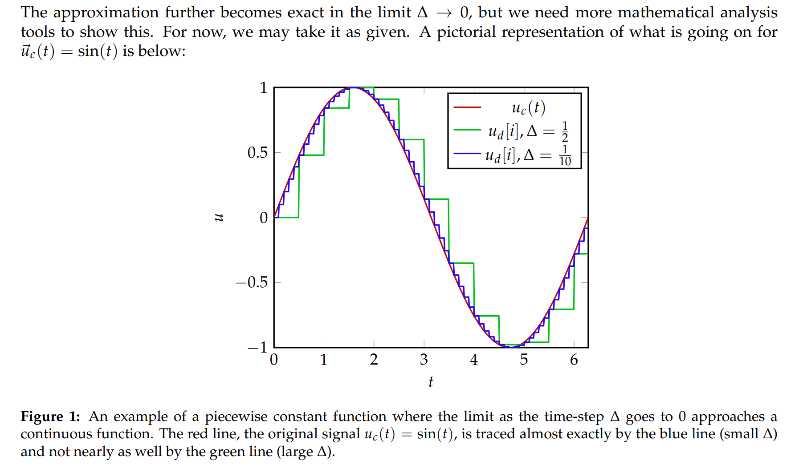

# Overview
## What does control do?
:::info

:::


## How to bridge the continuous and discrete
:::info

:::


## Interaction with the real world
:::info

:::


# Solving LTI Models
## State
> 


## Discrete-Time LTI Difference Equation
### Definition
> 


### Solving Process
>[!proof]
>$\begin{aligned}& \vec{x}_d[i]=A_d \vec{x}_d[i-1]+B_d \vec{u}_d[i-1] \\& =A_d(A_d \vec{x}_d[i-2]+B_d \vec{u}_d[i-2])+B_d \vec{u}_d[i-1] \\& =A_d^2 \vec{x}_d[i-2]+A_d B_d \vec{u}_d[i-2]+B_d \vec{u}_d[i-1] \\& =A_d^2(A_d \vec{x}_d[i-3]+B_d \vec{u}_d[i-3])+A_d B_d \vec{u}_d[i-2]+B_d \vec{u}_d[i-1] \\& =A_d^3 \vec{x}_d[i-3]+A_d^2 B \vec{u}_d[i-3]+A_d B_d \vec{u}_d[i-2]+B_d \vec{u}_d[i-1] \\& = \\& =A_d^{i-1}(A_d \vec{x}_d[0]+B_d \vec{u}_d[0])+\sum_{k=1}^{i-1} A_d^{i-k-1} B_d \vec{u}_d[k] \\& =A_d^i \vec{x}_d[0]+\sum_{k=0}^{i-1} A_d^{i-k-1} B_d \vec{u}_d[k] \\& =A_d^i \vec{x}_0+\sum_{k=0}^{i-1} A_d^{i-k-1} B_d \vec{u}_d[k]\end{aligned}$


### Validation Process
> [!important]
> 我们需要验证$\vec{x}_d[i]=A_d^i \vec{x}_0+\sum_{k=0}^{i-1} A_d^{i-k-1} B_d \vec{u}_d[k]$是否满足$(3)$和$(4)$。
> 1. **验证**$(3)$**:**
>    1. 等式左侧:$\begin{aligned}\vec{x}[i+1]&=A_d^{i+1} \vec{x}_0+\sum_{k=0}^{i} A_d^{i-k} B_d \vec{u}[k]\end{aligned}$
>    2. 等式右侧:
> 
$\begin{aligned}A_d\vec{x_d}[i]+B_d\vec{u_d}[i]&=A_d(A_d^i \vec{x}_0+\sum_{k=0}^{i-1} A_d^{i-k-1} B_d \vec{u}_d[k] )+B_d\vec{u_d}[i]\\&=A_d^{i+1}\vec{x_0}+\sum_{k=0}^{i-1}A_d^{i-k}B_d\vec{u_d}[k]+B_d\vec{u_d}[i]\\&=A^{i+1}\vec{x_0}+\sum_{k=0}^iA_d^{i-k}B_d\vec{u_d}[k]\end{aligned}$
> 综上，满足条件。
> 2. **验证**$(4)$**:**
> 
$\begin{aligned}\vec{x}[0]&=A_d^0 \vec{x}_0\\&=\vec{x_0}\end{aligned}$, 满足条件。


## Matrix Exponentials
### Definition
> If$\Lambda=\operatorname{diag}\left(\lambda_1,\lambda_2, \ldots, \lambda_n\right)$，$e^{\Lambda}=\begin{bmatrix} e^{\lambda_1}&&&\\&e^{\lambda_2}&&\\&&\ddots\\&&&e^{\lambda_n}\end{bmatrix}$$e^{\Lambda t}=\begin{bmatrix} e^{\lambda_1t}&&&\\&e^{\lambda_2t}&&\\&&\ddots\\&&&e^{\lambda_nt}\end{bmatrix}$
> 对于矩阵$A\in \mathbb{R}^{n\times n}$, 有$e^A=\begin{bmatrix} e^{a_{11}}&&\cdots&e^{a_{1n}}\\\vdots&e^{a_{22}}&&\vdots\\&&\ddots\\e^{a_{n1}}&&&e^{a_{nn}}\end{bmatrix}$, $e^{At}=\begin{bmatrix} e^{a_{11}t}&&\cdots&e^{a_{1n}t}\\\vdots&e^{a_{22}t}&&\vdots\\&&\ddots\\e^{a_{n1}t}&&&e^{a_{nn}t}\end{bmatrix}$


### Taylor Form
> 


### Properties&Proofs
> **下面的性质都建立在**$A$**可以对角化的基础上:**
> 1. 如果$A=V\Lambda V^{-1}$, 则:
>    1. $e^A=Ve^{\Lambda}V^{-1}$
>    2.  $e^{At}=Ve^{\Lambda t}V^{-1}$
> 2. $\frac{d}{dt}e^{At}=Ae^{At}$
> 3. 如果$A$可逆，$\int_0^t e^{At}=e^{At}A^{-1}\big|_0^t=(e^{At}-I_n)A^{-1}$
> 4. $\vec{x}(t)=e^{At}\vec{x}_0$是微分方程组$\begin{cases} \frac{d}{dt}\vec{x}(t)=A\vec{x}(t)\\\vec{x}(0)=\vec{x}_0\end{cases}$的解

> [!proof]
> **Proof for 1 
> Part(a):**
> 根据定义:$e^A=I_n+A+\frac{A^2}{2!}+\cdots$，$e^{\Lambda} =I_n+\Lambda+\frac{\Lambda^2}{2!}+\cdots$,
> 则我们有:$\begin{aligned}Ve^{\Lambda}V^{-1}&=V(I_n+\Lambda+\frac{\Lambda^2}{2!}+\cdots)V^{-1}\\&=I_n+V\Lambda  V^{-1}+V\frac{\Lambda^2}{2!}V^{-1}+\cdots\\&=I_n+A+\frac{V\Lambda V^{-1}V\Lambda V^{-1}}{2!}+\cdots\\&=I_n+A+\frac{A^2}{2!}+\cdots\\&=e^A\end{aligned}$
> **Part(b):**和`Part(a)`类似, 将$A$替换成$At$, $\Lambda$替换成$\Lambda t$即可。
> **Proof for 2**根据性质一，我们知道$\frac{d}{dt}e^{At}=V\frac{d}{dt}e^{\Lambda t}V^{-1}$$\begin{aligned}V\frac{d}{dt}e^{\Lambda t}V^{-1}&=V\frac{d}{dt}(I_n+\Lambda t+\frac{\Lambda^2t^2}{2!}+\frac{\Lambda^3t^3}{3!}+\cdots)V^{-1}\\&=V(0+\Lambda +\Lambda^2t+\frac{\Lambda^3t^2}{2!}+\cdots)V^{-1}\\&=V(\Lambda +\Lambda^2t+\frac{\Lambda^3t^2}{2!}+\cdots)V^{-1}\\&=V\Lambda  V^{-1}+V\Lambda^2t^2V^{-1}+V\frac{\Lambda^3 t^2}{2!}V^{-1}+\cdots\\&=A+A^2t+\frac{A^3t^2}{2!}+\cdots\\&=A(I_n+At+\frac{A^2t^2}{2!})\\&=Ae^{At}\end{aligned}$证毕。
> **Proof for 3**根据性质一，我们知道$\int_0^te^{At}dt=V\int_0^te^{\Lambda t}dtV^{-1}$下面的推导将会使用$A^{-1}=(V\Lambda V^{-1})^{-1}=V\Lambda^{-1}V^{-1}$:$\begin{aligned}V\int_0^te^{\Lambda t}dtV^{-1}&=V\int_0^t(I_n+\Lambda t+\frac{\Lambda^2t^2}{2!}+\frac{\Lambda^3t^3}{3!}+\cdots)dtV^{-1}\\&=V(I_nt+\Lambda \frac{t^2}{2!} +\frac{\Lambda^2 t^3}{3!}+\cdots)V^{-1}\\&=V(\Lambda t+\Lambda^2 \frac{t^2}{2!} +\frac{\Lambda^3t^3}{3!}+\cdots)\Lambda^{-1}V^{-1}\\&=V(I_n+\Lambda t+\Lambda^2 \frac{t^2}{2!} +\frac{\Lambda^3t^3}{3!}+\cdots-I_n)\Lambda^{-1}V^{-1}\\&=VI_n\Lambda^{-1}V^{-1}+V\Lambda t\Lambda^{-1}V^{-1}+V\Lambda^2\frac{t^2}{2!}\Lambda^{-1}V^{-1}+\cdots-VI_n\Lambda^{-1}V^{-1}\\&=(VI_nV^{-1})(V\Lambda^{-1}V^{-1})+(V\Lambda t V^{-1})(V\Lambda^{-1}V^{-1})+(V\Lambda^2\frac{t^2}{2!}V^{-1})(V\Lambda^{-1}V^{-1})+\cdots-(VI_nV^{-1})(V\Lambda^{-1}V^{-1})\\&=I_nA^{-1}+AtA^{-1}+\frac{(At)^2}{2!}A^{-1}+\cdots-I_nA^{-1}\\&=(I_n+At+\frac{(At)^2}{2!}+\cdots)A^{-1}-I_nA^{-1}\\&=(e^{At}-I_n)A^{-1}\end{aligned}$

> [!proof]
> **Proof for 4**利用性质$2$我们知道:$\frac{d}{dt}\vec{x}(t)=\frac{d}{dt}e^{At}\vec{x}_0=Ae^{At}\vec{x}_0=A\vec{x}(t)$, 满足第一个条件$\vec{x}(0)=e^{A\times 0}\vec{x}_0=\vec{x}_0$, 满足第二个条件， 证毕。


## Continuous-Time LTI Differential Equation
### Definition&Assumptions
> 
> 🔔: 其中$\vec{x}_c(t)=\begin{bmatrix}x_1(t)\\x_2(t)\\\vdots\\x_n(t) \end{bmatrix},\vec{u}_c(t)=\begin{bmatrix} u_1(t)\\u_2(t)\\\vdots\\u_n(t)\end{bmatrix}$, $x_i(t)$和$u_i(t)$都是连续函数，$A_c$和$B_c$都是矩阵。
> ⭐ 注意，我们假设$A_c\in \mathbb{R}^{n\times n}$是可对角化的，但没有假设$A_c$是可逆的。
> 1. $A_c$可以对角化在结论中的表现就是存在可逆的特征向量矩阵$V$使得$A_c=V\Lambda V^{-1}$。
> 2. 如果$A_c$的特征值中有零的存在，则$Rank(\Lambda)<n$因为$A_c=V\Lambda V^{-1}$, 且$Rank(A_c)=Rank(\Lambda)<n$，则$A_c$不可逆。
> 
总之$A_c$可以对角化这个假设在我们介绍`Upper Trigularization`之前在求解`Continuous LTI DE`中非常重要。


### Diagonal Notations
> 对于一个**对角矩阵** $A=\operatorname{diag}\left(a_{11}, a_{22}, \ldots, a_{n n}\right)=\left[\begin{array}{llll}a_{11} & & & \\& a_{22} & & \\& & \ddots & \\& & & a_{nn}\end{array}\right]$来说, 我们有如下记号:
> $\mathrm{e}^{A t}:=\left[\begin{array}{llll}\mathrm{e}^{a_{11} t} & & & \\& \mathrm{e}^{a_{22} t} & & \\& & \ddots & \\& & & \mathrm{e}^{a_{n n} t}\end{array}\right]$
> 🔔$\mathrm{e}^{A t}$ is a square matrix of the same size as $A$


### Solving Process
> 首先我们知道，对于`Scalar DE`:$\begin{cases}\frac{d}{dt}x_c(t) = \lambda x_c(t)+bu_c(t)\\x_c(0)=x_0\end{cases}$来说，使用`Integrating Factor Method`可知:
> $x_c(t)=x_0e^{\lambda t}+b\int_0^te^{\lambda(t-\tau)}u(\tau)d\tau$
> 然后我们将其一般化到矩阵形式，对于$\begin{cases}\frac{d}{dt}\vec{x}_c(t)=A_c\vec{x}_c(t)+B_c\vec{u}_c(t)\\\vec{x}_c(0)=\vec{x}_0\end{cases}$来说:
> 1. 我们首先进行坐标变换到特征空间，因为$A_c$可以对角化，所以存在一个特征空间的基矩阵$V$使得$A_c=V\Lambda V^{-1}$, 以及$\Lambda =V^{-1}A_cV$。
> 
令$\vec{x}_c(t)=V\vec{y}_c(t)$, 即$\vec{y}_c(t)=V^{-1}\vec{x}_c(t)$，则：$\frac{d}{dt}\vec{x}_c(t)=A_c\vec{x}_c(t)+B_c\vec{u}_c(t)$变为$\frac{d}{dt}V\vec{y}_c(t)=A_cV\vec{y}_c(t)+B_c\vec{u}_c(t)$, 然后两边同乘以$V^{-1}$, 得到$\frac{d}{dt}\vec{x}_c(t)=V^{-1}A_cV\vec{y}_c(t)+V^{-1}B_c\vec{u}_c(t)$, 即$\frac{d}{dt}\vec{y}_c(t)=\Lambda\vec{y}_c(t)+V^{-1}B_c\vec{u}_c(t)$。
> 2. 求解$\frac{d}{dt}\vec{y}_c(t)=\Lambda\vec{y}_c(t)+V^{-1}B_c\vec{u}_c(t)$微分方程：
> 
因为$\Lambda = \begin{bmatrix}\lambda_{1}&\cdots&0\\\vdots&\ddots&\vdots\\0&\cdots&\lambda_{n} \end{bmatrix}$, 所以上述方程实际上是一系列`Scalar DE's`组成的，即$\begin{bmatrix} y_1(t)\\y_2(t)\\\vdots\\y_n(t)\end{bmatrix}=\begin{bmatrix}\lambda_{1}y_1(t)+(V^{-1}B_c\vec{u}_c(t))_1 \\\lambda_{2}y_2(t)+(V^{-1}B_c\vec{u}_c(t))_2  \\\vdots\\\lambda_{n}y_n(t)+(V^{-1}B_c\vec{u}_c(t))_n  \end{bmatrix}$，那么根据`Scalar DE`的`Solution`形式，我们有: $y_k(t)=y_k(0)e^{\lambda_k t}+\int_0^te^{\lambda_k(t-\tau)}(V^{-1}B_c\vec{u}_c(\tau))_kd\tau$, 写成向量形式就是:
> $\begin{aligned}\vec{y}_c(t)&=\begin{bmatrix}y_1(0)e^{\lambda_1 t}+\int_0^te^{\lambda_1(t-\tau)}(V^{-1}B_c\vec{u}_c(\tau))_1d\tau\\y_2(0)e^{\lambda_2 t}+\int_0^te^{\lambda_2(t-\tau)}(V^{-1}B_c\vec{u}_c(\tau))_2d\tau\\\vdots\\y_n(0)e^{\lambda_n t}+\int_0^te^{\lambda_n(t-\tau)}(V^{-1}B_c\vec{u}_c(\tau))_nd\tau \end{bmatrix}=\begin{bmatrix}y_1(0)e^{\lambda_1 t}\\y_2(0)e^{\lambda_2 t} \\\vdots\\y_n(0)e^{\lambda_n t}\end{bmatrix}+\begin{bmatrix}\int_0^te^{\lambda_1(t-\tau)}(V^{-1}B_c\vec{u}_c(\tau))_1d\tau\\\int_0^te^{\lambda_2(t-\tau)}(V^{-1}B_c\vec{u}_c(\tau))_2d\tau\\\vdots\\\int_0^te^{\lambda_n(t-\tau)}(V^{-1}B_c\vec{u}_c(\tau))_nd\tau \end{bmatrix}\\&=\begin{bmatrix}e^{\lambda_{1}t}&\cdots&0\\\vdots&\ddots&\vdots\\0&\cdots&e^{\lambda_{n}t} \end{bmatrix}\begin{bmatrix}y_1(0)\\y_2(0)\\\vdots\\y_n(0) \end{bmatrix}+\int_0^t\begin{bmatrix}e^{\lambda_1(t-\tau)}(V^{-1}B_c\vec{u}_c(\tau))_1\\e^{\lambda_2(t-\tau)}(V^{-1}B_c\vec{u}_c(\tau))_2\\\vdots\\e^{\lambda_n(t-\tau)}(V^{-1}B_c\vec{u}_c(\tau))_n\end{bmatrix}d\tau\\&=e^{\Lambda t}\vec{y_c}(0)+\int_0^t\begin{bmatrix}e^{\lambda_{1}(t-\tau)}&\cdots&0\\\vdots&\ddots&\vdots\\0&\cdots&e^{\lambda_{n}(t-\tau)} \end{bmatrix}\begin{bmatrix}(V^{-1}B_c\vec{u}_c(\tau))_1\\(V^{-1}B_c\vec{u}_c(\tau))_2\\\vdots\\(V^{-1}B_c\vec{u}_c(\tau))_n \end{bmatrix}d\tau\\&=e^{\Lambda t}\vec{y_c}(0)+\int_0^te^{\Lambda(t-\tau)}V^{-1}B_c\vec{u}_c(\tau)d\tau\end{aligned}$
> 3. 利用$\vec{x}_c(t)=V\vec{y}_c(t)$和$\vec{y}_c(t)=V^{-1}\vec{x}(t)$转换到原来的坐标系中: 
> 
所以$\vec{x}_c(t)=Ve^{\Lambda t}V^{-1}\vec{x_c}(0)+\int_0^tVe^{\Lambda(t-\tau)}V^{-1}B_c\vec{u}_c(\tau)d\tau$, 证毕。
> 
> 4. 利用`Matrix Exponential`得到解的普遍形式:
> 

> $\begin{aligned}\vec{x}_c(t)&=Ve^{\Lambda t}V^{-1}\vec{x_c}(0)+\int_0^tVe^{\Lambda(t-\tau)}V^{-1}B_c\vec{u}_c(\tau)d\tau\\&=e^{At}\vec{x}_0+\int_0^t e^{A(t-\tau)}B_c\vec{u}_c(\tau)d\tau\end{aligned}$


### Validation Process
> 验证$\begin{aligned}\vec{x}_c(t)=e^{At}\vec{x_c}(0)+\int_0^t e^{A(t-\tau)}B_c\vec{u}_c(\tau)d\tau\end{aligned}$满足$\begin{cases}\frac{d}{dt}\vec{x}_c(t)=A_c\vec{x}_c(t)+B_c\vec{u}_c(t)\\\vec{x}_c(0)=\vec{x}_0\end{cases}$
> 首先$\vec{x}_c(0)=e^{A\times 0}\vec{x}_c(0)=\vec{x}_0$满足第二个条件。
> 其次，我们利用微积分基本定理有:
> $\begin{aligned}\frac{d}{dt}\vec{x}_c(t)&=\frac{d}{dt}e^{At}\vec{x_c}(0)+\frac{d}{dt}\int_0^t e^{A(t-\tau)}B_c\vec{u}_c(\tau)d\tau\\&=Ae^{At}\vec{x}_0+\frac{d}{dt}e^{At}\int_0^te^{-A\tau}B_c\vec{u}_c(\tau)d\tau\\&=Ae^{At}\vec{x}_0+Ae^{At}\int_0^te^{-A\tau}B_c\vec{u}_c(\tau)d\tau+e^{At}\frac{d}{dt}\int_0^te^{-A\tau}B_c\vec{u}_c(\tau)d\tau\\&=Ae^{At}\vec{x}_0+Ae^{At}\int_0^te^{-A\tau}B_c\vec{u}_c(\tau)d\tau+e^{At}e^{-At}B_c\vec{u}_c(t)\\&=A(e^{At}\vec{x}_0+e^{At}\int_0^te^{-A\tau}B_c\vec{u}_c(\tau)d\tau)+B_c\vec{u}_c(t)\\&=A\vec{x}_c(t)+B_c\vec{u}_c(t)\end{aligned}$
> 满足第一个条件，证毕。


## Examples
> 


# Linear Time Invariance
## Linearity
> 


## Time Invariance
> 


## Proof for LTIs
### Discrete Model
> 这个系统$\begin{aligned}\vec{x}_d[i+1] & =A_d \vec{x}_d[i]+B_d \vec{u}_d[i] \quad i \in \mathbb{N} \\\vec{x}_d[0] & =\vec{x}_0\end{aligned}$ 解为$\vec{x}_d[i]=A_d^i \vec{x}_0+\sum_{k=0}^{i-1} A_d^{i-k-1} B_d \vec{u}_d[k]\tag{1}$
> 1. **Linearity:**
> 
假设存在两个输入输出对:
> $(\vec{x}_{0,1},\vec{u}_{d,1})\to\vec{x}_{d,1}$, 对应$\vec{x}_{d,1}[i]=A_d^i \vec{x}_{0,1}+\sum_{k=0}^{i-1} A_d^{i-k-1} B_d \vec{u}_{d,1}[k]$,
> $(\vec{x}_{0,2},\vec{u}_{d,2})\to\vec{x}_{d,2}$, 对应$\vec{x}_{d,2}[i]=A_d^i \vec{x}_{0,2}+\sum_{k=0}^{i-1} A_d^{i-k-1} B_d \vec{u}_{d,2}[k]$
> 则对于输入$(c_1\vec{x}_{0,1}+c_2\vec{x}_{0,2},c_1\vec{u}_{d,1}+c_2\vec{u}_{d,2})$来说，我们要证明输出是$c_1\vec{x}_{d,1}+c_2\vec{x}_{d,2}$
> 我们利用$(1)$式，输入$(c_1\vec{x}_{0,1}+c_2\vec{x}_{0,2},c_1\vec{u}_{d,1}+c_2\vec{u}_{d,2})$, 得到输出$\begin{aligned}\vec{x}_d[i]&=A_d^i (c_1\vec{x}_{0,1}+c_2\vec{x}_{0,2})+\sum_{k=0}^{i-1} A_d^{i-k-1} B_d (c_1\vec{u}_{d,1}[k]+c_2\vec{u}_{d,2}[k])\\&=c_1(A_d^i \vec{x}_{0,1}+\sum_{k=0}^{i-1} A_d^{i-k-1} B_d \vec{u}_{d,1}[k])+c_2(A_d^i \vec{x}_{0,2}+\sum_{k=0}^{i-1} A_d^{i-k-1} B_d \vec{u}_{d,2}[k])
\\&=c_1\vec{x}_{d,1}[i]+c_2\vec{x}_{d,2}[i]\end{aligned}$
>  证毕。
> 2. **Time Invariance:**
> 
假设存在输入输出对:
> $(\vec{x}_{0},\vec{u}_{d})\to\vec{x}_{d}$, 对应$\vec{x}_{d}[i]=A_d^i \vec{x}_{0}+\sum_{k=0}^{i-1} A_d^{i-k-1} B_d \vec{u}_{d}[k]$, 则对于输入$(\vec{\widetilde{x}}_{0},\vec{\widetilde{u}_d})$来说，我们要证明输出$\vec{\widetilde{x}_d}[i]=\vec{x}_d[i+\tau]$。
> 我们利用$(1)$式，输入$(\vec{\widetilde{x}}_{0},\vec{\widetilde{u}_d})$，得到输出:
> $\begin{aligned}\vec{\widetilde{x}_d}[i]&=A_d^i \vec{\widetilde{x}}_0+\sum_{k=0}^{i-1} A_d^{i-k-1} B_d \vec{\widetilde{u}}_d[k]\\&=A_d^i\vec{x}_d[\tau]+\sum_{k=0}^{i-1} A_d^{i-k-1} B_d \vec{u}_d[k+\tau]\\&=A_d^i(A_d^{\tau}\vec{x}_0+\sum_{k=0}^{\tau-1} A_d^{\tau-k-1} B_d \vec{u}_{d}[k])+\sum_{k=0}^{i-1} A_d^{i-k-1} B_d \vec{u}_d[k+\tau]\\&=A_d^{i+\tau}\vec{x}_0+\sum_{k=0}^{\tau-1}A_d^{i+\tau-k-1}B_d\vec{u}_d[k]+\sum_{k=0}^{i-1}A_d^{i-k-1}B_d\vec{u}_d[k+\tau]\\&=A_d^{i+\tau}\vec{x}_0+\sum_{k=0}^{i+\tau-1}A_d^{i+\tau-k-1}B_d\vec{u}_d[k]\\&=\vec{x}_d[i+\tau]\end{aligned}$
> 证毕。


### Continuous Model
> 系统$\begin{aligned}\frac{\mathrm{d}}{\mathrm{d} t} \vec{x}_c(t) & =A_c \vec{x}_c(t)+B_c \vec{u}_c(t) \quad t \in \mathbb{R}_{+} \\\vec{x}_c(0) & =\vec{x}_0\end{aligned}$解为$\vec{x}_c(t)=e^{At}\vec{x}_0+\int_0^t e^{A(t-\tau)}B_c\vec{u}_c(\tau)d\tau\tag{1}$
> 1. **Linearity:**
> 
假设存在两个输入输出对:
> $(\vec{x}_{0,1},\vec{u}_{c,1})\to\vec{x}_{c,1}$, 对应$\vec{x}_{c,1}(t)=e^{At}\vec{x}_{0,1}+\int_0^t e^{A(t-\tau)}B_c\vec{u}_{c,1}(\tau)d\tau$
> $(\vec{x}_{0,2},\vec{u}_{c,2})\to\vec{x}_{c,2}$, 对应$\vec{x}_{c,2}(t)=e^{At}\vec{x}_{0,2}+\int_0^t e^{A(t-\tau)}B_c\vec{u}_{c,2}(\tau)d\tau$
> 则对于输入$(c_1\vec{x}_{0,1}+c_2\vec{x}_{0,2},c_1\vec{u}_{c,1}+c_2\vec{u}_{c,2})$来说，我们要证明输出是$c_1\vec{x}_{c,1}+c_2\vec{x}_{c,2}$
> 我们利用$(1)$式，输入$(c_1\vec{x}_{0,1}+c_2\vec{x}_{0,2},c_1\vec{u}_{c,1}+c_2\vec{u}_{c,2})$, 得到输出:
> $$\begin{aligned}\vec{x}_c(t)&=e^{At}(c_1\vec{x}_{0,1}+c_2\vec{x}_{0,2})+\int_0^t e^{A(t-\tau)}B_c(c_1\vec{u}_{c,1}(\tau)+c_2\vec{u}_{c,2}(\tau))d\tau
\\&=c_1(e^{At}\vec{x}_{0,1}+\int_0^t e^{A(t-\tau)}B_c\vec{u}_{c,1}(\tau)d\tau)+c_2(e^{At}\vec{x}_{0,2}+\int_0^t e^{A(t-\tau)}B_c\vec{u}_{c,2}(\tau)d\tau)\\&=c_1\vec{x}_{c,1}(t)+c_2\vec{x}_{c,2}(t)\end{aligned}$$
> 证毕。
> 2. **Time Invariance:**
> 
假设存在输入输出对:
> $(\vec{x}_{0},\vec{u}_{c})\to\vec{x}_{c}$, 对应$\vec{x}_c(t)=e^{At}\vec{x}_0+\int_0^t e^{A(t-\tau)}B_c\vec{u}_c(\tau)d\tau$, 则对于输入$(\vec{\widetilde{x}}_{0},\vec{\widetilde{u}_c})$来说，我们要证明输出$\vec{\widetilde{x}_c}(t)=\vec{x}_c(t+\tau)$。
> 我们利用$(1)$式，输入$(\vec{\widetilde{x}}_{0},\vec{\widetilde{u}_c})$，得到输出:
> $$\begin{aligned}\vec{\widetilde{x}_c}(t)&=e^{At}\vec{\widetilde{x}}_0+\int_0^t e^{A(t-\tau)}B_c\vec{\widetilde{u}}_c(\tau')d\tau'
\\&=e^{At}\vec{x}_c(\tau)+\int_0^t e^{A(t-\tau)}B_c\vec{u}_c(\tau'+\tau)d\tau'
\\&=e^{At}(e^{A\tau}\vec{x}_0+\int_0^{\tau} e^{A(\tau-\tau')}B_c\vec{u}_c(\tau')d\tau')+\int_0^t e^{A(t-\tau)}B_c\vec{u}_c(\tau'+\tau)d\tau'
\\&=e^{A(t+\tau)}\vec{x}_0+\int_0^{\tau} e^{A(t+\tau-\tau')}B_c\vec{u}_c(\tau')d\tau'+\int_0^t e^{A(t-\tau)}B_c\vec{u}_c(\tau'+\tau)d\tau'
\\&=e^{A(t+\tau)}\vec{x}_0+\int_0^{t+\tau} e^{A(t+\tau-\tau')}B_c\vec{u}_c(\tau')d\tau'\\&=\vec{x}_c(t+\tau)\end{aligned}$$
> 证毕。
> 🔔: 这里特别容易错的地方是, 当我们写出这个积分时:$\int_0^t\vec{\widetilde{u}}(\tau')d\tau'$, 积分变量是$\tau'$, 而$\vec{\widetilde{u}}(\tau')=\vec{u}(\tau'+\tau)$的过程的积分变量仍然是$\tau'$。


## Time Varying Model
> 


# Discretizing Continous LTI Model
## Basic Idea
> 


## Approximation Model
> 
> 我们的目标就是在这个假设下找到一个`Discretized Difference Equation Approximation`如下形式:
> $\vec{x}_d[i+1]=A_d\vec{x}_d[i]+B_d\vec{u}_d[i], \forall i\in \mathbb{N}$


## Scalar Version
:::info
**Disc06A P1**

:::
**Derivations**


## Matrix Version
> 下面的两个结论假设$A_c$是可以对角化的。这很重要。

### When A is Invertible
#### Diagonal Version
> [!thm]
> 

> [!proof]
> 
**Side Notes**

#### General Version
> [!thm]
> 

> [!proof]
> 假设现在我们要求当$t\in [i\Delta, (i+1)\Delta)$上的$\vec{x}_c(t)$的情况，令$t_{int}=t-i\Delta$, 则我们根据[Continuous Solution](#YCFQb)有:
$\begin{aligned}\vec{x}_c(t_{int})&=Ve^{\Lambda t_{int}}V^{-1}\vec{x}_c(t_{int}=0)+\int_0^{t_{int}}Ve^{\Lambda(t_{int}-\tau)}V^{-1}B_c\vec{u}_d[i]d\tau\\&=Ve^{\Lambda(t-i\Delta)}V^{-1}\vec{x}_d[i]+\int_0^{t-i\Delta}Ve^{\Lambda (t-i\Delta-\tau)}V^{-1}B_c\vec{u}_d[i]d\tau\end{aligned}$
其中$A_c=V\Lambda V^{-1}$。
因为$\vec{x}_d[i+1]=\vec{x}_c(t_{int}=\Delta)$, 所以$t=(i+1)\Delta$, 即:
$\begin{aligned}\vec{x}_d[i+1]&=Ve^{\Lambda(t-i\Delta)}V^{-1}\vec{x}_d[i]+\int_0^{t-i\Delta}Ve^{\Lambda (t-i\Delta-\tau)}V^{-1}B_c\vec{u}_d[i]d\tau\\&=Ve^{\Lambda \Delta}V^{-1}\vec{x}_d[i]+(\int_0^{\Delta}Ve^{\Lambda (\Delta-\tau)}V^{-1}B_cd\tau)\vec{u}_d[i]\end{aligned}$
所以$A_d=Ve^{\Lambda \Delta}V^{-1}, B_d=\int_0^{\Delta}Ve^{\Lambda (\Delta-\tau)}V^{-1}B_cd\tau$
根据[Matrix Exponentials](#JEy4U)中的性质，$A_d=e^{A_c \Delta}$和$\int_0^t e^{At}=e^{At}A^{-1}\big|_0^t=(e^{At}-I_n)A^{-1}$, 有：
$\begin{aligned} B_d&=\int_0^{\Delta}Ve^{\Lambda (\Delta-\tau)}V^{-1}B_cd\tau\\&=\int_0^{\Delta}e^{A_c(\Delta-\tau)}B_cd\tau\\&=e^{A_c\Delta}\int_0^{\Delta}e^{-A_c\tau}d\tau B_c\\&=e^{A_c\Delta}[-(e^{-A_c\tau})A_c^{-1}]\big|_0^{\Delta}B_c\\&=e^{A_c\Delta}\left(I_n-\mathrm{e}^{-A_c \Delta}\right) A_c^{-1}B_c\\&=\left(\mathrm{e}^{A_c \Delta}-I_n\right) A_c^{-1} B_c\end{aligned}$


### When A is not Invertible
> 

**Proof**假设现在我们要求当$t\in [i\Delta, (i+1)\Delta)$上的$\vec{x}_c(t)$的情况，令$t_{int}=t-i\Delta$, 则我们根据[Continuous Solution](#YCFQb)有:
$\begin{aligned}\vec{x}_c(t_{int})&=Ve^{\Lambda t_{int}}V^{-1}\vec{x}_c(t_{int}=0)+\int_0^{t_{int}}Ve^{\Lambda(t_{int}-\tau)}V^{-1}B_c\vec{u}_d[i]d\tau\\&=Ve^{\Lambda(t-i\Delta)}V^{-1}\vec{x}_d[i]+\int_0^{t-i\Delta}Ve^{\Lambda (t-i\Delta-\tau)}V^{-1}B_c\vec{u}_d[i]d\tau\end{aligned}$
其中$A_c=V\Lambda V^{-1}$。
因为$\vec{x}_d[i+1]=\vec{x}_c(t_{int}=\Delta)$, 所以$t=(i+1)\Delta$, 即:
$\begin{aligned}\vec{x}_d[i+1]&=Ve^{\Lambda(t-i\Delta)}V^{-1}\vec{x}_d[i]+\int_0^{t-i\Delta}Ve^{\Lambda (t-i\Delta-\tau)}V^{-1}B_c\vec{u}_d[i]d\tau\\&=Ve^{\Lambda \Delta}V^{-1}\vec{x}_d[i]+(\int_0^{\Delta}Ve^{\Lambda (\Delta-\tau)}V^{-1}B_cd\tau)\vec{u}_d[i]\end{aligned}$
所以$A_d=Ve^{\Lambda \Delta}V^{-1}, B_d=\int_0^{\Delta}Ve^{\Lambda (\Delta-\tau)}V^{-1}B_cd\tau$
根据[Matrix Exponentials](#JEy4U)中的性质$A_d=e^{A_c \Delta}$以及下面的积分求解过程

 我们有, 当$A_c$不可逆时：
$\begin{aligned} B_d&=\int_0^{\Delta}Ve^{\Lambda (\Delta-\tau)}V^{-1}B_cd\tau\\&=\int_0^{\Delta}e^{A_c(\Delta-\tau)}B_cd\tau\\&=e^{A_c\Delta}\int_0^{\Delta}e^{-A_c\tau}d\tau B_c\\&=e^{A_c\Delta}\left(\sum_{i=1}^{\infty} \frac{\left(-A_c\right)^{i-1} \Delta^i}{i !}\right)B_c\end{aligned}$


## Using Euler to Further Simplify
> 


## Practice Exercises
> Given a continuous time differential equation
> $\frac{d}{d t} x(t)=f(t)+u(t)$
> We want to find an equivalent recurrence relation in discrete time
> 
> $x_d(k+1)=\alpha x_d(k)+u_d(k)$
> We define a time-step $T$, which means that we:
> - "Sample" the state every $T$ seconds, or define $x_d(k)=x(k T)$, and
> - Provide a piecewise constant input such that $u(t)$ is constant in the interval $[k T,(k+1) T]$
> 
To discretize a system, we solve the differential equation for $x(t)$ assuming a constant input $u_d(k)=u(kT)$and then plug in time $t+T$. 
> Then, we set $x_d(k)=x(t)$ and $x_d(k+1)=x(t+T)$, and match the expression we got with the equation
> $x_d(k+1)=\alpha x_d(k)+u_d(k)$
> to find $\alpha$ and $u_d(k)$.


### Example 1: Constant
> 


### Example 2: Product
> 


### Example 3: Exponential
> 


### Example 4: Sinusoidal Functions
> 


### Example 5: 2D System
> 
> $a=1$,$b=T$,$c=T$, $d=1$, $e=T$, $f=\frac{T^2}{2}$


# Disturbance&Error Model
## Definition
> 

**For Interested Readers**[https://en.wikipedia.org/wiki/Uncertainty_quantification](https://en.wikipedia.org/wiki/Uncertainty_quantification)


## Additive Disturbance LTI Models
> 

**How to deal with these models**
**Example**


# System Identification
## Definition
> 


## Frobenius Norm - Quantifying Error 
> 

**Proof of the validity of the norm**
**我们要证明上面的四个性质:**

1. `Non-negativity`: $\sqrt{\sum_{i=1}^m \sum_{j=1}^n\left|A_{i j}\right|^2}\geq 0$, 成立。
2. `Zero Vector`: 如果$\sqrt{\sum_{i=1}^m \sum_{j=1}^n\left|A_{i j}\right|^2}=0$，则$\sum_{j=1}^n\left|A_{i j}\right|^2=0$, 则$A_{ij}=0, \forall i,j$, 成立。
3. `Scalar Multiplication`: $\|\alpha A\|_F=\sqrt{\sum_{i=1}^m \sum_{j=1}^n\left|\alpha A_{i j}\right|^2}=\alpha \sqrt{\sum_{i=1}^m \sum_{j=1}^n\left|A_{i j}\right|^2}=\alpha\|A\|_F$
4. `Triangle Inequality`: 

我们要证明$\|A+B\|_F\leq \|A\|_F+\|B\|_F$, 相当于要证明$\|A+B\|^2_F\leq \|A\|^2_F+\|B\|^2_F+2\|A\|_F\|B\|_F$，即:
$\sum_{i=1}^m \sum_{j=1}^n\left|A_{i j}+B_{ij}\right|^2\leq \sum_{i=1}^m \sum_{j=1}^n\left|A_{i j}\right|^2 +  \sum_{i=1}^m \sum_{j=1}^n\left|B_{i j}\right|^2+2\sqrt{ \sum_{i=1}^m \sum_{j=1}^n\left|A_{i j}\right|^2}\sqrt{ \sum_{i=1}^m \sum_{j=1}^n\left|B_{i j}\right|^2}$
$\sum_{i=1}^m \sum_{j=1}^n |A_{i j}|^2+ \sum_{i=1}^m \sum_{j=1}^n|B_{ij}|^2+2\sum_{i=1}^m \sum_{j=1}^n|A_{ij}||B_{ij}|\leq \sum_{i=1}^m \sum_{j=1}^n\left|A_{i j}\right|^2 +  \sum_{i=1}^m \sum_{j=1}^n\left|B_{i j}\right|^2+2\sqrt{ \sum_{i=1}^m \sum_{j=1}^n\left|A_{i j}\right|^2}\sqrt{ \sum_{i=1}^m \sum_{j=1}^n\left|B_{i j}\right|^2}$
即$\sum_{i=1}^m \sum_{j=1}^n|A_{ij}||B_{ij}|\leq \sqrt{ \sum_{i=1}^m \sum_{j=1}^n\left|A_{i j}\right|^2}\sqrt{ \sum_{i=1}^m \sum_{j=1}^n\left|B_{i j}\right|^2}$, 由柯西不等式可以证明。
> 

**Proof - Switch Summation**


## Trace Property
> 对于$A\in \mathbb{R}^{m\times n},B\in \mathbb{R}^{n\times m}$, $Tr(AB)=Tr(BA)$
> 证明:
> $\begin{aligned}Tr(AB)&=\sum_{i=1}^m (AB)_{ii}\\&=\sum_{i=1}^m\sum_{k=1}^nA_{ik}B_{ki}\\&=\sum_{k=1}^n\sum_{i=1}^mA_{ik}B_{ki}\\&=\sum_{k=1}^n\sum_{i=1}^mB_{ki}A_{ik}\\&=\sum_{k=1}^n(BA)_{kk}\\&=Tr(BA)\end{aligned}$


## Frobenius Norm Properties
### Trace Representation
> $\|A\|_F=\sqrt{\operatorname{tr}\left(A^{\top} A\right)}$, 其中$\operatorname{tr}(A)=\sum_{i=1}^{\min (n, m)} A_{i i}$
> 


### Transpose Invariant
> $\|A\|_F=\left\|A^{\top}\right\|_F$
> 


### Orthonormal Invariant
> $\|U A\|_F=\|A V\|_F=\|A\|_F$

**Proof - Using Transpose**
**Proof - Using Trace Property**$\|UA\|_F=\sqrt{tr((UA)^T(UA))}=\sqrt{tr(A^TU^TUA)}=\sqrt{tr(A^TA)}=\|A\|_F$
$\|AV\|_F=\sqrt{tr((AV)^T(AV))}=\sqrt{tr(V^TA^TAV)}=\sqrt{tr(VV^TA^TA)}=\sqrt{tr(A^TA)}=\|A\|_F$
$\sqrt{tr(V^TA^TAV)}=\sqrt{tr(VV^TA^TA)}$运用了`Trace Property`


### SVD Representation
> $\|A\|_F=\sqrt{\sum_{i=1}^n \sigma_i^2}$
> 


## Error Minimization - Least Square
> 

**Proof**


## Least Square for System ID
### Derivations
> 本质上就是将参数写成是向量堆叠起来的形式:
> 


### Exercises
> **Disc 06B Sp22**

#### 1D Example 1
> 


#### 1D Example 2
> 


#### 2D Example
> 


## Algorithms
### Discrete Time Algorithm
> 


### Continuous Time Algorithm
> $\text{\textbf{Input}: Integers}$ $n ,m, \ell$ $\text{where}$ $\ell \geq n+m$.
> $\text{\textbf{Input:} Data}\left[\vec{x}_c(i\Delta), \vec{u}_c(i\Delta), \vec{x}_c((i+1)\Delta) \right]$ $\text{for}$ $i \in\left\{i_1, \ldots, i_{\ell}\right\}$ (`Sample`获得的)
> $\text {\textbf{Output}: Least-squares estimates } \widehat{A}_c \text { and } \widehat{B}_c \text {. }$
> $\begin{aligned}& \text { 1:~ ~let } D:=\left[\begin{array}{cc}\vec{x}_c\left(i_1\Delta\right)^{\top} & \vec{u}_c\left(i_1\Delta\right)^{\top} \\\vdots & \vdots \\\vec{x}_c\left(i_{\ell}\Delta\right)^{\top} & \vec{u}_c\left(i_{\ell}\Delta\right)^{\top}\end{array}\right] \in \mathbb{R}^{\ell \times(n+m)} \\& \text { 2:~~ let } S:=\left[\begin{array}{c}\vec{x}_c\left((i_1+1)\Delta\right)^{\top} \\\vdots \\\vec{x}_c\left((i_{\ell}+1)\Delta\right)^{\top}\end{array}\right] \in \mathbb{R}^{\ell \times n}\end{aligned}$
> $\begin{aligned}& \text { 3: ~~\textbf{if} rank }(D)<n+m \text { then } \\& \text { 4: } \quad \text { try Gaussian elimination to solve } D P=S \text { column-by-column for a solution } \widehat{P} \in \mathbb{R}^{(n+m) \times n} \\& \text { 5:   ~~~~~\textbf{if} any column Gaussian elimination fails \textbf{then} } \\& \text { 6: } \quad \text { ~~~~~give up until we learn the Moore-Penrose pseudoinverse } \\& \text { 7: ~~\textbf{end if} } \\& \text { 8: ~~\textbf{else} } \\& \text { 9: ~~~~~compute } \widehat{P}:=\left(D^{\top} D\right)^{-1} D^{\top} S \in \mathbb{R}^{(n+m) \times n} \\& \text { 10: \textbf{end if} } \\& \text { 11: extract }\begin{bmatrix}\widehat{A}_c^{\top}\\\widehat{B}_c^{\top}\end{bmatrix}:=\widehat{P} \\& \text { 12: } \text {return }\left(\widehat{A}_c^{\top}, \widehat{B}_c\right)\end{aligned}$


## Validation Process - Loss Function
> 


## Numerical Example
> 


## Industrial Example - HW06 Fa21 P5 
> 对于一个离散的系统$\vec{x}[i+1]=A_d\vec{x}[i]+B_d\vec{u}[i]$，$A_d\in\mathbb{R}^{n\times n},B_d\in \mathbb{R}^{n\times p}$:
> 1. $\{\vec{x}[0],\vec{x}[1],\cdots, \vec{x}[T]\}$称为`State Trace`
> 2. $\{\vec{u}[0],\vec{u}[1],\cdots, \vec{u}[T-1]\}$称为`Input Trace`。
> 
于是如果我们想要追踪$T$个时间步，则有:
> $\begin{aligned}\vec{x}[1] & =A \vec{x}[0]+B \vec{u}[0] \\\vec{x}[2] & =A \vec{x}[1]+B \vec{u}[1] \\\vec{x}[3] & =A \vec{x}[2]+B \vec{u}[2] \\& \vdots \\\vec{x}[T] & =A \vec{x}[T-1]+B \vec{u}[T-1] .\end{aligned}$
> 此时我们有$n^2+np$个参数($A$和$B$的未知参数总和)和$T$个方程(对应$T$个时间步)。
> 一般情况下$T>n^2+np$, 所以我们要求解的系统是`Over-determined`的，所以需要`Least Square`。
> 

```python
def make_state_trace(a_matrix, b_matrix, inpt, initial_state=None):
    """
    make_state_trace: for a given A and B matrices, initial condition, and input, "run" the system and 
    calculate the system state for each time step. The length of the trace will be the length of the input plus one.
    
    arguments:
        a_matrix: A matrix of the system (numpy ndarray, n by n)
        b_matrix: B matrix of the system (numpy ndarray, p by n)
        inpt: input (u) (numpy ndarray, T by p)
              initial_state: initial state for the system (numpy ndarray, n by 1). If no initial state is provided, 
              the initial state will be the origin.
    
    returns:
        state_trace: a numpy ndarray containing the state at 
                     each time step that was run (numpy ndarray, T+1 by n).
    """
    n_states = np.shape(a_matrix)[0]   # A_matrix 决定了系统的维数
    n_timesteps = np.shape(inpt)[0]   # 输入数量决定了timestamp_number
    state_trace = np.zeros((n_timesteps + 1, n_states)) 

    state_trace[0] = initial_state if initial_state is not None else np.zeros(n_states)
    for i in range(n_timesteps):
        state_trace[i + 1] = a_matrix @ state_trace[i] + (b_matrix * inpt[i]).squeeze()
    return state_trace
```
```python
def random_input(t, n_inputs, mean=0, std=1):
    """
    random_input: given a time sequence t, generate a random input trace. Each entry of the trace will be sampled
                  from a Gaussian distribution with the given mean and standard deviation.
    """
    random_trace = np.random.normal(loc=mean, scale=std, size=(len(t), n_inputs))
    return random_trace
```
```python
def identify_system(state_trace, inpt):
    """
    identify_system: given an input and the state trace it generated, determine the A and B matrices 
                     of the system that was used to generate the state trace.
    
    arguments:
        state_trace: the state data.
        inpt: the input data:
        
    returns:
        a_identified: the A matrix identified from the state and input data (numpy ndarray)
        b_identified: the B matrix identified from the state and input data (numpy ndarray)
    """

    # set up least-squares equation from state and input data
    n_states = np.shape(state_trace)[1]
    lsq_b = state_trace[1:, :]
    lsq_a = np.concatenate((state_trace[:-1], inpt), axis=1)
    # solve the least-squares problem. Output should be [A B]^T
    # YOUR CODE HERE
    # Based on the code around it, it looks like your code needs to produce two variables called a_identified
    # and b_identified.
    ab_identified, _, _, _ = np.linalg.lstsq(lsq_a, lsq_b, rcond=None)
    # What else does your code need to do? Well, let's look at the documentation. You need to return two variables,
    # a_identified and b_identified, and they both need to be numpy matrices.
    a_identified = ab_identified[:n_states] # [A B]^T 中的A^T
    b_identified = ab_identified[n_states:] # [A B]^T 中的B^T
    
    return a_identified, b_identified

```


### Example 1: Simple Case
> 


## Summary for System ID
:::info

:::


# Resources
> **Note 9/10 Sp22**
> **Disc 06A/B Sp22**
> **HW06 Fa21**


