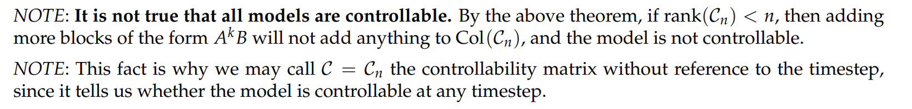

# Overview
> 

# Controllability Matrix
## Definition
> 

## Rank Growth of Controllability Matrix
> 

# Reachability
## Theorems
> 

**Proof of Theorem 5**

## Algorithms
> 

# Controllability
## Cayley-Hamilton Theorem
> 

**Proof that A satisfies its own chracteristic polynomial**

## Caley-Hamilton and Controllability Matrix
> 
> 推广：对于一些矩阵$B\in \mathbb{n\times p}$, $A^nB$is linearly dependent on $A^{n-1}B,A^{n-2}B,\cdots, AB,B$。

## How to determine Controllability
> 
> 我们看到，实际上`Model is controllable in i timesteps`实际上是一个比`Model is controllable in n timesteps`更强的条件，因为$i<n$，这表明$C_i$能更快的达到$Rank(C_i)=n$的条件。

**Proof of Theorem 9 (i) and (ii)**
**Proof of Theorem 9 (iii) and (v) - Induction on Linear Dependence**
**Proof of Theorem 9 (iii) and (iv) - Growth of Rank of Controllability Matrix⭐⭐⭐⭐⭐**
**更详细的原因在这里(Note 11 Fa21)：**

这里我们之所以要`Separate k=t`和`k=0`的情况，是为了能够将$A^0\vec{b}$这项考虑进来。

总的来说，如果$Rank(\begin{bmatrix} B &AB&\cdots A^{n-1}B\end{bmatrix})<n$的话，因为我们知道当$i\geq n$时，$Rank(\begin{bmatrix} B &AB&\cdots A^{i-1}B\end{bmatrix})=Rank(\begin{bmatrix} B &AB&\cdots A^{n-1}B\end{bmatrix})$, 即矩阵的秩不会增长了，所以如果在$n$个时间步都没有能`Reach Target State`, 那么就永远不会达到这个`Target State`了。
**Proof of Theorem 9 (iv) and (v)**
> 

## Controllability Determination Algorithms
> 

## Example(Disc07B)
> **Disc07B P2**
> 

# Controllability and Stability
## Controllable Caconical Form(CCF)
### Definition
> 

**Proof of Proposition 15**

### Properties
> 

### Example(Disc07A)
> **Disc07A Sp22 P2**
> 

## Similarity Analysis
### Characteristic Polynomials
> 

### Uniquely Determination
> 

### Similarity Preserves Characteristic Polynomials
> 

**Proof**
> 假设$A$的特征值是$\lambda$, 对应的特征向量是$\vec{v}$, 则$A\vec{v}=\lambda \vec{v}$，则$TA\vec{v}=\lambda T\vec{v}$。
> 因为$B=TAT^{-1}$, 所以两边同乘以$T$, 得到$BT=TA$, 所以$BT\vec{v}=\lambda T\vec{v}$, 于是$A$**和**$B$**的特征值相同**，且如果$\vec{v}$是$A$的$\lambda$对应的特征向量，则$T\vec{v}$是$B$的$\lambda$对应的特征向量。

## CCF Transformation
### Existence Theorem
> 
> ⭐：所以我们看到，对一个可控系统做线性坐标变换，是不会改变其可控性的，即坐标变换前的控制矩阵$\mathcal{C}_n$和坐标变换后的$\widetilde{\mathcal{C}_n}$(因为$\widetilde{A}$和$\vec{\widetilde{b}}$的特殊结构，使得$\widetilde{\mathcal{C}_n}$永远是一个下三角矩阵)都是可逆的($Rank=n$)。
> 

**Proof**

### Simpler Explanations
> **HW09 Sp23 P4**
> 
> **本质上就是说: **
> 存在一个**可逆**线性变换$T$使得$\vec{z}[i]=T^{-1}\vec{x}[i]$**等价于 **原来的系统$\vec{x}[i+1]=A\vec{x}[i]+B\vec{u}[i]$可控。
> 存在一个**可逆**线性变换$T$使得$\vec{z}[i]=T^{-1}\vec{x}[i]$**等价于 **原来的系统的控制矩阵$C_n$满秩。

### Eigenvalue Properties I
> $A$和$A_{CCF}=T^{-1}AT$的特征值相同。证明二者的特征多项式相同即可。
> 所以知道了$A$的特征值（计算可得），就能写出其$A_{CCF}$的形式。而如果$\vec{x}[i+1]=A\vec{x}[i]+B\vec{u}[i]$是可控的，则存在可逆线性变换使得$A_{CCF}=T^{-1}AT$成立。

### Eigenvalue Properties II
> 假设我们有一个离散的系统$\vec{x}[i+1]=A\vec{x}[i]+B\vec{u}[i]$, 假设我们使用`Closed Loop`来控制，即$\vec{u}[i]=F\vec{x}[i]$。
> 令$T=C_n\widetilde{C}_n^{-1}$(对于一个`Controllable`的系统一定存在这样的可逆线性变换), 使得$\vec{x}[i]=T\vec{z}[i]$, 即
> $\vec{z}[i+1]=T^{-1}AT\vec{z}[i]+T^{-1}B\vec{u}[i]=A_{CCF}\vec{z}[i]+B_{CCF}\vec{u}[i]$
> 在这个新的坐标系中使用`Closed Loop Control`, 即$\vec{u}[i]=F_{CCF}\vec{z}[i]$, 因为$\vec{u}[i]=F\vec{x}[i]=FT\vec{z}[i]$
> 所以$\begin{cases} A_{CCF}=T^{-1}AT\\B_{CCF}=T^{-1}B\\F_{CCF}=FT\end{cases}$, 也就是用$A,B,F$来表示$A_{CCF},B_{CCF},F_{CCF}$。
> 对于这样的$A+BF$和$A_{CCF}+B_{CCF}F_{CCF}$，我们要证明他们的特征值相同:
> $(A_{CCF}+B_{CCF}F_{CCF})\vec{v}=\lambda \vec{v}$
> 两边同时使用线性变换$T$得到:
> $\begin{aligned}T(A_{CCF}+B_{CCF}F_{CCF})\vec{v}&=T\lambda \vec{v}\\(AT+BFT)\vec{v}&=\lambda T\vec{v}\\(A+BF)T\vec{v}=\lambda T\vec{v}\end{aligned}$
> 所以$T\vec{v}$是$A+BF$的特征向量且特征值和$A_{CCF}+B_{CCF}F_{CCF}$一样。
> 

### Example
> **HW09 Sp23 P4**
> 
> **找寻**$T$**步骤:**
> 1. 确保原系统是可控的，否则$T$不存在。
> 2. 求解原系统$A$的特征多项式并展开为$\lambda^n-a_{n-1}\lambda^{n-1}+\cdots-a_n$。
> 3. 将系数$a_i$倒叙取反填充到$A_{CCF}$的最后一行，根据定义填充剩余部分的数字。
> 4. 根据状态数量构建$B_{CCF}$。
> 5. 利用$A_{CCF},B_{CCF}$构建$\widetilde{C}_n$矩阵，计算$C_n\widetilde{C}_n=T$

**Solution **

## Controllable System can be Stablized
> 

**Proof**

# Resources
> **Note 11 Fa21 Easy to digest**
> **Note 12 Sp22 Mathematically Inclined**
> **Disc07A/B**
> **HW09 Sp23**

