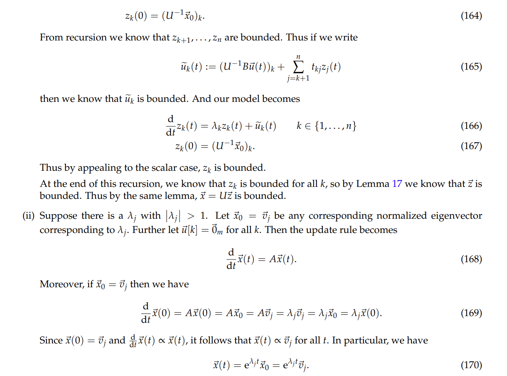
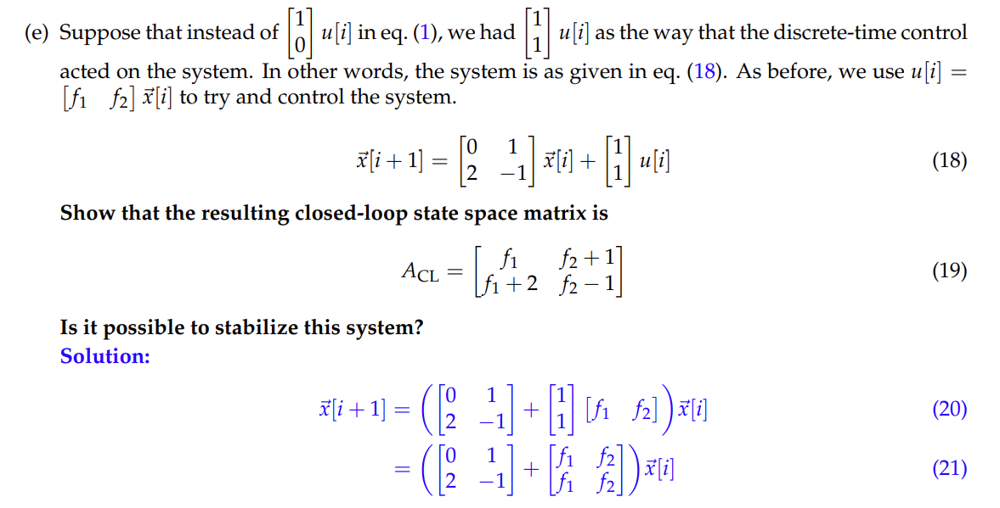

# Overview
> 

# Stability
## Definitions
### Boundedness
> 
> - $\vec{z}_d:\mathbb{N}\to \mathbb{R}^k$的含义是: 我们通过`Indexing`操作(指定一个$i\in \mathbb{N}$)，得到的是在时间步$i$时的状态向量$\vec{z}_d[i]\in\mathbb{R}^k$
> - $\vec{z}_c:\mathbb{N}\to \mathbb{R}^k$的含义是: 我们通过`Indexing`操作(指定一个正的时间$t\in \mathbb{R_+}$)，得到的是在时刻$t$的状态向量$\vec{z}_c(t)\in\mathbb{R}^k$
> - $R_d$和$R_c$都是与时间无关的有限常数。
> - $\vec{z_d},\vec{z}_c$是有界的意思是说他们的`Norm`在所有的时间上都是有界的。换句话说，我们沿着`Discrete LTI/Continuous LTI Model`的`State Trajectory`($i\in [0, n]$, t$\in [0,t]$)走的话, 每一个时刻对应的`State`向量的`Norm`都得是有界的。
> - 对于实数向量来说，向量的模长就是每个向量元素的平方和。对于复数向量来说，向量的模长就是每个向量元素的模长的平方和。

### BIBO Stability
> 

## Why we need Stability?
> 

# Asymptotic Stability
## Math Tools
### General Triangle Inequality
> 

### Boundedness of Vector Sequences and Functions
> 

> [!proof]
> **Proof of Lemma 17 Discrete Case**
> **(i):** **$(\implies)$如果$\vec{u}_d$是有界的，则根据定义，$\|\vec{u}_d[i]\|\leq R_u,\forall i$, 即$\forall i,\exists R_u~s.t.~~\|\vec{u}_d[i]\|=\sqrt{|u_{d,1}[i]|^2+|u_{d,2}[i]|^2+\cdots+|u_{d,n}[i]|^2}\leq R_u$
> 所以$|u_{d,1}[i]|^2+|u_{d,2}[i]|^2+\cdots+|u_{d,n}[i]|^2\leq R_u^2$, 对于$u_{d,j}[i]$来说，假设$\exists j, s.t. \forall M\in \mathbb{R},|u_{d,j}[i]|>M$(即无界)，则$|u_{d,1}[i]|^2+|u_{d,2}[i]|^2+\cdots+|u_{d,n}[i]|^2\leq R_u^2$,不成立，所以$u_{d,j}[i]$is bounded for all i.
> $(\Longleftarrow)$如果$u_k$是有界的，则$\exists R_{u,i}\in \mathbb{R}, s.t. |u_k[i]|\leq R_{u,k},\forall k\in \{1,2,\cdots, m\},\forall i$。则$|u_{d,1}[i]|^2+|u_{d,2}[i]|^2+\cdots+|u_{d,n}[i]|^2\leq \sum_{k}R_{u,k}^2$, 即$\|\vec{u}[i]\|\leq \sum_{k}R_{u,k}^2$所以$\vec{u}$有界。
> (ii): $(\implies)$如果$\vec{u}$是有界的，则根据$(i)$, $u_k$是有界的，令其为$R_k$, 即$|u_k[i]|\leq R_k,\forall i$。因为$C\vec{u}$有界等价于$(C\vec{u})_{k,:}$有界。而$(C\vec{u}[i])_{k,:}=C_{k,:}\vec{u}[i]=\sum_{j=1}^kc_{kj}u_{j[i]}\leq \sum_{j=1}^kc_{kj}R_{k}$, 证毕。
> $(\Longleftarrow)$如果$C\vec{u}$有界，则$(C\vec{u})_{k,:}$有界, 则利用$(i)$中的逻辑即可。
> **Proof of Lemma 17 Continuous Case**将上述证明中所有的求和符号都改成积分符号即可。

### Upper Triangularization
> 

## Discrete Time Model
> 

### Scalar Case
> 

> [!proof]
> 
> 上述证明中，当$|a|<1$, 如果$x[0]=0$, 则我们选择$u[k]=0,\forall k$即可让`System Unstable`, 但是如果$x[0]\neq 0$的取值, 则使得系统`unstable`的$u[i]$的构造需要变化一下，详见下面的例子:
> **Disc06B**
> 

### Diagonalizable Matrix Case
> 

> [!proof]
> 
🔔: $\vec{e}_j$表示只有第$j$项元素为$1$, 其余所有项元素为$0$的向量。

### Non-Diagonalizable Matrix Case
> 

**Proof**
> 

### Stable Region
> 

## Continuous Time Model
> 

**Proof **

### Scalar Case
> 

**Proof**

### Diagonalizable Matrix Case
> 

**Proof**

### Non-Diagonalizable Matrix Case
> 

**Proof**

### Stable Region
> 

## Proof Idea
> 

# Marginal Stability - Diagonalizable
## Definition
> 

## Discrete Time Model
> 

**Proof**
> 换句话说，就是如果$|\lambda_i|<1,\forall i$, 那么无论什么`Input`，模型永远是`Stable`的。但是如果$\lambda_k=1, k\in \mathbb{N}$, 则我们必须保证$(V^{-1}B)_{k,:}$也就是$V^{-1}B$的第$k$行是零向量, 那么模型才是稳定的，否则第$k$行的`Scalar Result`就是$z_k[i]=\lambda_k^iz_k[0]+\sum_{j=0}^{i-1}\lambda_k^{j}(V^{-1}B)_{k,:}\vec{u}[i-k-1]$, 此时我们取模得到:
> $\begin{aligned}|z_k[i]|&=|\lambda_k^iz_k[0]+\sum_{j=0}^{i-1}\lambda_k^{j}(V^{-1}B)_{k,:}\vec{u}[i-k-1]|\\&=|z_k[0]+\sum_{j=0}^{i-1}(V^{-1}B)_{k,:}\vec{u}[i-k-1]|\end{aligned}$
> 而$\lim_{i\to \infty} |z_k[i]| = \lim_{i\to \infty}|z_k[0]+\sum_{j=0}^{i-1}(V^{-1}B)_{k,:}\vec{u}[i-k-1]|$显然不是`Bounded`的。

## Continuous Time Model
> 

**Proof**

# Stability Sanity Check
## Discrete Time Model
> 

**Example**

## Continous Time Model
> 

**Example**

# Feedback Control
## Open/Closed Loop System
> 

## Discrete Time Case
> 
> $F\vec{x}[i]$代表的就是$\vec{f}(\vec{x}[i])$，一个向量函数。
> $F$的形状是由$\vec{x}[i]$的维数和$\vec{u}[i]$的维数共同决定的。
> 假设我们的模型是$\vec{x}[i+1]=\begin{bmatrix} 1&1\\0&2\end{bmatrix}\vec{x}[i]+\begin{bmatrix} 0\\1\end{bmatrix}u[i]$, 此时$A=\begin{bmatrix} 1&1\\0&2\end{bmatrix}$, $B=\begin{bmatrix} 0\\1\end{bmatrix}$, $u[i]\in \mathbb{R}^1$, $\vec{x}[i]\in \mathbb{R}^2$, 所以$F\in \mathbb{R}^{1\times 2}=\begin{bmatrix} f_1&f_2\end{bmatrix}$。

**Proof**
> 一般而言，我们会令$\vec{u}_{OL}[i]=\vec{0}$。

## Continuous Time Case
> 
> 其中$F=B^{-1}(A_{CL}-A)$, 如果$B^{-1}$存在的话。

**Proof**一般而言，我们会令$\vec{u}_{OL}[i]=\vec{0}$。

## Choice of F
### Input with Noise
> **Disc07A Sp22 P1**
> 

### Eigenvalues' Choice
> **Disc07B P1 Sp22**
> 

## Summary
> 对于一个离散系统$\vec{x}[i+1]=A\vec{x}[i]+B\vec{u}[i]$或者连续系统$\frac{d}{dt}\vec{x}(t)=A\vec{x}(t)+B\vec{u}(t)$来说，如果$A$有一些特征值$\lambda_k$(包括上三角化得到的)不满足`Stable`的条件，则我们可以对$\vec{u}[i]$做`Feedback Control`, 令$\vec{u}[i]=F\vec{x}[i]$, 此时我们可以得到一个新的系统:
> $\vec{x}[i+1]=(A+BF)\vec{x}[i]$或者$\frac{d}{dt}\vec{x}(t)=(A+BF)\vec{x}(t)$
> 令$A_{CL}=A+BF$, 我们定义了一个新的状态转移矩阵，我们期望通过改变$F$这个矩阵使得$A_{CL}$的特征值能够使得我们的系统稳定。
> 但是在某些情况下我们无论如何也无法找到这样的$F$,
> 

# Stablizing the Model
## Algorithm
> 

## Example
> 

# Circuit Examples(Disc06B)
> **Disc06B Sp22**
> 

**Solution**
> 

**(i) Derive Differential Equations**
**(ii) Solving Differential Equations**
**(iii) Stability Control**
> 

**Choice of Input Sequence**

# Resources
> **Note 11 Sp22**
> **Disc06B/07A Sp22**

