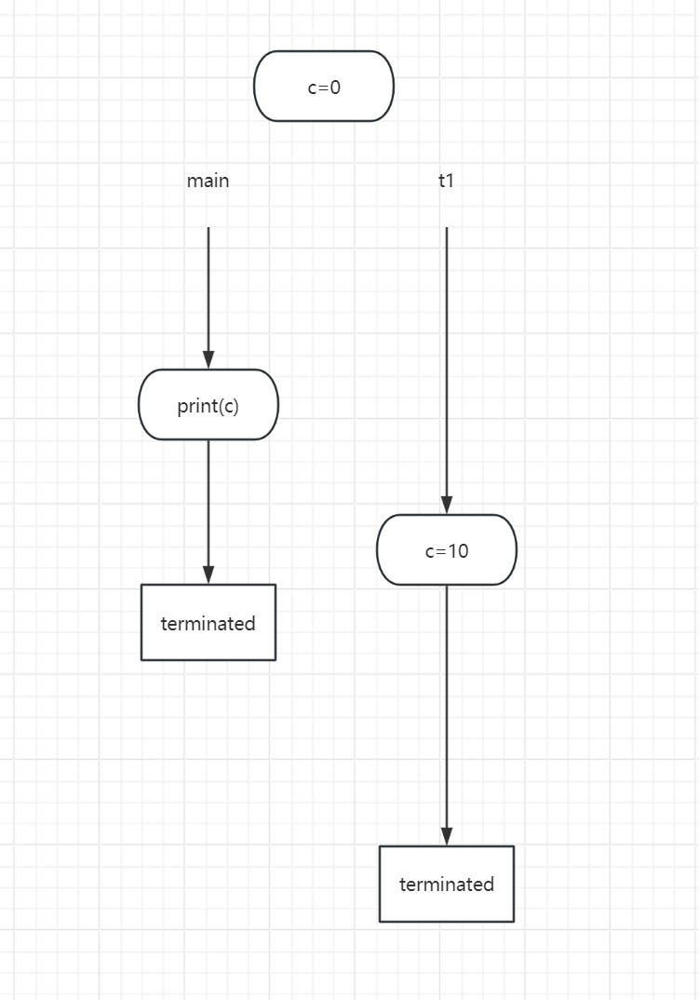
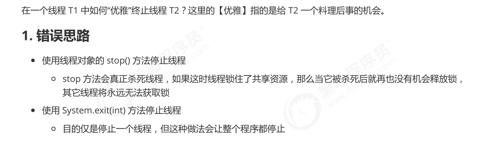

# Java 线程状态
## 操作系统层面(五种状态)
> [!important]
> 


## Java API 层面(六种状态)
> [!important]
> 


# Sleep and Yield
## Thread.sleep()
> [!important]
> 调用`sleep()`会让当前线程从`RUNNING`进入`TIMED WAITING`状态。
```java
package cn.itcast.test;

import lombok.extern.slf4j.Slf4j;


@Slf4j(topic = "c.sleep_yield")
public class sleep_yield {

    public static void main(String[] args) {
        Thread t1 = new Thread(new Runnable() {

            @Override
            public void run() {
                try {
                    Thread.sleep(2000);
                } catch (InterruptedException e) {
                    throw new RuntimeException(e);
                }
            }
        });

        t1.start();


        log.debug("Child Thread State:" + t1.getState());
        try {
            // Make sure that the child process starts sleeping and changes from runnable to timed waiting
            Thread.sleep(500);
            log.debug("Child Thread State:" + t1.getState());
        } catch (InterruptedException e) {
            throw new RuntimeException(e);
        }
    }
}
```
> [!code] Output
> 


## TimeUnit.sleep()
> [!important]
> `TimeUnit.sleep()`比`Thread.sleep()`拥有更好的可读性，前者在内部调用的就是后者。


## Thread.yield()
> [!important] 
> `Thread.yield()` changes the calling thread from `RUNNING` to `RUNNABLE`.
> 
> The difference between `TIMED WAITING` and `RUNNABLE` is that the former is like setting the priority of the thread to be very low, making it very difficult for scheduler to make it `RUNNABLE`. CPU will not dispatch its resource to a `TIMED WAITING` thread until the timer is over. 
> 
> `yield()` has no parameter, no need to wait.


## 线程优先级
> [!important]
> - 线程优先级会提示（hint）调度器优先调度该线程，但它仅仅是一个提示，调度器可以忽略它
> - 如果 cpu 比较忙，那么优先级高的线程会获得更多的时间片(把有限的钱用在刀刃上)，但 cpu 闲时，优先级几乎没作用
```java
package cn.itcast.test;

public class priority {

    public static void main(String[] args) {
        Runnable task1 = () -> {
            int count = 0;
            for (;;) {
                System.out.println("---->1 " + count++);
            }
        };
        Runnable task2 = () -> {
            int count = 0;
            for (;;) {
// Thread.yield();
                System.out.println(" ---->2 " + count++);
            }
        };
        Thread t1 = new Thread(task1, "t1");
        Thread t2 = new Thread(task2, "t2");
         t1.setPriority(Thread.MIN_PRIORITY);

         /*
            Since we manually create a scenario where CPU is infinitely
            looping, CPU is very busy, so we expect thread 2(which has higher priority)
            to be schduled with higher frequency and count variable increasing
            faster than thread 1.
          */
        t2.setPriority(Thread.MAX_PRIORITY);
        t1.start();
        t2.start();
    }
}
```


## sleep应用 - 防止CPU 100 % 
> [!important]
> 在只有单核的CPU上，我们如果使用`busy-waiting`机制会发现`CPU`占用率非常高，因为一直在跑`while loop`, 此时通过简单的在线程代码中添加`sleep()`即可显著降低占用率。


# Join
## 等待线程执行完毕
> [!important] 
> `t.join()` 可用于等待`t` 线程执行完毕后主线程才能继续执行。
```java
import lombok.extern.slf4j.Slf4j;
import java.util.concurrent.TimeUnit;

@Slf4j(topic="c.join")
public class join {

    static int c = 0;
    public static void main(String[] args) {
        Thread t1 = new Thread(()->{
            log.debug("t1 start...");
            try {
                TimeUnit.SECONDS.sleep(2);
                c = 10;
            } catch (InterruptedException e) {
                throw new RuntimeException(e);
            }
        },"t1");
        t1.start();

        log.debug("Main Thread, c:"  + c); // 0
    }
}
```
> [!exp] Output
> 
```java
import lombok.extern.slf4j.Slf4j;  
  
import java.util.concurrent.TimeUnit;  
  
@Slf4j(topic="c.join")  
public class join {  
  
    static int c = 0;  
    public static void main(String[] args) {  
        Thread t1 = new Thread(()->{  
            log.debug("t1 start...");  
            try {  
                TimeUnit.SECONDS.sleep(2);  
                c = 10;  
            } catch (InterruptedException e) {  
                throw new RuntimeException(e);  
            }        },"t1");  
        t1.start();  
  
        try {  
	        // Explicitly waiting for child thread to terminate
            t1.join();  
        } catch (InterruptedException e) {  
            throw new RuntimeException(e);  
        }  
        log.debug("Main Thread, c:"  + c); // 10  
    }  
}
```
> [!exp]
> 


## 等待多个线程
> [!code]
> 下面的代码中主线程等待多个线程执行完毕，等待时间取决于最慢的线程。
```java
package cn.itcast.test;  

import lombok.extern.slf4j.Slf4j;  
import java.util.concurrent.TimeUnit;  
  
@Slf4j(topic="c.join")  
public class join {  
  
    static int c = 0;  
    public static void main(String[] args) {  
        Thread t1 = new Thread(()->{  
            log.debug("t1 start...");  
            try {  
                TimeUnit.SECONDS.sleep(1);  
                c = 10;  
            } catch (InterruptedException e) {  
                throw new RuntimeException(e);  
            }        },"t1");  
  
        Thread t2 = new Thread(()->{  
            log.debug("t2 start...");  
            try {  
                TimeUnit.SECONDS.sleep(2);  
                c = 10;  
            } catch (InterruptedException e) {  
                throw new RuntimeException(e);  
            }        },"t2");  
        t1.start();  
        t2.start();  
  
        try {  
            long startTime = System.currentTimeMillis();  
            t1.join();  
            t2.join();  

			// Should be around 2 seconds
            log.debug("Time of waiting:" + (System.currentTimeMillis() - startTime)); // 10  
        } catch (InterruptedException e) {  
            throw new RuntimeException(e);  
        }    
    }
}
```
> [!exp]
> 

> [!code] 交换join 顺序
> 如果我们交换`t1.join()`和`t2.join()`的顺序, 总的等待时间还是`2s`, 因为在等待`t2`的期间`t1`已经执行完毕，所以当`t2.join()`的阻塞解除时, `t1.join()`并不会呗阻塞，因为线程`t1`早已完成执行。
> 


## 有时效的等待
> [!code]
> `join(maxTime)`方法可以接受一个参数，表示线程等待的最大时间，超过这个时间之后线程不在等待子线程，继续执行其代码。
```java
package cn.itcast.test;  
  
  
import lombok.extern.slf4j.Slf4j;  
  
@Slf4j(topic = "c.timed_join")  
public class timed_join {  
  
    static int r1 = 0;  
    static int r2 = 0;  
  
  
    public static void main(String[] args) throws InterruptedException {  
        test1();  
        test2();  
    }  
  
    public static void test1() throws InterruptedException {  
        Thread t1 = new Thread(() -> {  
            try {  
                Thread.sleep(2000);  
                r1 = 1;  
            } catch (InterruptedException e) {  
                throw new RuntimeException(e);  
            }        }, "t1");  
        t1.start();  
  
        // Didn't wait enough time, where t1 hasn't terminated and updated the r1  
        t1.join(1500);  
        log.debug("r1:" + r1);  // 0
    }  
    public static void test2() throws InterruptedException {  
        Thread t2 = new Thread(() -> {  
            try {  
                Thread.sleep(2000);  
                r2 = 1;  
            } catch (InterruptedException e) {  
                throw new RuntimeException(e);  
            }        }, "t1");  
        t2.start();  
  
        // Wait enough time, where t1 has terminated and updated the r1  
        t2.join(2500);  
        log.debug("r2:" + r2);  // 1
    }}
```


# Interrupt
## Thread.interrupt()
> [!important]
> 其他线程使用`interrupt()`方法可以打断`TIMED WAITING`状态使其变成`RUNNABLE`状态。
```java
package cn.itcast.test;


import lombok.extern.slf4j.Slf4j;

@Slf4j(topic="c.interrupt")
public class interrupt {

    public static void main(String[] args) {
        Thread t1 = new Thread(new Runnable() {
            @Override
            public void run() {
                try {
                    log.debug("Ready to sleep!");
                    Thread.sleep(2000);
                } catch (InterruptedException e) {
                    log.debug("waking up...");
                    e.printStackTrace();
                }
            }
        });

        // Before child thread is scheduled by CPU: NEW
        log.debug("Child Thread State:" + t1.getState());
        t1.start();

        try {
            Thread.sleep(500);
            // Check child thread state to become TIMED WAITING
            log.debug("Child Thread State:" + t1.getState());

            // Ready to interrupt
            log.debug("Interrupting...");
            t1.interrupt();

            // Check the child thread state: TIMED WAITING
            log.debug("Child Thread State:" + t1.getState());
        } catch (InterruptedException e) {
            throw new RuntimeException(e);
        }

        try {
            Thread.sleep(500);
        } catch (InterruptedException e) {
            throw new RuntimeException(e);
        }
        
        // TERMINATED
        log.debug("Child Thread State:" + t1.getState());
    }
}
```
> [!code] Output
> 


## 被打断的线程状态
> [!important]
> 对于一个线程来说，其内部有一个`isInterrupted`状态, 默认为`false`.
> - 如果线程在`RUNNABLE`(可运行和运行状态都是这个)状态被打断，则`isInterrupted`设置为`true`。不会清空打断状态（清空指的是从`true` 回到`false`, 因为初始状态为`false`）。
> - 如果线程在`TIMED WAITING`状态被打断, 则`isInterrupted`重置为`false`. 原因是`TIMED WAITING`状态下被打断就如同我们要唤醒这个线程，此时`isInterrupted`被重置是为了后续该线程在`RUNNABLE`状态下能够区分是否再次被其他线程打断, 打断为`true`, 没有为`false`。
```java
package cn.itcast.test;  
  
import lombok.extern.slf4j.Slf4j;  
  
@Slf4j(topic="c.interruptState")  
public class interruptState {  
    public static void main(String[] args) throws InterruptedException {  
        test1();  
    }  
    public static void test1() throws InterruptedException {  
        Thread t1 = new Thread(() -> {  
            try {  
                Thread.sleep(2000);  
            } catch (InterruptedException e) {  
                e.printStackTrace();  
            }        }, "t1");  
        t1.start();  
  
        log.debug("before interrupt, state:" + t1.getState() + ", isinterrupted: " + t1.isInterrupted());  // RUNNABLE的时候被打断, true


		// 确保t1进入TIMED WAITING状态
        Thread.sleep(500);  
  
        log.debug("before interrupt, state:" + t1.getState() + ", isinterrupted: " + t1.isInterrupted());  // sleep的时候被打断，isInterrupt: false
  
        t1.interrupt();  
  
        log.debug("after interrupt, state:" + t1.getState() + ", isinterrupted: " + t1.isInterrupted());  // false
    }

	public static void test2() throws InterruptedException {  
    Thread t2 = new Thread(() -> {  
        for(;;) {  
  
        }    }, "t2");  
    t2.start();  
  
  
    // t1 is runnable  
    log.debug("before scheduled, state:" + t2.getState() + ", isinterrupted: " + t2.isInterrupted());  
  
    Thread.sleep(500);  
  
    // t1 is running  
    log.debug("after schduled, before interrupt, state:" + t2.getState() + ", isinterrupted: " + t2.isInterrupted());  
  
    t2.interrupt();  
  
  
    // t1 is running  
    log.debug("after interrupt, state:" + t2.getState() + ", isinterrupted: " + t2.isInterrupted());  
	}
    
}
```
> [!code] Output
> test1
> 
> test2
> 
> 


## 通过打断终止线程执行
> [!code]
> 我们可以利用`isInterrupted`的变化来调整被打断的线程的运行状态。
```java
package cn.itcast.test;  
  
  
import lombok.extern.slf4j.Slf4j;  
  
@Slf4j(topic="c.interruptThread")  
public class interruprThread {  
    public static void main(String[] args) throws InterruptedException {  
        test1();  
    }  
    public static void test1() throws InterruptedException {  
        Thread t1 = new Thread(() -> {  
            boolean isInterrupted =  Thread.currentThread().isInterrupted();  
            log.debug("running...");  
            for(;;) {  
                // While t1 is running, if it is interrupted, isInterrupted will be true.  
                if (isInterrupted) { 
                // 如果被打断，终止执行 
                    log.debug("While runnning, is interrupted, breaking...");  
                    break;  
                }                
                isInterrupted = Thread.currentThread().isInterrupted();  
            }       
		});        
		t1.start();  
  
        Thread.sleep(2000);  
  
        log.debug("ready to interrupt");  
  
  
        t1.interrupt();  
    }}
```
> [!code] Output
> 


# Park
## 特性
> [!code]
> 线程内部调用`park()`会使得线程在此停下来。
> 使用`interrupt()`打断调用了`park()`的线程，不会清空打断状态。
```java
package cn.itcast.test;

import lombok.extern.slf4j.Slf4j;

import java.util.concurrent.locks.LockSupport;

import static cn.itcast.n2.util.Sleeper.sleep;

@Slf4j(topic="c.park")
public class park {
    public static void main(String[] args) {
        Thread t1 = new Thread(() -> {
            log.debug("park...");
            // Here isInterrupted = false, causing the park() to block
            LockSupport.park();  // block here, until being interrupted
            // After interrupted, isInterrupted is set to true, causing the blocking park() to proceed.
            log.debug("unpark...");
            log.debug("interrupt state: {}", Thread.currentThread().isInterrupted());
            // The next time LockSupport.park() is called, since isInterrupted is still true, the following line won't block
            LockSupport.park(); // Cannot block.
            log.debug("unpark...");
        }, "t1");
        t1.start();

        sleep(2);
        t1.interrupt();
    }
}

```
> [!code] Output
> 


## 如何使park()多次生效
> [!code]
> 使用`Thread.interrupted()`方法:
> - 该方法返回当前调用线程的状态，并清除打断标记，重置为`false`
> - 可以和`park()`配合使得`park()`多次生效。
```java
package cn.itcast.test;

import lombok.extern.slf4j.Slf4j;

import java.util.concurrent.locks.LockSupport;

import static cn.itcast.n2.util.Sleeper.sleep;

@Slf4j(topic="c.park")
public class park {
    public static void main(String[] args) {
        Thread t1 = new Thread(() -> {
            log.debug("park...");
            LockSupport.park();  // block here, until being interrupted
            log.debug("unpark...");
            // Thread.interrupted() reset isInterrupted to false
            log.debug("interrupt state: {}", Thread.interrupted());
            LockSupport.park(); // block again
            log.debug("unpark...");
        }, "t1");
        t1.start();

        sleep(2);
        t1.interrupt();
    }
```


# 设计模式 - Two Phase Termination
> [!motiv]
> 
> `System.exit()` 实际上会终结主进程，进而终结主进程中的所有线程。

> [!def]
> 
> Notes:
> 1. 睡眠两秒的意义是让出CPU的时间片让CPU不会太忙。
> 2. 总的来说分为两种情况
> 	1. 线程在`Running`的时候被打断，直接料理后事, 并退出循环。
> 	2. 线程在`sleep`的时候被打断，先将打断标记设置为`true`, 在下一次循环的时候料理后事并推出循环。
> 
```java
package cn.itcast.test;


import lombok.extern.slf4j.Slf4j;

import java.util.concurrent.TimeUnit;

@Slf4j(topic="c.TwoPhaseTerminate")
public class TwoPhaseTerminate {
    public static void main(String[] args) throws InterruptedException {
        MonitorThread mt = new MonitorThread();
        mt.start();

        TimeUnit.SECONDS.sleep(10);

        mt.stop();
    }
}


@Slf4j(topic="c.MonitorThread")
class MonitorThread {
    private Thread monitor;

    public void start() {
        monitor = new Thread(() -> {
            Thread ct = Thread.currentThread();
            while (true) {
                if (ct.isInterrupted()) {
                    // interrupted while running, reaping and exiting
                    log.debug("reaping itself");
                    break;
                }
                try {
                    // If not interrupted, sleep and monitor
                    Thread.sleep(2000);
                    log.debug("monitor logging");
                } catch (InterruptedException e) {
                    /*
                        If interrupted when sleeping, isInterupted is reset to false, so we need to set the isInterrupted from false to true.
                        Then in the next loop, the thread will exit.
                    */
                    ct.interrupt();
                }
            }
        }, "monitor");
        monitor.start();
    }


    public void stop() {
        monitor.interrupt(); // Interrupt the thread
    }
}
```


# 主线程和守护线程
> [!def]
> 默认情况下，Java 进程需要等待所有线程都运行结束，才会结束。有一种特殊的线程叫做守护线程，只要其它非守护线程运行结束了，即使守护线程的代码没有执行完，也会强制结束。就是说一旦我们将一个线程设置为了守护线程，主进程就不用等待其结束了才结束，而是直接终止它。
> 
> 在java中，我们通过`Thread.setDaemon(true)`可以将非守护线程设置为守护线程。
> 
> 垃圾回收线程就是一种守护线程。
```java
package cn.itcast.test;

import lombok.extern.slf4j.Slf4j;

@Slf4j(topic = "c.Test15")
public class Test15 {
    public static void main(String[] args) throws InterruptedException {
        Thread t1 = new Thread(() -> {
            while (true) {
                if (Thread.currentThread().isInterrupted()) {
                    break;
                }
            }
            log.debug("结束");
        }, "t1");
        t1.setDaemon(true);
        t1.start();

        Thread.sleep(1000);
        log.debug("结束");
    }
}
```
> [!code] Output
> 


