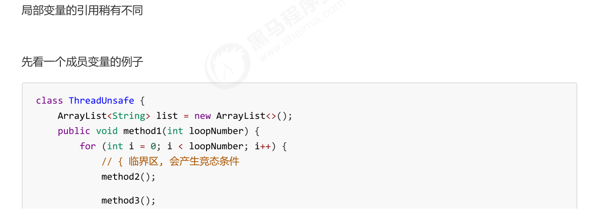
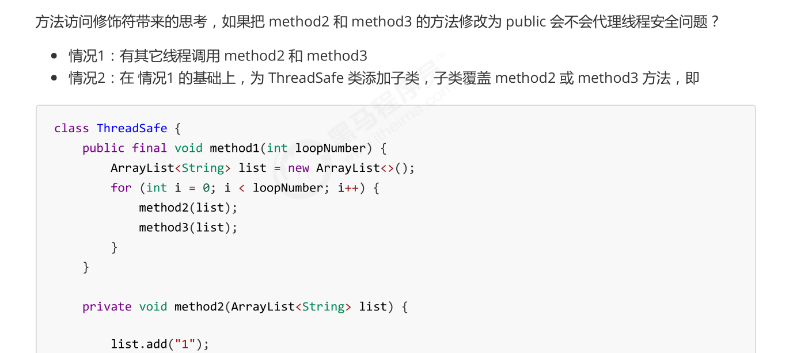

# synchronized 
## 对象锁
> [!important]
> **把需要共享的变量封装到一个类当中:**
> - `synchronized`加在动态方法上，等价于锁住当前类的对象(`this`/ `new Room()`)。
> - `synchronized`加在静态方法上，等价于所著当前类的字节码(`Room.class`)
```java
import lombok.extern.slf4j.Slf4j;

public class Room {

    int value = 0;
    static int values = 0;


	/*
	  语法糖，same as 
	  public synchronized void increment(){
		  this.value++;
	  }
	*/
    public void increment() {
        synchronized (this) {
            this.value++;
        }
    }


	/*
	  语法糖，same as 
	  public synchronized static void increment(){
		  values++;
	  }
	*/
    public static void increments() {
        synchronized (Room.class) {
            values++;
        }
    }

    public void decrement() {
        synchronized (this) {
            this.value--;
        }
    }

    public static void decrements() {
        synchronized (Room.class) {
            values--;
        }
    }

    public int getValue() {
        synchronized (this) {
            return this.value;
        }
    }

    public static int getValues() {
        synchronized (Room.class) {
            return values;
        }
    }
}

import lombok.extern.slf4j.Slf4j;

@Slf4j(topic = "c.ObjectLock")
public class ObjectLock {

    public static void main(String[] args) throws InterruptedException {
        Room room = new Room();

        Thread t1 = new Thread(() -> {
            for (int i = 0; i < 5000; i++) {
                room.increment();
                Room.increments();
            }
        }, "t1");

        Thread t2 = new Thread(() -> {
            for (int i = 0; i < 5000; i++) {
                room.decrement();
                Room.decrements();
            }
        }, "t2");

        t1.start();
        t2.start();

        t1.join();
        t2.join();

        log.debug("Count: {}", room.getValue());
        log.debug("Counts: {}", Room.getValues());
    }
}
```


## 线程八锁
> [!example] Case 1
> Output: 1 2 or 2 1
> 取决于哪一个线程先获得CPU执行权。
```java
@Slf4j(topic = "c.Number")  
class Number{  
    public synchronized void a() {  
        log.debug("1");  
    }    
    
    public synchronized void b() {  
        log.debug("2");  
    }}  
public static void main(String[] args) {  
    Number n1 = new Number();  
    new Thread(()->{ n1.a(); }).start();  
    new Thread(()->{ n1.b(); }).start();  
}
```

> [!example] Case 2
> Output:
> - 如果线程1先获取CPU, 则1s后1  2
> - 如果线程2先获取CPU, 则2  1s后1
> 
```java
@Slf4j(topic = "c.Number")  
class Number{  
    public synchronized void a() {  
        sleep(1);  
        log.debug("1");  
    }    
    public synchronized void b() {  
        log.debug("2");  
    }}  
    
	public static void main(String[] args) {  
	    Number n1 = new Number();  
	    new Thread(()->{ n1.a(); }).start();  
	    new Thread(()->{ n1.b(); }).start();  
	}
}
```


> [!example] Case 3
> Output: 
> - 情况1：3 1s 12 
> - 情况2：23 1s 1
> - 情况3：32 1s 1
> 
> 线程3并没有参与锁争夺的过程，所以3可能在任何时候被打印出来，但是要注意，如果线程1先获得CPU，则因为其要等待1s，所以 3 可能出现在等待的这一秒钟内，对应情况1。
> 
> 如果线程1 没有获取到CPU, 那么线程2 和 3 等可能被先后打印，对应情况2, 3。
```java
@Slf4j(topic = "c.Number")  
class Number{  
    public synchronized void a() {  
        sleep(1);  
        log.debug("1");  
    }   
    public synchronized void b() {  
        log.debug("2");  
    }    
    public void c() {  
        log.debug("3");  
    }}  
	public static void main(String[] args) {  
	    Number n1 = new Number();  
	    new Thread(()->{ n1.a(); }).start();  
	    new Thread(()->{ n1.b(); }).start();  
	    new Thread(()->{ n1.c(); }).start();  
}
```

> [!example] Case 4
> 这里因为线程1和线程2持有不同的对象锁，所以没有竞态发生，两个线程同时获取各自的锁对象，然后CPU, multiplexing 执行指令。
> 
> Output:
> - 2 1s后1
```java
@Slf4j(topic = "c.Number")  
class Number{  
    public synchronized void a() {  
        sleep(1);  
        log.debug("1");  
    }    
    public synchronized void b() {  
        log.debug("2");  
    }
}

public static void main(String[] args) {  
	Number n1 = new Number();  
	Number n2 = new Number();  
	new Thread(()->{ n1.a(); }).start();  
	new Thread(()->{ n2.b(); }).start();  
}`
```


> [!example] Case 5
> 和Case 4 类似，线程1锁住的是`Number()`对象，线程2锁住的是`Number.class`对象，本质是不同的对象，所以没有互斥的效果。
> 
> Output:
> - 2 1s后1
```java
@Slf4j(topic = "c.Number")  
class Number{  
    public static synchronized void a() {  
        sleep(1);  
        log.debug("1");  
    }    
    public synchronized void b() {  
        log.debug("2");  
    }  
}

public static void main(String[] args) {  
	Number n1 = new Number();  
	new Thread(()->{ n1.a(); }).start();  
	new Thread(()->{ n1.b(); }).start();  
}

```

> [!example] Case 6
> 和Case 2一样。两个线程在`Number()`对象上互斥。
```java
@Slf4j(topic = "c.Number")  
class Number{  
    public static synchronized void a() {  
        sleep(1);  
        log.debug("1");  
    }  
    public static synchronized void b() {  
        log.debug("2");  
    }
}  
public static void main(String[] args) {  
	Number n1 = new Number();  
	new Thread(()->{ n1.a(); }).start();  
	new Thread(()->{ n1.b(); }).start();  
}
```

> [!example] Case 7
> 和Case 5 类似
> 
> Output:
> - 2 1s后1
```java
@Slf4j(topic = "c.Number")  
class Number{  
    public static synchronized void a() {  
        sleep(1);  
        log.debug("1");  
    }    
    public synchronized void b() {  
        log.debug("2");  
    }
}  

public static void main(String[] args) {  
    Number n1 = new Number();  
    Number n2 = new Number();  
    new Thread(()->{ n1.a(); }).start();  
    new Thread(()->{ n2.b(); }).start();  
}
```

> [!example] Case 8
> 线程1和线程2在`Number.class`对象上互斥。
> 
> Output:
> 1s 后12， 或 2 1s后 1
```java
@Slf4j(topic = "c.Number")  
class Number{  
    public static synchronized void a() {  
        sleep(1);  
        log.debug("1");  
    }    
    public static synchronized void b() {  
        log.debug("2");  
    }
}  

public static void main(String[] args) {  
    Number n1 = new Number();  
    Number n2 = new Number();  
    new Thread(()->{ n1.a(); }).start();  
    new Thread(()->{ n2.b(); }).start();  
}

```


# 变量线程安全分析
## 总论
> [!def]
> **成员变量和静态变量是否线程安全？**
> - 如果它们没有共享，则线程安全
> - 如果它们被共享了，根据它们的状态是否能够改变，又分两种情况
> 	- 如果只有读操作，则线程安全
> 	- 如果有读写操作，则这段代码是临界区，需要考虑线程安全
> 
> **局部变量是否线程安全？**
> - 局部变量是线程安全的
> - 但局部变量引用的对象则未必（比如在堆内存中的对象）
> 	- 如果该对象没有逃离方法的作用访问，它是线程安全的
> 	- 如果该对象逃离方法的作用范围，需要考虑线程安全


## 局部变量在栈上
> [!example]
> 
> 注意在`java`中，如果一个变量被分配在栈内存上，则对这个变量的自增操作在转化为指令时只有一行`iinc`。如果变量在方法区中，则指令会有多行（一般为`3`行，`iload, inc istore`）。
> 
> 


## 局部变量是引用
### 多个线程引用同一个对象
> [!example]
> 


### 不同线程引用不同对象
> [!example]
> 


## 将局部引用暴露给外部（子类）
> [!example]
> 
> 这个例子中，父类中的`method2()`和`method3()`因为会接收一个`list`参数，所以存在将该参数暴露给其他线程的风险。
> 
> 如果`method2()`和`method3()`的权限修饰符是`private`或者`ThreadSafe`类是一个`final`类，则其不能被继承，这就保护了`method1()`中创建的`list`局部变量不会暴露。
> 
> 否则，如果权限修饰符为`public`, 则按照上面的方式重写，则`method1()`中创建的`list`会通过`method3(list)`的参数传递给这个新的线程，导致有多个线程共享`list`变量。


# 线程安全类
## 常见线程安全类
> [!def]
> 


