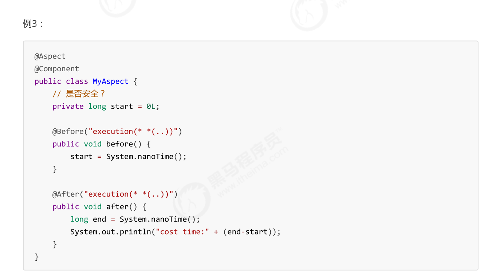

# synchronized 用法
## 对象锁
> [!important]
> **把需要共享的变量封装到一个类当中:**
> - `synchronized`加在动态方法上，等价于锁住当前类的对象(`this`/ `new Room()`)。
> - `synchronized`加在静态方法上，等价于所著当前类的字节码(`Room.class`)
```java
import lombok.extern.slf4j.Slf4j;

public class Room {

    int value = 0;
    static int values = 0;


	/*
	  语法糖，same as 
	  public synchronized void increment(){
		  this.value++;
	  }
	*/
    public void increment() {
        synchronized (this) {
            this.value++;
        }
    }


	/*
	  语法糖，same as 
	  public synchronized static void increment(){
		  values++;
	  }
	*/
    public static void increments() {
        synchronized (Room.class) {
            values++;
        }
    }

    public void decrement() {
        synchronized (this) {
            this.value--;
        }
    }

    public static void decrements() {
        synchronized (Room.class) {
            values--;
        }
    }

    public int getValue() {
        synchronized (this) {
            return this.value;
        }
    }

    public static int getValues() {
        synchronized (Room.class) {
            return values;
        }
    }
}

import lombok.extern.slf4j.Slf4j;

@Slf4j(topic = "c.ObjectLock")
public class ObjectLock {

    public static void main(String[] args) throws InterruptedException {
        Room room = new Room();

        Thread t1 = new Thread(() -> {
            for (int i = 0; i < 5000; i++) {
                room.increment();
                Room.increments();
            }
        }, "t1");

        Thread t2 = new Thread(() -> {
            for (int i = 0; i < 5000; i++) {
                room.decrement();
                Room.decrements();
            }
        }, "t2");

        t1.start();
        t2.start();

        t1.join();
        t2.join();

        log.debug("Count: {}", room.getValue());
        log.debug("Counts: {}", Room.getValues());
    }
}
```


## 线程八锁
> [!example] Case 1
> Output: 1 2 or 2 1
> 取决于哪一个线程先获得CPU执行权。
```java
@Slf4j(topic = "c.Number")  
class Number{  
    public synchronized void a() {  
        log.debug("1");  
    }    
    
    public synchronized void b() {  
        log.debug("2");  
    }}  
public static void main(String[] args) {  
    Number n1 = new Number();  
    new Thread(()->{ n1.a(); }).start();  
    new Thread(()->{ n1.b(); }).start();  
}
```

> [!example] Case 2
> Output:
> - 如果线程1先获取CPU, 则1s后1  2
> - 如果线程2先获取CPU, 则2  1s后1
> 
```java
@Slf4j(topic = "c.Number")  
class Number{  
    public synchronized void a() {  
        sleep(1);  
        log.debug("1");  
    }    
    public synchronized void b() {  
        log.debug("2");  
    }}  
    
	public static void main(String[] args) {  
	    Number n1 = new Number();  
	    new Thread(()->{ n1.a(); }).start();  
	    new Thread(()->{ n1.b(); }).start();  
	}
}
```


> [!example] Case 3
> Output: 
> - 情况1：3 1s 12 
> - 情况2：23 1s 1
> - 情况3：32 1s 1
> 
> 线程3并没有参与锁争夺的过程，所以3可能在任何时候被打印出来，但是要注意，如果线程1先获得CPU，则因为其要等待1s，所以 3 可能出现在等待的这一秒钟内，对应情况1。
> 
> 如果线程1 没有获取到CPU, 那么线程2 和 3 等可能被先后打印，对应情况2, 3。
```java
@Slf4j(topic = "c.Number")  
class Number{  
    public synchronized void a() {  
        sleep(1);  
        log.debug("1");  
    }   
    public synchronized void b() {  
        log.debug("2");  
    }    
    public void c() {  
        log.debug("3");  
    }}  
	public static void main(String[] args) {  
	    Number n1 = new Number();  
	    new Thread(()->{ n1.a(); }).start();  
	    new Thread(()->{ n1.b(); }).start();  
	    new Thread(()->{ n1.c(); }).start();  
}
```

> [!example] Case 4
> 这里因为线程1和线程2持有不同的对象锁，所以没有竞态发生，两个线程同时获取各自的锁对象，然后CPU, multiplexing 执行指令。
> 
> Output:
> - 2 1s后1
```java
@Slf4j(topic = "c.Number")  
class Number{  
    public synchronized void a() {  
        sleep(1);  
        log.debug("1");  
    }    
    public synchronized void b() {  
        log.debug("2");  
    }
}

public static void main(String[] args) {  
	Number n1 = new Number();  
	Number n2 = new Number();  
	new Thread(()->{ n1.a(); }).start();  
	new Thread(()->{ n2.b(); }).start();  
}`
```


> [!example] Case 5
> 和Case 4 类似，线程1锁住的是`Number()`对象，线程2锁住的是`Number.class`对象，本质是不同的对象，所以没有互斥的效果。
> 
> Output:
> - 2 1s后1
```java
@Slf4j(topic = "c.Number")  
class Number{  
    public static synchronized void a() {  
        sleep(1);  
        log.debug("1");  
    }    
    public synchronized void b() {  
        log.debug("2");  
    }  
}

public static void main(String[] args) {  
	Number n1 = new Number();  
	new Thread(()->{ n1.a(); }).start();  
	new Thread(()->{ n1.b(); }).start();  
}

```

> [!example] Case 6
> 和Case 2一样。两个线程在`Number()`对象上互斥。
```java
@Slf4j(topic = "c.Number")  
class Number{  
    public static synchronized void a() {  
        sleep(1);  
        log.debug("1");  
    }  
    public static synchronized void b() {  
        log.debug("2");  
    }
}  
public static void main(String[] args) {  
	Number n1 = new Number();  
	new Thread(()->{ n1.a(); }).start();  
	new Thread(()->{ n1.b(); }).start();  
}
```

> [!example] Case 7
> 和Case 5 类似
> 
> Output:
> - 2 1s后1
```java
@Slf4j(topic = "c.Number")  
class Number{  
    public static synchronized void a() {  
        sleep(1);  
        log.debug("1");  
    }    
    public synchronized void b() {  
        log.debug("2");  
    }
}  

public static void main(String[] args) {  
    Number n1 = new Number();  
    Number n2 = new Number();  
    new Thread(()->{ n1.a(); }).start();  
    new Thread(()->{ n2.b(); }).start();  
}
```

> [!example] Case 8
> 线程1和线程2在`Number.class`对象上互斥。
> 
> Output:
> 1s 后12， 或 2 1s后 1
```java
@Slf4j(topic = "c.Number")  
class Number{  
    public static synchronized void a() {  
        sleep(1);  
        log.debug("1");  
    }    
    public static synchronized void b() {  
        log.debug("2");  
    }
}  

public static void main(String[] args) {  
    Number n1 = new Number();  
    Number n2 = new Number();  
    new Thread(()->{ n1.a(); }).start();  
    new Thread(()->{ n2.b(); }).start();  
}

```


# 变量线程安全分析
## 总论
> [!def]
> **成员变量和静态变量是否线程安全？**
> - 如果它们没有共享，则线程安全
> - 如果它们被共享了，根据它们的状态是否能够改变，又分两种情况
> 	- 如果只有读操作，则线程安全
> 	- 如果有读写操作，则这段代码是临界区，需要考虑线程安全
> 
> **局部变量是否线程安全？**
> - 局部变量是线程安全的
> - 但局部变量引用的对象则未必（比如在堆内存中的对象）
> 	- 如果该对象没有逃离方法的作用访问，它是线程安全的
> 	- 如果该对象逃离方法的作用范围，需要考虑线程安全


## 局部变量在栈上
> [!example]
> 
> 注意在`java`中，如果一个变量被分配在栈内存上，则对这个变量的自增操作在转化为指令时只有一行`iinc`。如果变量在方法区中，则指令会有多行（一般为`3`行，`iload, inc istore`）。
> 
> 


## 局部变量是引用
### 多个线程引用同一个对象
> [!example]
> 


### 不同线程引用不同对象
> [!example]
> 


## 将局部引用暴露给外部（子类）
> [!example]
> 
> 这个例子中，父类中的`method2()`和`method3()`因为会接收一个`list`参数，所以存在将该参数暴露给其他线程的风险。
> 
> 如果`method2()`和`method3()`的权限修饰符是`private`或者`ThreadSafe`类是一个`final`类，则其不能被继承，这就保护了`method1()`中创建的`list`局部变量不会暴露。
> 
> 否则，如果权限修饰符为`public`, 则按照上面的方式重写，则`method1()`中创建的`list`会通过`method3(list)`的参数传递给这个新的线程，导致有多个线程共享`list`变量。


# 线程安全类
## 常见线程安全类
> [!def]
> 


## 线程安全方法的组合
> [!example]
> 
> 可以看到，线程安全方法的组合不是线程安全的。


## 不可变类的线程安全
> [!important]
> 
> 这种方法被称为defensive copying.


## 实例分析
### Servlet
> [!example] Case 1
> 
> 在`Tomcat`运行期间只会有一个`Servlet`对象产生，这就意味着肯定有多个线程会对这个对象的状态进行修改。
> - 所有引用类在没有权限修饰符的情况下都是线程不安全的。
> - 不可变类的引用类在`final`修饰下是线程安全的，比如这里的`String`
> - 所有可变类即便加上`final`修饰也是线程不安全的，比如这里的`Date`

> [!example] Case 2
> 
> 这里`userService`也不是线程安全的，`update()`方法就属于临界区，会有多个线程调用。


### Spring AOP
> [!example] Spring
> 
> Spring中的任何对象默认都是单例的，也就是所有的对象都有被多个线程共享的可能。于是这个例子中，多个线程都可以调用`MyAspect()`对象的`before()` 或者 `after()`方法导致`start`变量的值不是线程安全的。


### 无状态类
> [!example]
> 
> **从下面往上看:**
> - `UserDaoImpl`是无状态的，尽管`update()`会被多个线程调用，但是其方法内部创建的都是对其他线程不可见的局部变量，且没有向外部暴露(如果加一些修饰符的话会更好)。同时`conn`对象也是局部变量，也是线程安全的。
> - `UserServiceImpl`是线程安全的，尽管他有一个成员变量，但是这个成员变量是无状态的。同时这个类中的方法也没有修改`userDao`的指向，所以是线程安全的。
> - `MyServlet`也是线程安全的，原因同上。

> [!example]
> 
> 和上面的例子类似，但是这里`UserDaoImpl`类不是无状态的了，有一个成员变量会被多个线程执行`update()`修改。


### 局部变量
> [!example]
> 
> 得益于局部变量的存在，这个程序是线程安全的，每个线程在调用`UserServiceImpl`的`update()`方法时，都会创建一个新的`UserDaoImpl`。
> 
> 尽管`UserDaoImpl`类是有状态的，但是不同线程内部都有自己的类对象，不存在共享问题。

> [!bug] Caveats
> 推荐将`Connection`对象作为线程内的局部变量，这样可以保证线程安全，保证每个线程只处理自己的请求。


### 暴露引用/变量逃逸
> [!example]
> 
> 这里局部变量`sdf`会被传递给子类的对象中，导致如果我们通过子类对象执行`bar()`时，会发生线程安全问题。


### JDK String
> [!important]
> **几个问题:**
> - 为什么`String`类已经是`Immutable`了, 却还要设计成`final`类? 如果不是`final`类，则如果子类通过外星方法继承并重写了`String`类的某个会暴露内部状态引用的方法，则通过这个子类调用外星方法会导致线程安全问题。本质上就是子类会通过继承重写破坏父类方法的行为。
> 
> 


## 买票练习
> [!example]
```java
package cn.itcast.n4.exercise;

import lombok.extern.slf4j.Slf4j;

import java.util.ArrayList;
import java.util.List;
import java.util.Random;
import java.util.Vector;

@Slf4j(topic = "c.ExerciseSell")
public class ExerciseSell {
    public static void main(String[] args) throws InterruptedException {
        // 模拟多人买票
        TicketWindow window = new TicketWindow(1000);

        // 所有线程的集合
        List<Thread> threadList = new ArrayList<>();
        // 卖出的票数统计
        List<Integer> amountList = new Vector<>();
        for (int i = 0; i < 2000; i++) {
            Thread thread = new Thread(() -> {
			 /*
			   这里window和amountList是两个不同的类，各自都需要线程安全保护
			   但是不需要组合起来保护。
			 */
                // 买票
                int amount = window.sell(random(5));
                // 统计买票数，因为Vector<>是线程安全类，所以不需要加synchronized(amountList){...}
                amountList.add(amount);
            });
            threadList.add(thread);
            thread.start();
        }

        for (Thread thread : threadList) {
            thread.join();
        }

        // 统计卖出的票数和剩余票数
        log.debug("余票：{}",window.getCount());
        log.debug("卖出的票数：{}", amountList.stream().mapToInt(i-> i).sum());
    }

    // Random 为线程安全
    static Random random = new Random();

    // 随机 1~5
    public static int random(int amount) {
        return random.nextInt(amount) + 1;
    }
}

// 售票窗口
class TicketWindow {
    private int count;

    public TicketWindow(int count) {
        this.count = count;
    }

    // 获取余票数量
    public int getCount() {
        return count;
    }

    // 售票
    public synchronized int sell(int amount) {
        if (this.count >= amount) {
            this.count -= amount;
            return amount;
        } else {
            return 0;
        }
    }
}

```


## 转账练习
> [!example]
```java
import lombok.extern.slf4j.Slf4j;

import java.util.Random;

@Slf4j(topic = "c.ExerciseTransfer")
public class ExerciseTransfer {
    public static void main(String[] args) throws InterruptedException {
        Account a = new Account(1000);
        Account b = new Account(1000);
        Thread t1 = new Thread(() -> {
            for (int i = 0; i < 1000; i++) {
                a.transfer(b, randomAmount());
            }
        }, "t1");
        Thread t2 = new Thread(() -> {
            for (int i = 0; i < 1000; i++) {
                b.transfer(a, randomAmount());
            }
        }, "t2");
        t1.start();
        t2.start();
        t1.join();
        t2.join();
        // 查看转账2000次后的总金额
        log.debug("total:{}", (a.getMoney() + b.getMoney()));
    }

    // Random 为线程安全
    static Random random = new Random();

    // 随机 1~100
    public static int randomAmount() {
        return random.nextInt(100) + 1;
    }
}

// 账户
class Account {
    private int money;

    public Account(int money) {
        this.money = money;
    }

    public int getMoney() {
        return money;
    }

    public void setMoney(int money) {
        this.money = money;
    }

    // 转账
    public void transfer(Account target, int amount) {
	    /*
	      本例中，Account A中的money和Account B中的money都是共享变量
	      当A给B转账的时候，A需要读取自己的money查看余额是否足够，同时需要读取B的money来完成金额数修改，所以有多个变量是共享变量。
	      在Account.class上加上锁保证账户的money都被保护。
	      如果只加synchronized(this)相当于只保护了当前对象的共享变量。this.setMoney会被保护，但是target.setMoney()不会被保护。而且会产生死锁现象。


			虽然synchronized(Account.class)能解决线程安全问题，但是效率很低，同一时间只有两个账户能够互相转账。也就是只能A -> B 结束了以后 B->A才能进行。
			锁的粒度不够小。
	    */
        synchronized(Account.class) {
            if (this.money >= amount) {
                this.setMoney(this.getMoney() - amount);
                target.setMoney(target.getMoney() + amount);
            }
        }
    }
}


```


# Java Monitor
## Java对象头
> [!def]
> 在32位的虚拟机中
> - `KClass Word`是一个指针(4 bytes), 存放方法区中存放当前类的类名的地址，比如`Student`类名存放在在方法区中的`0xbffffffc`处，那么`KClass Word`就是这个地址。
> - `Mark Word`如下，主要是记录一些对象当前的锁状态。
> - 对于`Integer`包装类来说，除了其元数据的`4 bytes`, 对象头还需要维护`8 bytes`, 所以总共是`4 + 8 = 12 bytes`。
> 
> 


## Monitor 工作原理
> [!def]
> 每一个`Java`对象都会和一个`Monitor`对象相关联。
> 


## synchronized 原理
> [!important]
> 


# Java 锁优化
## 轻量级锁
> [!def]
> 


# Wait-Notify
> [!important]
> 


## 使用Condition_Variable实现Circular Buffer
```java
package cn.itcast.self_test;


import lombok.extern.slf4j.Slf4j;

import java.util.ArrayDeque;
import java.util.Deque;
import java.util.Queue;
import java.util.concurrent.ArrayBlockingQueue;
import java.util.concurrent.BlockingQueue;

@Slf4j(topic="c.Protective_Block")
public class Protective_Block {

    public static void main(String[] args) {
        ConcurrentCircularBuffer<String> monitor = new ConcurrentCircularBuffer<>(10);

        int numConsume = 5;
        int numProduce = 3;
        Thread[] consumers = new Thread[numConsume];
        Thread[] producers = new Thread[numProduce];

        for (int i = 0; i < numConsume; i++){
            consumers[i] = new Thread(()->{
                String s = monitor.poll();
                System.out.println("Successfully consumed " + s);
            }, "consumer"+i);
        }

        for (int i = 0; i < numProduce; i++){
            producers[i] = new Thread(()->{
                while (true) {
                    try {
                        Thread.sleep(500);
                    } catch (InterruptedException e) {
                        throw new RuntimeException(e);
                    }
                    monitor.put("Data" + Thread.currentThread().getId());
                    System.out.println(Thread.currentThread().getName()  + " successfully produced the data" + Thread.currentThread().getId());
                }

                }, "producer"+i);
        }

        System.out.println("Now starting consumers");
        for (int i = 0; i < numConsume; i++){
            consumers[i].start();
        }

        System.out.println("Now starting producers");
        for (int i = 0;  i < numProduce; i++){
            producers[i].start();
        }
    }
}


class ConcurrentCircularBuffer<T> {

    public T[] buffer;
    int capacity;
    int front;
    int back;

    public ConcurrentCircularBuffer(int capacity) {
        buffer = (T[]) new Object[capacity];
        this.capacity = capacity;
        front = 0;
        back = 0;
    }


    public synchronized boolean isEmpty() {
        return front == back;
    }


    public synchronized boolean isFull() {
        return Math.abs(front - back) == capacity;
    }

    public synchronized T poll() {
        while (isEmpty()) {
            try {
                this.wait();
            } catch (InterruptedException e) {
                throw new RuntimeException(e);
            }
        }
        T res = buffer[front];
        front = (front + 1) % capacity;
        this.notify();
        return res;
    }

    public synchronized void put(T data) {
        while (isFull()) {
            try {
                this.wait();
            } catch (InterruptedException e) {
                throw new RuntimeException(e);
            }
        }

        buffer[back] = data;
        back = (back + 1) % capacity;
        this.notify();
    }
}
```


