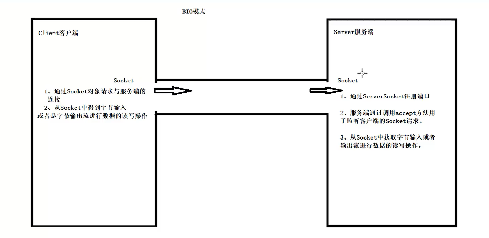
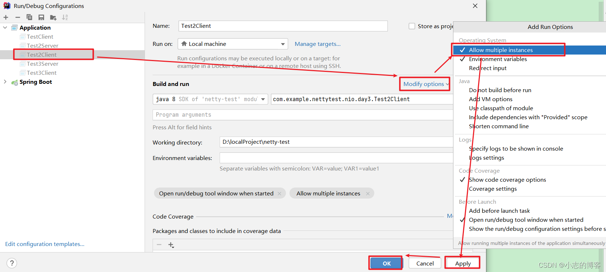
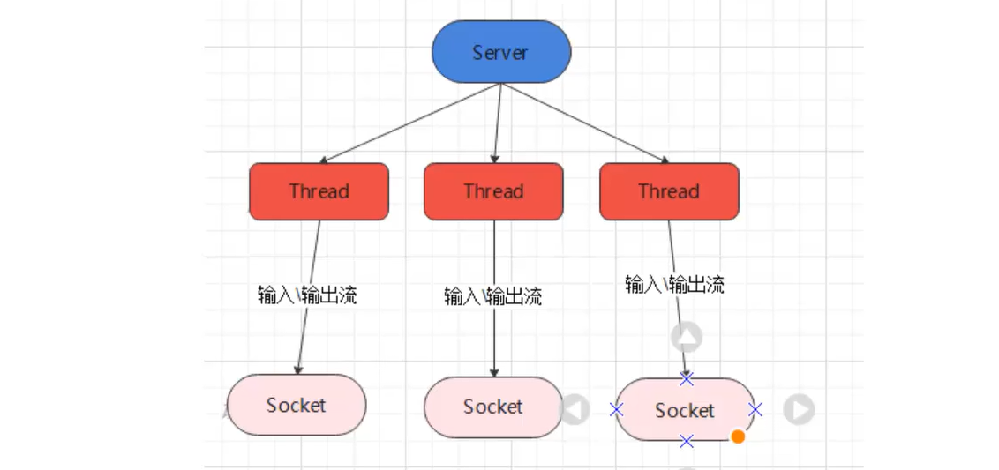

# BIO 工作机制
> [!important]
> **同步阻塞:** 服务器实现模式为一个连接一个线程，即客户端有连接请求时就需要启动一个线程进行处理。但是如果这个连接请求内部做的事很少，或者什么都不做，那么就会导致不必要的线程开销。可以使用线程池机制进行优化。


# 传统BIO网络编程
## 同步阻塞
> [!def] 同步阻塞
> 
> 阻塞体现在服务端要从客户端中接收字节流，但是客户端迟迟没有发送的情况，此时服务端会阻塞住知道客户端发送字节之后才继续执行。


## BIO模式下接收多个客户端
> [!important] Configuration
> Java中模拟多个客户端, (allow multiple instances of the same class).
> - 先运行起来一个客户端
> - 在某一个客户端运行的同时，点击`Edit Configuration`, 配置`Allow Multiple Instances`
> 

> [!important]
> 
```java
package cn.itcast.BIO;

import java.io.*;
import java.net.ServerSocket;
import java.net.Socket;

public class Server {

    public static void main(String[] args) throws IOException {
        try {

            ServerSocket ss = new ServerSocket(8081);
            Thread.sleep(5000);
            while (true) {
                Socket connfd = ss.accept();
                new Thread(new ThreadTask(connfd)).start();
            }

        } catch(Exception e) {
            e.printStackTrace();
        }
    }
}

class ThreadTask implements Runnable {


    private Socket connfd;

    public ThreadTask(Socket connfd) {
        this.connfd = connfd;
    }

    @Override
    public void run() {
        InputStream is = null;
        try {
            is = connfd.getInputStream();
            int port = connfd.getPort();
            System.out.println("Accept connection from client with port: " + port);
        } catch (IOException e) {
            throw new RuntimeException(e);
        }
        BufferedReader br = new BufferedReader(new InputStreamReader(is));

        String msg;
        while (true) {
            try {
                if ((msg = br.readLine()) == null) break;
            } catch (IOException e) {
                throw new RuntimeException(e);
            }
            System.out.println("服务端接收到" + msg);
        }
    }
}
```


# 伪异步I/O编程
## Pre-Threading
> [!important]
> See [Proxy_Lab](../../../Computer_Systems/Operating_Systems_Programming/HWs_Projects/CSAPP_CS61C_Projects/4_Architecture_Programming/Proxy_Lab.md)
> 
> In java, we could use similary ideas with a blocking queue(key data structure underlying the producer-consumer synchronization model).
```java
public class ConcurrentServer {

    public final static int MAXIMUM_THREAD = 32;

    public static void main(String[] args) throws IOException {
        ServerSocket ss = new ServerSocket(8081);

        BlockingQueue<Socket> bq = new ArrayBlockingQueue<>(MAXIMUM_THREAD);

        // Prethreading
        Thread[] threads = new Thread[MAXIMUM_THREAD];
        for (int i = 0; i < MAXIMUM_THREAD; i++) {
            threads[i] = new ServerThread(bq);
            threads[i].start();
        }

        while (true) {
            try {
                Socket connfd = ss.accept();
                System.out.println("Incoming");
                bq.offer(connfd, 5, TimeUnit.SECONDS);
            } catch(Exception e) {
                e.printStackTrace();
            }
        }
    }
}

 class ServerThread extends Thread{

    private BlockingQueue<Socket> bq;

    public ServerThread(BlockingQueue<Socket> bq) {
        this.bq = bq;
    }

    @Override
    public void run() {
        while (true) {
            Socket connfd = null;
            try {
                // Want to wait if the blocking queue is empty
                connfd = bq.take();
                System.out.println("gaga");
            } catch (InterruptedException e) {
                throw new RuntimeException(e);
            }
            System.out.println("Thread "+ Thread.currentThread().getName()+" is handling client connection from port " + connfd.getPort());
            InputStream is = null;
            try {
                is = connfd.getInputStream();
                BufferedReader bir = new BufferedReader(new InputStreamReader(is));
                String msg;
                while ((msg = bir.readLine()) != null) {
                    System.out.println("Printing Out Message: "+ msg);
                }
            } catch (IOException e) {
                throw new RuntimeException(e);
            }

        }
    }
}
```


## ThreadPool
> [!important]
> 我们也可以对上述`Pre-threading`流程进行一个封装，直接使用线程池实现并发。
```java
public class ConcurrentServer2 {

    public static void main(String[] args) {

        try {
            ServerSocket ss = new ServerSocket(8081);
            HandlerSocketServerPool pool = new HandlerSocketServerPool(16, 32);
            while (true) {
                Socket connfd = ss.accept();
                pool.execute(new ServerRunnable(connfd));
            }
        } catch (Exception e) {
            e.printStackTrace();
        }
    }
}


class ServerRunnable implements Runnable {

    private Socket connfd;

    public ServerRunnable(Socket connfd) {
        this.connfd = connfd;
    }

    @Override
    public void run() {
        BufferedReader bir = null;
        try {
            bir = new BufferedReader(new InputStreamReader(connfd.getInputStream()));
        } catch (IOException e) {
            throw new RuntimeException(e);
        }
        String msg;
        while (true) {
            try {
                if ((msg = bir.readLine()) == null) break;
            } catch (IOException e) {
                throw new RuntimeException(e);
            }
            System.out.println("Receving Line: "+ msg);
        }
    }
}


class HandlerSocketServerPool {
    private ExecutorService executorService;


    // 定义线程池
    public HandlerSocketServerPool(int maxThreadNum, int queueSize) {
        executorService = new ThreadPoolExecutor(3, maxThreadNum, 120, TimeUnit.SECONDS, new ArrayBlockingQueue<Runnable>(queueSize));
    }


    // 提交任务
    public void execute(Runnable target) {
        executorService.execute(target);
    }
}
```


# BIO任意文件上传


# BIO 即使通讯


