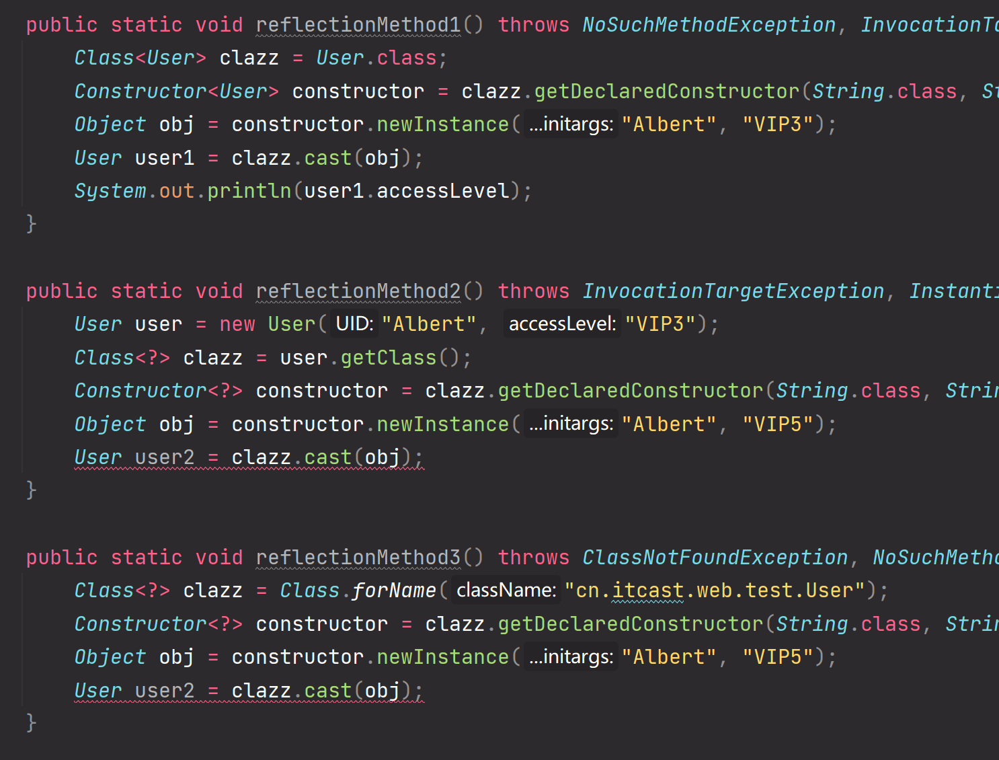

# Java类的生命周期


# 获取类的字节码文件的三种方式
> [!important]
> `User user = new User(...)`
> - **方式1:** `Class clazz = User.class`, 这种方式不会触发类内部的静态代码块。
> - **方式2:** `Class<?> clazz = user.getClass()`, 这种方式不会触发类内部的静态代码块。使用泛形通配符的原因是: 在编译阶段，Compiler还不能确定`user`在`RUNTIME`阶段的类型(Java的多态机制)，所以用通配符。
> - **方式3:** `Class<?> clazz = Class.forName(全类名)`, 这种方式会触发类内部的静态代码块。


# 字节码对象的常用方法
> [!important]
> 1. 通过`clazz.getDeclaredFields()`获取类中所有的成员变量(所有权限修饰符)。
> 2. 通过`clazz.getFields()`获取本类及其继承链上的所有类中的`public`成员变量。


# 利用反射创建对象的方法
> [!important]
> 1. 获取类的字节码文件: `Class<?> clazz = Class.forName(全类名)`
> 2. 获取类的带参构造器: `Constructor<?> constructor = clazz.getDeclaredConstructor(String.class, int.class, ...)`
> 3. 创建类的对象: `Object obj = constructor.newInstance("Albert", 30)`
> 4. 转型: `User user = (User) obj`(如果我们确定obj属于`User`类的话)
> 	1. 为了转型安全，我们需要先进行类型判断: `obj instanceof User`
> 	2. 或者使用`User user = clazz.cast(obj)`, 注意，这个方法仅对使用`User.class`获取的字节码对象有效, 对动态生成的字节码对象无效，会在编译阶段报错，因为在编译阶段由于多态的存在而无法确定类的类型。
> 
> 


# 利用反射调用类的方法
> [!important]
> 通过`method.invoke(obj, parameterType.class, ...)`即可。


# 利用反射进行框架设计 - IOC
> [!algo] Idea
> 对象的实例化和方法的调用不再依赖于硬编码的类名和方法名，而是基于字符串和注解所提供的配置信息进行，使得代码非常灵活和通用，特别适用于需要编写高度解耦的代码的应用程序。
> 
> 在Spring框架中，内部会有一个`Container`，用于管理创建的对象。
> 
> 用户需要通过定义一个配置类`Config`, 其中写上创建对象的逻辑。
> 

## Container
> [!code]
```java
package cn.itcast.web.IOC;

import java.lang.reflect.Constructor;
import java.lang.reflect.InvocationTargetException;
import java.lang.reflect.Method;
import java.util.HashMap;
import java.util.Map;

public class Container {

    private Map<Class<?>, Method> mapping;
    private Object config;

    private Map<Class<?>, Object> services;

    public Container() {
        this.mapping = new HashMap<>();
        this.services = new HashMap<>();
    }

    // Init 的时候不会创建对象, 而是将对象的Class对象和Method服务作为键值对传入HashMap中
    public void init() throws ClassNotFoundException, NoSuchMethodException, InvocationTargetException, InstantiationException, IllegalAccessException {

        Class<?> clazz = Class.forName("cn.itcast.web.IOC.Config");
        Constructor<?> constructor = clazz.getDeclaredConstructor();
        this.config = constructor.newInstance();

        Method[] declaredMethods = clazz.getDeclaredMethods();
        for (Method method: declaredMethods) {
            if (method.isAnnotationPresent(AlexBean.class)) {
                this.mapping.put(method.getReturnType(), method);
            }
        }
    }


    // 根据Class<?>获取对象，比如User->new User(), 同时将创建的对象放入哈希表中。
    // 如果哈希表中已经有该类的对象，则不会创建新的该类的对象。
    public Object getServiceInstanceByName(Class<?> clazz) throws InvocationTargetException, IllegalAccessException {
        if (this.mapping.containsKey(clazz)) {
            // If the object of class clazz, has been created, then just return that object
            // instead of instantiating a new one.
            if (this.services.containsKey(clazz)) {
                return this.services.get(clazz);
            }
            Method method = this.mapping.get(clazz);
            Object obj = method.invoke(this.config);
            this.services.put(clazz, obj);
            return obj;
        }
        return null;
    }


    // IOC: 依赖注入, 假设有一个类Box, 其构造方法依赖于Customer和Order对象
    // 则如果我们要创建Box对象，会先创建Box构造方法所依赖的对象，放入容器，然后
    // 实例化Box对象，并放入容器。
    public Object createInstance(Class<?> clazz) throws InvocationTargetException, InstantiationException, IllegalAccessException, NoSuchMethodException {
        Constructor<?>[] declaredConstructors = clazz.getDeclaredConstructors();
        for (Constructor<?> constructor: declaredConstructors) {
            if (constructor.isAnnotationPresent(AlexWired.class)) {
                Class<?>[] parameterTypes = constructor.getParameterTypes();
                Object[] arguments = new Object[parameterTypes.length];
                for (int i = 0; i < parameterTypes.length; i++) {
                    Object o = getServiceInstanceByName(parameterTypes[i]);
                    arguments[i] = o;
                }
                Object o = constructor.newInstance(arguments);
                this.services.put(clazz, o);
                return o;
            }
        }
        // If there is no autowired constructor, then choose the default
        // no-param constructor, clazz.getConstructor() will get that.
        return clazz.getConstructor().newInstance();
    }
}
```


## Config配置类
> [!code]
```java

package cn.itcast.web.IOC;

import java.time.Instant;

/**
 * Provide service, creating objects
 */
public class Config {

    @AlexBean
    public Customer customer() { return new Customer("22309123","Albert", 35, "70 Christopher");
    }

    @AlexBean
    public Transaction address(){
        return new Transaction("31321393", "Successful",231233L, "Amazon");
    }


    @AlexBean
    public Order order() {
        return new Order("31321393", Instant.now() , "22309123");
    }

}
```


## AlexBean
> [!code]
> `AlexBean`注解相当于`Bean`注解，表示框架需要**对某个类的创建提供服务**方法。
```java
package cn.itcast.web.IOC;


import java.lang.annotation.*;

@Target(ElementType.METHOD)
@Retention(RetentionPolicy.RUNTIME)
@Documented
public @interface AlexBean {
}

```


## AlexWired
> [!code]
> `AlexWired`相当于`AutoWired`, 表示当前类的创建依赖于其他类的实例化对象，用于提示框架。
```java
package cn.itcast.web.IOC;

import java.lang.annotation.*;

@Target(ElementType.CONSTRUCTOR)
@Retention(RetentionPolicy.RUNTIME)
@Documented
public @interface AlexWired {
}
```


## 其他类
> [!code]
```java
public class Customer {

    private String UID;
    private String name;

    private int age;

    private String addr;


    public Customer(String UID, String name, int age, String addr) {
        this.UID = UID;
        this.name = name;
        this.age = age;
        this.addr = addr;
    }

    public String getName() {
        return name;
    }

    @Printable
    public void printCustomerName() {
        System.out.println("Customer Name: " + getName());
    }
}


public class Order {

    private String OID;
    private Instant timestamp;
    private String UID;

    public Order() {
        this.OID = "222222222";
        this.timestamp = Instant.now();
        this.UID = "2323232323";
    }

    public Order(String OID, Instant timestamp, String UID) {
        this.OID = OID;
        this.timestamp = timestamp;
        this.UID = UID;
    }

    @Printable
    public void printOrderUID() {
        System.out.println("Order UID" + UID);
    }
}

public class Transaction {
    private String OID;
    private String status;  /* Successful/Failed */

    private long amount; /* Order Checkout Details */

    private String company;

    public Transaction(String OID, String status, long amount, String company) {
        this.OID = OID;
        this.status = status;
        this.amount = amount;
        this.company = company;
    }
}


public class Main {
    public static void main(String[] args) throws ClassNotFoundException, InvocationTargetException, NoSuchMethodException, InstantiationException, IllegalAccessException, NoSuchFieldException {
        Container container = new Container();
        container.init();

        String serviceName = "cn.itcast.web.IOC.Box";
        String fieldName = "customer";

        Class<?> clazz = Class.forName(serviceName);
        Object instance = container.createInstance(clazz);
        Field customerField = clazz.getDeclaredField(fieldName);
        customerField.setAccessible(true);
        Object o = customerField.get(instance);
        Method[] declaredMethods = o.getClass().getDeclaredMethods();
        for (Method method: declaredMethods) {
            if (method.isAnnotationPresent(Printable.class)) {
                method.invoke(o);
            }
        }
    }
}

@Target(ElementType.METHOD)  
@Retention(RetentionPolicy.RUNTIME)  
@Documented  
public @interface Printable {  
}
```

