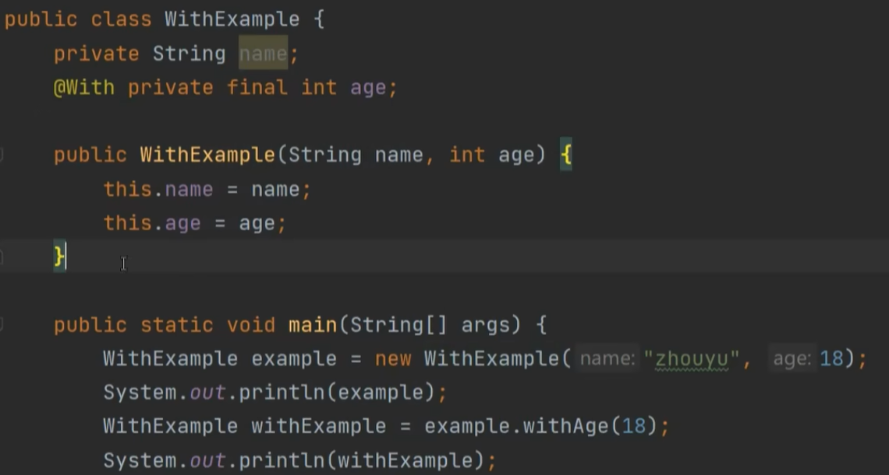

# SpringBoot Initializer
> [!important]
> https://start.spring.io/
> 
> Click `GENERATE` and download the generated project.
> 


# Create a MySQL Database
> [!important]
> - Open MySQL Workbench 8.0 CE, make sure MySQL service is installed locally.
> - Create a new schema first.
> 
> - Create new tables and insert records.


# Configure Server and MySQL Connection
> [!important]
```properties
spring.application.name=ems-backend  
  
server.port=8083  
  
  
spring.datasource.url=jdbc:mysql://localhost:3306/etmsentity  
spring.datasource.username=root  
spring.datasource.password=123456  
  
  
spring.jpa.properties.hibernate.dialect=org.hibernate.dialect.MySQLDialect  
# If there are any changes in the JPA entity, also reflect that change in the database  
spring.jpa.hibernate.ddl-auto=update
```


# Project Directory


# Lombok
> [!important]
> 一个代码简化神器, 常用注解如下:
> - `@Getter`注解可以为一个类内的所有字段添加`getter()`方法。
> - `@Setter`注解可以为一个类内的所有字段添加`setter()`方法。
> - `@NonNull`注解可以规定一个方法的入参不能为空，否则无法通过编译阶段。
> - `@Cleanup`注解可以对一个实现了`AutoClosable`接口的对象使用，使得目标对象资源自动释放，比如`InputStream`。

## @NonNull
> [!code]
> 本质上, `@NonNull`就是在方法体执行前加了一行判空语句。限制了我们在调用方法时必须要传入非`null`的参数。
```java
public class TestLombok1 {
    public static void main(String[] args) throws InterruptedException {
        Thread thread0 = new Thread(() -> {
            autoDetectNull(null);
        },"t1");
        thread0.start();

        Thread thread1 = new Thread(() -> {
            manualDetectNull(null);
        },"t2");
        thread1.start();
        thread0.join();
        thread1.join();
    }

	// 注解
    public static void autoDetectNull(@NonNull String input) {
        System.out.println(input);
    }

	// 手写
    public static void manualDetectNull(String input) {
        if (input == null) {
            throw new NullPointerException("Input param is null");
        }
        System.out.println(input);
    }
    
}

```


## @Cleanup
> [!code]
> 本质上是在开辟的`AutoClosable`对象之后加上了一个`try-finally`块用于资源释放, 并调用`close()`方法（可以设置注解中的`value()`值设置资源释放时调用的方法）。
```java

public class TestLombokCleanup {
    public static void main(String[] args) throws IOException {
        autoCleanUp(args);
        manualCleanup(args);
    }

    public static void autoCleanUp(String[] args) throws IOException {
        @Cleanup InputStream fis = new FileInputStream("F:\\Study_Notes_Backup\\Full_Stack_Projects\\SpringBoot3_JPA_React\\ems-backend\\ems-backend\\src\\main\\java\\com\\example\\emsbackend\\tests\\lombokTest\\test.c");
        int nread;
        byte[] buffer = new byte[1024];
        while ((nread = fis.read(buffer)) >= 0) {
            System.out.println(nread);
        }
    }

    public static void manualCleanup(String[] args) throws IOException {
        @Cleanup InputStream fis = new FileInputStream("F:\\Study_Notes_Backup\\Full_Stack_Projects\\SpringBoot3_JPA_React\\ems-backend\\ems-backend\\src\\main\\java\\com\\example\\emsbackend\\tests\\lombokTest\\test.c");

		// 框架会自行添加如下try-finally block
        try{
            int nread;
            byte[] buffer = new byte[1024];
            while ((nread = fis.read(buffer)) >= 0) {
                System.out.println(nread);
            }
        } catch (IOException e) {
            throw new RuntimeException(e);
        } finally {
            if (Collections.singletonList(fis).get(0) != null) {
                fis.close();
            }
        }
    }
}
```


## @EqualsAndHashCode
> [!code]
> 生成所有`Fields`的`hashCode()`计算方法。
> - `@EqualsAndHashCode.Exclude`表示在计算`hashCode()`时候不考虑这个字段的`hashCode`。


## @ToString
> [!code]
> 生成所有`Fields`拼接而成的字符串(`ClassName(field1name=field1value...)`的形式)。
> - 在`Field`前使用`@ToString.Exclude`使其不出现在最终的`String`中。


## @NoArgsConstructor
> [!code]
> 生成一个无参构造方法。


## @AllArgsConstructor
> [!code]
> 生成所有`Fields`的有参构造方法。


## @RequiredArgsConstructor
> [!code]
> 对于那些被声明为`@NonNull`的`Fields`生成有参构造方法。


## @Data
> [!important]
> 


## @Value
> [!important]
> 


## @Builder
> [!important]
> 使得一个类可以通过工厂模式创建对象。
> 
> - `@Singular`对象用于往集合中逐个添加元素。
> - `@Builder.Default`用于使得默认值生效(id = 3 而不是 id = 0)。


## @With
> [!code]
> 本质是实现一个`Defensive Copying`的机制:
> - 一旦修改加上了`@With`注解的属性，就会创建一个新的对象
> 
> 


