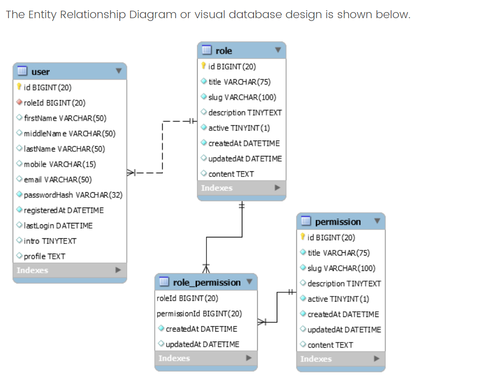
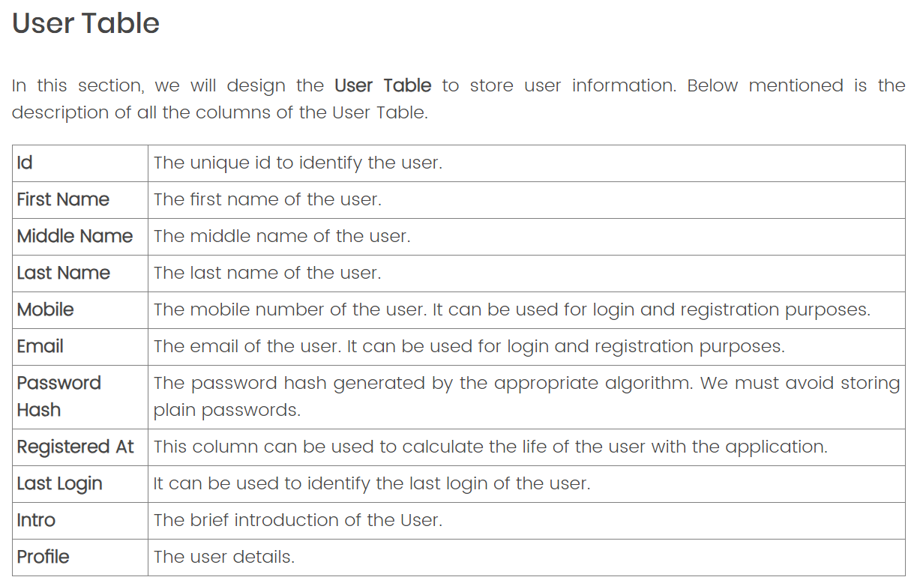
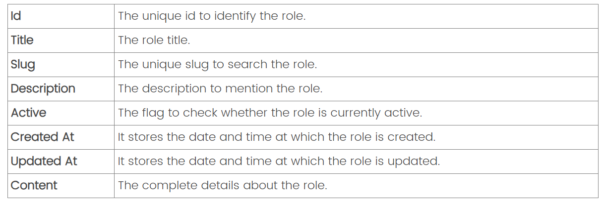
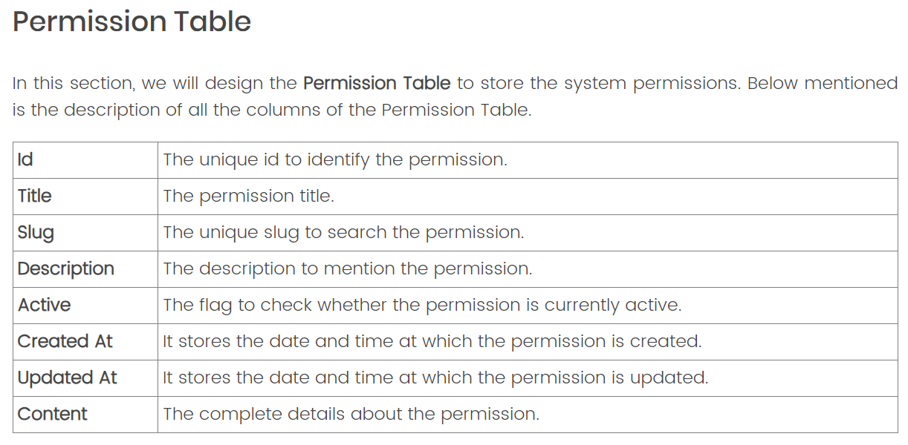
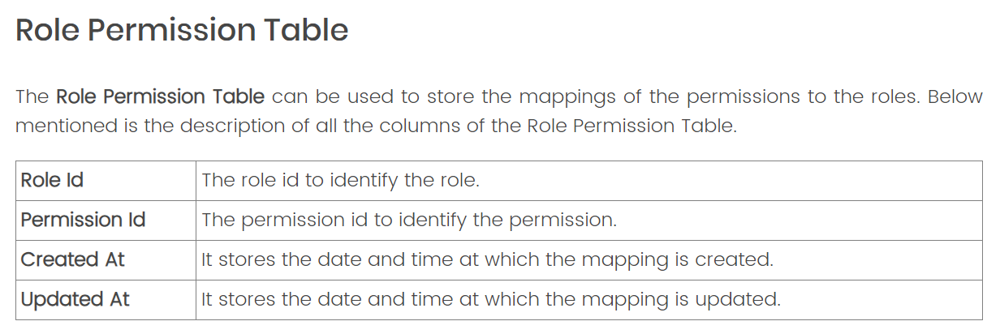

# RBAC Design
> [!important]
> https://mysql.tutorials24x7.com/blog/guide-to-design-database-for-rbac-in-mysql
> 

## User Table
> [!def]
> 


```sql
CREATE TABLE `user` (  
  `id` BIGINT NOT NULL AUTO_INCREMENT,  
  `firstName` VARCHAR(50) NULL DEFAULT NULL,  
  `middleName` VARCHAR(50) NULL DEFAULT NULL,  
  `lastName` VARCHAR(50) NULL DEFAULT NULL,  
  `mobile` VARCHAR(15) NULL,  
  `email` VARCHAR(50) NULL,  
  `passwordHash` VARCHAR(32) NOT NULL,  
  `registeredAt` DATETIME NOT NULL,  
  `lastLogin` DATETIME NULL DEFAULT NULL,  
  `intro` TINYTEXT NULL DEFAULT NULL,  
  `profile` TEXT NULL DEFAULT NULL,  
  PRIMARY KEY (`id`),  
  UNIQUE INDEX `uq_mobile` (`mobile` ASC),  
  UNIQUE INDEX `uq_email` (`email` ASC) );
```


## Role Table
> [!def]
> 
```sql
CREATE TABLE `role` (  
  `id` BIGINT NOT NULL AUTO_INCREMENT,  
  `title` VARCHAR(75) NOT NULL,  
  `slug` VARCHAR(100) NOT NULL,  
  `description` TINYTEXT NULL,  
  `active` TINYINT(1) NOT NULL DEFAULT 0,  
  `createdAt` DATETIME NOT NULL,  
  `updatedAt` DATETIME NULL DEFAULT NULL,  
  `content` TEXT NULL DEFAULT NULL,  
  PRIMARY KEY (`id`),  
  UNIQUE INDEX `uq_slug` (`slug` ASC) );
```


## Permission Table
> [!def]
> 
```sql
CREATE TABLE `rbac`.`permission` (  
  `id` BIGINT NOT NULL AUTO_INCREMENT,  
  `title` VARCHAR(75) NOT NULL,  
  `slug` VARCHAR(100) NOT NULL,  
  `description` TINYTEXT NULL,  
  `active` TINYINT(1) NOT NULL DEFAULT 0,  
  `createdAt` DATETIME NOT NULL,  
  `updatedAt` DATETIME NULL DEFAULT NULL,  
  `content` TEXT NULL DEFAULT NULL,  
  PRIMARY KEY (`id`),  
  UNIQUE INDEX `uq_slug` (`slug` ASC) );

```


## Role Permission Table
> [!def]
> 
```sql
CREATE TABLE `role_permission` (
  `roleId` BIGINT NOT NULL,
  `permissionId` BIGINT NOT NULL,
  `createdAt` DATETIME NOT NULL,
  `updatedAt` DATETIME NULL,
  PRIMARY KEY (`roleId`, `permissionId`),
  INDEX `idx_rp_role` (`roleId` ASC),
  INDEX `idx_rp_permission` (`permissionId` ASC),
  CONSTRAINT `fk_rp_role`
    FOREIGN KEY (`roleId`)
    REFERENCES `role` (`id`)
    ON DELETE NO ACTION
    ON UPDATE NO ACTION,
  CONSTRAINT `fk_rp_permission`
    FOREIGN KEY (`permissionId`)
    REFERENCES `permission` (`id`)
    ON DELETE NO ACTION
    ON UPDATE NO ACTION);

```


## User Role Table
> [!def]
> We can keep the system simple by assigning a single role to the user. The assigned role can be used to pull the permissions mapped to the role. The access to the specific resource or permission can be checked by comparing the hard-coded permission the list of permissions mapped to the role assigned to the user.
> 
> It can be done using the query as shown below.
```sql
ALTER TABLE `user` 
ADD COLUMN `roleId` BIGINT NOT NULL AFTER `id`,
ADD INDEX `idx_user_role` (`roleId` ASC);

ALTER TABLE `user` 
ADD CONSTRAINT `fk_user_role`
  FOREIGN KEY (`roleId`)
  REFERENCES `role` (`id`)
  ON DELETE NO ACTION
  ON UPDATE NO ACTION;

```


