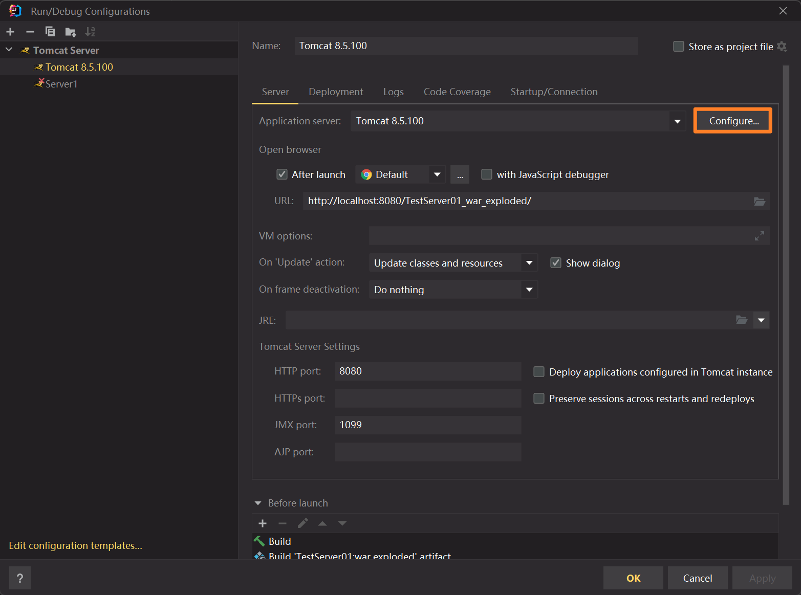
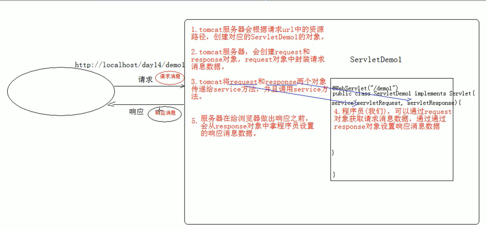

# Tomcat服务部署快速入门
## 创建项目
> [!important]
> 1. 创建一个Java的空项目
> 2. 添加Tomcat: Run -> Edit Configuration -> + -> Add Tomcat Server -> Configure -> 选择本地的Tomcat文件夹。
> 
> 3. 创建Tomcat JavaEE项目: `ALT + CTRL + SHIFT + /` 启动IDEA注册表文件，点击:
> 
> 4. File -> New -> New Module -> 选择Java EE项目。选择Java EE 7 并勾选 Web Application, 默认Servlet 3.1。Java EE 8 默认Servlet 4.0 。
> 
> 5. 得到一个项目文件夹:
> 


## 服务器热部署
> [!important]
> 服务器热部署: 
> - Update resources 表示更改静态资源的时候自动重启服务器
> - Update classes and resources 表示更改静态资源或者Java代码的时候自动重启服务器
> 
> 


# Servlet-XML配置
## 创建Servlet程序
> [!important]
> Servlet是运行在Tomcat服务端的一个小程序，用于处理用户的请求和响应。
> 
> 从设计模式上说，Servlet是一个Java的接口，我们需要实现这个接口来使用小程序的功能。
> 
> **创建步骤为:**
> 1. 创建一个JavaEE程序
> 2. 定义一个类，实现Servlet接口
> 3. 实现接口中的抽象方法
> 4. 配置Servlet。用户访问`https://www.web.com/res/index.html`网址的时候，tomcat内部会将这个url映射到一个`Servlet`对象上，所以为了让映射关系成立，我们需要配置Servlet。
>
> 


## 配置Servlet映射
> [!important]
```xml
<?xml version="1.0" encoding="UTF-8"?>  
<web-app xmlns="http://xmlns.jcp.org/xml/ns/javaee"  
         xmlns:xsi="http://www.w3.org/2001/XMLSchema-instance"  
         xsi:schemaLocation="http://xmlns.jcp.org/xml/ns/javaee http://xmlns.jcp.org/xml/ns/javaee/web-app_3_1.xsd"  
         version="3.1">  
  
    <!-- 创建新的映射 -->  
    <servlet>  
        <!-- 给这个小程序起名，可为任意名称, 相当于unique id -->  
        <servlet-name>demo1</servlet-name>  
        <!-- 全类名 -->  
        <servlet-class>cn.itcast.web.servlet.ServletDemo1</servlet-class>  
    </servlet>  
    <!-- 设置映射规则 url -> servlet -->    <servlet-mapping>  
        <!-- 设置名为demo1的Servlet的url映射 -->  
        <servlet-name>demo1</servlet-name>  
        <!-- https://localhost:8081/demo1 -->  
        <url-pattern>/demo1</url-pattern>  
    </servlet-mapping>  
  
</web-app>
```


## 本地配置文件
> [!important]
> 运行服务器时，控制台会输出包含`CATALINA_BASE`的键值对:
> Using CATALINA_BASE:   `"C:\Users\alexm\AppData\Local\JetBrains\IntelliJIdea2022.2\tomcat\4dff9ba8-f417-40f8-aa85-cd7055ae5c18"`
> 这个目录下存放的就是我们对当前tomcat服务器的配置文件。
> 
> 我们在`Run -> Edit Configuration`中做的任何修改都会更新到`conf`目录下的`server.xml`中:
> 


## 工作空间项目目录和tomcat项目部署目录
### tomcat部署目录
> [!important]
> tomcat真正访问的是`tomcat`部署的web项目, 就是`out`中的文件，这些文件对应着工作空间目录的`WEB-INF`目录下的所有资源：classes中存放着所有服务器启动后Java编译器编译的所有类文件:
> 


# Servlet生命周期
> [!important]
> 假设我们有如下Servlet配置项:
> 
```xml
<?xml version="1.0" encoding="UTF-8"?>  
<web-app xmlns="http://xmlns.jcp.org/xml/ns/javaee"  
         xmlns:xsi="http://www.w3.org/2001/XMLSchema-instance"  
         xsi:schemaLocation="http://xmlns.jcp.org/xml/ns/javaee http://xmlns.jcp.org/xml/ns/javaee/web-app_3_1.xsd"  
         version="3.1">  
  
    <!-- 创建新的映射 -->  
    <servlet>  
        <!-- 给这个小程序起名，可为任意名称, 相当于unique id -->  
        <servlet-name>demo1</servlet-name>  
        <!-- 全类名 -->  
        <servlet-class>cn.itcast.web.servlet.ServletDemo1</servlet-class>  
    </servlet>  
  
    <!-- 设置映射规则 url -> servlet -->    <servlet-mapping>  
        <!-- 设置名为demo1的Servlet的url映射 -->  
        <servlet-name>demo1</servlet-name>  
        <!-- https://localhost:8081/demo1 -->  
        <url-pattern>/demo1</url-pattern>  
    </servlet-mapping>  
  
</web-app>
```
> [!important]
> 当用户访问`https://localhost:8081/demo1`时，`tomcat`会将`cn.itcast.web.servlet.ServletDemo1`这个类加载进内存并实例化一个对象，然后执行这个对象上的`service()`方法。
> 总的来说, 我们有如下执行原理：
> 1. 当**服务器接受到客户端浏览器的请求后**，会解析请求URL路径，获取访问的Servlet的资源路径
> 	1. 注意服务器启动的时候默认不会自动实例化`Servlet`对象，而是要在开始接收请求之后才会去实例化对象，且tomcat容器对每个`Servlet`类只会实例化一个对象。
> 	2. 什么时候实例化可以通过配置`load-on-start`属性
> 		1. `load-on-start`为负数，则在第一次请求接收时创建对象
> 		2. `load-on-start`为非负数，则在服务器启动时就创建对象
> 		3. 使用注解配置时，默认为`-1`。
> 2. 查找web.xml文件，是否有对应的\<url-pattern\>标签体内容
> 3. 如果有，则在找到对应的\<servlet-class\>全类名
> 4. tomcat会将字节码文件加载进内存, 并且创建其对象
> 5. 调用其方法


# Servlet接口方法
> [!important]
```java
public class ServletDemo2 implements Servlet {

    /**
     * 在Servlet被创建时执行一次且只会执行一次。
     * 一般用于加载资源
     * @param servletConfig
     * @throws ServletException
     */
    @Override
    public void init(ServletConfig servletConfig) throws ServletException {
        System.out.println("init...");
    }

    /**
     * 获取ServletConfig对象
     * @return ServletConfig: Servlet的配置对象
     */
    @Override
    public ServletConfig getServletConfig() {
        return null;
    }


    /**
     * 提供服务的方法
     * 每一次Servlet对应的URL被访问时，执行。执行多次
     * @param servletRequest
     * @param servletResponse
     * @throws ServletException
     * @throws IOException
     */
    @Override
    public void service(ServletRequest servletRequest, ServletResponse servletResponse) throws ServletException, IOException {
        System.out.println("service...");
    }


    /**
     * 获取Servlet的一些信息，版本，作者等
     * @return
     */
    @Override
    public String getServletInfo() {
        return null;
    }

    /**
     * 销毁方法
     * 在服务器正常关闭时, 在Servlet被回收/杀死之前。只执行一次。
     * 注意: 当服务器没有正常关闭时，不会执行destroy()方法。
	 * 一般用于释放资源。
     */
    @Override
    public void destroy() {
        System.out.println("destroy...");
    }
}
```


# Servlet单例模式
## Servlet 配置 - 指定对象创建时机
> [!important]
> 
```xml
<servlet>  
    <servlet-name>demo2</servlet-name>  
    <servlet-class>cn.itcast.web.servlet.ServletDemo2</servlet-class>  
    <!-- 指定Servlet的创建时机  
        1. 第一次被访问时，创建  
            * <load-on-startup>的值为负数  
        2. 在服务器启动时，创建  
            * <load-on-startup>的值为非负数  
    -->  
    <load-on-startup>2</load-on-startup>  
  
    <!-- -->  
</servlet>
```


## 单例模式
> [!important]
> * Servlet的init方法，只执行一次，说明一个Servlet在内存中只存在一个对象， Servlet是单例的。
> * 多个用户同时访问时，可能存在线程安全问题。
> * **解决:** 尽量不要在Servlet中定义成员变量。即使定义了成员变量, 也不要修改值。获取值是可以的。


# Servlet注解配置(Servlet 3.0)
> [!important]
> Servlet 3.0 之后可以使用注解配置Servlet及其映射。
> [Java Annotations](../Java_SE/Annotations.md)相关知识
> 
> **步骤:**
> 1. 创建JavaEE 7项目，选择Servlet版本3.0或以上，可以不创建web.xml
> 2. 定义一个类，实现Servlet接口
> 3. 实现方法。
> 4. 在类上使用`@WebServlet`注解配置。
```java
package javax.servlet.annotation;

import java.lang.annotation.Documented;
import java.lang.annotation.ElementType;
import java.lang.annotation.Retention;
import java.lang.annotation.RetentionPolicy;
import java.lang.annotation.Target;

@Target({ElementType.TYPE})
@Retention(RetentionPolicy.RUNTIME)
@Documented
public @interface WebServlet {
    String name() default "";

    String[] value() default {};

	/** 
	  可以使得多个url映射到一个Servlet对象上去
	*/
    String[] urlPatterns() default {};

    int loadOnStartup() default -1;

    WebInitParam[] initParams() default {};

    boolean asyncSupported() default false;

    String smallIcon() default "";

    String largeIcon() default "";

    String description() default "";

    String displayName() default "";
}
```


# Tomcat 断点调试
> [!important]
> 点击`Debug`即可:
> 


# Servlet的体系结构
## 继承链条
> [!important]
> HttpServlet -> GenericServlet -> Servlet
> 一般我们使用的时候都会继承`HttpServlet`, 然后覆写其`doGet`和`doPost`方法。


## HttpServlet使用
> [!important]
> `@WebServlet("/user/*")`是通配符匹配表示所有`/user/`后面跟什么都可以，都会触发当前`Servlet`的`service`方法。


## 路径匹配优先级
> [!important]
> 如果多个`Servlet`都可以匹配用户访问的`url`则`tomcat`会默认优先精确匹配。比如用户访问了`/user/demo5`这个路径，此时有两个`Servlet`都可以被触发:
> - `Servlet01`的路径是`/user/*`
> - `Servlet02`的路径是`/user/demo5`
> 
> 那么会优先选择下面的匹配。


# Request/Response对象
## 生命周期
> [!important]
> 
> **重点:**
> 1. request和response对象是由`tomcat`服务器内部创建的。
> 2. request对象是来获取请求消息，response对象来设置响应消息。


## Request对象的使用
### 获取请求行数据
> [!important]
> 
> 其中如果请求参数有多个，那么通过`getQueryString()`返回的字符串是由`&`拼接而成的键值对。


### 获取请求头数据
> [!important]
> 
```java
@Override  
protected void doGet(HttpServletRequest req, HttpServletResponse resp) throws ServletException, IOException {  
    // Get Request Line  
    System.out.println(req.getMethod());  
    System.out.println(req.getProtocol());  
    // Get Request Header  
    Enumeration<String> headerKeyIter = req.getHeaderNames();  
  
    while (headerKeyIter.hasMoreElements()) {  
        String headerKey = headerKeyIter.nextElement();  
        String value = req.getHeader(headerKey);  
        System.out.println(value);  
    }
}
```
> [!code] Output
> 


## Response对象的使用


