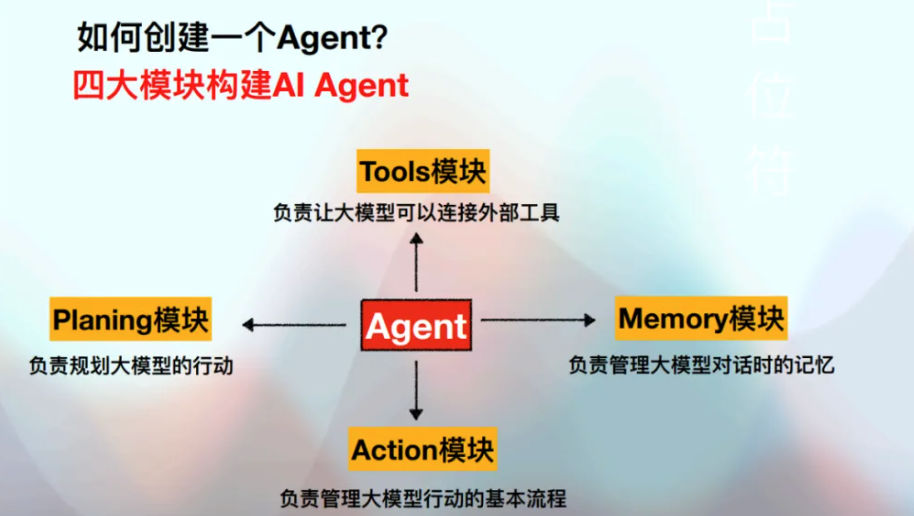
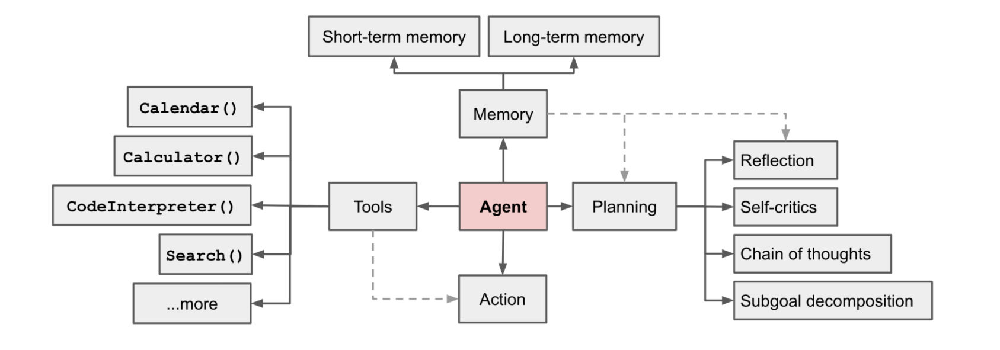
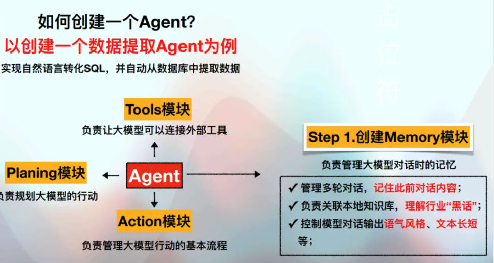
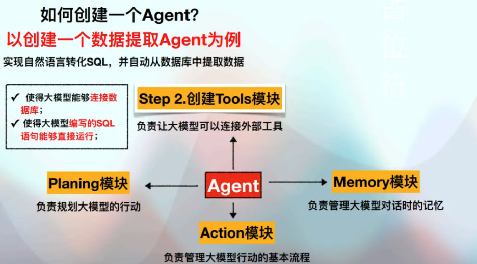
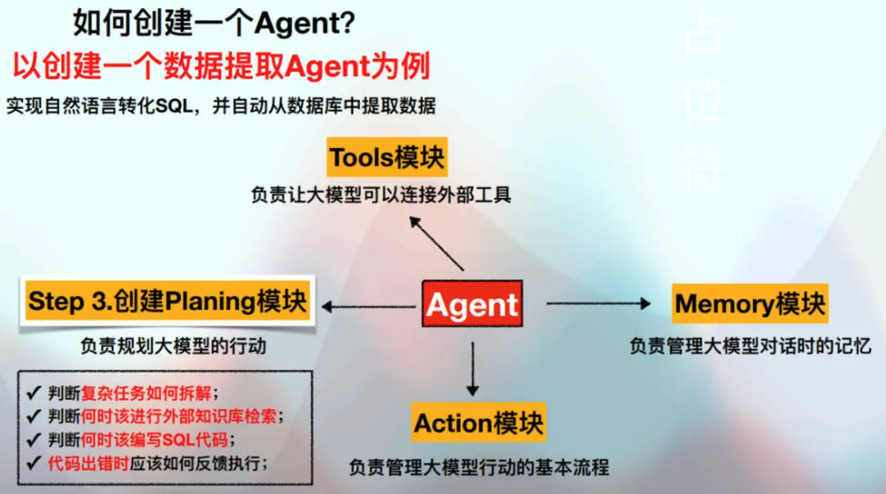
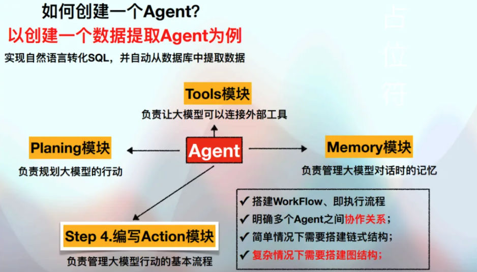

# 四大模块总括
https://lilianweng.github.io/posts/2023-06-23-agent/

> [!def]
> 

## Memory 模块
> [!def]
> 
> - **Short-term memory:** I would consider all the in-context learning as utilizing short-term memory of the model to learn.
> - **Long-term memory:** This provides the agent with the capability to retain and recall (infinite) information over extended periods, often by leveraging an external vector store and fast retrieval.

## Tools 模块
> [!def]
> 
> - The agent learns to call external APIs for extra information that is missing from the model weights (often hard to change after pre-training), including current information, code execution capability, access to proprietary information sources and more.

## Planning 模块
> [!def]
> 
> - **Subgoal and decomposition:** The agent breaks down large tasks into smaller, manageable subgoals, enabling efficient handling of complex tasks.
> - **Reflection and refinement:** The agent can do self-criticism and self-reflection over past actions, learn from mistakes and refine them for future steps, thereby improving the quality of final results.

## Action 模块
> [!def]
> 

# Planning

