# 技术介绍
> [!important]
> MCP，全称是Model Context Protocol，模型上下文协议，由Claude母公司Anthropic于去年11月正式提出。
> 
> 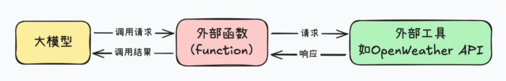
> 
> 总的来说，MCP解决的最大痛点，就是Agent开发中调用外部工具的技术门槛过高的问题。
> 
> 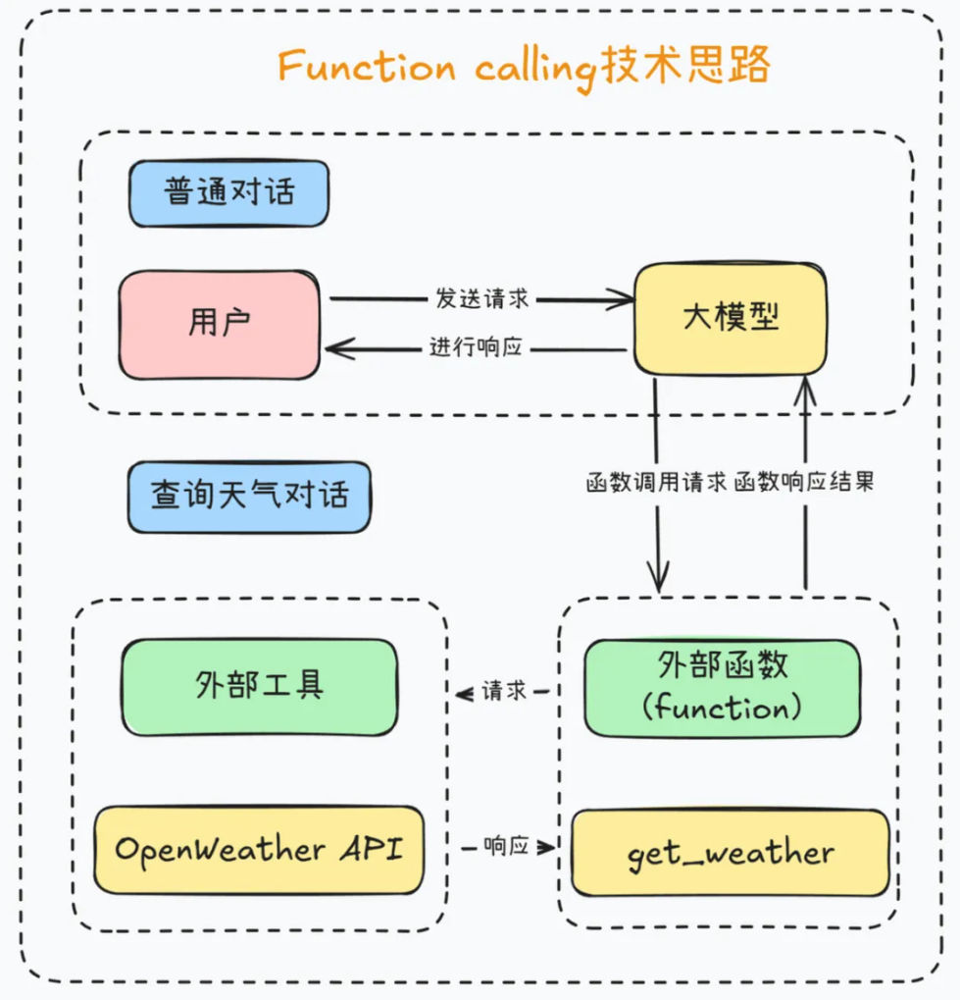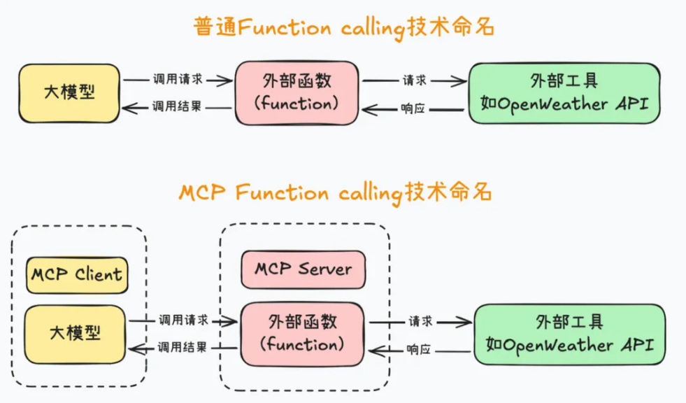

> [!example]
> 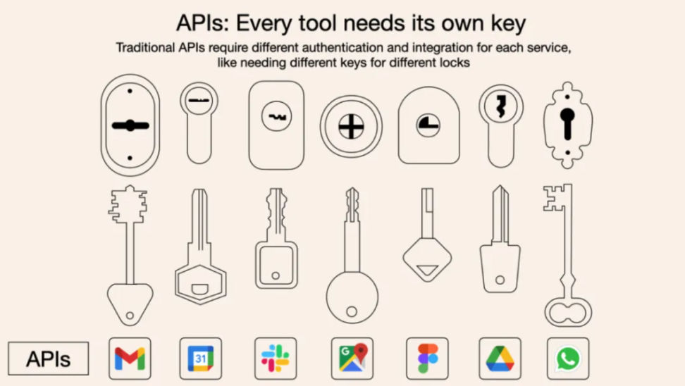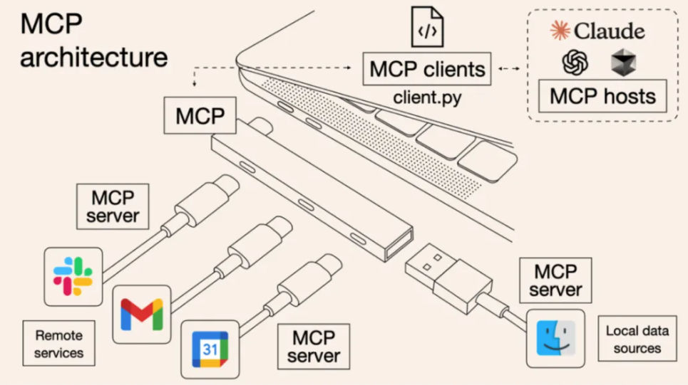


# MCP客户端Client开发流程
## uv 工具介绍与使用
> [!info]
> `MCP`开发要求借助uv进行虚拟环境创建和依赖管理。`uv` 是一个`Python` 依赖管理工具，类似于 `pip` 和 `conda`，但它更快、更高效，并且可以更好地管理 `Python` 虚拟环境和依赖项。它的核心目标是替代 `pip`、`venv` 和 `pip-tools`，提供更好的性能和更低的管理开销。

> [!important]
> uv 的特点：
> 1. 速度更快：相比 `pip`，`uv` 采用 Rust 编写，性能更优。
> 2. 支持 PEP 582：无需 virtualenv，可以直接使用 __pypackages__ 进行管理。
> 3. 兼容`pip`：支持 requirements.txt 和 pyproject.toml 依赖管理。
> 4. 替代`venv`：提供 uv venv 进行虚拟环境管理，比 venv 更轻量。
> 5. 跨平台：支持 Windows、macOS 和 Linux。


## uv安装流程
> [!def]
> 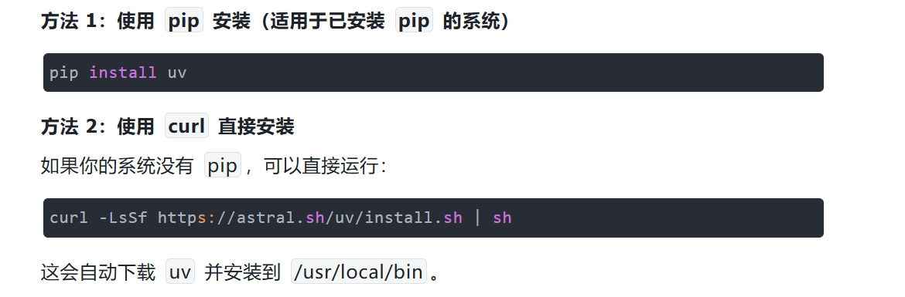
```
pip install uv    # 方法一
curl -LsSf https://astral.sh/uv/install.sh | sh   # 方法二
```


## uv的基本用法介绍
> [!def]
> 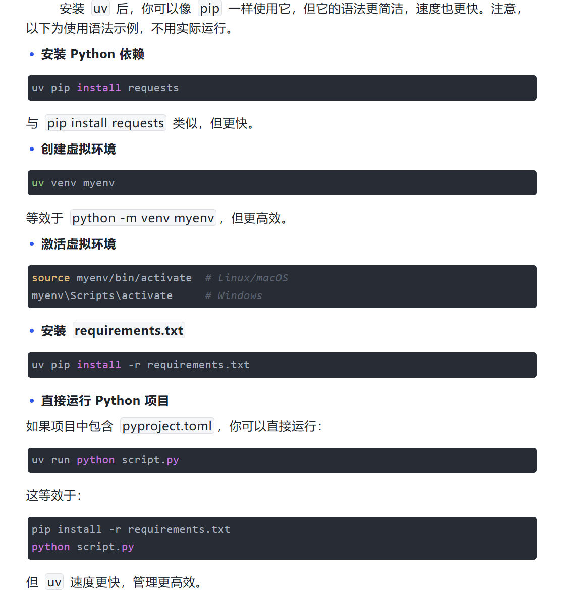


# MCP极简客户端搭建流程
## 创建MCP客户端项目
> [!code]
> 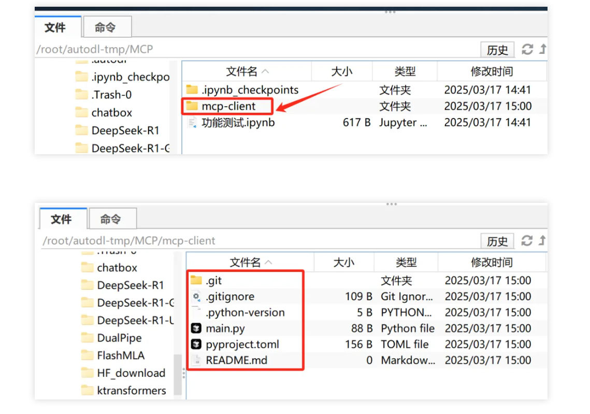
```bash
# 创建项目目录
uv init mcp-client
cd mcp-client
```


## 创建MCP客户端虚拟环境
> [!code] 创建虚拟环境
> 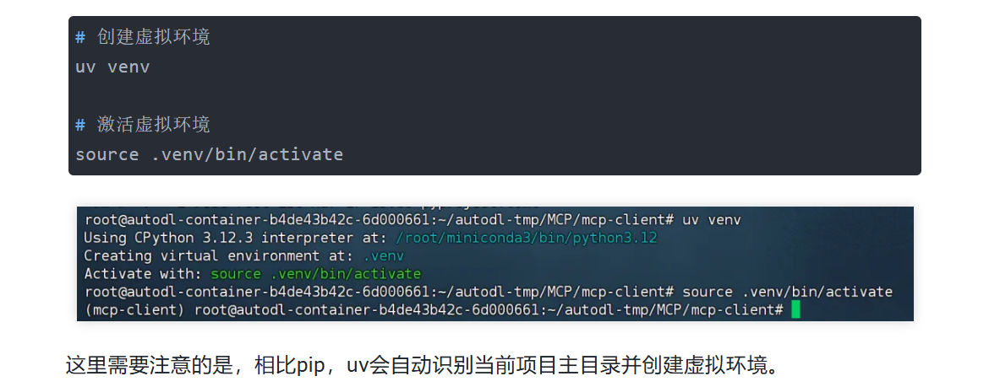
```bash
# 创建虚拟环境
uv venv

# 激活虚拟环境
source .venv/bin.activate
```
> [!code]
> 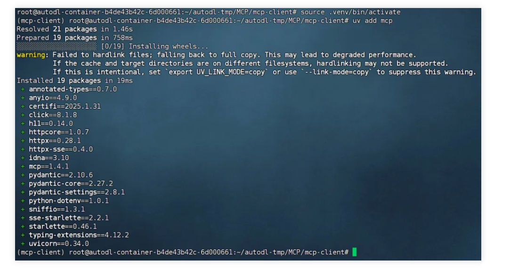
```
# 安装 MCP SDK  
uv add mcp
```


## 编写基础MCP客户端
> [!code]
> 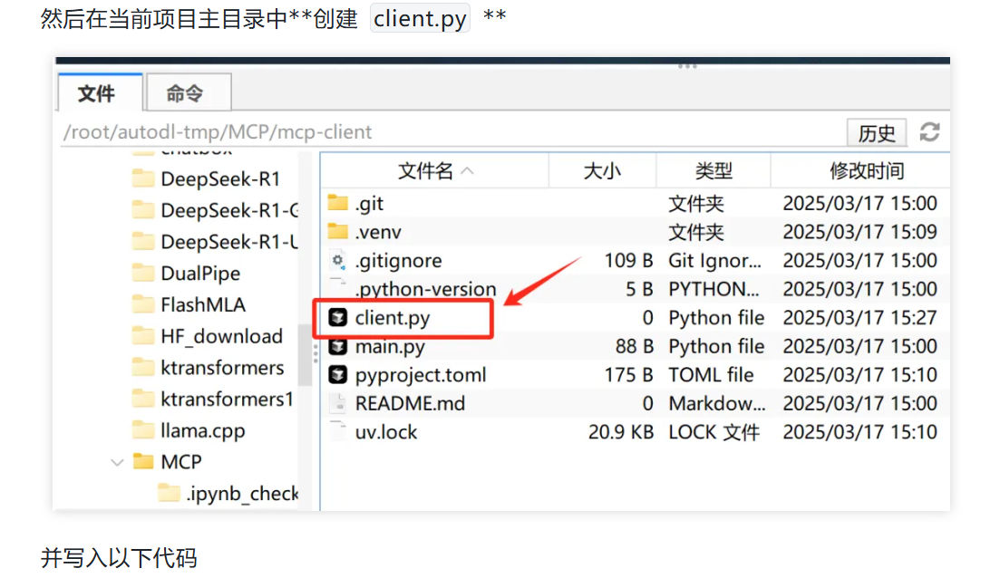
```python
import asyncio
from mcp import ClientSession
from contextlib import AsyncExitStack

class MCPClient:
    def__init__(self):
        """初始化 MCP 客户端"""
        self.session = None
        self.exit_stack = AsyncExitStack()

    async def connect_to_mock_server(self):
        """模拟 MCP 服务器的连接（暂不连接真实服务器）"""
        print("✅ MCP 客户端已初始化，但未连接到服务器")

    async def chat_loop(self):
        """运行交互式聊天循环"""
        print("\nMCP 客户端已启动！输入 'quit' 退出")

        whileTrue:
            try:
                query = input("\nQuery: ").strip()
                if query.lower() == 'quit':
                    break
                print(f"\n🤖 [Mock Response] 你说的是：{query}")
            except Exception as e:
                print(f"\n⚠️ 发生错误: {str(e)}")

    asyncdefcleanup(self):
        """清理资源"""
        await self.exit_stack.aclose()

async def main():
    client = MCPClient()
    try:
        await client.connect_to_mock_server()
        await client.chat_loop()
    finally:
        await client.cleanup()

if __name__ == "__main__":
    asyncio.run(main())

```


