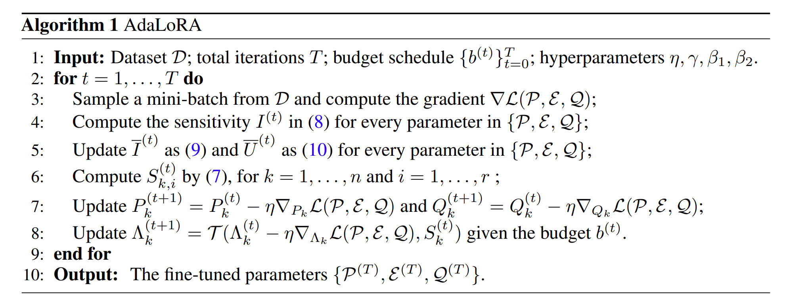

**Reference:** https://athekunal.medium.com/adaptive-lora-adalora-paper-explanation-7cb5ac04d0cb

**Paper:** https://arxiv.org/abs/2303.10512
# Paper Analysis
## Idea
> [!def]
> **LoRA:** $W+\Delta W = W+BA$ where $B\in \mathbb{R}^{d_{1}\times r}$ and $A\in \mathbb{R}^{r \times d_{2}}$
> **AdaLoRA:** $W+\Delta W = W+P\Lambda Q$ where $P\in \mathbb{R}^{d_{1}\times r}$, $Q\in \mathbb{R}^{r \times d_{2}}$ and $\Lambda \in \mathbb{R}^{r\times r}$
> 
> Adalora出现的原因是其作者认为Lora训练的时候对于所有的秩一矩阵的weights都是一样的，也就是Lora没有考虑importance of weights. 所以在Adalora中，作者assign rank to weights dynamically based on SVD and based on the importance score, they prune the weights.
> 
> 其中$\Lambda$是用来控制ranking.

## Findings
> [!important]
> 

## SVD Training
> [!algo]
> 
> 定义$s(\cdot)$, 以下是可视化深度神经网络中某个参数的重要性的方式:
> 
> 
> Exponential Smoothed Version(Momentum):
> 
> 

# Code Experiments

