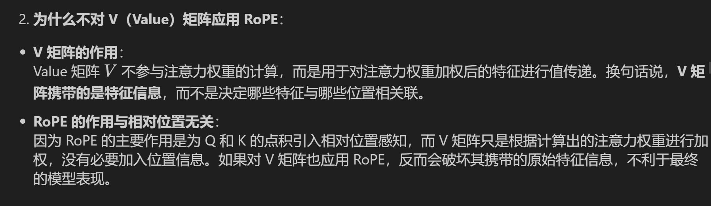

# Overall Structure
> [!def]
> 


# Rotary Positional Embedding
## Motivations
> [!motiv]
> 


## Definition
> [!def]
> 
> 我们也可以借用[Complex_Arithmetic_I](../../Machine_Learning/Control_LA_Circuit/EECS16B/Module1_Signal_Processing/Advanced_Circuit_Elements/Complex_Arithmetic_I.md)相关知识将这个矩阵表达式转化为如下形式:
> 
> 
```python
def precompute_pos_cis(dim: int, max_position: int, theta: float = 10000.0):
    """

    :param dim: d_model's embedding size
    :param max_position:
    :param theta: Rotation angles
    :return: (seq_len, dim // 2)
    """
    # 频率
    freqs = 1.0 / (theta ** (torch.arange(0, dim, 2)[: (dim // 2)].float() / dim))

    # 位置编码m
    m = torch.arange(max_position, device=freqs.device)

    # 频率乘以位置编码、外积
    freqs = torch.outer(m, freqs).float()

    # 生成模长为1，旋转角度为freqs的复数 (cos(freq) + i * sin(freq))
    pos_cis = torch.polar(torch.ones_like(freqs), freqs)

    return pos_cis
```


## 相对位置表示
> [!important]
> 


## 用于Q和K矩阵
> [!important]
> 
```python
# 将频率（位置编码）应用于查询矩阵 q 和键矩阵 k
def apply_rotary_emb(xq, xk, pos_cis):
    # 内部函数：用于调整 pos_cis（位置编码）的形状，使其与输入张量 x 的形状匹配
    def unite_shape(pos_cis, x):
        # 注意这里输入的x是已经转变为复数的Q和K矩阵
        # 复数Q、K矩阵的维度与实数Q、K矩阵的维度有区别
        # 例如，当实数Q矩阵的结构为 (10,128,512) 时
        # 复数Q矩阵的结构为(10,128,256,2)，其中后两位代表复数的实部和虚部
        # 此时如果对Q矩阵取最后一维索引，会得到最后一个实部，也就是256
        # 获取输入张量的维度数量
        ndim = x.ndim
        # 确保输入张量的维度数是有效的
        assert 0 <= 1 < ndim
        # 确保 pos_cis 的形状与输入 x 的形状中的seq_len, d_model维度匹配
        assert pos_cis.shape == (x.shape[1], x.shape[-1])
        # 构造新的形状，除了第二维度和最后一维度之外，其他维度都设置为 1
        # 这是为了广播 pos_cis 以匹配输入 x 的形状
        shape = [d if i == 1 or i == ndim - 1 else 1 for i, d in enumerate(x.shape)]
        # 调整 pos_cis 的形状为新的 shape
        return pos_cis.view(*shape)

    # 将查询张量 xq 的最后一个维度视为复数的一部分，形状变为 (*xq.shape[:-1], -1, 2)
    # 这意味着将最后一维度按 2 拆分，转换为复数表示（因为一个复数由实部和虚部组成）
    xq_ = torch.view_as_complex(xq.float().reshape(*xq.shape[:-1], -1, 2))

    # 对键张量 xk 做同样的处理，将其转换为复数形式
    xk_ = torch.view_as_complex(xk.float().reshape(*xk.shape[:-1], -1, 2))

    # 调整 pos_cis 的形状，使其与查询矩阵 xq_ 的形状匹配
    pos_cis = unite_shape(pos_cis, xq_)

    # 将旋转嵌入应用到查询矩阵，复数乘法会影响幅度和相位
    # 然后将复数结果转换回实数形式并将其展平（恢复到原来的维度结构）
    xq_out = torch.view_as_real(xq_ * pos_cis).flatten(3)

    # 对键矩阵做同样的操作，应用旋转嵌入
    xk_out = torch.view_as_real(xk_ * pos_cis).flatten(3)

    # 返回处理后的查询矩阵和键矩阵，且类型与输入张量相同
    return xq_out.type_as(xq), xk_out.type_as(xk)
```


## Inner Product Derivations
> [!important]
> 


# Grouped Multi-query Attention
> [!important]
> 
```python
def repeat_kv(x: torch.Tensor, n_rep: int) -> torch.Tensor:
    """torch.repeat_interleave(x, dim=2, repeats=n_rep)"""
    # 定义函数 repeat_kv，接受两个参数：张量 x 和重复次数 n_rep
    # x 是一个形状为 (bs, slen, n_kv_heads, head_dim) 的张量，分别代表：
    # bs: 批次大小 (batch size)
    # slen: 序列长度 (sequence length)
    # n_kv_heads: KV 头的数量 (number of key-value heads)
    # head_dim: 每个头的维度大小 (dimension size of each head)
    # n_rep: 重复次数

    # 获取张量的形状 (bs: 批次大小, slen: 序列长度, n_kv_heads: KV 头的数量, head_dim: 每个头的维度)
    bs, slen, n_kv_heads, head_dim = x.shape

    # 如果 n_rep 为 1，表示不需要重复，直接返回原始张量
    if n_rep == 1:
        return x

    # 执行以下操作以重复 KV 头：
    # 1. 在第 4 维度 (即 None) 上扩展 x，使其形状为 (bs, slen, n_kv_heads, 1, head_dim)
    # 2. 使用 expand 函数将第 4 维度扩展为 n_rep，得到形状 (bs, slen, n_kv_heads, n_rep, head_dim)
    # 3. 最后通过 reshape 将形状重新调整为 (bs, slen, n_kv_heads * n_rep, head_dim)
    # 这会将每个 KV 头重复 n_rep 次
    return (
        x[:, :, :, None, :]                       # 扩展张量，在 n_kv_heads 后增加一个维度
        .expand(bs, slen, n_kv_heads, n_rep, head_dim)  # 扩展 n_rep 次
        .reshape(bs, slen, n_kv_heads * n_rep, head_dim)  # 调整形状为新的维度
    )
```


# RMS Normalization
> [!def]
> 
```python
class RMSNorm(torch.nn.Module):
    # 初始化函数，接受参数：
    # dim: 归一化的维度大小
    # eps: 防止除零的非常小的数值
    def __init__(self, dim: int, eps: float):
        super().__init__()  # 调用父类的初始化方法
        self.eps = eps  # 将 eps 存储为类的属性
        # 初始化可学习的参数 weight，初始值为全1，形状为(dim,)
        # 这是每个维度的缩放系数
        self.weight = nn.Parameter(torch.ones(dim))  

    # 定义一个内部方法 _norm，用于对输入 x 进行归一化操作
    def _norm(self, x):
        # 使用平方的均值作为输入的标准差，并加上 eps 以防止除零
        # torch.rsqrt 是计算平方根的倒数，即 1 / sqrt(x)
        return x * torch.rsqrt(x.pow(2).mean(-1, keepdim=True) + self.eps)

    # 定义前向传播的操作
    def forward(self, x):
        # 首先调用 _norm 方法对输入 x 进行归一化，并确保类型一致性
        # x.float() 将输入转换为浮点数进行精度较高的计算
        output = self._norm(x.float()).type_as(x)  
        # 将归一化后的输出乘以可学习的参数 weight，调整每个维度的缩放
        return output * self.weight
```


# KV Cached(For Generation)
## Motivations
> [!important]
> 


## Definition
> [!def]
> 


# FFN with SwiGLU


# Full Implementations
> [!code]
```python


```
