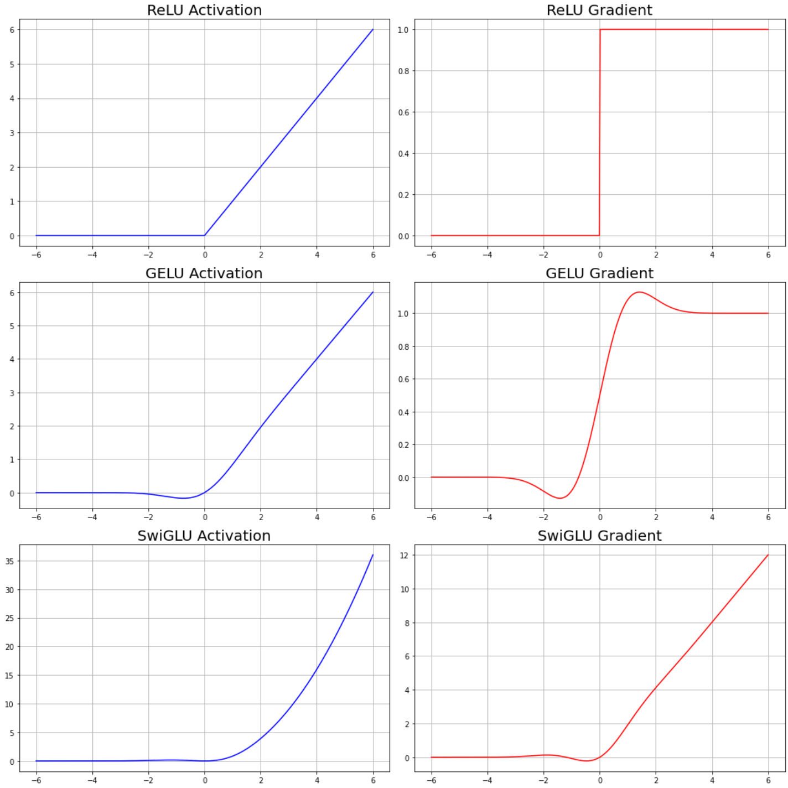
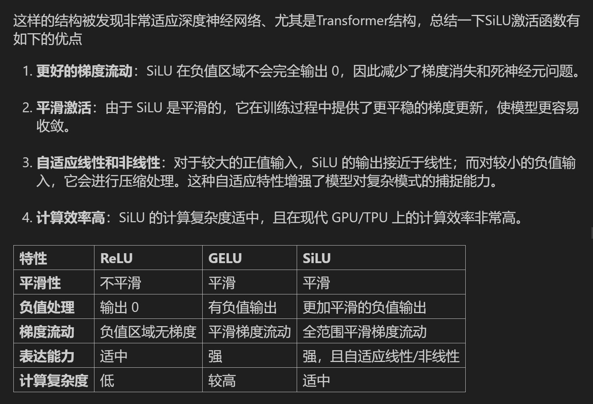
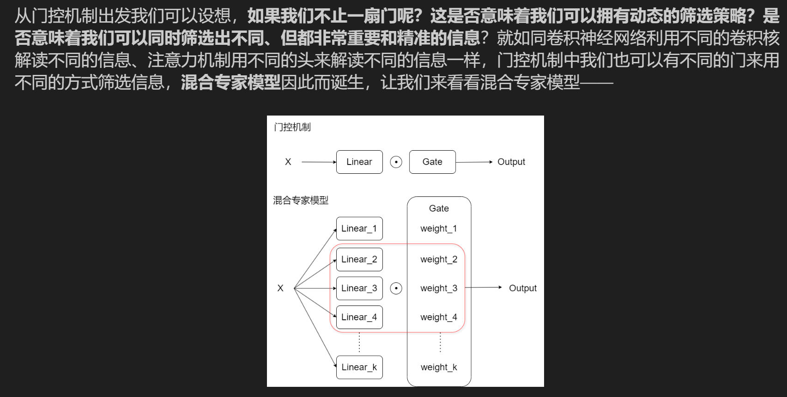
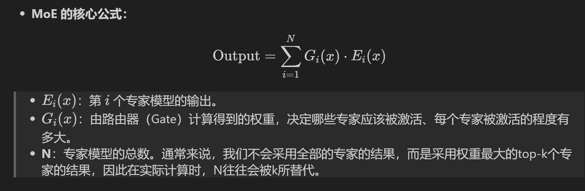

# Overall Structure
> [!def]
> 


# Rotary Positional Embedding
## Motivations
> [!motiv]
> 


## Definition
> [!def]
> 
> 我们也可以借用[Complex_Arithmetic_I](../../Machine_Learning/Control_LA_Circuit/EECS16B/Module1_Signal_Processing/Advanced_Circuit_Elements/Complex_Arithmetic_I.md)相关知识将这个矩阵表达式转化为如下形式:
> 
> 
```python
def precompute_pos_cis(dim: int, max_position: int, theta: float = 10000.0):
    """

    :param dim: d_model's embedding size
    :param max_position:
    :param theta: Rotation angles
    :return: (seq_len, dim // 2)
    """
    # 频率
    freqs = 1.0 / (theta ** (torch.arange(0, dim, 2)[: (dim // 2)].float() / dim))

    # 位置编码m
    m = torch.arange(max_position, device=freqs.device)

    # 频率乘以位置编码、外积
    freqs = torch.outer(m, freqs).float()

    # 生成模长为1，旋转角度为freqs的复数 (cos(freq) + i * sin(freq))
    pos_cis = torch.polar(torch.ones_like(freqs), freqs)

    return pos_cis
```


## 相对位置表示
> [!important]
> 


## 用于Q和K矩阵
> [!important]
> 
```python
# 将频率（位置编码）应用于查询矩阵 q 和键矩阵 k
def apply_rotary_emb(xq, xk, pos_cis):
    # 内部函数：用于调整 pos_cis（位置编码）的形状，使其与输入张量 x 的形状匹配
    def unite_shape(pos_cis, x):
        # 注意这里输入的x是已经转变为复数的Q和K矩阵
        # 复数Q、K矩阵的维度与实数Q、K矩阵的维度有区别
        # 例如，当实数Q矩阵的结构为 (10,128,512) 时
        # 复数Q矩阵的结构为(10,128,256,2)，其中后两位代表复数的实部和虚部
        # 此时如果对Q矩阵取最后一维索引，会得到最后一个实部，也就是256
        # 获取输入张量的维度数量
        ndim = x.ndim
        # 确保输入张量的维度数是有效的
        assert 0 <= 1 < ndim
        # 确保 pos_cis 的形状与输入 x 的形状中的seq_len, d_model维度匹配
        assert pos_cis.shape == (x.shape[1], x.shape[-1])
        # 构造新的形状，除了第二维度和最后一维度之外，其他维度都设置为 1
        # 这是为了广播 pos_cis 以匹配输入 x 的形状
        shape = [d if i == 1 or i == ndim - 1 else 1 for i, d in enumerate(x.shape)]
        # 调整 pos_cis 的形状为新的 shape
        return pos_cis.view(*shape)

    # 将查询张量 xq 的最后一个维度视为复数的一部分，形状变为 (*xq.shape[:-1], -1, 2)
    # 这意味着将最后一维度按 2 拆分，转换为复数表示（因为一个复数由实部和虚部组成）
    xq_ = torch.view_as_complex(xq.float().reshape(*xq.shape[:-1], -1, 2))

    # 对键张量 xk 做同样的处理，将其转换为复数形式
    xk_ = torch.view_as_complex(xk.float().reshape(*xk.shape[:-1], -1, 2))

    # 调整 pos_cis 的形状，使其与查询矩阵 xq_ 的形状匹配
    pos_cis = unite_shape(pos_cis, xq_)

    # 将旋转嵌入应用到查询矩阵，复数乘法会影响幅度和相位
    # 然后将复数结果转换回实数形式并将其展平（恢复到原来的维度结构）
    xq_out = torch.view_as_real(xq_ * pos_cis).flatten(3)

    # 对键矩阵做同样的操作，应用旋转嵌入
    xk_out = torch.view_as_real(xk_ * pos_cis).flatten(3)

    # 返回处理后的查询矩阵和键矩阵，且类型与输入张量相同
    return xq_out.type_as(xq), xk_out.type_as(xk)
```


## Inner Product Derivations
> [!important]
> 


# Grouped Multi-query Attention
> [!important]
> 
```python
def repeat_kv(x: torch.Tensor, n_rep: int) -> torch.Tensor:
    """torch.repeat_interleave(x, dim=2, repeats=n_rep)"""
    # 定义函数 repeat_kv，接受两个参数：张量 x 和重复次数 n_rep
    # x 是一个形状为 (bs, slen, n_kv_heads, head_dim) 的张量，分别代表：
    # bs: 批次大小 (batch size)
    # slen: 序列长度 (sequence length)
    # n_kv_heads: KV 头的数量 (number of key-value heads)
    # head_dim: 每个头的维度大小 (dimension size of each head)
    # n_rep: 重复次数

    # 获取张量的形状 (bs: 批次大小, slen: 序列长度, n_kv_heads: KV 头的数量, head_dim: 每个头的维度)
    bs, slen, n_kv_heads, head_dim = x.shape

    # 如果 n_rep 为 1，表示不需要重复，直接返回原始张量
    if n_rep == 1:
        return x

    # 执行以下操作以重复 KV 头：
    # 1. 在第 4 维度 (即 None) 上扩展 x，使其形状为 (bs, slen, n_kv_heads, 1, head_dim)
    # 2. 使用 expand 函数将第 4 维度扩展为 n_rep，得到形状 (bs, slen, n_kv_heads, n_rep, head_dim)
    # 3. 最后通过 reshape 将形状重新调整为 (bs, slen, n_kv_heads * n_rep, head_dim)
    # 这会将每个 KV 头重复 n_rep 次
    return (
        x[:, :, :, None, :]                       # 扩展张量，在 n_kv_heads 后增加一个维度
        .expand(bs, slen, n_kv_heads, n_rep, head_dim)  # 扩展 n_rep 次
        .reshape(bs, slen, n_kv_heads * n_rep, head_dim)  # 调整形状为新的维度
    )
```


# RMS Normalization
> [!def]
> 
```python
class RMSNorm(torch.nn.Module):
    # 初始化函数，接受参数：
    # dim: 归一化的维度大小
    # eps: 防止除零的非常小的数值
    def __init__(self, dim: int, eps: float):
        super().__init__()  # 调用父类的初始化方法
        self.eps = eps  # 将 eps 存储为类的属性
        # 初始化可学习的参数 weight，初始值为全1，形状为(dim,)
        # 这是每个维度的缩放系数
        self.weight = nn.Parameter(torch.ones(dim))  

    # 定义一个内部方法 _norm，用于对输入 x 进行归一化操作
    def _norm(self, x):
        # 使用平方的均值作为输入的标准差，并加上 eps 以防止除零
        # torch.rsqrt 是计算平方根的倒数，即 1 / sqrt(x)
        return x * torch.rsqrt(x.pow(2).mean(-1, keepdim=True) + self.eps)

    # 定义前向传播的操作
    def forward(self, x):
        # 首先调用 _norm 方法对输入 x 进行归一化，并确保类型一致性
        # x.float() 将输入转换为浮点数进行精度较高的计算
        output = self._norm(x.float()).type_as(x)  
        # 将归一化后的输出乘以可学习的参数 weight，调整每个维度的缩放
        return output * self.weight
```


# KV Cached(For Generation)
## Motivations
> [!important]
> 


## Definition
> [!def]
> 


# Flash Attention


# FFN with SwiGLU
## Overall Structure
> [!def]
> 


## SwiGLU: 门控线性单元激活函数
> [!important]
> 
```python
import numpy as np
import matplotlib.pyplot as plt

# 定义 ReLU 激活函数及其梯度
def relu(x):
    return np.maximum(0, x)

def relu_derivative(x):
    return np.where(x > 0, 1, 0)

# 定义 GELU 激活函数及其梯度
def gelu(x):
    return 0.5 * x * (1 + np.tanh(np.sqrt(2 / np.pi) * (x + 0.044715 * x**3)))

def gelu_derivative(x):
    tanh_term = np.tanh(np.sqrt(2 / np.pi) * (x + 0.044715 * x**3))
    sech2_term = 1 - tanh_term ** 2  # tanh 导数
    return 0.5 * (1 + tanh_term + np.sqrt(2 / np.pi) * x * (1 + 3 * 0.044715 * x**2) * sech2_term)

# 定义 SwiGLU 激活函数及其梯度
def swiglu(x, W1a=1.0, W1b=1.0):
    return gelu(W1a * x) * (W1b * x)

def swiglu_derivative(x, W1a=1.0, W1b=1.0):
    gelu_grad = gelu_derivative(W1a * x) * W1a
    return gelu_grad * (W1b * x) + gelu(W1a * x) * W1b

# 创建输入数据
x = np.linspace(-6, 6, 400)

# 计算所有函数及其梯度
y_relu, y_relu_grad = relu(x), relu_derivative(x)
y_gelu, y_gelu_grad = gelu(x), gelu_derivative(x)
y_swiglu, y_swiglu_grad = swiglu(x), swiglu_derivative(x)

# 绘制 3x2 图像布局
fig, axes = plt.subplots(3, 2, figsize=(15, 15))

# ReLU 激活函数和梯度
axes[0, 0].plot(x, y_relu, color='b', label='ReLU')
axes[0, 0].set_title('ReLU Activation',size=20)
axes[0, 0].grid(True)
axes[0, 1].plot(x, y_relu_grad, color='r', label='ReLU Gradient')
axes[0, 1].set_title('ReLU Gradient',size=20)
axes[0, 1].grid(True)

# GELU 激活函数和梯度
axes[1, 0].plot(x, y_gelu, color='b', label='GELU')
axes[1, 0].set_title('GELU Activation',size=20)
axes[1, 0].grid(True)
axes[1, 1].plot(x, y_gelu_grad, color='r', label='GELU Gradient')
axes[1, 1].set_title('GELU Gradient',size=20)
axes[1, 1].grid(True)

# SwiGLU 激活函数和梯度
axes[2, 0].plot(x, y_swiglu, color='b', label='SwiGLU')
axes[2, 0].set_title('SwiGLU Activation',size=20)
axes[2, 0].grid(True)
axes[2, 1].plot(x, y_swiglu_grad, color='r', label='SwiGLU Gradient')
axes[2, 1].set_title('SwiGLU Gradient',size=20)
axes[2, 1].grid(True)

plt.tight_layout()
plt.show()
```


## SiLU
> [!def]
> 
```python
import numpy as np
import matplotlib.pyplot as plt

# 定义 SiLU 激活函数及其梯度
def silu(x):
    return x * (1 / (1 + np.exp(-x)))  # SiLU = x * sigmoid(x)

def silu_derivative(x):
    sigmoid_x = 1 / (1 + np.exp(-x))
    return sigmoid_x * (1 + x * (1 - sigmoid_x))  # d(SiLU)/dx

# 创建输入数据
x = np.linspace(-6, 6, 400)

# 计算 SiLU 和其梯度
y_silu = silu(x)
y_silu_grad = silu_derivative(x)

# 绘制 SiLU 激活函数及其梯度
plt.figure(figsize=(12, 5))

# SiLU 激活函数图像
plt.subplot(1, 2, 1)
plt.plot(x, y_silu, label='SiLU', color='b')
plt.title('SiLU Activation Function')
plt.xlabel('x')
plt.ylabel('SiLU(x)')
plt.grid(True)
plt.legend()

# SiLU 梯度图像
plt.subplot(1, 2, 2)
plt.plot(x, y_silu_grad, label='Gradient of SiLU', color='r')
plt.title('Gradient of SiLU Function')
plt.xlabel('x')
plt.ylabel('d(SiLU)/dx')
plt.grid(True)
plt.legend()

plt.show()
```


## SwiGLU with SiLU
> [!important]
> 
```python
class FeedForward(nn.Module):
    def __init__(self, dim: int, hidden_dim: int, multiple_of: int, dropout: float):
        super().__init__()
        if hidden_dim is None:
            hidden_dim = 4 * dim
            hidden_dim = int(2 * hidden_dim / 3)
            hidden_dim = multiple_of * ((hidden_dim + multiple_of - 1) // multiple_of)
        self.w1 = nn.Linear(dim, hidden_dim, bias=False)
        self.w2 = nn.Linear(hidden_dim, dim, bias=False)
        self.w3 = nn.Linear(dim, hidden_dim, bias=False)
        self.dropout = nn.Dropout(dropout)

    def forward(self, x):
        return self.dropout(self.w2(F.silu(self.w1(x)) * self.w3(x)))
```
> [!exp] 
> 
> 这里保证的是`hidden_dim`会向上取`multiple_of`的倍数


# 混合专家模型MoE
> [!motiv]
> 


## Definition
> [!def]
> 


## Improvements over FFN
> [!important]
> 


## How to activate Experts
> [!important]
> 


## Bottleneck in Training
> [!important]
> 


## Inference
> [!important]
> 


## MOEGate
> [!code]
```python
import torch
import torch.nn as nn
import torch.nn.functional as F
import math

class MoEGate(nn.Module):
    def __init__(self, config: LMConfig):
        """
        初始化 MoEGate 类，用于混合专家模型中的门控机制。

        参数：
        - config: LMConfig 对象，包含模型的配置信息，如专家数量、得分函数、辅助损失等。
        """
        super().__init__()
        self.config = config  # 保存配置信息
        self.top_k = config.num_experts_per_tok  # 每次选择的 top-k 个专家数量
        self.n_routed_experts = config.n_routed_experts  # 总的专家数量

        self.scoring_func = config.scoring_func  # 路由器使用的得分函数（如 softmax）
        self.alpha = config.aux_loss_alpha  # 辅助损失的系数
        self.seq_aux = config.seq_aux  # 是否启用基于序列的辅助损失

        self.norm_topk_prob = config.norm_topk_prob  # 是否对 top-k 权重进行归一化
        self.gating_dim = config.dim  # 输入维度
        # 路由器的权重矩阵：用于计算每个专家的得分
        self.weight = nn.Parameter(torch.empty((self.n_routed_experts, self.gating_dim)))
        self.reset_parameters()  # 初始化权重参数

    def reset_parameters(self) -> None:
        """
        使用 Kaiming 初始化方法对权重矩阵进行初始化，确保模型在深层网络中有较好的梯度流动。
        """
        import torch.nn.init as init
        init.kaiming_uniform_(self.weight, a=math.sqrt(5))  # Kaiming 初始化

    def forward(self, hidden_states):
        """
        前向传播：根据输入的隐状态（hidden_states）计算专家的得分，选择 top-k 个专家，
        并在训练时计算辅助损失。

        参数：
        - hidden_states: Tensor，形状为 (batch_size, seq_len, hidden_dim) 的输入张量。

        返回：
        - topk_idx: 被选中的 top-k 个专家的索引。
        - topk_weight: 这些专家对应的权重。
        - aux_loss: 在训练模式下返回的辅助损失（否则为 None）。
        """
        # 获取 batch 大小、序列长度和隐藏维度
        bsz, seq_len, h = hidden_states.shape

        # 将输入重塑为二维张量 (batch_size * seq_len, hidden_dim)
        hidden_states = hidden_states.view(-1, h)

        # 使用线性层计算每个专家的得分 (n_routed_experts, gating_dim) -> (batch_size * seq_len, n_routed_experts)
        logits = F.linear(hidden_states, self.weight, None)

        # 根据配置，使用 softmax 对得分进行归一化处理
        if self.scoring_func == 'softmax':
            scores = logits.softmax(dim=-1)  # 按照最后一维计算 softmax
        else:
            raise NotImplementedError(f'insupportable scoring function for MoE gating: {self.scoring_func}')

        # 获取 top-k 专家的权重和对应的索引
        topk_weight, topk_idx = torch.topk(scores, k=self.top_k, dim=-1, sorted=False)

        # 如果启用归一化，则对 top-k 权重进行归一化处理
        if self.top_k > 1 and self.norm_topk_prob:
            # 避免除以 0，添加小数项 1e-20
            denominator = topk_weight.sum(dim=-1, keepdim=True) + 1e-20
            topk_weight = topk_weight / denominator

        # 如果在训练模式下且辅助损失系数 alpha > 0，则计算辅助损失
        if self.training and self.alpha > 0.0:
            scores_for_aux = scores  # 获取所有专家的得分用于辅助损失计算
            aux_topk = self.top_k  # 辅助损失中使用的 top-k 专家数量
            # 将 top-k 专家的索引重塑为 (batch_size, top_k * seq_len)
            topk_idx_for_aux_loss = topk_idx.view(bsz, -1)

            if self.seq_aux:
                # 如果启用了序列级别的辅助损失
                scores_for_seq_aux = scores_for_aux.view(bsz, seq_len, -1)

                # 初始化交叉熵损失的张量
                ce = torch.zeros(bsz, self.n_routed_experts, device=hidden_states.device)

                # 计算每个专家的使用次数并归一化
                ce.scatter_add_(
                    1, topk_idx_for_aux_loss,
                    torch.ones(bsz, seq_len * aux_topk, device=hidden_states.device)
                ).div_(seq_len * aux_topk / self.n_routed_experts)

                # 计算序列级别的辅助损失
                aux_loss = (ce * scores_for_seq_aux.mean(dim=1)).sum(dim=1).mean() * self.alpha
            else:
                # 如果没有启用序列级别的辅助损失
                # 使用 one-hot 编码标记被选中的专家
                mask_ce = F.one_hot(topk_idx_for_aux_loss.view(-1), num_classes=self.n_routed_experts)
                ce = mask_ce.float().mean(0)  # 计算每个专家的平均使用率

                Pi = scores_for_aux.mean(0)  # 所有专家的平均分配概率
                fi = ce * self.n_routed_experts  # 专家使用频率
                aux_loss = (Pi * fi).sum() * self.alpha  # 计算辅助损失
        else:
            aux_loss = None  # 如果不在训练模式或 alpha=0，则不计算辅助损失

        # 返回 top-k 专家的索引、对应权重和辅助损失
        return topk_idx, topk_weight, aux_loss
```


## MOEFFN
> [!code]
```python
import torch
import torch.nn as nn

class MOEFeedForward(nn.Module):
    def __init__(self, config: LMConfig):
        """
        初始化 MOEFeedForward 类。
        
        参数：
        - config: 包含模型配置的 LMConfig 对象，包括专家数量、维度、隐藏层维度和 dropout 参数。
        """
        super().__init__()
        self.config = config
        
        # 创建多个专家网络的列表 (ModuleList)，每个专家是一个 FeedForward 层
        self.experts = nn.ModuleList([
            FeedForward(
                dim=config.dim,
                hidden_dim=config.hidden_dim,
                multiple_of=config.multiple_of,
                dropout=config.dropout,
            )
            for _ in range(config.n_routed_experts)  # n_routed_experts：总专家数量
        ])

        # 创建门控 (Gate) 对象，用于选择哪些专家参与计算
        self.gate = MoEGate(config)

        # 如果配置指定了共享专家，则创建共享的 FeedForward 层
        if config.n_shared_experts is not None:
            self.shared_experts = FeedForward(
                dim=config.dim,
                hidden_dim=config.hidden_dim,
                multiple_of=config.multiple_of,
                dropout=config.dropout,
            )

    def forward(self, x):
        """
        前向传播逻辑。

        参数：
        - x: 输入张量，形状为 (batch_size, seq_len, hidden_dim)。

        返回：
        - y: 输出张量，经过专家网络和共享专家（如果存在）的计算。
        """
        identity = x  # 保存原始输入（用于后续的残差连接）
        orig_shape = x.shape  # 保存原始输入的形状信息
        bsz, seq_len, _ = x.shape  # 获取批次大小、序列长度和隐藏层维度

        # 使用门控机制选择参与计算的专家
        topk_idx, topk_weight, aux_loss = self.gate(x)  # topk_idx: 选中的专家索引，topk_weight: 选中的专家权重

        # 将输入数据重塑为 (batch_size * seq_len, hidden_dim)
        x = x.view(-1, x.shape[-1])  
        flat_topk_idx = topk_idx.view(-1)  # 将专家索引展平成一维

        if self.training:
            # 训练模式下，重复输入数据以适应专家数量
            x = x.repeat_interleave(self.config.num_experts_per_tok, dim=0)

            # 创建用于存储专家输出的张量
            y = torch.empty_like(x, dtype=torch.float16)

            # 遍历每个专家，将符合条件的 token 输入到对应专家中
            for i, expert in enumerate(self.experts):
                y[flat_topk_idx == i] = expert(x[flat_topk_idx == i])  # 仅处理属于该专家的 token

            # 计算每个 token 的加权输出
            y = (y.view(*topk_weight.shape, -1) * topk_weight.unsqueeze(-1)).sum(dim=1)
            y = y.view(*orig_shape)  # 恢复为原始输入的形状
        else:
            # 推理模式下，只选择最优专家
            y = self.moe_infer(x, flat_topk_idx, topk_weight.view(-1, 1)).view(*orig_shape)

        # 如果有共享专家，将共享专家的输出与 y 相加（残差连接）
        if self.config.n_shared_experts is not None:
            y = y + self.shared_experts(identity)

        return y

    @torch.no_grad()
    def moe_infer(self, x, flat_expert_indices, flat_expert_weights):
        """
        推理模式下的专家计算逻辑。

        参数：
        - x: 输入张量，形状为 (batch_size * seq_len, hidden_dim)。
        - flat_expert_indices: 展平后的专家索引，用于指示哪些 token 属于哪些专家。
        - flat_expert_weights: 展平后的专家权重，用于加权专家的输出。

        返回：
        - expert_cache: 经过专家计算后的输出张量。
        """
        # 创建一个与输入形状相同的张量，用于存储专家输出
        expert_cache = torch.zeros_like(x)

        # 对专家索引进行排序，以便批量处理属于同一专家的 token
        idxs = flat_expert_indices.argsort()

        # 计算每个专家需要处理的 token 数量，并累积求和以找到每个专家的范围
        tokens_per_expert = flat_expert_indices.bincount().cpu().numpy().cumsum(0)

        # 将排序后的索引映射回 token 的原始位置
        token_idxs = idxs // self.config.num_experts_per_tok

        # 遍历每个专家，处理属于该专家的 token
        for i, end_idx in enumerate(tokens_per_expert):
            # 获取每个专家的 token 范围
            start_idx = 0 if i == 0 else tokens_per_expert[i - 1]

            # 如果该专家没有处理任何 token，则跳过
            if start_idx == end_idx:
                continue

            # 获取该专家对象
            expert = self.experts[i]

            # 获取属于该专家的 token 索引和对应的 token
            exp_token_idx = token_idxs[start_idx:end_idx]
            expert_tokens = x[exp_token_idx]

            # 通过专家计算 token 的输出
            expert_out = expert(expert_tokens)

            # 使用专家的权重对输出进行加权
            expert_out.mul_(flat_expert_weights[idxs[start_idx:end_idx]])

            # 将加权后的输出累加到 expert_cache 中
            expert_cache.scatter_add_(0, exp_token_idx.view(-1, 1).repeat(1, x.shape[-1]), expert_out)

        return expert_cache
```


## Procedure Summary
> [!summary]
> See this image [MoE](MoE.png).