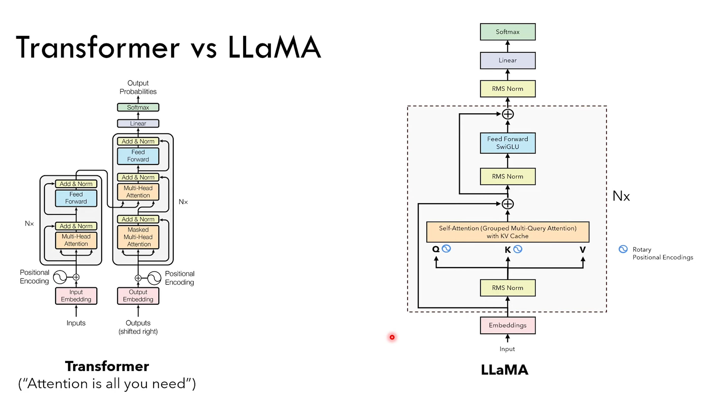

# Transformer and LLaMA
> [!important]
> 


# 环境配置
> [!def]
> - `conda env create --file <filename.yml>`
> 
```yml
name: llama2-gpu  
channels:  
  - defaults  
  - nvidia  
dependencies:  
  - python==3.10  
  - nvidia::cuda-toolkit==12.1.1  
  - pip  
  - pip:  
    - -r requirements.txt
```
> [!code] Minimum Requirements
```txt
numpy  
scipy  
tqdm  
docopt  
nltk  
torchvision  
torch  
sentencepiece  
lxml==5.0.0  
sacrebleu  
tensorboard
```


