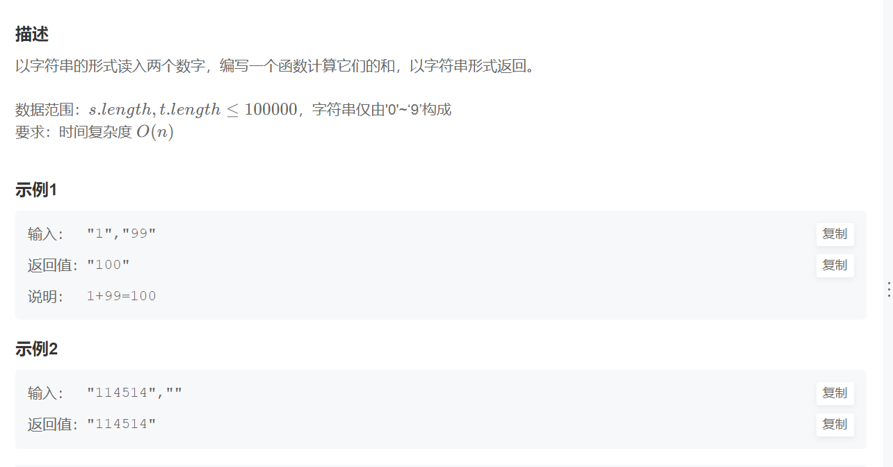

# 大数加法
> [!task] 难度: 中等
> 
> 常规的使用`Long.parseLong`在超过20位的数字是无效的，这将导致`Integer overflow`的错误。
> - 所以我们一般直接对字符串进行操作，而不转换。
```java
public class Solution {
    /**
     * 代码中的类名、方法名、参数名已经指定，请勿修改，直接返回方法规定的值即可
     *
     * 计算两个数之和
     * @param s string字符串 表示第一个整数
     * @param t string字符串 表示第二个整数
     * @return string字符串
     */
    public String solve (String s, String t) {
        // write code here
        StringBuilder sb = new StringBuilder();
        Stack<Integer> stack = new Stack<>();

		// 从尾部开始遍历
        int i = s.length() - 1, j = t.length() - 1, carry = 0;

        while (i >=0 || j >= 0 || carry != 0) {
	        // i>=0判断某一个数是否已经耗尽(高位补零) 
            carry += i >= 0 ? s.charAt(i--) - '0': 0;
            carry += j >=0 ? t.charAt(j--) - '0': 0;
            stack.push(carry % 10); // 每一位的具体结果
            carry = carry / 10;
        }

        while (!stack.isEmpty()) {
            sb.append(stack.pop());
        }
        return sb.toString();
    }
}
```


# 素数筛
