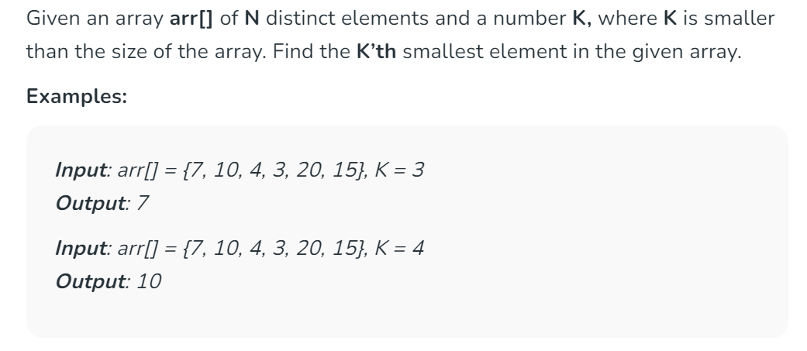
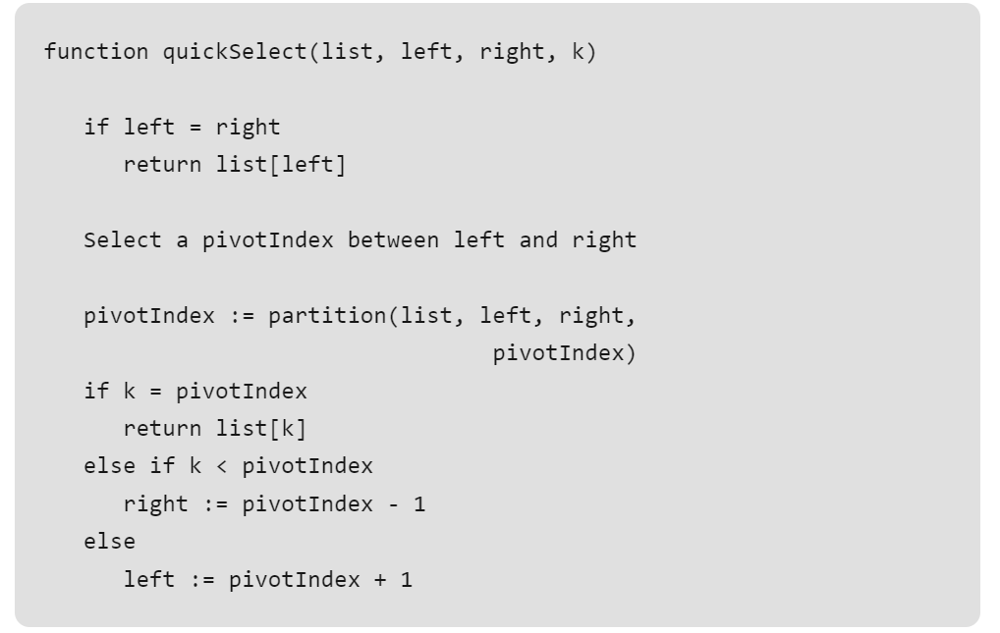
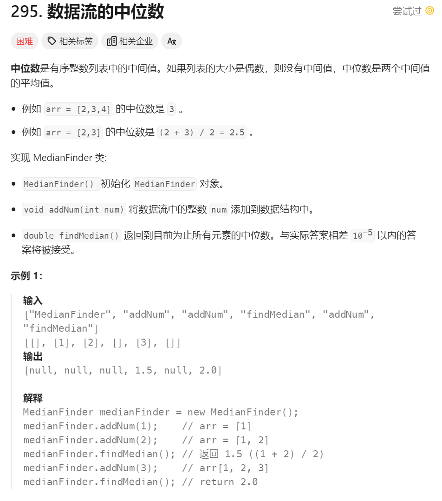
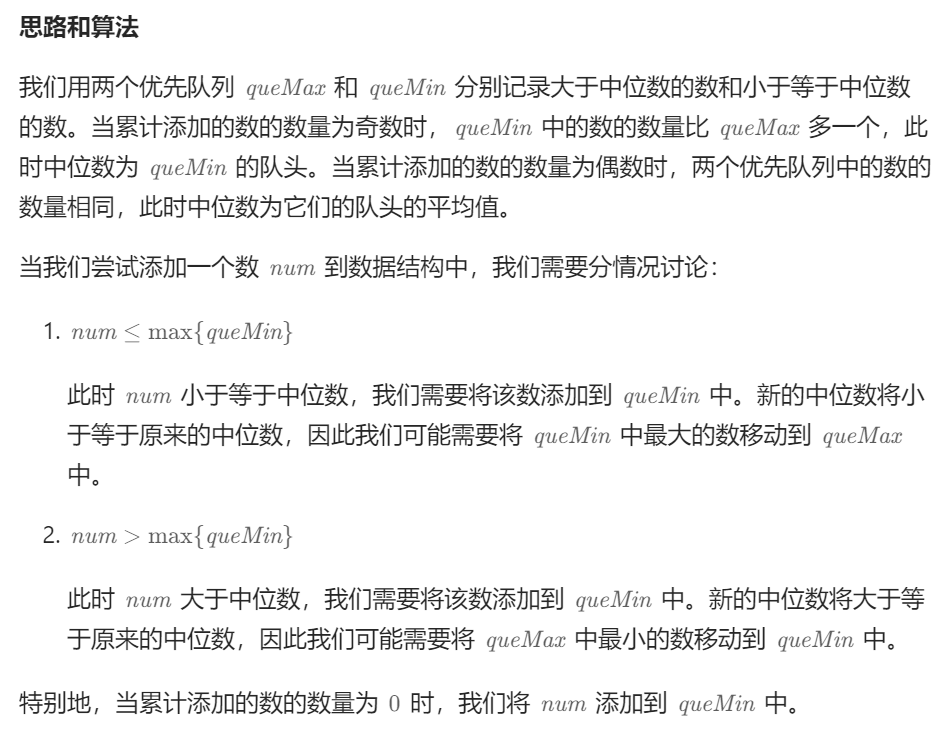

# 中位数查找
## Fing k-th smallest element
> [!task]
> 


### Quick Select
> [!algo]
> 
> This reduces the expected complexity from O(n log n) to O(n)
```java
// partition function similar to quick sort
// Considers last element as pivot and adds
// elements with less value to the left and
// high value to the right and also changes
// the pivot position to its respective position
// in the final array.
public static int partition(int[] arr, int low,
                                int high)
{
	int pivot = arr[high], pivotloc = low;
	for (int i = low; i <= high; i++) {
		// inserting elements of less value
		// to the left of the pivot location
		if (arr[i] < pivot) {
			int temp = arr[i];
			arr[i] = arr[pivotloc];
			arr[pivotloc] = temp;
			pivotloc++;
		}
	}

	// swapping pivot to the final pivot location
	int temp = arr[high];
	arr[high] = arr[pivotloc];
	arr[pivotloc] = temp;

	return pivotloc;
}


// finds the kth position (of the sorted array)
// in a given unsorted array i.e this function
// can be used to find both kth largest and
// kth smallest element in the array.
// ASSUMPTION: all elements in arr[] are distinct
public static int kthSmallest(int[] arr, int low,
							  int high, int k)
{
	// find the partition
	int partition = partition(arr, low, high);

	// if partition value is equal to the kth position,
	// return value at k.
	if (partition == k - 1)
		return arr[partition];

	// if partition value is less than kth position,
	// search right side of the array.
	else if (partition < k - 1)
		return kthSmallest(arr, partition + 1, high, k);

	// if partition value is more than kth position,
	// search left side of the array.
	else
		return kthSmallest(arr, low, partition - 1, k);
}
```


### Priority Queue
> [!algo]


## 数据流的中位数
> [!important]
> 


### Using Quick Select
> [!algo]
> 比较简单的思路(但是会超时)就是使用`QuickSelect`算法获取
```java
class MedianFinder {

    private List<Integer> listArray;
    private int[] data;

    public MedianFinder() {
        listArray = new ArrayList<>();
    }
    
    public void addNum(int num) {
        listArray.add(num);
        data = listArray.stream().mapToInt(Integer::intValue).toArray();
    }
    
    public double findMedian() {
        int N = data.length;
        if (N % 2 == 0) {
            int left = quickselect(data, 0, N - 1, N / 2 );
            data = listArray.stream().mapToInt(Integer::intValue).toArray();
            int right = quickselect(data, 0, N - 1, N / 2 + 1);
            return ((double) left + right) / 2;
        } else {
            return quickselect(data, 0, N - 1, N / 2 + 1);
        }
    }

    public int quickselect(int[] arr, int left, int right, int k) {

        int pivotloc = partition(arr, left, right);

        if (pivotloc == k - 1) {
            return arr[pivotloc];
        } else if (pivotloc < k - 1) {
            return quickselect(arr, pivotloc + 1, right, k);
        } else {
		    return quickselect(arr, left, pivotloc - 1, k); 
        }
    }

    public int partition(int[] arr, int low, int high) {
        int pivot = arr[high], pivotloc = low;

        for (int i = low; i <= high; i++) {
            if (arr[i] < pivot) {
                int temp = arr[i];
                arr[i] = arr[pivotloc];
                arr[pivotloc] = temp;
                pivotloc++;
            }
        }

        int temp = arr[high];
        arr[high] = arr[pivotloc];
        arr[pivotloc] = temp;

        return pivotloc;
    }
}
```


### Using Priority Queue
> [!algo]
> 
```java
class MedianFinder {

    PriorityQueue<Integer> smaller;
    PriorityQueue<Integer> larger;

    public MedianFinder() {
        // The maxHeap that stores the number less than current median
        smaller = new PriorityQueue<>((a, b) -> (b - a));
        // The minHeap that stores the number larger than current median
        larger = new PriorityQueue<>((a, b) -> (a - b));
    }
    
    public void addNum(int num) {
        if (smaller.isEmpty() || num <= smaller.peek()) {
            smaller.offer(num);
            if (larger.size() + 1 < smaller.size()) {
                larger.offer(smaller.poll());
            }
        } else {
            larger.offer(num);
            if (larger.size() > smaller.size()) {
                smaller.offer(larger.poll());
            }
        }
    }
    
    public double findMedian() {
        if (smaller.size() > larger.size()) {
            return smaller.peek();
        }
        return (smaller.peek() + larger.peek()) / 2.0;
    }
}
```


# 二分查找
