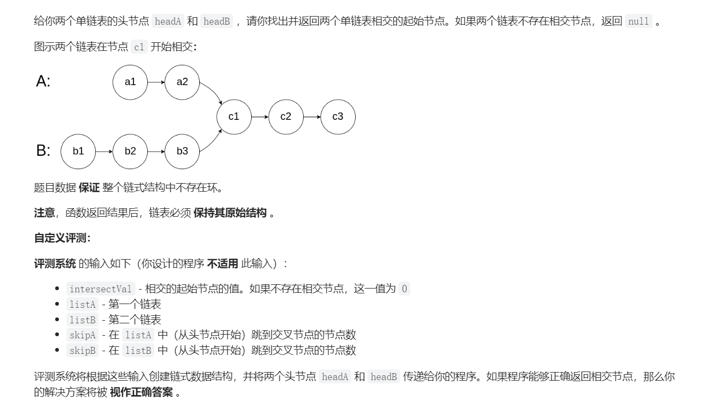
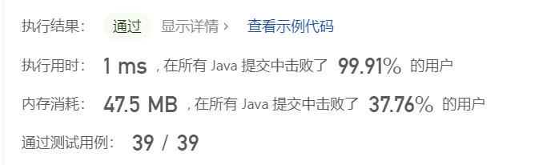

# 链表相交问题
## 相交链表
> [!task]
> 
> 注意本题假设如果两个链表相交，那么就不再分开，要么就不相交。
> 思路就是分别走完两个链表先判断是否相交
> - 不相交，那直接返回
> - 相交，那么计算长度差，长的链表先走`长度差`步，然后短的链表和长的链表一起走，直到第一个相交的节点返回。
```java
public ListNode getIntersectionNode(ListNode headA, ListNode headB) {
        ListNode Acur = headA;
        ListNode Bcur = headB;

        int lengthA = 0;
        int lengthB = 0 ;
        
        while (Acur != null) {
            lengthA ++ ;
            Acur = Acur.next;
        }

         while (Bcur != null) {
            lengthB ++ ;
            Bcur = Bcur.next;
        }

        Acur = headA;
        Bcur = headB;

        if (lengthA < lengthB) {
            for (int i = 0; i < lengthB - lengthA; i++) {
                Bcur = Bcur.next;
            }
            while (Acur != Bcur) {
                Acur = Acur.next;
                Bcur = Bcur.next;
            }
            return Acur;
        } else {
             for (int i = 0; i < lengthA - lengthB; i++) {
                Acur = Acur.next;
            }
            while (Acur != Bcur) {
                Acur = Acur.next;
                Bcur = Bcur.next;
            }
            return Acur;
        }
    }
```
> [!test]
> 


# 翻转链表

## K个一组翻转链表
> [!task]


 
# 用链表解决生产问题
## 设计推特


