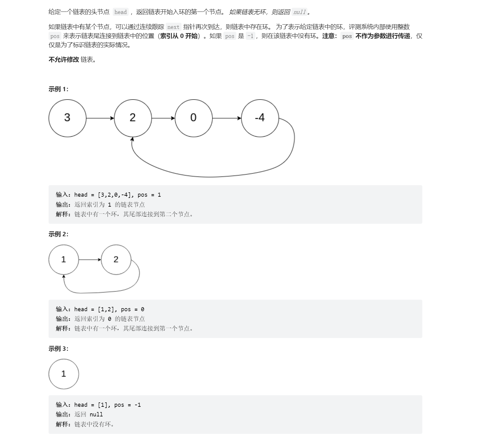
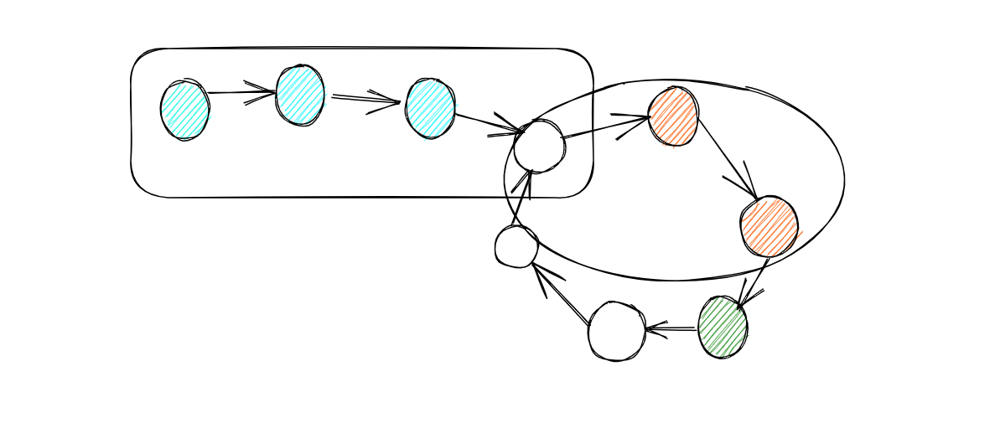

# 链表相交问题
## 相交链表
> [!task]
> 
> 注意本题假设如果两个链表相交，那么就不再分开，要么就不相交。
> 思路就是分别走完两个链表先判断是否相交
> - 不相交，那直接返回
> - 相交，那么计算长度差，长的链表先走`长度差`步，然后短的链表和长的链表一起走，直到第一个相交的节点返回。
```java
public ListNode getIntersectionNode(ListNode headA, ListNode headB) {
        ListNode Acur = headA;
        ListNode Bcur = headB;

        int lengthA = 0;
        int lengthB = 0 ;
        
        while (Acur != null) {
            lengthA ++ ;
            Acur = Acur.next;
        }

         while (Bcur != null) {
            lengthB ++ ;
            Bcur = Bcur.next;
        }

        Acur = headA;
        Bcur = headB;

        if (lengthA < lengthB) {
            for (int i = 0; i < lengthB - lengthA; i++) {
                Bcur = Bcur.next;
            }
            while (Acur != Bcur) {
                Acur = Acur.next;
                Bcur = Bcur.next;
            }
            return Acur;
        } else {
             for (int i = 0; i < lengthA - lengthB; i++) {
                Acur = Acur.next;
            }
            while (Acur != Bcur) {
                Acur = Acur.next;
                Bcur = Bcur.next;
            }
            return Acur;
        }
    }
```
> [!test]
> 


# 环形链表
## 判断链表是否有环(中等)
> [!task]
> 
> 证明过程需要利用同余的相关性质, 参考[Congruence](../../Discrete_Mathematics/Unit2_Structures/Number_Theory/Modular_Arithmetic.md#Congruence):
> 不妨先假设环存在，假设环的长度为$c$, 从快慢指针的起点到环的入口的距离为$x$
> - 满指针的速度为1
> - 快指针的速度为2
> - 在快慢指针行走一段时间后相遇在环内的某个节点，不妨设这个节点距离环的入口的距离为$y$(从环的入口到这个节点的距离)
> 
> **则我们有:**
> 
> 当快慢指针第一次相遇时，慢指针走了$x + k\cdot c + y$, 快指针走了$x+t\cdot c + y$。而我们又知道快慢指针行走的距离差为慢指针所走的距离，所以我们可以得到慢指针走的距离为$(k - t) \cdot c$, 也就是环的长度的整数倍。同时我们也知道慢指针行走的距离可以表示为$x + k \cdot c+y$, 所以$x + y$ 根据同余原则也应该是环的长度的整数倍。
> 
> 现在我们假设慢指针还需要**再走**$z$ 就能再一次到达环的入口，则$y+z = c$, 于是$x+c-z \equiv 0 \bmod c$, 化简之后得到$x\equiv z \mod c$, 这就是本题的关键结论。
> 
> 这里方框框住的节点数量和圆圈框住的节点数量关于$c$是同余的。
```java
public ListNode detectCycle(ListNode head) {
    // 特判
	if (head == null || head.next == null) {
		// 注意：不要习惯性把 head 返回回去
		return null;
	}

	// 起点要一样，这里利用第 141 题的结论
	ListNode slow = head;
	ListNode fast = head;

	// 注意这种写法，因为快指针一次走两步，
	// 所以要看它下一个结点以及下下一个结点是否为空
	while (fast != null && fast.next != null) {
		slow = slow.next;
		fast = fast.next.next;

		if (slow == fast) {
			break;
		}
	}

	// 特判，如果只是因为链表不存在环，那就返回空，因为既然不存在环，肯定没有重复结点
	if (fast == null || fast.next == null) {
		return null;
	}

	// 利用推出的关键结论得到环的入口节点
	slow = head;
	while (slow != fast) {
		slow = slow.next;
		fast = fast.next;
	}
	return slow;
}
```


# 翻转链表

## K个一组翻转链表
> [!task]


 
# 用链表解决生产问题
## 设计推特


