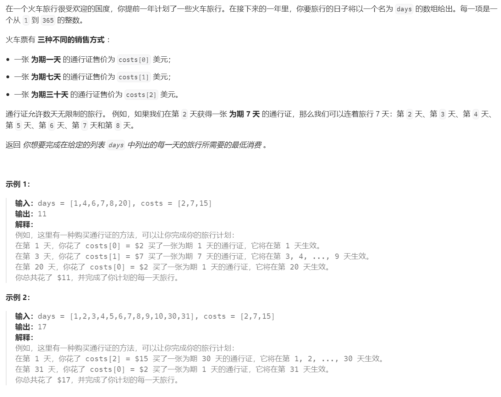
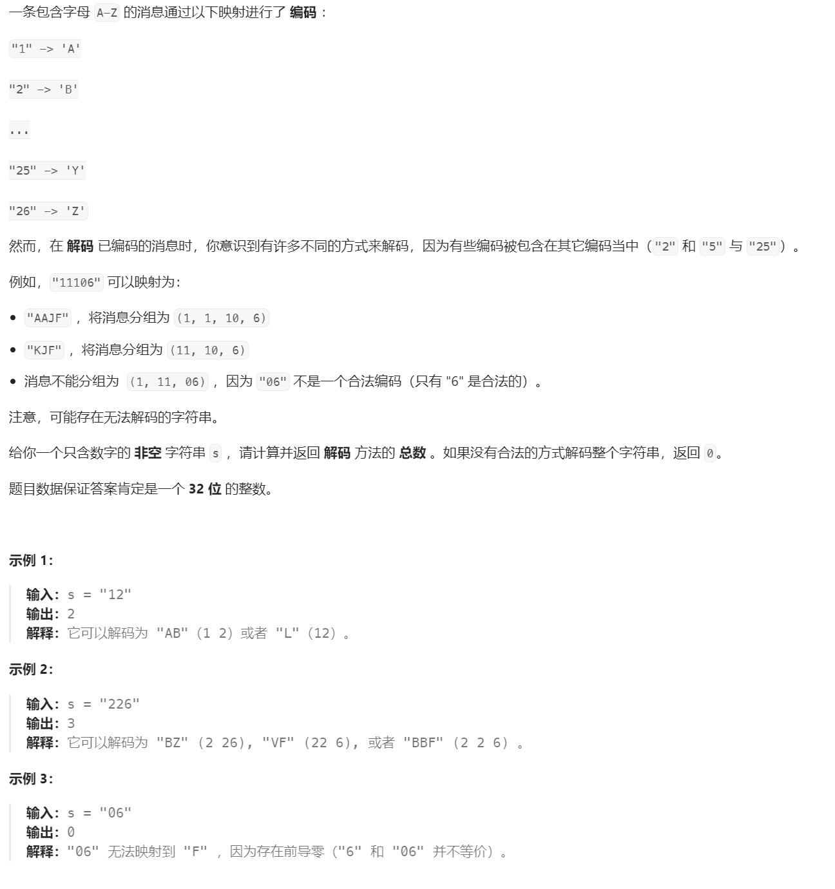
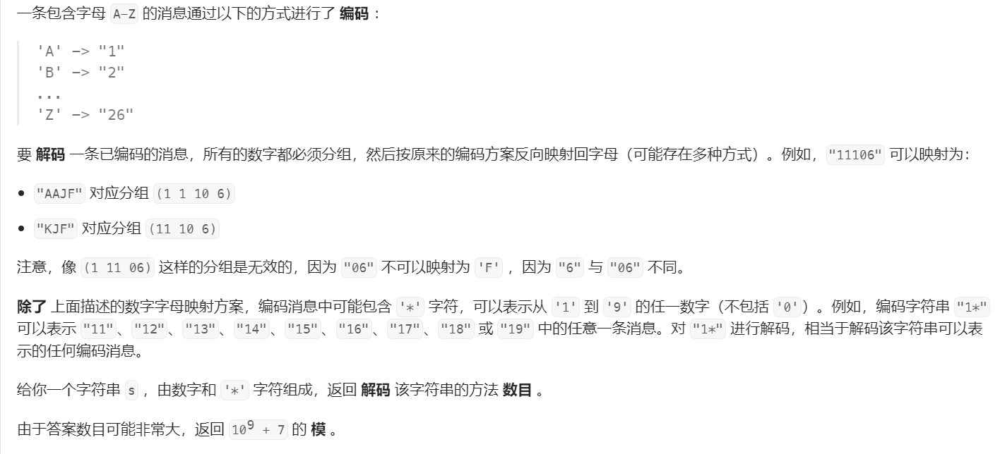

# 最大子数组/子序列
## 最长上升子序列长度
> [!task]
> 
> 这里定义状态`dp[i]`为以`nums[i]`结尾的最长上升子序列的长度
```java
public int lengthOfLIS(int[] nums) {
	int n = nums.length;
	int[] dp = new int[n];

	for (int i = 0; i < n; i++) {
		dp[i] = 1;
	}

	for (int i = 0; i < n; i++) {
		for (int j = 0; j < i; j++) {
			if (nums[j] < nums[i]) {
				dp[i] = Math.max(dp[j] + 1 , dp[i]);
			}
		}
	}

	int res = Integer.MIN_VALUE;
	for (int i = 0; i < n; i++) {
		res = Math.max(dp[i], res);
	}

	return res;

}
```


## 最长上升子序列
> [!task]


## 俄罗斯套娃信封
> [!task]
> 


## 最长连续递增子序列
> [!task]
> 
```java
public int findLengthOfLCIS(int[] nums) {
	int n = nums.length;
	int[] dp = new int[n];

	for (int i = 0; i < n; i++) {
		dp[i] = 1;
	}

	for (int i = 1 ; i < n; i++) {
		if (nums[i] > nums[i-1]) {
			dp[i] = dp[i-1] + 1;
		} else {
			dp[i] = 1;
		}
	}

	int res = Integer.MIN_VALUE;

	for (int i = 0; i < n; i++) {
		res = Math.max(dp[i], res);
	}

	return res;
}

```


## 最长山脉
> [!task]
> 
```java
public int longestMountain(int[] arr) {
	int n = arr.length;
	int[] dp1 = new int[n];
	int[] dp2 = new int[n];

	// init
	for (int i = 0; i < n; i++) {
		dp1[i] = 1;
		dp2[i] = 1;
	}
	
	// 顺序
	for (int i = 1; i < n; i++) {
		if (arr[i] > arr[i - 1]) {
			dp1[i] = dp1[i - 1] + 1;
		} 
	}


	// 逆序
	for (int i = n - 2; i >= 0; i--) {
		if (arr[i] > arr[i + 1]) {
			dp2[i] = dp2[i + 1] + 1;
		}
	}


	// 求最长
	int res = Integer.MIN_VALUE;
	for (int i = 0; i < n; i++) {
		if (dp1[i] > 1 && dp2[i] > 1) {
			int cur = dp1[i] + dp2[i] - 1;
			res = Math.max(res, cur);
		}
	}

	return res == Integer.MIN_VALUE ? 0 : res;
}
```


## 最大子序和


## 最大子矩阵


## 乘积最大子数组
> [!task]
> 
```python

```


# 从后往前规划
## 最低票价
> [!task]
> 
> 提供两种思路:
> - 暴力递归, 不做剪枝，在每一天都去枚举所有的火车票，如果在当日`day[i]`选择了第`k`种票，且这个票的有效时间为`t`, 则`day[i]`到`day[i + t - 1]`都不需要额外买票了，我们就可以从`day[i + t]`开始往后规划票价，所以我们发现，这里其实蕴含了一个子问题的结构，`day[i+t]`就是`day[i]`的子问题，可以用递归解决。
> - 动态规划，对上述递归过程做记忆化。

### 暴力递归
> [!code]
```java
class Solution {
    public static int[] duration = new int[] {1, 7, 30};

    public int mincostTickets(int[] days, int[] costs) {
        return minCost(days, costs, 0);
    }

    /**
        days[i:] 开始的最小票价
     */
    public int minCost(int[] days, int[] costs, int startDay) {

        if (startDay == days.length) {
            return 0;
        }

        int ans = Integer.MAX_VALUE;

        // 遍历所有的票价选项
        for (int k = 0, j = startDay; k < costs.length; k++) {
            while (j < days.length && days[startDay] + duration[k] > days[j]) {
	            // 找到下一次需要做决策的天数（也就是票价有效期到了的天数）
                j++;
            }
            ans = Math.min(ans, costs[k] + minCost(days, costs, j));
        }
        return ans;
    }
}
```


### 动态规划
> [!code]
> 这是一个从底到顶的动态规划。
```java
class Solution {
    public static int[] duration = new int[] {1, 7, 30};
    public int mincostTickets(int[] days, int[] costs) {
        int N = days.length;
        int[] dp = new int[N + 1];
        Arrays.fill(dp, 0, N + 1, Integer.MAX_VALUE);
        dp[N] = 0;
        for (int i = N - 1; i >= 0; i--) {
            for (int k = 0, j = i; k < duration.length; k++) {
                while (j < N && days[i] + duration[k] > days[j]) {
                    j++;
                }
                dp[i] = Math.min(dp[i], costs[k] + dp[j]);
            }
        }
        return dp[0];
    }
}
```


## 解码方法 I
> [!task]
> 


### 动态规划
> [!code]
```java
class Solution {
    public int numDecodings(String s) {
        int N = s.length();
        // dp[i:] 为 s[i:] 的解码方法总数
        int[] dp = new int[N + 1];
        Arrays.fill(dp, 1);

        for (int  i = N - 1; i >= 0; i--) {
            if (s.charAt(i) == '0') {
	            // 如果当前字符为零，则无论如何没有解码方法
                dp[i] = 0;
            } else {
		        // 否则，如果只解析当前的字符，就有一种方法
                dp[i] = dp[i + 1];
                if (i + 1 < N && ((s.charAt(i) - '0') * 10 + s.charAt(i + 1) - '0') <= 26) {
	                // 如果s.charAt(i + 1)也满足，则又有一种方法，将两个子树的方法数相加即可
                    dp[i] += dp[i + 2] ;
                } 
            }
            
        }
        return dp[0];
    }
}
```


### 空间优化
> [!code]
> 由于`dp[i]`仅依赖于`dp[i+1]`和潜在的`dp[i+2]`, 所以可以进一步做空间优化
```java
class Solution {
    public int numDecodings(String s) {
        int N = s.length();
        int next = 1;
        int nextnext = 0;

        for (int i = N - 1, cur; i >= 0; i--) {
            if (s.charAt(i) == '0') {
                cur = 0;
            } else {
                cur = next;
                if (i + 1 < N && ((s.charAt(i) - '0') * 10 + s.charAt(i + 1) - '0') <= 26) {
                    cur += nextnext;
                }
            }
            nextnext = next;
            next = cur;
        }
        return next;
    }
}
```


## 解码方法 II
> [!task]
> 
> 本题就是解码方法`I`的进阶版本，主要考察分类讨论


### 动态规划
> [!code]
```java
class Solution {

    public static final long mod = 1000000007;

    public int numDecodings(String s) {
        int N = s.length();
        // dp[i:] 为 s[i:] 的解码方法总数
        char[] arr = s.toCharArray();
        // 使用long防止大数相加时出现溢出
        long[] dp = new long[N + 1];
        dp[N] = 1;

        for (int  i = N - 1; i >= 0; i--) {
            if (s.charAt(i) == '0') {
	            // 如果当前字符为零，则无论如何没有解码方法
                dp[i] = 0;
            } else {
		        // 否则，如果只解析当前的字符，就有一种方法
                dp[i] = (arr[i] == '*' ? 9 : 1) * dp[i + 1];
                if (i + 1 < N) {
                    if (arr[i] != '*') {
                        if (arr[i + 1] != '*') {
                            if ((arr[i] - '0') * 10 + (arr[i + 1] - '0') <= 26) {
                                dp[i] += dp[i + 2];
                            }
                         } else {
                            // "1*"
                            if (arr[i] == '1') {
                                dp[i] += dp[i + 2] * 9;
                            }
                            // "2*"
                            if (arr[i] == '2') {
                                dp[i] += dp[i + 2] * 6;
                            }
                         }
                    } else {
                        if (arr[i + 1] != '*') {
                            // "*_" -> 1, * 只可能代表 1
                            if (arr[i + 1] > '6') {
                                dp[i] += dp[i + 2];
                            } else {
                                // "*_*" -> * 只可能代表 1, 2
                                dp[i] += dp[i + 2] * 2;
                            }
                        } else {
                            // "**" -> "11 ~ 19, 21 ~ 26" 因为 * 只能变成1 ~ 9 中的一个
                            dp[i] += dp[i + 2] * 15;
                        }
                    }
                }
            }
            dp[i] %= mod;
            
        }
        return (int) dp[0];
    }
}
```


### 空间优化
> [!code]
```java


```


# 股票问题


# 打家劫舍
