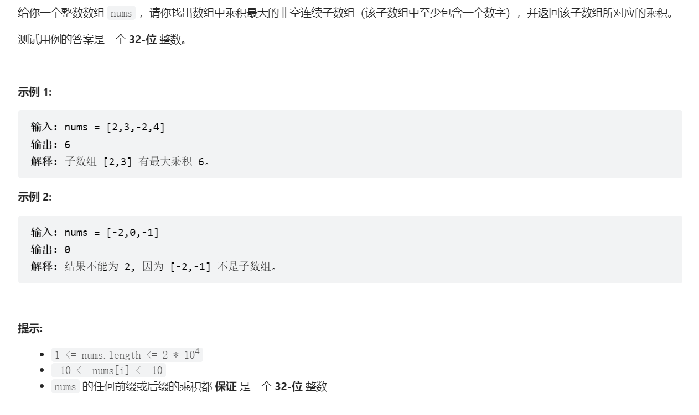

# 最大子数组/子序列
## 最长上升子序列长度
> [!task]
> 
> 这里定义状态`dp[i]`为以`nums[i]`结尾的最长上升子序列的长度
```java
public int lengthOfLIS(int[] nums) {
	int n = nums.length;
	int[] dp = new int[n];

	for (int i = 0; i < n; i++) {
		dp[i] = 1;
	}

	for (int i = 0; i < n; i++) {
		for (int j = 0; j < i; j++) {
			if (nums[j] < nums[i]) {
				dp[i] = Math.max(dp[j] + 1 , dp[i]);
			}
		}
	}

	int res = Integer.MIN_VALUE;
	for (int i = 0; i < n; i++) {
		res = Math.max(dp[i], res);
	}

	return res;

}
```


## 最长上升子序列
> [!task]


## 俄罗斯套娃信封
> [!task]
> 


## 最长连续递增子序列
> [!task]
> 
```java
public int findLengthOfLCIS(int[] nums) {
	int n = nums.length;
	int[] dp = new int[n];

	for (int i = 0; i < n; i++) {
		dp[i] = 1;
	}

	for (int i = 1 ; i < n; i++) {
		if (nums[i] > nums[i-1]) {
			dp[i] = dp[i-1] + 1;
		} else {
			dp[i] = 1;
		}
	}

	int res = Integer.MIN_VALUE;

	for (int i = 0; i < n; i++) {
		res = Math.max(dp[i], res);
	}

	return res;
}

```


## 最长山脉
> [!task]
> 
```java
public int longestMountain(int[] arr) {
	int n = arr.length;
	int[] dp1 = new int[n];
	int[] dp2 = new int[n];

	// init
	for (int i = 0; i < n; i++) {
		dp1[i] = 1;
		dp2[i] = 1;
	}
	
	// 顺序
	for (int i = 1; i < n; i++) {
		if (arr[i] > arr[i - 1]) {
			dp1[i] = dp1[i - 1] + 1;
		} 
	}


	// 逆序
	for (int i = n - 2; i >= 0; i--) {
		if (arr[i] > arr[i + 1]) {
			dp2[i] = dp2[i + 1] + 1;
		}
	}


	// 求最长
	int res = Integer.MIN_VALUE;
	for (int i = 0; i < n; i++) {
		if (dp1[i] > 1 && dp2[i] > 1) {
			int cur = dp1[i] + dp2[i] - 1;
			res = Math.max(res, cur);
		}
	}

	return res == Integer.MIN_VALUE ? 0 : res;
}
```


## 最大子序和


## 最大子矩阵


## 乘积最大子数组
> [!task]
> 
```python

```


# 打家劫舍


