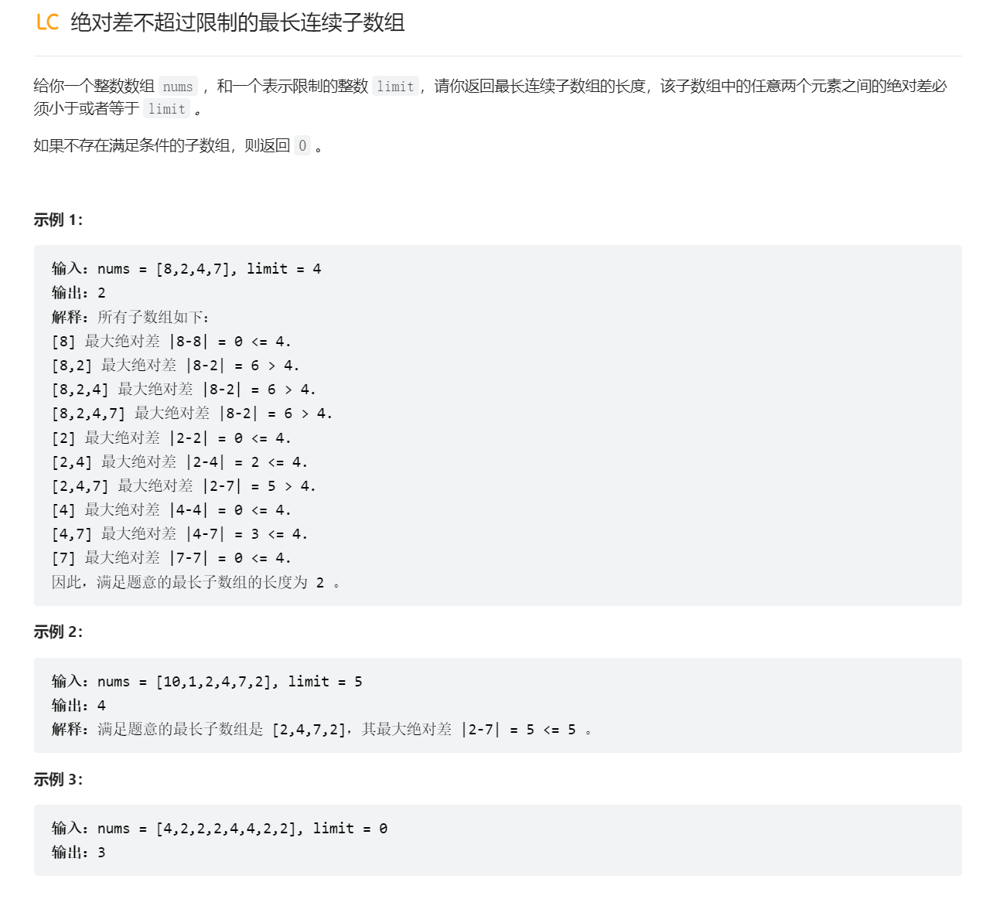

# 滑动窗口最大值
## 优先队列


## 单调队列
> [!important]
> 


# 滑动窗口中位数


# 绝对值差不超过限制的最长连续子数组
> [!task]
> 
> 本题可以采用两个单调队列并且结合滑动窗口计数问题的思路实现。
```java
class Solution {
    public int longestSubarray(int[] nums, int limit) {
    int res = 0;
    int n = nums.length;
    Deque<Integer> minQueue = new ArrayDeque<>();
    Deque<Integer> maxQueue = new ArrayDeque<>();

    int left = 0;
    // 计数问题
    for (int right = 0; right < n; right++) {
	    // 单调队列
        addQueue(minQueue, maxQueue, nums, right);
        while (!validWindow(minQueue, maxQueue, nums, limit)) { 
	        // 单调队列    
            removeQueue(minQueue, maxQueue, nums, left);
            left++;
        }
        
        res = Math.max(res, right - left + 1);
    }

    return res;
}

	public boolean validWindow(Deque<Integer> minQueue, Deque<Integer> maxQueue, int[] nums,  int limit) {
	return Math.abs(nums[maxQueue.peekFirst()] - nums[minQueue.peekFirst()]) <= limit;
	}   
	
	public void addQueue(Deque<Integer> minQueue, Deque<Integer> maxQueue, int[] nums, int newIndex) {
	addMinQueue(minQueue, nums, newIndex);
	addMaxQueue(maxQueue, nums, newIndex);
	}
	
	public void removeQueue(Deque<Integer> minQueue, Deque<Integer> maxQueue, int[] nums, int left) {
	removeMinQueue(minQueue, nums, left);
	removeMaxQueue(maxQueue, nums, left);
	}
	
	public void addMinQueue(Deque<Integer> minQueue, int[] nums, int newIndex) {
	while (!minQueue.isEmpty() && nums[newIndex] <= nums[minQueue.peekLast()]) {
		minQueue.pollLast();
	}
	minQueue.offerLast(newIndex);
	}
	
	public void addMaxQueue(Deque<Integer> maxQueue, int[] nums, int newIndex) {
	while (!maxQueue.isEmpty() && nums[newIndex] >= nums[maxQueue.peekLast()]) {
		maxQueue.pollLast();
	}
	maxQueue.offerLast(newIndex);
	}
	
	public void removeMinQueue(Deque<Integer> minQueue, int[] nums, int left) {
	if (!minQueue.isEmpty() && minQueue.peekFirst() == left) {
		minQueue.pollFirst();
	}
	}
	
	public void removeMaxQueue(Deque<Integer> maxQueue, int[] nums, int left) {
	if (!maxQueue.isEmpty() && maxQueue.peekFirst() == left) {
		maxQueue.pollFirst();
	}
	}
	

}
```
