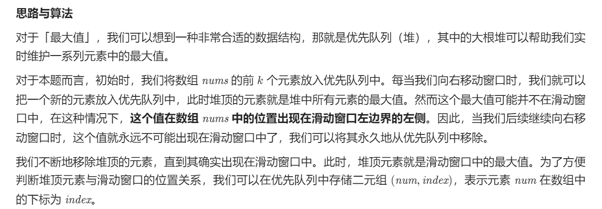
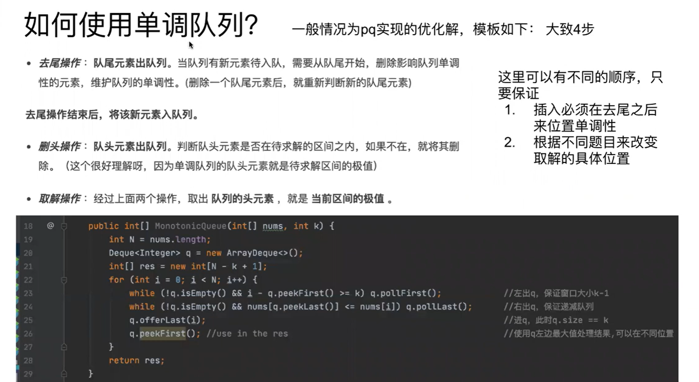
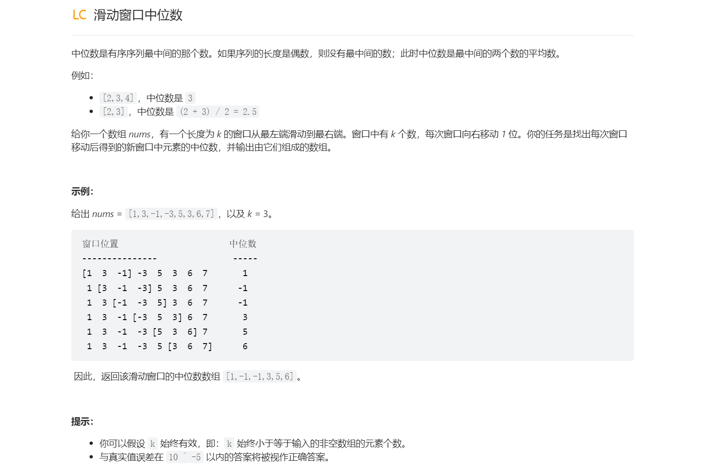

# 滑动窗口最大值(困难)
## 优先队列
> [!important]
> 
```java
class Solution {
    public int[] maxSlidingWindow(int[] nums, int k) {
        int n = nums.length;
        PriorityQueue<int[]> pq = new PriorityQueue<int[]>(new Comparator<int[]>() {
	        // 关键点在于这个二元组 {num, num_index}
            public int compare(int[] pair1, int[] pair2) {
                return pair1[0] != pair2[0] ? pair2[0] - pair1[0] : pair2[1] - pair1[1];
            }
        });
        for (int i = 0; i < k; ++i) {
            pq.offer(new int[]{nums[i], i});
        }
        int[] ans = new int[n - k + 1];
        ans[0] = pq.peek()[0];
        for (int i = k; i < n; ++i) {
            pq.offer(new int[]{nums[i], i});
            // 当前的优先队列中的最大值的下标可能并不满足在窗口内这个条件
            while (pq.peek()[1] <= i - k) {
                pq.poll();
            }
            ans[i - k + 1] = pq.peek()[0];
        }
        return ans;
    }
}
```


## 单调队列
> [!important]
> 
> - 队列中储存的是元素下标
> - 队列中元素下标对应的元素具有单调性
```java
public int[] maxSlidingWindow(int[] nums, int k) {
        Deque<Integer> monoQueue = new ArrayDeque<>();
        int[] res = new int[nums.length - k + 1];

		// 初始化第一个窗口信息
        for (int i = 0; i < k; i++) {
            while (!monoQueue.isEmpty() && nums[monoQueue.peekLast()] <= nums[i]) monoQueue.pollLast();
            monoQueue.offerLast(i);
            
        }
        res[0] = nums[monoQueue.peekFirst()];
        for (int i = k; i < nums.length; i++) {
			// 窗口右侧扩展入栈
            while (!monoQueue.isEmpty() && nums[i] >= nums[monoQueue.peekLast()]) {
                monoQueue.pollLast();
            }
            monoQueue.offerLast(i);
            // 窗口左侧收缩出栈
            while (monoQueue.peekFirst() <= i - k) {
                monoQueue.pollFirst();
            }
            // 滑动窗口最大值结果列表
            res[i - k + 1] = nums[monoQueue.peekFirst()];
        }
        return res;
    }
```


# 滑动窗口中位数(很困难)
> [!task]
> 


## Using Priority Queue
> [!algo]
> 思路可以参考[数据流的中位数](数组#数据流的中位数), 比 Data Stream Median 难的地方就在于如何支持删除数。
> 
> 因为 Data Stream Median 的方法是用 两个 Heap，一个 max heap，一个min heap。所以删除的话，就需要让 heap 也支持删除操作。 由于 Python 的 heapq 并不支持 logn 时间内的删除操作，因此只能自己实现一个 hash + heap 的方法。
> 
> 总体时间复杂度 O(nlogk)，n是元素个数，k 是 window 的大小。
```java


```


# 绝对值差不超过限制的最长连续子数组
> [!task]
> 
> 本题可以采用两个单调队列并且结合滑动窗口计数问题的思路实现。
> 题目中一个重要的同义转换:
> - 滑动窗口中任意两个元素的差的绝对值都小于等于`limit`等价于，滑动窗口中最大值的元素和最小值的元素的差的绝对值小于等于`limit`。
> - 数学语言就是$max|f(x)-f(y)| <= |maxf(x)-minf(y)| <=limit$
```java
class Solution {
    public int longestSubarray(int[] nums, int limit) {
    int res = 0;
    int n = nums.length;
    Deque<Integer> minQueue = new ArrayDeque<>();
    Deque<Integer> maxQueue = new ArrayDeque<>();

    int left = 0;
    // 计数问题
    for (int right = 0; right < n; right++) {
	    // 单调队列
        addQueue(minQueue, maxQueue, nums, right);
        while (!validWindow(minQueue, maxQueue, nums, limit)) { 
	        // 单调队列    
            removeQueue(minQueue, maxQueue, nums, left);
            left++;
        }
        
        res = Math.max(res, right - left + 1);
    }

    return res;
}

	public boolean validWindow(Deque<Integer> minQueue, Deque<Integer> maxQueue, int[] nums,  int limit) {
	return Math.abs(nums[maxQueue.peekFirst()] - nums[minQueue.peekFirst()]) <= limit;
	}   
	
	public void addQueue(Deque<Integer> minQueue, Deque<Integer> maxQueue, int[] nums, int newIndex) {
	addMinQueue(minQueue, nums, newIndex);
	addMaxQueue(maxQueue, nums, newIndex);
	}
	
	public void removeQueue(Deque<Integer> minQueue, Deque<Integer> maxQueue, int[] nums, int left) {
	removeMinQueue(minQueue, nums, left);
	removeMaxQueue(maxQueue, nums, left);
	}
	
	public void addMinQueue(Deque<Integer> minQueue, int[] nums, int newIndex) {
	while (!minQueue.isEmpty() && nums[newIndex] <= nums[minQueue.peekLast()]) {
		minQueue.pollLast();
	}
	minQueue.offerLast(newIndex);
	}
	
	public void addMaxQueue(Deque<Integer> maxQueue, int[] nums, int newIndex) {
	while (!maxQueue.isEmpty() && nums[newIndex] >= nums[maxQueue.peekLast()]) {
		maxQueue.pollLast();
	}
	maxQueue.offerLast(newIndex);
	}
	
	public void removeMinQueue(Deque<Integer> minQueue, int[] nums, int left) {
	if (!minQueue.isEmpty() && minQueue.peekFirst() == left) {
		minQueue.pollFirst();
	}
	}
	
	public void removeMaxQueue(Deque<Integer> maxQueue, int[] nums, int left) {
	if (!maxQueue.isEmpty() && maxQueue.peekFirst() == left) {
		maxQueue.pollFirst();
	}
	}
	

}
```
