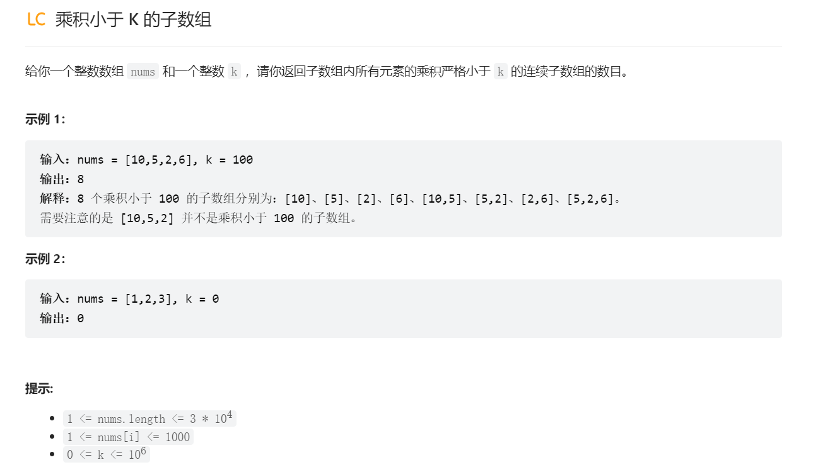

# 一开始不满足
## 包含所有三种字符的子字符串(中等)
> [!task]
> 
```java
public int numberOfSubstrings(String s) {
	int left = 0;
	int count = 0;
	Map<Character, Integer> countDict = new HashMap<>();
	for (int i = 0; i < s.length(); i++) {
		char cur = s.charAt(i);
		countDict.put(cur, countDict.getOrDefault(cur, 0) + 1);
		// 满足了，开始移动left, 直到不满足
		while (isValidWindow(countDict)) {
			char leftCur = s.charAt(left);
			countDict.put(leftCur, countDict.get(leftCur) - 1);
			if (countDict.get(leftCur) <= 0) {
				countDict.remove(leftCur);
			}
			left++;
			
		}
		// 一开始不满足，left一直为零
		count += left;
		
	}
	return count;
}

public boolean isValidWindow(Map<Character, Integer> countDict) {
	if (countDict.getOrDefault('a', 0) >= 1 && countDict.getOrDefault('b', 0) >= 1 && countDict.getOrDefault('c', 0) >= 1) {
		return true;
	}

	return false;
}
```


## 长度为K的无重复子串
> [!task]
> 
```java


```


## 最小覆盖字串(困难)
> [!task]
> 
```java
public String minWindow(String s, String t) {
	int left = 0;
	int res = Integer.MAX_VALUE;
	String minString = "";
	Map<Character, Integer> srcDict = new HashMap<>();
	Map<Character, Integer> targetDict = new HashMap<>();

	for (char c: t.toCharArray()) {
		targetDict.put(c, targetDict.getOrDefault(c, 0) + 1);
	}

	for (int i = 0; i < s.length(); i++) {
		char cur = s.charAt(i);
		srcDict.put(cur, srcDict.getOrDefault(cur, 0) + 1);
		// 满足了，开始移动left, 直到不满足
		while (isValidWindow(srcDict, targetDict)) {
			char leftCur = s.charAt(left);
			srcDict.put(leftCur, srcDict.get(leftCur) - 1);
			if (srcDict.get(leftCur) <= 0) {
				srcDict.remove(leftCur);
			}
			if (i - left + 1 < res) {
				minString = s.substring(left, i + 1);
			}
			res = Math.min(res, i - left + 1);
			left++;  
		}
		// 一开始不满足，向右滑动直到满足
	}
	return minString;
}

public boolean isValidWindow(Map<Character, Integer> srcDict, Map<Character, Integer> targetDict) {

	for (Character c: targetDict.keySet()) {
		// 覆盖即可，所以窗口内每个字母出现的次数大于等于目标次数都是合法的
		if (srcDict.getOrDefault(c, 0) < targetDict.get(c)) {
			return false;
		}
	}
	return true;
}
```


# 一开始满足
## 解题模板
> [!code]
```java 
public int lengthOfLongestSubstringKDistinct(String s, int k) {
    Map<Character, Integer> map = new HashMap<>();
    int left = 0, res = 0;
    
    for (int i = 0; i < s.length(); i++) {
        char cur = s.charAt(i);
        map.put(cur, map.getOrDefault(cur, 0) + 1);  // Step 1: Add the current character to the window
        
        // Step 2: If the window contains more than 'k' distinct characters, shrink it, 中间遇到不满足的了，开始缩减left
        while (map.size() > k) {
            char c = s.charAt(left);
            map.put(c, map.get(c) - 1);
            if (map.get(c) == 0) {
                map.remove(c);
            }
            left++;  // Move the left pointer to shrink the window
        }
        
        // Step 3: Calculate the result for the valid window, 满足
        res = Math.max(res, i - left + 1);
    }
    
    return res;
}

```


## 乘积小于K的子数组
> [!task]
> 
```java
public int numSubarrayProductLessThanK(int[] nums, int k) {
	int product = 1;
	int count = 0;
	int left = 0;

	for (int i = 0; i < nums.length; i++) {
		int cur = nums[i];
		product *= cur;
		while (left <= i && product >= k) {
			int curLeft = nums[left];
			product /= curLeft;
			left++;
		}
		count += (i - left + 1);
	}
	return count;
}
```


## 水果成篮
> [!task]
> 
> 本题的意思就是找到一个**最大长度**的窗口，使得这个窗口内**最多**只有**两类**水果
```java
public int totalFruit(int[] fruits) {
        int count = 0;
        int left = 0;
        Map<Integer, Integer> map = new HashMap<>();

        for (int i = 0; i < fruits.length; i++) {
            int curFruitType = fruits[i];
            map.put(curFruitType, map.getOrDefault(curFruitType, 0) + 1);
            while (map.size() > 2) {
                int currLeft = fruits[left];
                map.put(currLeft, map.get(currLeft) - 1);
                if (map.get(currLeft) == 0) {
                    map.remove(currLeft);
                }
                left++;
            }
            count = Math.max(i - left + 1, count);
        }

        return count;
    }
```


# 固定窗口长度
> [!task]
> 
```java
public int numKLenSubstrNoRepeats(String s, int k) {
	if (s.length() < k) {
		return 0;
	}
	Map<Character, Integer> map = new HashMap<>();
	int count = 0;

	for (int i = 0; i < k; i++) {
		char curLeft = s.charAt(i);
		map.put(curLeft, map.getOrDefault(curLeft, 0) + 1);
	}

	int left = 0;
	int right = k - 1;

	while (right < s.length()) {
		if (isValidWindow(map)) {
			count++;
		}
		char curLeft = s.charAt(left);
		map.put(curLeft, map.get(curLeft) - 1);
		if (map.get(curLeft) < 0) {
			map.remove(curLeft);
		}
		left++;
		right++;
		if (right >= s.length()) {
			break;
		}
		char curRight = s.charAt(right);
		map.put(curRight, map.getOrDefault(curRight, 0) + 1);
	}
	return count;
}


public boolean isValidWindow(Map<Character, Integer> srcDict) {
	
	for (Character c: srcDict.keySet()) {
		// 有重复
		if (srcDict.get(c) > 1) {
			return false;
		}
	}
	return true;
}
```


