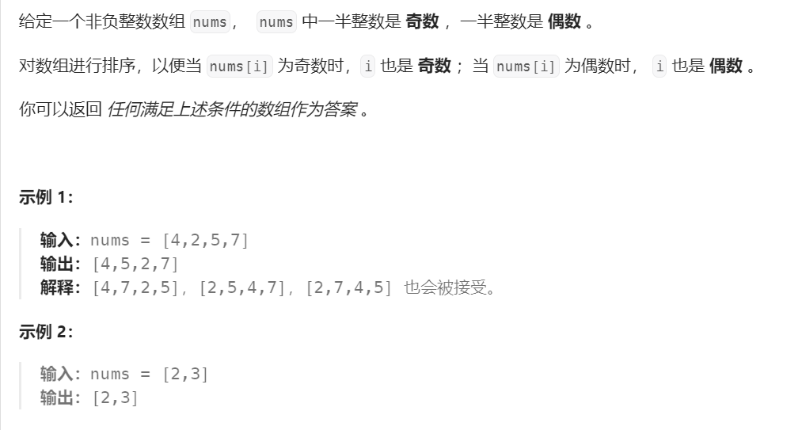
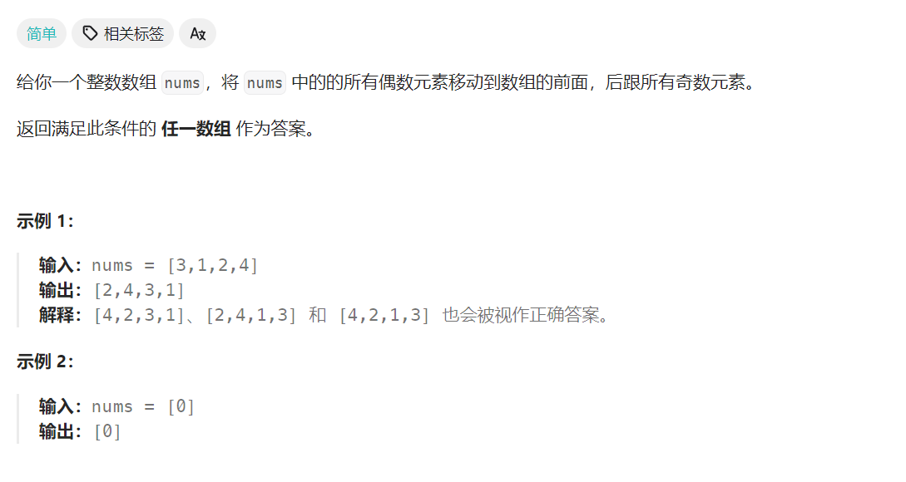
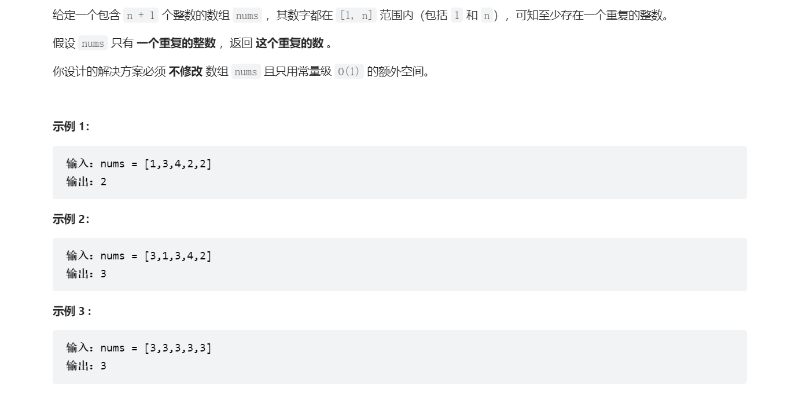
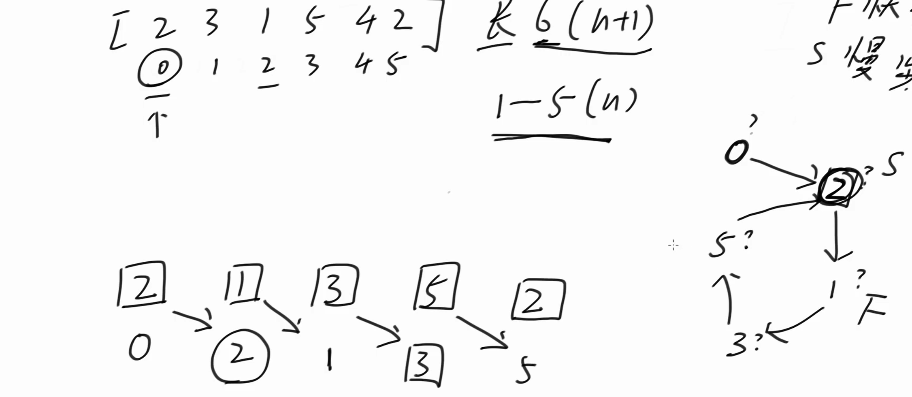
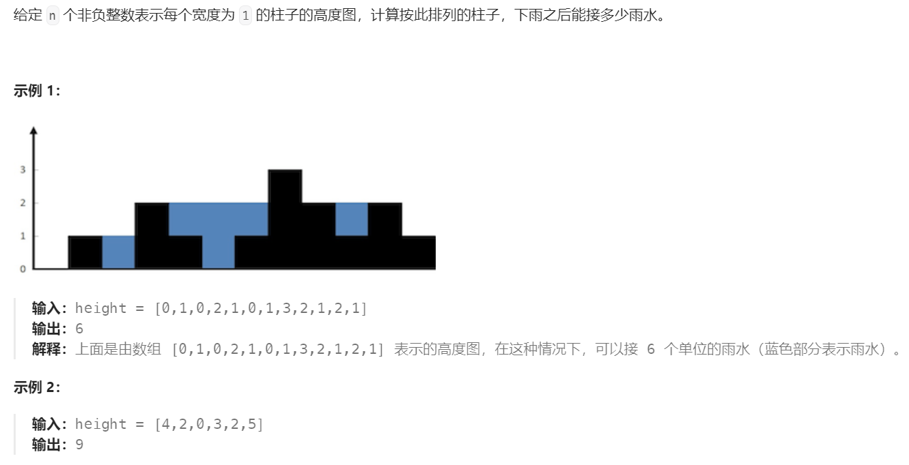

# 奇偶排序数组 - 指针交换
## 变体1(简单)
> [!task]
> 
> **人话就是:**
> - 奇数放在奇数位
> - 偶数放在偶数位
> 
> **思路就是:**
> - 紧盯着一个元素
> 	- 如果元素是奇数就发货到奇数下标，并更新奇数下标
> 	- 如果元素是偶数就发货到偶数下标，并更新到偶数下标
> - 如果奇数下标越界或者偶数下标越界，就表明已经调整完成了
```java
class Solution {
    public int[] sortArrayByParityII(int[] nums) {
        int N = nums.length;

        for (int even = 0, odd = 1; even < N && odd < N;) {
            if ((nums[N - 1] & 1) == 1) {
                swap(nums, odd, N - 1);
                odd += 2;
            } else {
                swap(nums, even, N - 1);
                even += 2;
            }
        }

        return nums;
    }

    public void swap(int[] arr, int src, int dest) {
        int temp = arr[src];
        arr[src] = arr[dest];
        arr[dest] = temp;
    }
}
```


## 变体2(简单)
> [!task]
> 
> 依旧可以使用双指针发货思路, 甚至只需要单指针即可。
> - 直接循环，如果遇到奇数则扔到数组后方；  
> - 只需要一个变量记录第一个奇数位置即可。
```java
class Solution {
    public int[] sortArrayByParity(int[] nums) {
        int N = nums.length;
        int loc = N - 1; // 从最后一位开始
        for (int i = 0; i < loc;) {
            if ((nums[i] & 1) == 1) {
                swap(nums, i, loc);
                loc--;
            } else {
                i++;
            }
        }
        return nums;
    }

    public void swap(int[] arr, int src, int dest) {
        int temp = arr[src];
        arr[src] = arr[dest];
        arr[dest] = temp;
    }
}
```


# 寻找重复数 - 快慢指针
> [!task]
> 
> 本题也可以使用快慢指针, 思路如下:
> 
> 
> 代码实现思路参考[环形链表](../Data_Structures/链表.md#环形链表)
```java
public int findDuplicate(int[] nums) {
	int N = nums.length;
	if (N < 2 || nums == null) {
		return -1;
	}
	// 初始化很关键，我们不能任意地指定slow=0和fast=0, 因为列表中没有0元素。
	int slow = nums[0];
	int fast = nums[nums[0]];

	while (slow != fast) {
		slow = nums[slow];
		fast = nums[nums[fast]];

		if (slow == fast) {
			break;
		}
	}

	if (fast >= N) {
		// No duplicates
		return -1;
	}

	fast = 0;
	while (slow != fast) {
		slow = nums[slow];
		fast = nums[fast];
	}

	return slow;
}
```


# 接雨水(困难)
## 变体1: 二维
> [!task]
> 
> 思路如下:
> - 本质上我们要求的接水量应该等于所有下标位置能接的水量的总和。
> - 所以我们只需要确定下标为$i$能接的水量即可。
> - 对于下标$i$, 它的接水量应该取决于其左侧$[0:i-1]$的最大高度和其右侧$[i+1:n]$的最大高度的最小值减去当前位置的高度（lower bounded by zero）。
> - 用数学语言表示就是$rain[i] = \max\{0, \min\{\max \{height[0:i-1]\}, \max\{height[i+1:n-1]\}\} - height[i]\}$
> 
> 所以我们有两种实现方式:
> - 方法一：先遍历两遍数组，从左到右，从右到左的最大值，然后利用这两个辅助数组求得每一个$rain[i]$
> - 方法二：优化方式一，采用双指针$l$和$r$。
> 	- 对于$l$索引的接水量，
> 		- 如果$lmax=\max\{height[0:l-1]\}<=rmax\max\{height[r+1:n-1]\}$, 则可以确定为$\max\{\min\{lmax, rmax\}-height[l],0\}$，$l++$更新。
> 		- 反之，则不能确定，$l$不能更新。原因是右侧的最大值还没有最终确定，有可能还会变得更大。
> 	- 对于$r$索引的接水量，
> 		- 如果$lmax=\max\{height[0:r-1]\}<=rmax\max\{height[r+1:n-1]\}$, 则可以确定为$\max\{\min\{lmax, rmax\}-height[r],0\}$， $r++$更新。
> 		- 反之，则不能确定，$r$不能更新。原因是左侧的最大值还没有最终确定，有可能还会变得更大。


### 方法一: 双数组
> [!code]
```java
public int trap(int[] height) {
	int N = height.length;
	if (N <= 2) {
		return 0;
	}

	int[] lcummax = new int[N];
	int[] rcummax = new int[N];
	int ans = 0;
	// 左侧辅助数组e.g. [1,2,3,5,8]
	for (int i = 0; i < N; i++) {
		if (i == 0) {
			lcummax[i] = height[i];
		} else {
			lcummax[i] = Math.max(lcummax[i - 1], height[i]);
		}
	}
	// 左侧辅助数e.g. 组[8, 8, 7, 6,5]
	for (int i = N - 1; i >= 0; i--) {
		if (i == N - 1) {
			rcummax[i] = height[i];
		} else {
			rcummax[i] = Math.max(rcummax[i + 1], height[i]);
		}
	}

	// 计算雨水量
	for (int i = 1; i < N - 1; i++) {
		ans += Math.max(Math.min(lcummax[i - 1], rcummax[i + 1]) - height[i], 0);
	}

	return ans;
}
```


### 方法二: 双指针
> [!code]
```java
public int trap(int[] height) {
	int N = height.length;
	if (N <= 2) {
		return 0;
	}

	int l = 1, r = N - 2, lmax = height[0], rmax = height[N - 1], ans = 0;

	// Cannot replace with l != r, 否则l == r时候的与水量就不会被算到答案里，就会少算。
	while (l <= r) {
		if (lmax <= rmax) {
			ans += Math.max(lmax - height[l],  0);
			lmax = Math.max(lmax, height[l]);
			l++;
		} else {
			ans += Math.max(rmax - height[r],  0);
			rmax = Math.max(rmax, height[r]);
			r--;
		}
	}
	return ans;
}
```


## 变体2: 三维
> [!task]
```java


```


