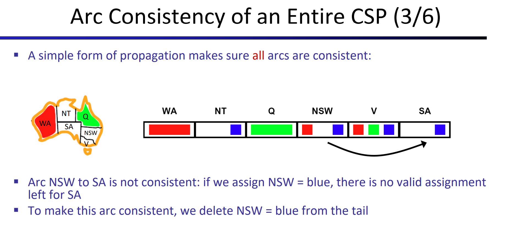
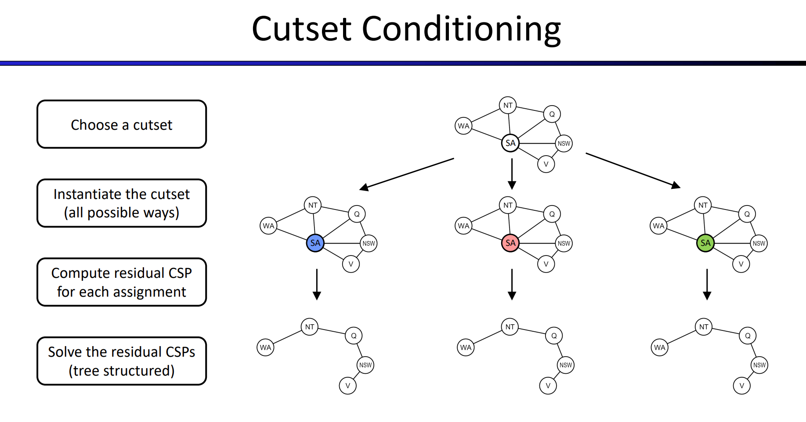

> Chapter 6 Edition 3
# Constraint Satisfaction Problems
## Search and CSPs
> [!def] Motivation
> 

> [!example] Map Coloring
> 

> [!example] N-Queens
> 

## Constraint Graphs
> [!def]
> 

> [!example] Cryptarithmetic
> 

> [!example] Sudoku
> 

## Solving CSP - Backtracking
> [!algo]
> 

# Speed up Backtracking
## Method 1: Filtering - Filter out Values
### Forward Checking
> [!def]
> Propagation ahead to see whether the current assignment is good.
> 

> [!bug] Limitation
> Forward checking only detects failure right in front of you. In other words, forward-checking ensures minimum-level filtering.

### Arc Consistency
> [!def]
> 
> **Note:** Tail is the non-arrow end while head is the arrow end.

#### AC-3 Algorithm
> [!algo]
> 
> The logic is that, once we find an arc that is inconsistent, we delete the value that causes inconsistency from the tail of that arc(call it node $x$) and treat that tail as new head and update all the arcs that treat node $x$ as head to remain arc consistency over the entire CSP.

> [!example] Map Coloring - Arc Consistency
> 

#### Limitations
> [!important]
> 
> The top right corner graph contains multiple solutions after running `AC-3`. Since here each arc is consistent, which satisfies arc consistency, but overall the problem has multiple solutions even if we have enforced arc consistency.
> 
> The bottom right corner graph contains no solution after running `AC-3`. Since here each arc is consistent, which satisfies arc consistency, but overall the problem has no solution even if we have enforced arc consistency.
> 
> In other words, arc consistency only looks at pair of nodes myopically instead of looking at triple nodes or more.
> 
> The above problems are the reason why `AC-3` still need backtracking as a guarantee to find solution. 

### K-Consistency
> [!important]
> 

## Method 2: Ordering
### Minimum Remaining Values(MRV)
> [!def]
> 
> When deciding **which variable** to assign value next, we can choose the next unassigned variable **in order.** The order is determined by our handpicked algorithm. MRV is one of them.
> 
> 
> **Why min rather max?**
> We want to fail fast. Once assignment causes problem, MRV will detect it fast and backtrack and use a different value to assign.
> 
> **Note:** This speed up is related to the choice of next unassigned variable.

 
### Least Constraining Value(LCV)
> [!def]
> 
> **Why MRV and LCV?**
> 
> Because it is a CSP. It is an identification problem where you have to assign value to every variable. So we want every variable to be assigned. In other words, we want to try more values that are part of the potential solution instead of failing fast.
> 
> **Note:** This speed up happens after we have chosen the variable and want to **choose the value** to be assigned to it.

## Method 3: Structure
> [!motiv] Motivation
> 
> Our original problem in the worst case requires traversing through each possible assignment of variables, which gives worst-case runtime of $O(d^n)$ where $d$ is the size of the domain and $n$ is the number of variables in our problem specification.
> 
> But we can split the problem into** independent subproblems**(if viable), then the runtime could be greatly optimized.
> 
> But in real life, independent subproblems are very rare since the whole point of CSP is to solve problems with variables that interact(i.e. not independent).

### Tree-Structured CSP
> [!algo]
> If we’re trying to solve a tree-structured CSP (**one that has no loops in its constraint graph**), we can reduce the runtime for finding a solution from $O(d^N)$ all the way to $O(n\cdot d^2$ ), linear in the number of variables. This can be done with the tree-structured CSP algorithm, outlined below:
> 
> **Notes:**
> 
> 1. **How do we know during the backward pass, for each node in the DAG, there is no other arcs that are pointing to that node?** 
> 
> 	Tree property! For each node in a tree, it can only have one parent.
> 2. **Why is the runtime $O(nd^2)$?**
> 	$n$ means we iterate through node $1$ to node $n$, $d^2$ means we are checking the pair of values in the domain of tail and head of an arc. More importantly, every time you see $d^2$ as a factor in the runtime, very likely we are checking the consistency of an arc.
> 	

> [!proof] Proof Sketch
> 
>

> [!bug] Limitations
> 
> **Why doesn't this algorithm work with cycles in the constraint graph?**
> 
> Suppose we have an edge from C to F ad shown below:
> 
> Suppose after the backward pass step, we have 
> C:[green]
> D: [blue] 
> F:[green, blue] where arc CF and DF are both consistent. 
> 
> Then during the forward assignment, C got green and F have to be blue. but then we move onto D, and assign blue, F have no choice to pick. 
> 
> To sum up, for tree we only need 2-consistency(arc-consistency) but for graph we need higher-order consistency.

### Make it Tree-Structured
#### Cutset Conditioning
> [!algo]
> 
> **Derivations on runtime:**
> 
> The initial assignment to a cutset of size c may leave the resulting tree-structured CSP(s) with no valid solution after pruning, so we may still need to backrack up to $d^c$ times. 
> 
> Since removal of the cutset leaves us with a tree-structured CSP with $(n − c)$ variables, we know this can be solved (or determined that no solution exists) in $O((n − c)\cdot d^2 )$. 
> 
> Hence, the runtime of cutset conditioning on a general CSP is $O(d^c\cdot (n−c)\cdot d^2)$, very good for small c. 

#### Tree Decomposition(Optional)
> [!algo]
> 
> Generally we can solve the subproblems separately. But since subproblems are not guaranteed to be independent, the solution from the subproblems have to satisfy some constraints in order to be considered valid for the original CSP problem.

# Local Search - Alternative to BT
## Local Search Definition

## Hill-Climbing Search

## Simulated Annealing

## Genetic Algorithms

# Demo Website
> [!example]
> https://inst.eecs.berkeley.edu/~cs188/fa21/assets/demos/csp/csp_demos.html