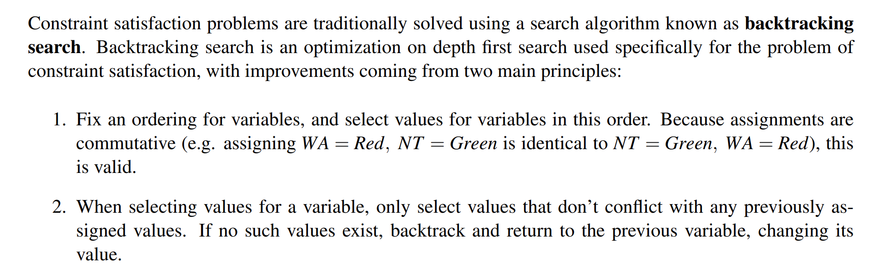
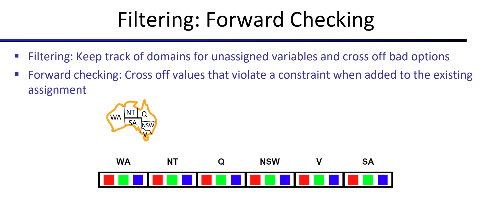
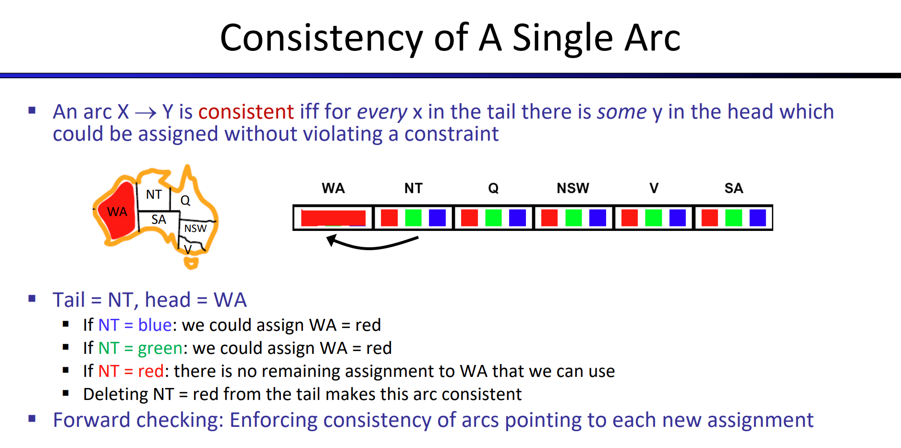
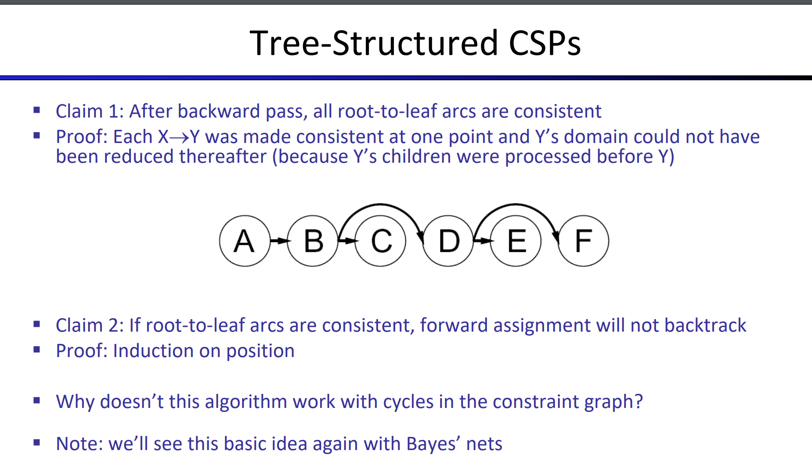
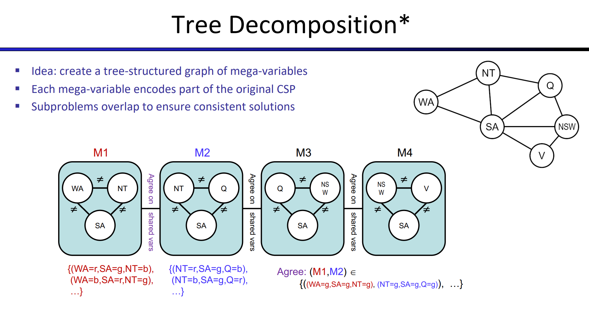
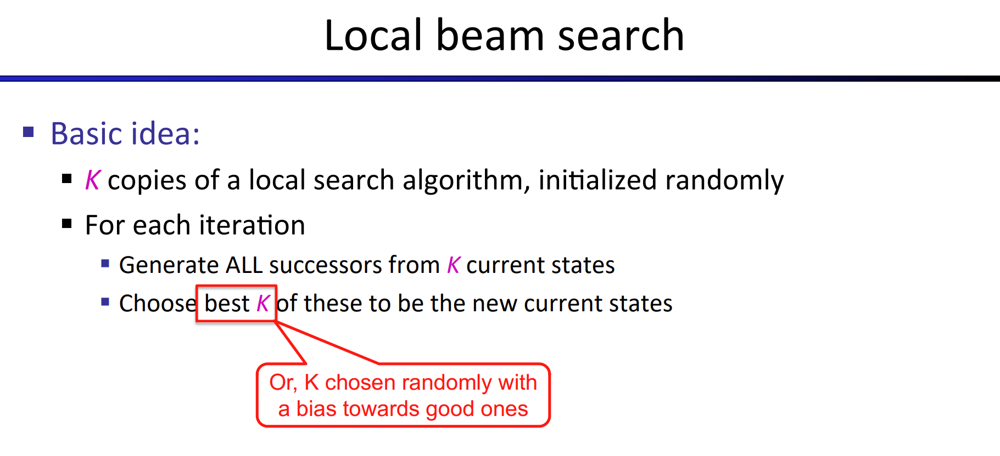
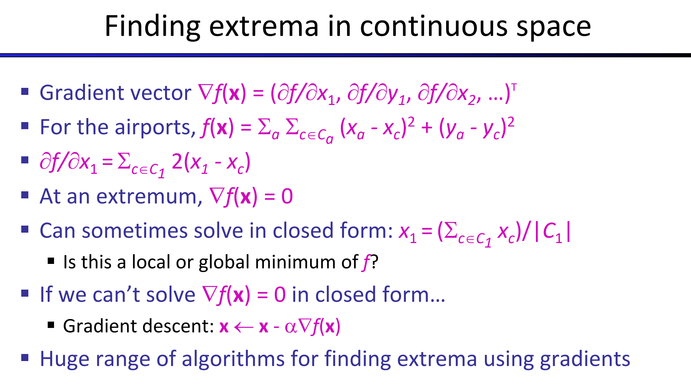

> Chapter 6 Edition 3
# Constraint Satisfaction Problems
## Search and CSPs
> [!def] Motivation
> 

> [!example] Map Coloring
> 

> [!example] N-Queens
> 

## Constraint Graphs
> [!def]
> 

> [!example] Cryptarithmetic
> 

> [!example] Sudoku
> 

## Solving CSP - Backtracking
> [!algo]
> 

# Speed up Backtracking
## Method 1: Filtering - Filter out Values
### Forward Checking
> [!def]
> Propagation ahead to see whether the current assignment is good.
> 

> [!bug] Limitation
> Forward checking only detects failure right in front of you. In other words, forward-checking ensures minimum-level filtering.

### Arc Consistency
> [!def]
> 
> **Note:** Tail is the non-arrow end while head is the arrow end.

#### AC-3 Algorithm
> [!algo]
> 
> The logic is that, once we find an arc that is inconsistent, we delete the value that causes inconsistency from the tail of that arc(call it node $x$) and treat that tail as new head and update all the arcs that treat node $x$ as head to remain arc consistency over the entire CSP.

> [!example] Map Coloring - Arc Consistency
> 

#### Limitations
> [!important]
> 
> The top right corner graph contains multiple solutions after running `AC-3`. Since here each arc is consistent, which satisfies arc consistency, but overall the problem has multiple solutions even if we have enforced arc consistency.
> 
> The bottom right corner graph contains no solution after running `AC-3`. Since here each arc is consistent, which satisfies arc consistency, but overall the problem has no solution even if we have enforced arc consistency.
> 
> In other words, arc consistency only looks at pair of nodes myopically instead of looking at triple nodes or more.
> 
> The above problems are the reason why `AC-3` still need backtracking as a guarantee to find solution. 

### K-Consistency
> [!important]
> 

## Method 2: Ordering
### Minimum Remaining Values(MRV)
> [!def]
> 
> When deciding **which variable** to assign value next, we can choose the next unassigned variable **in order.** The order is determined by our handpicked algorithm. MRV is one of them.
> 
> 
> **Why min rather max?**
> We want to fail fast. Once assignment causes problem, MRV will detect it fast and backtrack and use a different value to assign.
> 
> **Note:** This speed up is related to the choice of next unassigned variable.

 
### Least Constraining Value(LCV)
> [!def]
> 
> **Why MRV and LCV?**
> 
> Because it is a CSP. It is an identification problem where you have to assign value to every variable. So we want every variable to be assigned. In other words, we want to try more values that are part of the potential solution instead of failing fast.
> 
> **Note:** This speed up happens after we have chosen the variable and want to **choose the value** to be assigned to it.

## Method 3: Structure
> [!motiv] Motivation
> 
> Our original problem in the worst case requires traversing through each possible assignment of variables, which gives worst-case runtime of $O(d^n)$ where $d$ is the size of the domain and $n$ is the number of variables in our problem specification.
> 
> But we can split the problem into** independent subproblems**(if viable), then the runtime could be greatly optimized.
> 
> But in real life, independent subproblems are very rare since the whole point of CSP is to solve problems with variables that interact(i.e. not independent).

### Tree-Structured CSP
> [!algo]
> If we’re trying to solve a tree-structured CSP (**one that has no loops in its constraint graph**), we can reduce the runtime for finding a solution from $O(d^N)$ all the way to $O(n\cdot d^2$ ), linear in the number of variables. This can be done with the tree-structured CSP algorithm, outlined below:
> 
> **Notes:**
> 
> 1. **How do we know during the backward pass, for each node in the DAG, there is no other arcs that are pointing to that node?** 
> 
> 	Tree property! For each node in a tree, it can only have one parent.
> 2. **Why is the runtime $O(nd^2)$?**
> 	$n$ means we iterate through node $1$ to node $n$, $d^2$ means we are checking the pair of values in the domain of tail and head of an arc. More importantly, every time you see $d^2$ as a factor in the runtime, very likely we are checking the consistency of an arc.
> 	

> [!proof] Proof Sketch
> 
>

> [!bug] Limitations
> 
> **Why doesn't this algorithm work with cycles in the constraint graph?**
> 
> Suppose we have an edge from C to F ad shown below:
> 
> Suppose after the backward pass step, we have 
> C:[green]
> D: [blue] 
> F:[green, blue] where arc CF and DF are both consistent. 
> 
> Then during the forward assignment, C got green and F have to be blue. but then we move onto D, and assign blue, F have no choice to pick. 
> 
> To sum up, for tree we only need 2-consistency(arc-consistency) but for graph we need higher-order consistency.

### Make it Tree-Structured
#### Cutset Conditioning
> [!algo]
> 
> **Derivations on runtime:**
> 
> The initial assignment to a cutset of size c may leave the resulting tree-structured CSP(s) with no valid solution after pruning, so we may still need to backrack up to $d^c$ times. 
> 
> Since removal of the cutset leaves us with a tree-structured CSP with $(n − c)$ variables, we know this can be solved (or determined that no solution exists) in $O((n − c)\cdot d^2 )$. 
> 
> Hence, the runtime of cutset conditioning on a general CSP is $O(d^c\cdot (n−c)\cdot d^2)$, very good for small c. 

#### Tree Decomposition(Optional)
> [!algo]
> 
> Generally we can solve the subproblems separately. But since subproblems are not guaranteed to be independent, the solution from the subproblems have to satisfy some constraints in order to be considered valid for the original CSP problem.

# Local Search - Alternative to BT
> [!overview]
> Local Search works when the CSP is complete, and not necessarily optimal.
> 

## Idea - Iterative Improvement
> [!def]
> Local search works by iterative improvement - start with some random assignment to values then iteratively select a random conflicted variable and reassign its value to the one that violates the fewest constraints until no more constraint violations exist (a policy known as the min-conflicts heuristic).
> 
> 
> In this 4-queen example, I start with a state where all 5 constraints are violated, then the iterative improvement will start with this state, pick one of these violating constraints, adjust it to make it satisfy. In fact, local search appears to run in almost constant time and have a high probability of success not only for N-queens with arbitrarily large N, but also for any randomly generated CSP.
> 
> From the graph we can see most of the CSP problems are easy(two-tailed):
> 
> - When the number of constraints is high and the number of variables is low(right tail), this technique can greatly boost CSP's performance. Since the number of variables of low, the solution space cannot be big.
> 
> - When the number of constraints is low and the number of variables is high(left tail), this technique can also greatly boost CSP's performance. Like the sodoku problem where we have few rules, we can do whatever we want to not violate the constraints.
> 
> - But in reality, the CSP that we solve tend to have lots of variables and lots of constraints(middle spike), which may require us to find alternatives to backtracking algorithm for performance improvement.
> 
> However, despite these advantages, local search is both** incomplete** and **suboptimal** and so won’t necessarily converge to an optimal solution.

## Hill-Climbing Search
> [!overview]
> 
> The hill-climbing search algorithm (or **steepest-ascent**) moves from the current state towards a neighboring state that increases the objective value. 
> 
> The algorithm does not maintain a search tree but only the states and the corresponding values of the objective. The “greediness" of hill-climbing makes it vulnerable to being trapped in local maxima as locally those points appear as global maxima to the algorithm, and plateaux.

> [!algo]
> 
> Variants of hill-climbing:
> - **Stochastic hill-climbing** which selects an action randomly among the uphill moves, have been proposed and has been shown in practice to converge to higher maxima at the cost of more iterations.
> - **RandomRestart hill-climbing** which conducts a number of hill-climbing searches each time from a randomly chosen initial state, is trivially complete as at some point the randomly chosen initial state will coincide with the global maximum.

> [!example] 8-queen problem
> 

## Simulated Annealing
> [!algo]
> 
> Simulated annealing aims to **combine random walk (randomly moves to nearby states) and hill-climbing** to obtain a complete and efficient search algorithm. In simulated annealing we allow moves to states that can decrease the objective. 
> 
> More specifically, the algorithm **at each state chooses a random move**. 
> - If the move leads to higher objective it is always accepted. 
> - If on the other hand it leads to smaller objectives then the move is accepted with some probability. This probability is determined by the **temperature parameter**, which initially is high (more “bad" moves allowed) and gets decreased according to some schedule. When the temperature is high, you are doing random selection, when temperature is low you are doing hill climbing.
> - If temperature is decreased slowly enough then the simulated annealing algorithm will reach the global maximum with probability approaching 1.
> 
> 

## Local Beam Search
> [!def]
> Keeping just one node in memory might seem to be an extreme reaction to the problem of memory limitations. The local beam search algorithm keeps track of **k** states rather than 1. 
> 
>  It begins with k randomly generated states. At each step, all the successors of all k states are generated. If any one is a goal, the algorithm halts. Otherwise, it selects the k best successors from the complete list and repeats.
>  
>  At first sight, a local beam search with k states might seem to be nothing more than running k random restarts in parallel instead of in sequence. In fact, the two algorithms are quite different. 
>  - In a random-restart search, each search process runs **independently** of the others. 
>  - In a local beam search, useful information is passed among the parallel search threads. In effect, the states that generate the best successors say to the others, the algorithm quickly abandons unfruitful searches and moves its resources to where the most progress is being made.
>  
>  
>  In its simplest form, local beam search can **suffer from a lack of diversity** among the k states—they can quickly become concentrated in a small region of the state space, making the search little more than an expensive version of hill climbing. 
>  
>  A variant called **stochastic beam search**, analogous to stochastic hill climbing, helps alleviate this problem. Instead of choosing the best k from the the pool of candidate successors, stochastic beam search chooses k successors at random, with the probability of choosing a given successor being an increasing function of its value. Stochastic beam search bears some resemblance to the process of natural selection, whereby the “successors” (offspring) of a “state” (organism) populate the next generation according to its “value” (fitness).

> [!example]
> 

## Genetic Algorithms
> [!overview]
> 
> **Initital Step:** The algorithm begins with k randomly generated states. Eac state is called individual and they together form a population.
> 
> **Ranking Initial States:** The initial states should be ranked according to **fitness function**(for 8-queen problem it is the number of nonattacking pairs of queens).
> 
> **Choosing Next Generation:** We normalize the fitness score to obtain a probability for each individual, which is the probability of being choosed. For example, the probability of the first individual 24748552's probability of being chosen is $\frac{24}{24+23+20+11}\approx 31\%$。
> 
> **Pair the individuals:** After choosing the individual according to the probability, we may have some individual being discarded and some individuals being chosen multiple times. Then we pair up individuals at random.
> 
> **Merge the pair:** After pairing up, we **randomly choose a crossover point for each pair** and merge them according to the crossover point. The choice of crossover point could be made non-random and generally we want to choose in a way such that the result get the better half.
> 
> **Mutation:** Finally, each offspring is susceptible to some random mutation with independent probability.
> 

> [!algo]
> 
> Genetic algorithms try to move uphill while exploring the state space and exchanging information between threads. Their main advantage is the use of crossovers since this allows for large blocks of letters, that have evolved and lead to high valuations, to be combined with other such blocks and produce a solution with high total score.

## Local Search in Continuous Space
> [!def]
> 

# Demo Website
> [!example]
> https://inst.eecs.berkeley.edu/~cs188/fa21/assets/demos/csp/csp_demos.html

