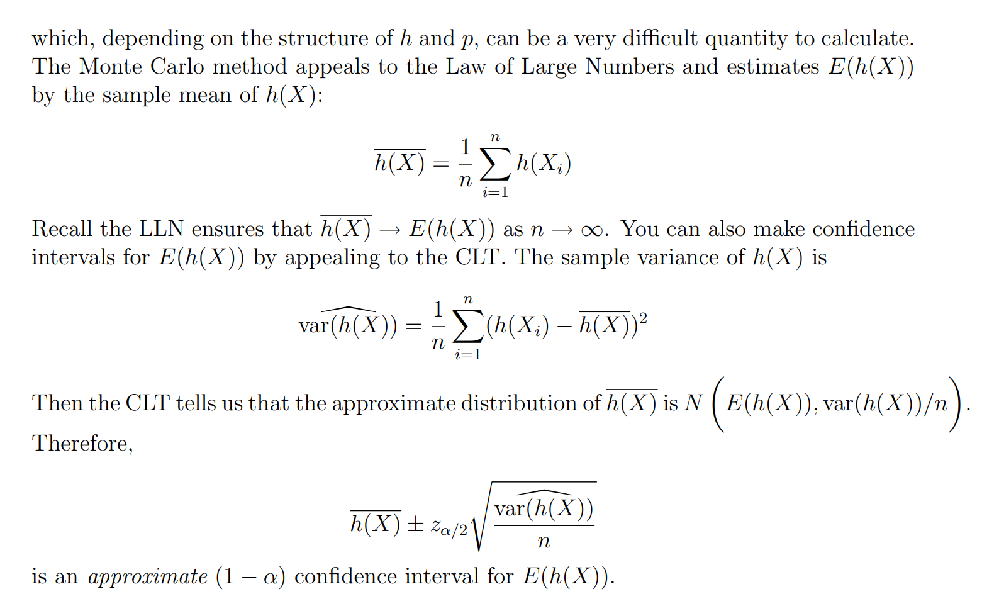

# Monte Carlo Integral Method
## Theorem
> [!thm]
> 


## Calculating Bounded Integrals
> [!def]
> 

> [!code]
```r
# underlying uniforms
U <- runif(100000, 0, 2*pi)

# calculate h(U)
hU <- sin(U*cos(U))

# monte carlo approximation
2*pi*mean(hU)
[1] -1.048418

# R’s numerical integration approximation
h <- function(u) sin(u*cos(u))
integrate(h, 0, 2*pi)$val
[1] -1.041727
```


## Logistic Regression Example
> [!example]
> 


## Calculating Unbounded Integrals
> [!def]
> 

> [!code]
```r
X <- rnorm(100000)
Y <- sin(X*cos(X))/dnorm(X)
mean(Y)
[1] -0.3657281

```


# Importance Sampling
## Motivations
> [!motiv] Motivation
> One of the principal reasons for wishing to sample from complicated probability distributions is to be able to evaluate expectations of the tasrget distribution.
> 
> The technique of importance sampling provides a framework for approximating **expectations/integrals** directly but **does not** itself provide a mechanism for drawing samples from distribution p(z).
> 
> The art of this method lies in the choice of a good proposed distribution $g(\cdot)$
> 
> 


## Examples
### Laplacian Distribution Expectation
> [!example] Solution 1: Use Monte Carlo Integration Approximation
> 

> [!example] Solution 2: Important Sampling, Gaussian as Proposed Distribution
> 


### Double Exponential Density
> [!def]
> 


## Algorithm Procedure
> [!algo]
> 

> [!proof] Proof Idea
> 


## Code Example
> [!def]
> Suppose we want to compute $\int f(x)dx$ where f(x) looks like:
> 


> [!code] Good Choice of q
> 
```python
def distribution(mu=0, sigma=1):  
    # return probability given a value  
    distribution = stats.norm(mu, sigma)  
    return distribution  
      
# pre-setting  
n = 1000
mu_target = 3.5  
sigma_target = 1  
mu_appro = 3  
sigma_appro = 1
p_x = distribution(mu_target, sigma_target)  
q_x = distribution(mu_appro, sigma_appro)

# True sample mean
s = 0  
for i in range(n):  
# draw a sample  
x_i = np.random.normal(mu_target, sigma_target)  
s += f_x(x_i)  
print("simulate value", s/n)  # 0.954


# Proposed sample mean
value_list = []  
for i in range(n):  
# sample from different distribution q(x)
x_i = np.random.normal(mu_appro, sigma_appro)  
value = f_x(x_i)*(p_x.pdf(x_i) / q_x.pdf(x_i))  
  
value_list.append(value) # 0.949, var = 0.304, Good!
```


> [!code] Bad Choice of q
> 
```python
# pre-setting  
n = 5000
mu_target = 3.5  
sigma_target = 1  
mu_appro = 1  
sigma_appro = 1
p_x = distribution(mu_target, sigma_target)  
q_x = distribution(mu_appro, sigma_appro)


# True sample mean
s = 0  
for i in range(n):  
# draw a sample  
x_i = np.random.normal(mu_target, sigma_target)  
s += f_x(x_i)  
print("simulate value", s/n)  # 0.954


# Proposed sample mean
value_list = []  
for i in range(n):  
# sample from different distribution q(x)
x_i = np.random.normal(mu_appro, sigma_appro)  
value = f_x(x_i)*(p_x.pdf(x_i) / q_x.pdf(x_i))  
  
value_list.append(value) # 0.995, var = 83.36, Bad!
```
> [!important]
> 


## Advantages
> [!important]
> **Importance sampling is likely to be useful when:**
> 1. $p(x)$ is difficult or impossible to sample from.
> 2. We need to be able to evaluate $p(x)$. Meaning we can plug in an $x$ and get a value. 
> 3. $q(x)$ needs to be easy to evaluate and sample from since our estimate will ideally be made of many samples from it.
> 4. A key requirement for the sampling distribution q(z), namely that it should not be small or zero in regions where p(z) may be significant. Since our weight is given by $w_i(x)=\frac{p_i(x)}{q_i(x)}\forall x\in \mathcal{X}$, if $q(x)$ is small where $p(x)$ is big, then the algorithm will put more importance on those samples that has smaller $q(x)$, and these samples are considered outliers in the distribution of $q(x)$, which will cause huge variance in our estimate.
> 5. Lastly, and the hard part, is that you need to be able to choose $q(x)$ to be high where the absolute value of $p(x)\times f(x)$ is high which is not necessarily an easy task.
> 


## Drawback
> [!bug] Caveats
> When applying this method in graphical model:
> 


# Monte Carlo Markov Chain(MCMC)
See [5 Markov Chain Monte Carlo](../../../../Mathematics/Probablity_Statistics/Probability_Basics/7_简单随机过程/离散马尔科夫链.md#5%20Markov%20Chain%20Monte%20Carlo)


# Hybrid Monte Carlo Algorithm

