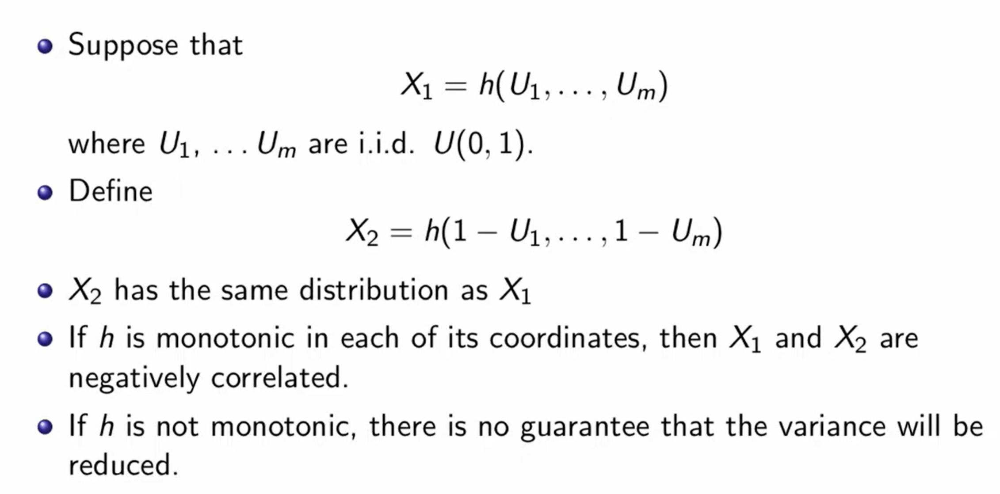
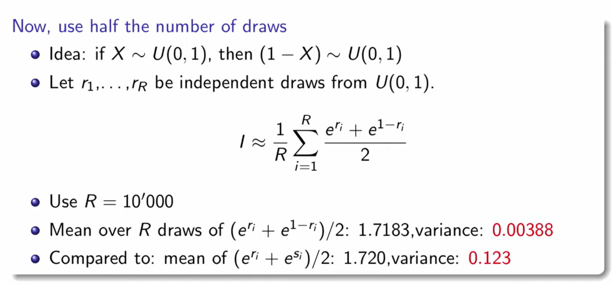
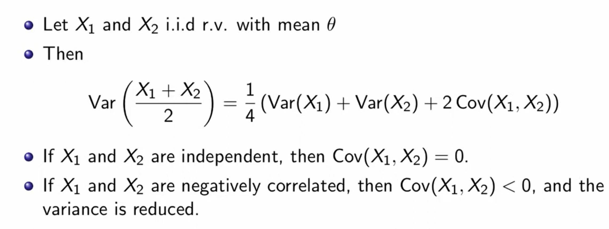
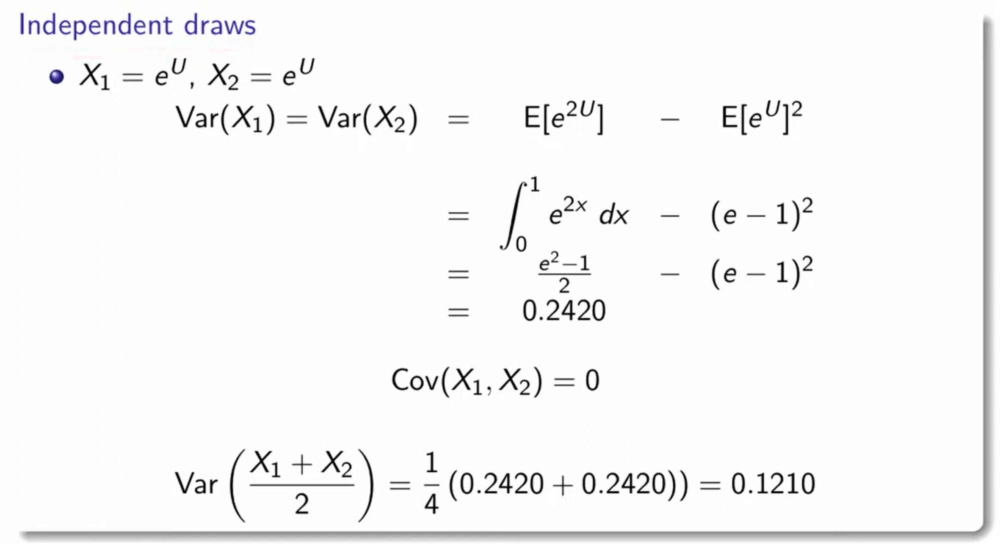
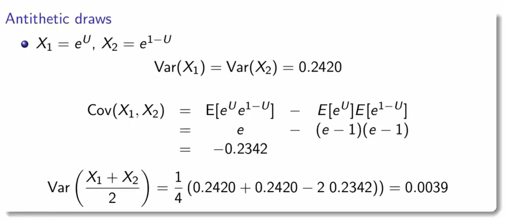
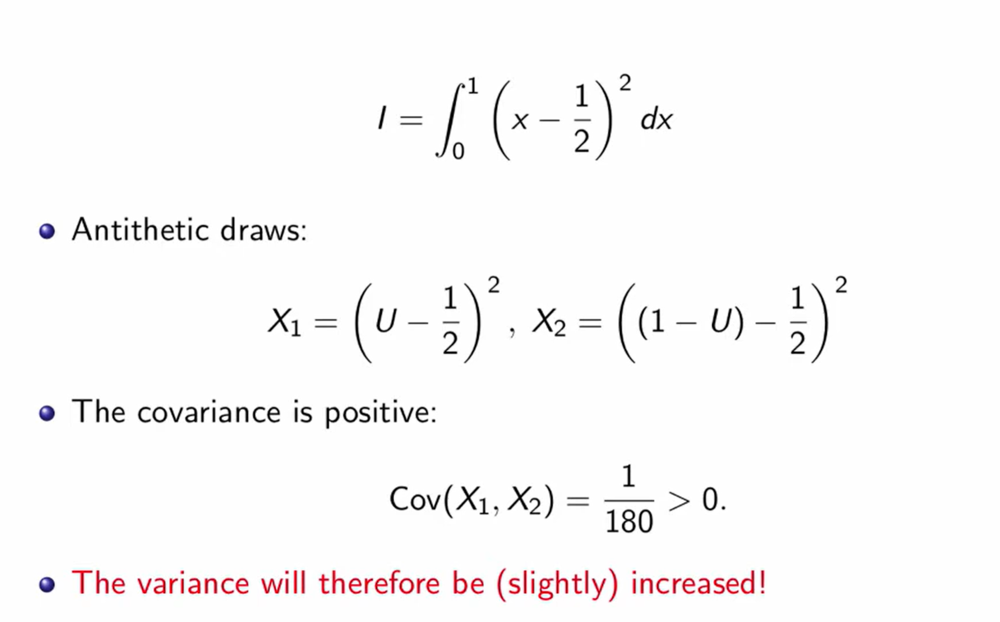
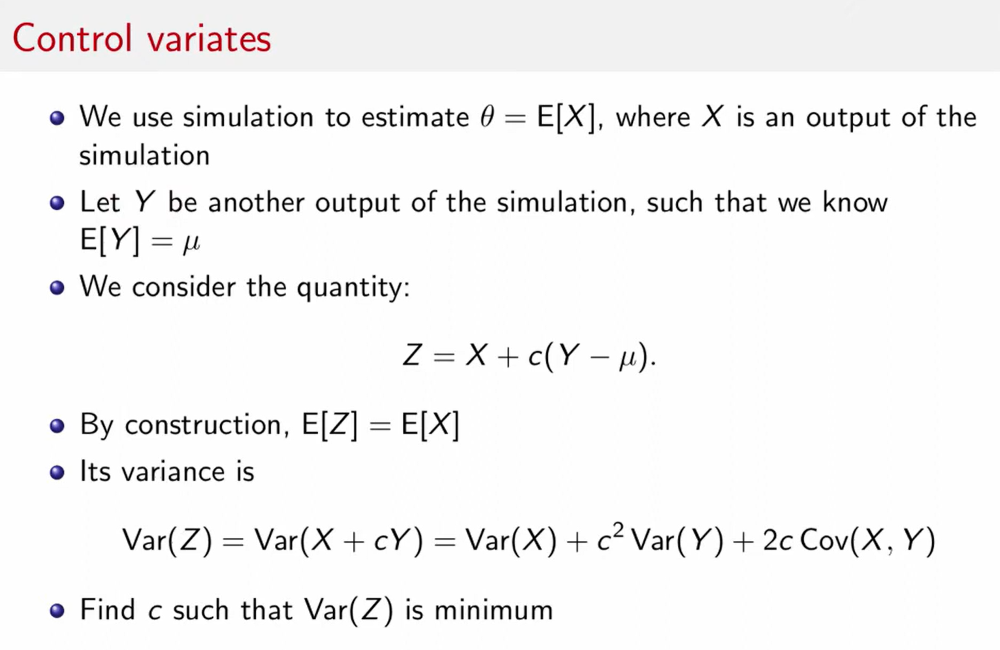
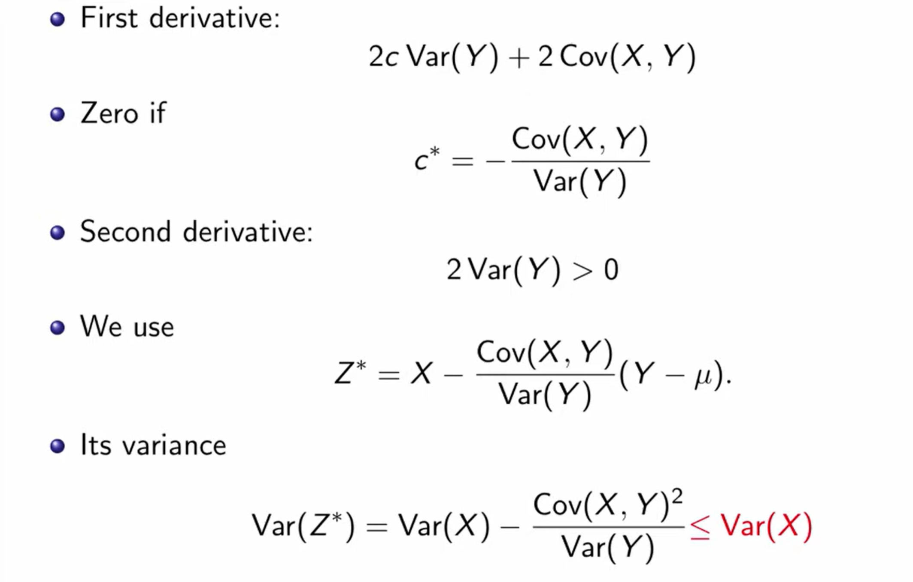
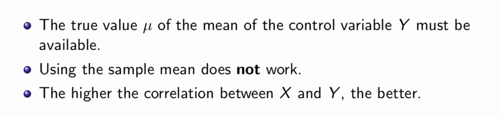

# Anthitetic Draws
## Procedures
> [!important]
> 

## Examples
> [!example]
> 

> [!example]
> 

## Caveats
> [!bug] Caveats: Non-monotonic Function
> 

# Control Variates
## Definition
> [!def]
> 

> [!important] Min-Variance Point
> 

## Examples
> [!example]
> 

## Ceveats
> [!bug]
> 

