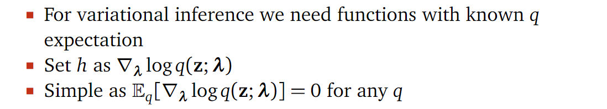

# Motivations
> [!motiv]
> The log marginal likelihood is a central object for Bayesian inference with latent variable models:$$
> \ln p_{\theta}(x)=\ln \int p_{\theta}(x, z) d z$$
> where $x$ are observations, $z$ are latent variables, and $\theta$ are parameters. 
> 
> Remember in latent variable model we have:
> 
> where it is impossible to compute $\ln \int p_{\theta}(x | z)p(z) d z$ since there are infinitely many possible $z$ so that this integral has no closed form solution.
> 
> So in practice, we train the latent variable model using expected log-likelihood:

# ELBO
> https://lips.cs.princeton.edu/the-elbo-without-jensen-or-kl/

## Definition
> [!def]
> 
> Simplified: 
> 
> 
> 
> 

## Derivations
### Derivation 1: Jensen's Inequality
> [!important]
> 

### Derivation 2: KL Divergence
> [!important]
> 

### Derivation 3: Course Notes
> [!important]
> 

## Optimization
### Naive Approach
> [!important]
> First, start with a model:
> $$p(z, x)$$
> Next, choose a variational approximation:
> $$q(z;\lambda)$$
> Write down the ELBO:
> $$\mathscr{L}(\boldsymbol{\lambda})=\mathbb{E}_{q(\mathbf{z} ; \boldsymbol{\lambda})}[\log p(\mathbf{x}, \mathbf{z})-\log q(\mathbf{z} ; \boldsymbol{\lambda})]$$
> Compute the expectation(for example):
> $$\text { Example: } \mathscr{L}(\boldsymbol{\lambda})=x \lambda^2+\log \lambda$$
> Take derivatives:
> $$\text { Example: } \nabla_\lambda \mathscr{L}(\lambda)=2 x\lambda+\frac{1}{\lambda}$$
> Optimize:
> $$\lambda_{t+1}=\lambda_t+\rho_t \nabla_\lambda \mathscr{L}$$
> 

> [!example]
> 

# BBVI
## Motivations
> [!motiv]
> 

## BBVI Definitions
> [!def]
> 

## Score Function Gradients
> [!important]
> 

## Basic BBVI
### Algorithm
> [!algo]
> 
> 

 
### Problems
> [!bug] Caveats
> 

### Control Variates
> [!important]
> 

## Reparameteriztion Grdients

# CAVI

# SVI

# ADVI
