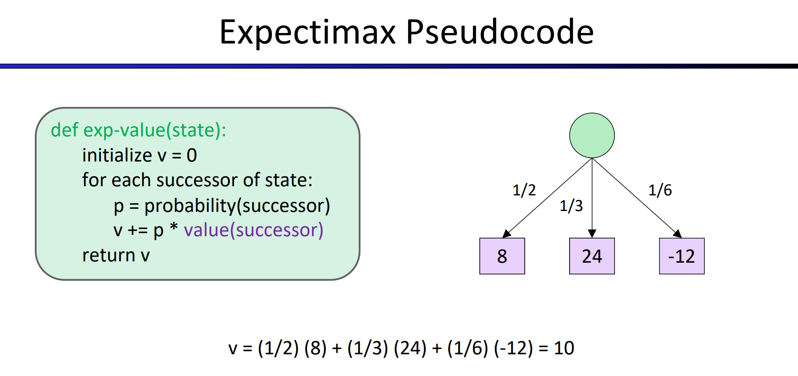
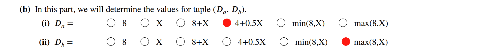
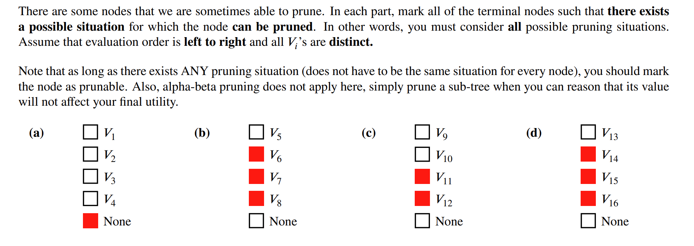
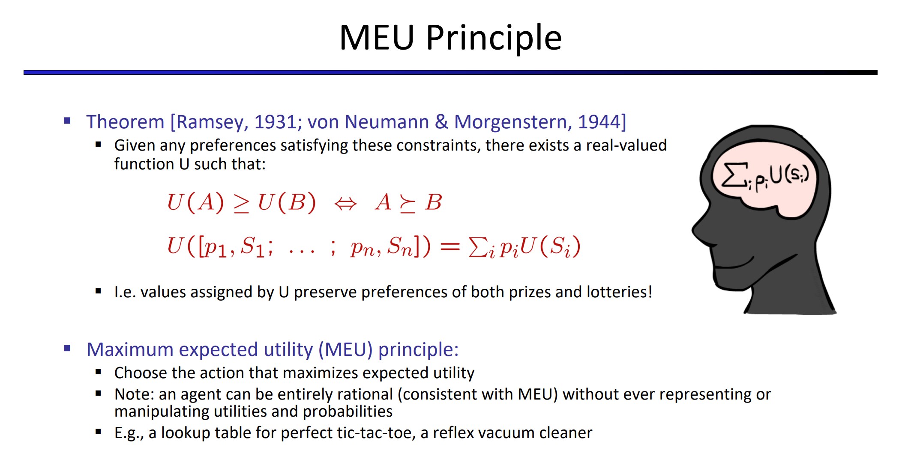

> Chapter 5 Edition 3

# Reflex Agent

# Minimax Algorithm
## Algorithm
> [!algo]
> 
> **Note:** It's just like DFS Postorder traversal. Bottom up.

## Time Complexity
> [!important]
> 

# Expectimax Algorithm
## Algorithm
> [!algo]
> 

> [!example]
> 

## Examples
> [!example] Fa23 Exam Prep 04 P1
> 

# Minimax vs Expectimax
> [!example] Vitamin3 Q3.4
> 

# MedianMiniMax Algorithm
> [!example] Fa23 Exam Prep 4 P2
> 

 

# Suboptimal Strategies
> [!important]
> Sometimes your adverserial player may not act optimally, in the minimax context, suboptimal response will cause the min_node to return not the smallest value it can see, but may return a much bigger one, which would cause the max_node on the path to root to obtain higher than actual value. 
> 
> If your adverserial player may not act optimally and playing randomly. Then if the MAX player follows 

## Suboptimal Min Player

> [!example] Vitamin3 Q 7.1
> 

## Random MIN Player
> [!example] Vitamin3 Q7.2
> 

# Resource Limit Pruning
## Alpha-Beta Pruning
### Algorithm
> [!algo]
> 

> [!example] Minimax Pruning
> 
> In minimax setting, the middle child of the middle node can be pruned.

> [!example] Expectimax Pruning
> 

### Possible Pruning Schema
> [!property]
> Perhaps the simplest check is as follows: pruning of children of a minimizer node m is possible (for some assignment to the terminal nodes), when both of the following conditions are met: 
> - (i) The value of another child of m has already been determined.
> - (ii) Somewhere on the path from m to the root node, there is a maximizer node M for which an alternative option has already been explored. 
> 
> The pruning will then happen if any such alternative option for the maximizer had a higher value than the value of the "another child" of m for which the value was already determined.

> [!example] Vitamin3 Q6.1
> 
>
> Here in (c) The left-most child of the root would have $α=−∞$, so its direct children can never be pruned because they will always be greater than $−∞$−∞. Intuitively the root hasn't seen anything else yet, so any value returned by the minimizer might end up being taken by its parent.

> [!example] Vitamin3 Q6.2
> 
> Simple observation for (d),(e), when we run the algorithm, by its DFS property we will never assign a new value to $\alpha$ along the path until we have finished at least a complete post order traversal, so we can never rule out the node on the left most children.
> 
> For (f), if we focus on the middle node of depth 1, we will see that the value of $\beta$ for this node is $+\infty$ and hasn't been updated, so we cannot just prune the child.

## Depth-Limited Search
> [!overview]
> Though alpha-beta pruning can help increase the depth for which we can feasibly run minimax, this still usually isn’t even close to good enough to get to the bottom of search trees for a large majority of games. As a result, we turn to evaluation functions, functions that take in a state and output an estimate of the true minimax value of that node.
> 
> Depth-limited search is not guaranteed to find the optimal solution to the original problem.
> 
> The depth-limit search is guided by evaluation function, which is a linear combination of the feature of the current state.
> 
> Different choices of evaluation function may generate different search depth for the same problem.

### Evaluation Function
> [!def]
> For depth-limited search, the evaluation function is a linear combination of features that could be manually extracted from each search state.
> 

> [!example] Vitamin3 Q8
> 

## Monte Carlo Tree Search
> [!overview]
> 

### Evaluation Function
> [!def]
> MCTS is a method to use randomization to estimate the evaluation of a search state, generally for the child node(suppose there are $T$ child nodes)of an arbitrary node $m$, we follows:
> 1. Choose a total number of rollout $R=\sum\limits_{n=1}^TN(n)$ where $N(n)$ is the number of rollouts(random experiments that are allocated to the child node $n$).
> 2. Allocate $N(n)$ to each child node across node $1$ to node $T$, more promising child node gets more rollouts
> 3. Starting from these child node, simulate the game results and accumulate the total number of wins in the terminal states, denote it by $U(n)$ for child node $n$.
> 4. **Upper Confidence Bounds:** Calculate the fraction $$\frac{U(n)}{N(n)}+C\times\sqrt{\frac{logN(Parent(n))}{N(n)}}$$ to be the evaluation of the child node $n$, where the first term is how promising this child node will lead $player(Parent(n))$ to win at the end, and the secdon term is how certain we are about this estimation and user can freely adjust $C$. Typically higher value in this expression means that we are more likely to explore this child node as next action.

### MCTS Algorithm
> [!algo]
> 

> [!example]
> 

### Summary
> [!summary]
> 

# Multi-Agent Utility
> [!def]
> 

## Non-Zero Sum Games
> [!example] Vitamin3 Q5.2
> 

> [!example] Fa23 Disc04 P2
> 

# Utilities&Preferences
## Utility Definition
> [!def]
> 

## Utility Scale
> [!def]
> 

## MEU Principles
> [!def]
> 

> [!example] Vitamin3 Q9.1
> 

> [!example] Vitamin3 Q9.2
> 

## (Rational) Preferences
> [!def]
> 

> [!example] Vitamin3 Q9.3
> 

> [!example] Vitamin3 Q11
> 

## Human Utilities
### Definition
> [!def]
> 

### Risk Aversion
> [!def]
> 

> [!example] Vitamin3 Q10
> 

