# Classifiers&Decision Rules
## Terminologies
> [!overview]
> We have several terminologies:
> 1. **Decision Function** $f(x)$: Aka predictor function, discriminant function, which is a function $f(x)$ that maps a point x to a scalar such that
> 	- $f(x) > 0$ if $x ∈ class ~ C$; 
> 	- $f(x) ≤ 0$ if $x < class ~C$.
> 2. **Decision boundary** $\mathcal{X}$: the boundary chosen by our classifier to separate items in the class from those not. Often this is a set that contains a bunch of points that could be classified as either one group or another. 
> 	- Formally it is defined as $\mathcal{X}=\{x\in\mathbb{R}^d:f(x)=0\}$
> 	- That is, all the points that makes decision function evaluate to 0.
> 	- For linear classifiers, this set is a hyperplane of dimension $d-1$, derivations see [Orthogonal Decomposition Theorem](../../EECS127AB/2_Matrix_Calculus/Vector_OPT_Basics.md#正交分解定理)
> 	- $\{x : f(x) = 0\}$ is also called an **isosurface** of f for the isovalue 0. $f$ can have other isosurfaces for other isovalues, e.g., $\{x : f(x) = 1\}$.
>  3. **Loss function** $L(h(x), y)$ specifies badness if classifier predicts the class of x to be h(x), and the true class is y. Note that this function only computes the loss at a single test point x. The independent variables here is $h$ and $y$.
> 	 - Symmetric Loss: A symmetrical loss is the same for false positives and false negatives. **In this case, minimizing risk function is the same as maximizing the posterior probability.** 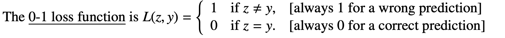 
> 	 - Asymmetric: When we make a wrong prediction, if we have preferences of false positive over false negative or vice versa, we can use asymmetric loss function.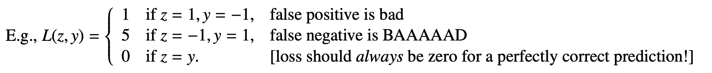
> 4.  **Decision Rule / Classifier $h:\mathbb{R}^d\to\pm1$**: A function that maps feature to $\pm1$
> 5. **Risk function/Cost function/Objective Function** $R(h)$: This is a **functional**(a function that maps a function to real value). Used to measure to what extent our classifier is violating the classification. Normally we want to minimize it so we should design it to be positive for these violations.
> 	 - **Risk Function**: $R(h)=\mathbb{E}_{X,Y\sim p}[L(h(X),Y)]$
> 	 - **Empirical Risk Function**: $\widehat{R}_n(h)=\frac{1}{n}\sum_{i=1}^nL(h(x_i),y_i)$
> 	 - By WLLN, $\widehat{R}_{n}(h)\to R(h)$. So in practice we just minimize the empirical risk function.
>  6. Bayes Decision Rule / Classifier: $h^*$ : The decision rule/classifier that minimizers the risk function.

## Three ways to build Classifiers
> [!def]
> 

## Bayes Decision Rules
> [!important]
> 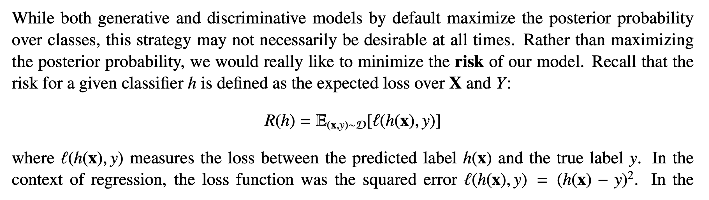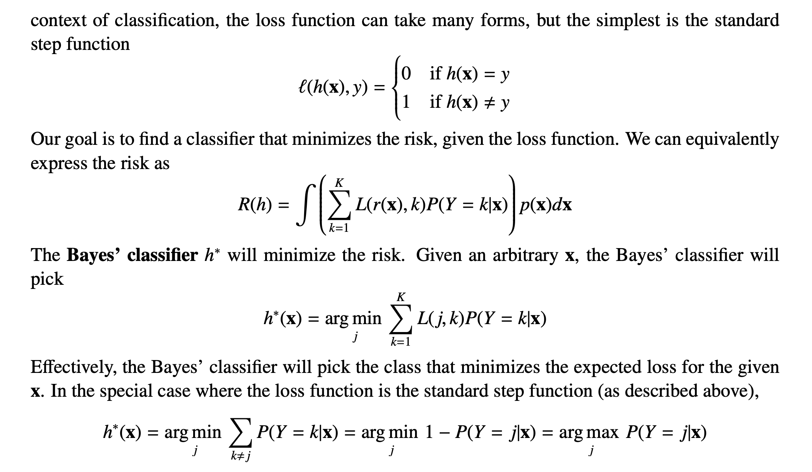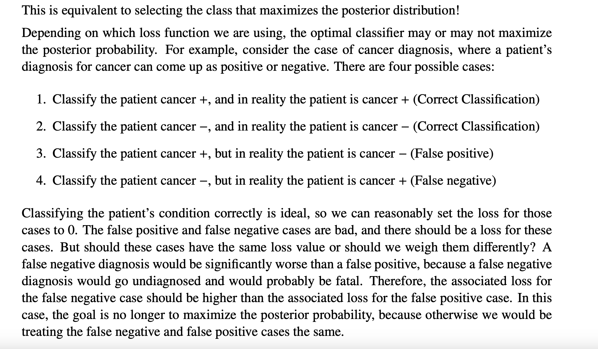

> [!example] Why we prefer risk minimization over posterior maximization
> 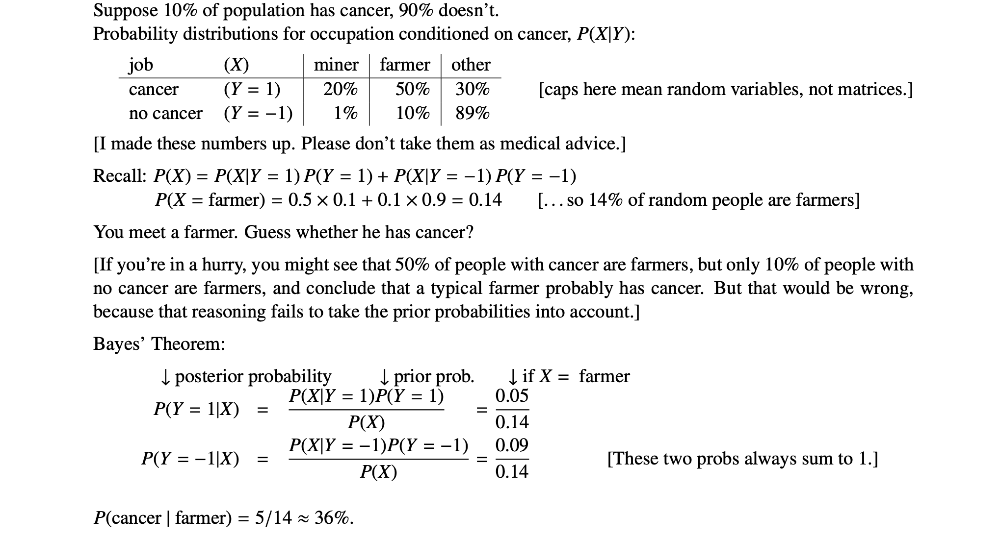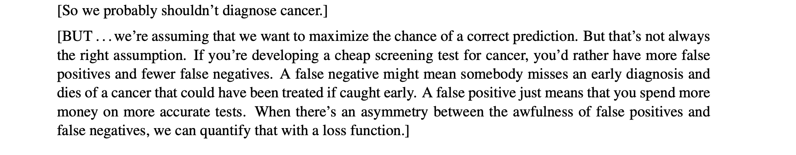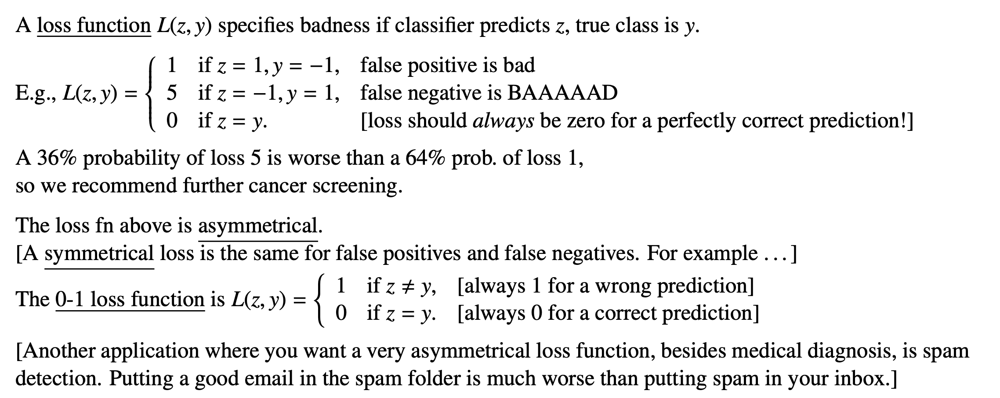
> This example says that if we think false negative is BAAAD, then we'd better predict positive to make the wrong prediction false positive.
> 
> 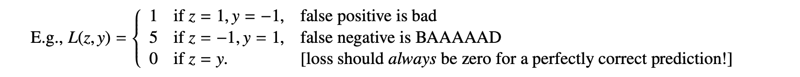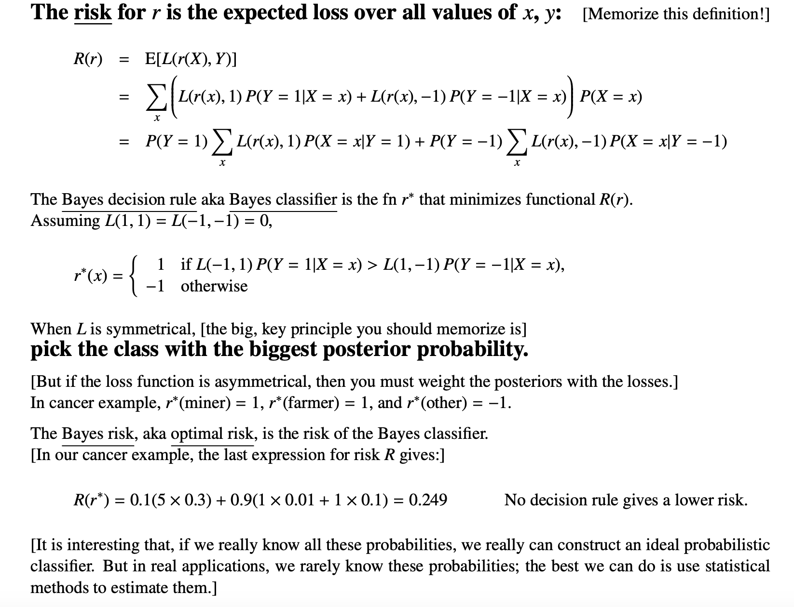
> Note that in the above example, if we choose symmetric loss function, then the bayes decision rule should be:
> $$r^*(x)=\left\{\begin{aligned}1 & \text { if } P(Y=1 \mid X=x)>P(Y=-1 \mid X=x), \\-1 & \text { otherwise }\end{aligned}\right.$$ since $L(-1,1)=L(1,-1)$.

# Simple Classifiers
## Centroid Method
> [!algo] Centroid Method: A Simple Classifier
> 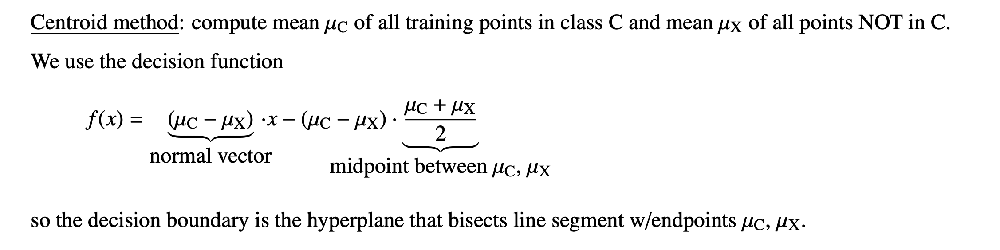
> Setting decision function $f(x)=0$, we get the decision boundary is $x=\frac{\mu_C+\mu_X}{2}$.

## Perceptron Algorithm
### Algorithm Procedures
> [!overview]
> 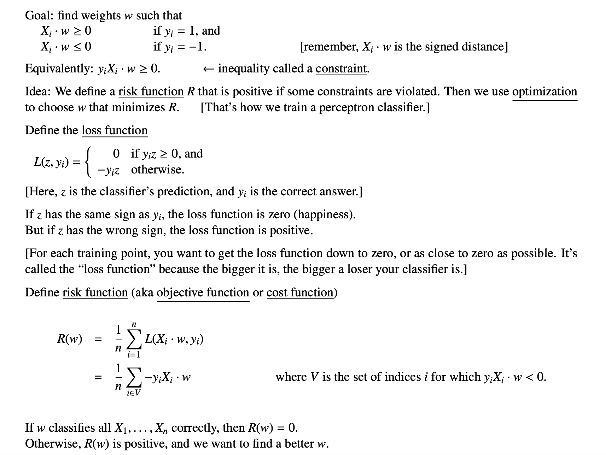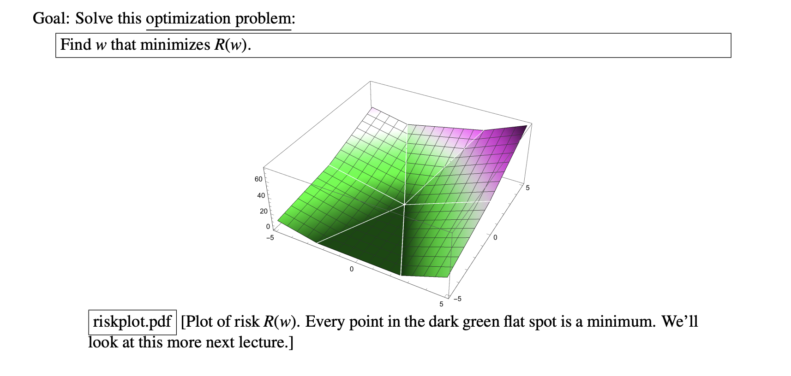

### Space Transformation
> [!def]
> 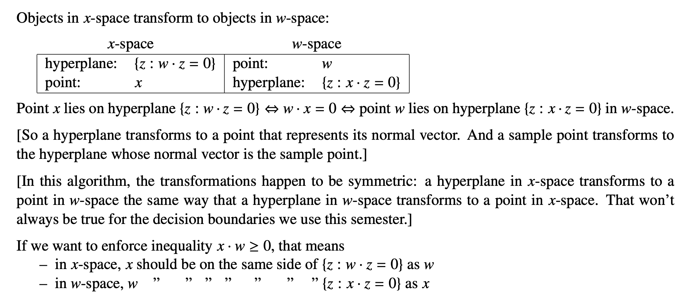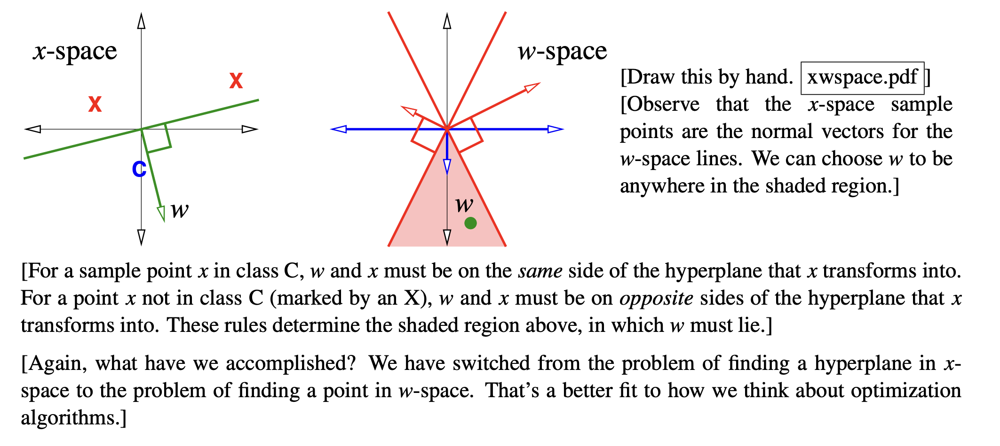

### Training Perceptron
> [!algo] Train Perceptron
> 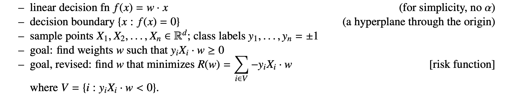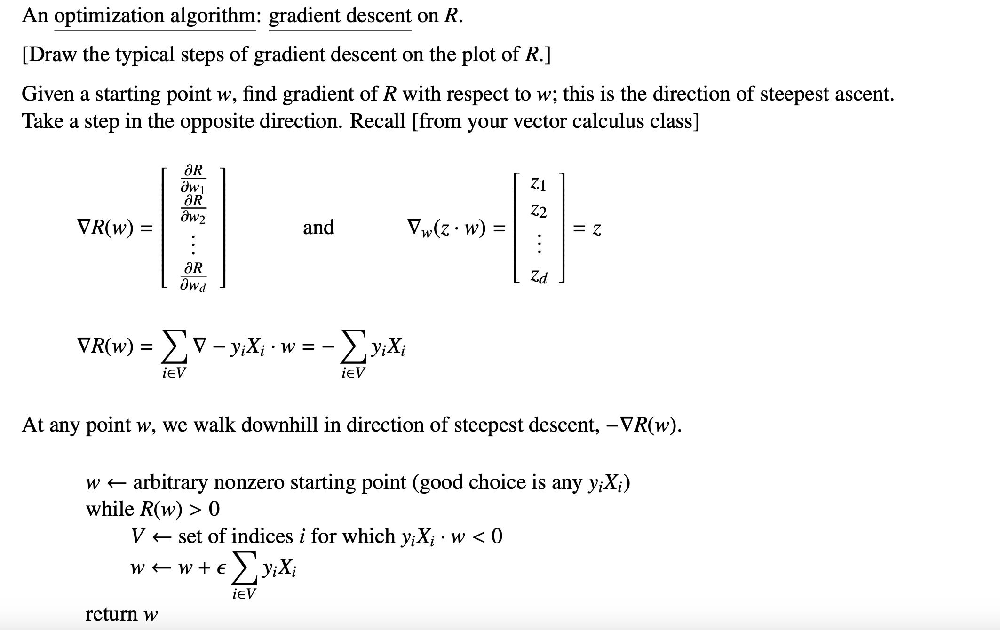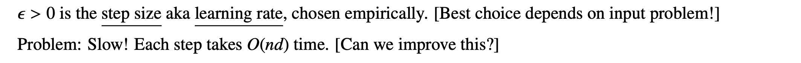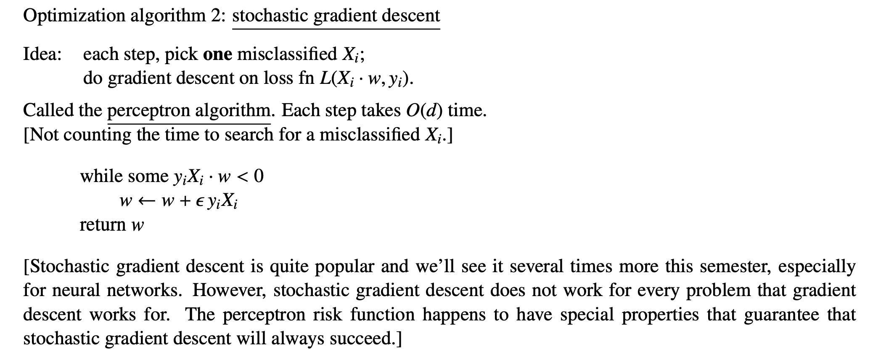

## Max-Margin Classifiers
### Terminologies
> [!overview]
> - **Margin**: The margin of a **linear classifier** is the distance from the decision boundary to the nearest training point.
> - 

# Generative Models
## Modeling Ideas
> [!overview]
> Generative models have strong roots in probabilistic modeling.
> 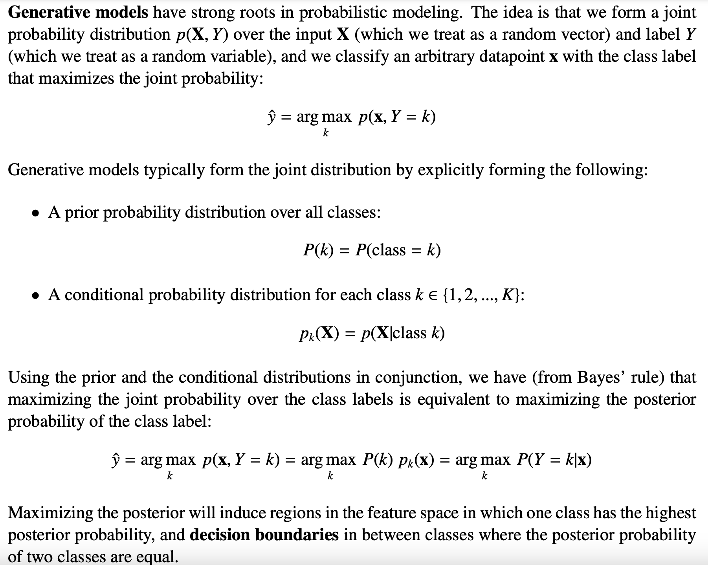

> [!bug] Caveat
> 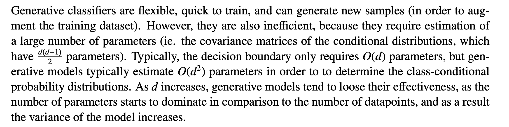

## GDA

# Discriminative Models
## Modeling Idea
> [!def]
> Different from generative model where we compute the posterior distribution $P(Y\mid\mathbf{X})$ by bayes rule, which requires us to have a prior distribution of $Y$ and class-conditional distribution of $p_{\mathbf{X}|Y}$.
> 
> The discriminative model directly model $P(Y\mid\mathbf{X})$ without any consideration of the prior and conditional distribution. Actually, $P(Y\mid \mathbf{X})$ are modeled by some weights instead of probability parameters.
> 
> For discriminative models, we have two ways to learn the classifiers and make predictions:
> 1. Learn $P(Y\mid \mathbf{X})$ and predict $\hat{y}=\operatorname{argmax}_{k}P(Y=k\mid\mathbf{X})$.
> 2. Learn the hard decision boundary $r(\mathbf{X})$ directly without considering any probability stuff. (This is SVM).

## Logistic Regression
> [!def]
> 

## Gaussian LDA

## Least Square SVM

# SVM Models
## Hard-Margin SVM

## Soft-Margin SVM

