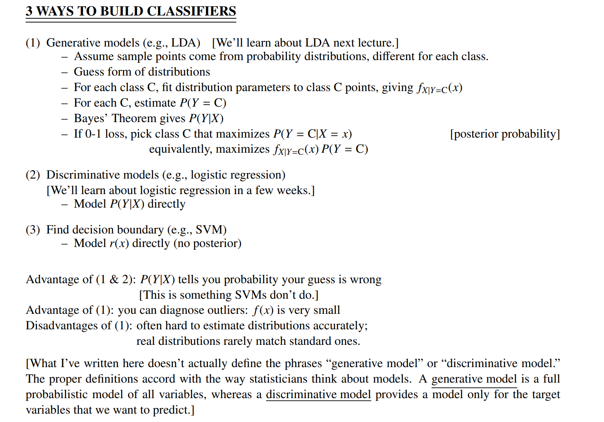

# Three ways to build Classifiers
> [!def]
> 

# Classification Terminologies
## Misclassification Rate

# Generative Models
> [!overview]
> Generative models have strong roots in probabilistic modeling.

## GDA

# Discriminative Models
## Logistic Regression
> [!def]
> 

## Gaussian LDA

## Least Square SVM

# SVM Models
## Hard-Margin SVM

## Soft-Margin SVM

