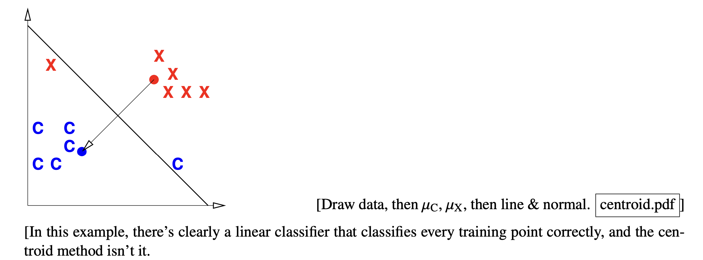
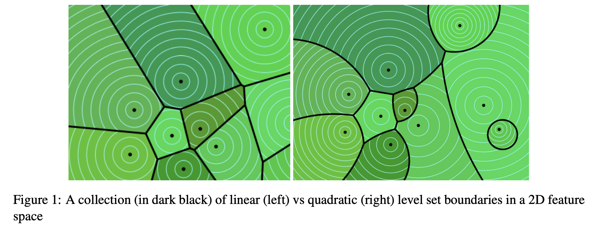
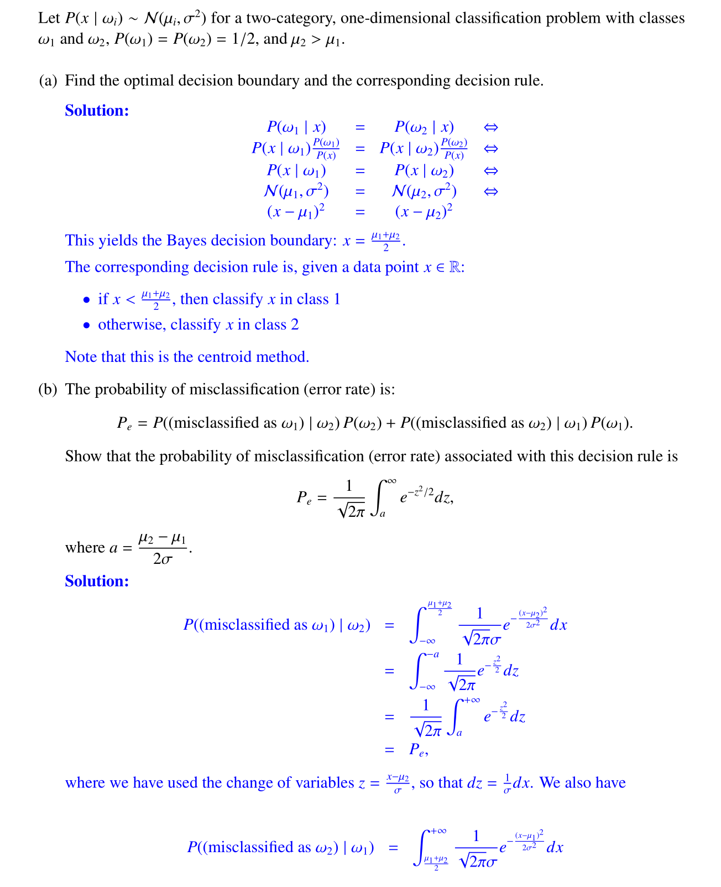
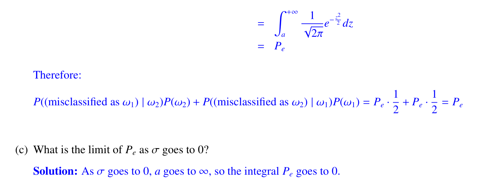
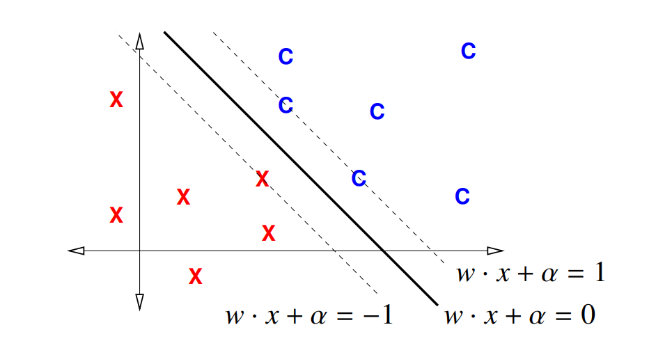
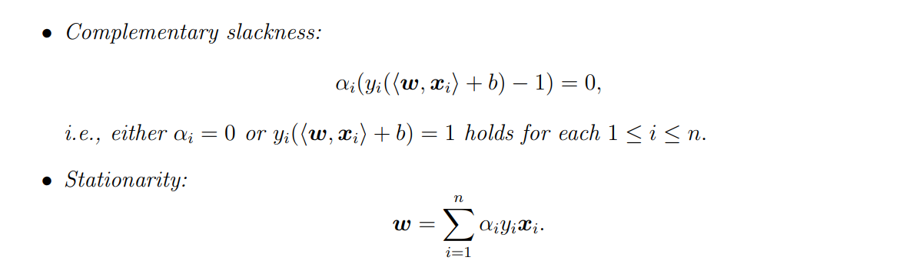
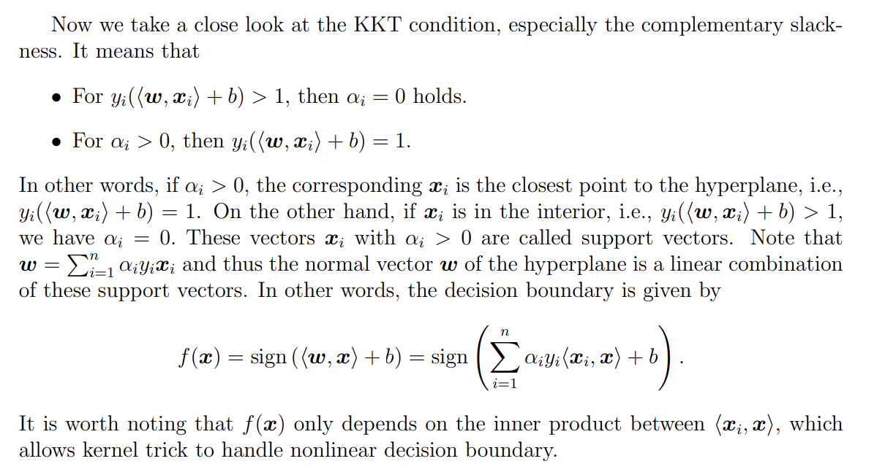
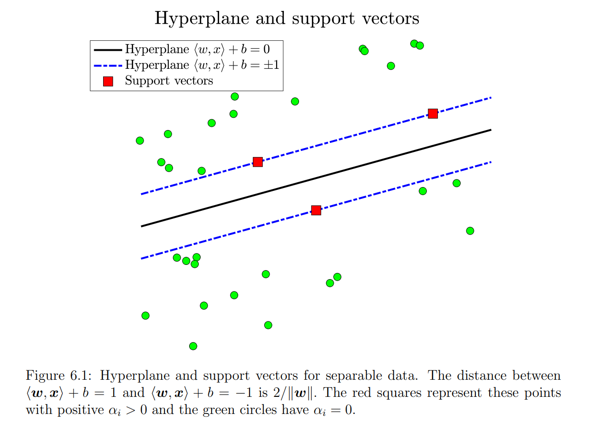

# Classifiers&Decision Rules
## Terminologies
> [!overview]
> We have several terminologies:
> 1. **Decision Function** $f(x)$: Aka predictor function, discriminant function, which is a function $f(x)$ that maps a point x to a scalar such that
> 	- $f(x) > 0$ if $x ∈ class ~ C$; 
> 	- $f(x) ≤ 0$ if $x < class ~C$.
> 2. **Decision boundary** $\mathcal{X}$: the boundary chosen by our classifier to separate items in the class from those not. Often this is a set that contains a bunch of points that could be classified as either one group or another. 
> 	- Formally it is defined as $\mathcal{X}=\{x\in\mathbb{R}^d:f(x)=0\}$
> 	- That is, all the points that makes decision function evaluate to 0.
> 	- For linear classifiers, this set is a hyperplane of dimension $d-1$, derivations see [Orthogonal Decomposition Theorem](../../EECS127AB/2_Matrix_Calculus/Vector_OPT_Basics.md#正交分解定理)
> 	- $\{x : f(x) = 0\}$ is also called an **isosurface** of f for the isovalue 0. $f$ can have other isosurfaces for other isovalues, e.g., $\{x : f(x) = 1\}$.
>  3. **Loss function** $L(h(x), y)$ specifies badness if classifier predicts the class of x to be h(x), and the true class is y. Note that this function only computes the loss at a single test point x. The independent variables here is $h$ and $y$.
> 	 - Symmetric Loss: A symmetrical loss is the same for false positives and false negatives. **In this case, minimizing risk function is the same as maximizing the posterior probability.**  
> 	 - Asymmetric: When we make a wrong prediction, if we have preferences of false positive over false negative or vice versa, we can use asymmetric loss function.
> 4.  **Decision Rule / Classifier $h:\mathbb{R}^d\to\pm1$**: A function that maps feature to $\pm1$
> 5. **Risk function/Cost function/Objective Function** $R(h)$: This is a **functional**(a function that maps a function to real value). Used to measure to what extent our classifier is violating the classification. Normally we want to minimize it so we should design it to be positive for these violations.
> 	 - **Risk Function**: $R(h)=\mathbb{E}_{X,Y\sim p}[L(h(X),Y)]$
> 	 - **Empirical Risk Function**: $\widehat{R}_n(h)=\frac{1}{n}\sum_{i=1}^nL(h(x_i),y_i)$
> 	 - By WLLN, $\widehat{R}_{n}(h)\to R(h)$. So in practice we just minimize the empirical risk function.
>  6. **Bayes Decision Rule / Classifier**: $h^*$ : The decision rule/classifier that minimizers the risk function.

## Three ways to build Classifiers
> [!def]
> 

## Bayes Decision Rules
> [!important]
> 

> [!example] Why we prefer risk minimization over posterior maximization
> 
> This example says that if we think false negative is BAAAD, then we'd better predict positive to make the wrong prediction false positive.
> 
> 
> Note that in the above example, if we choose symmetric loss function, then the bayes decision rule should be:
> $$r^*(x)=\left\{\begin{aligned}1 & \text { if } P(Y=1 \mid X=x)>P(Y=-1 \mid X=x), \\-1 & \text { otherwise }\end{aligned}\right.$$ since $L(-1,1)=L(1,-1)$.

# Simple Classifiers
## Centroid Method
> [!algo] Centroid Method: A Simple Classifier
> 
> Setting decision function $f(x)=0$, we get the decision boundary is $x=\frac{\mu_C+\mu_X}{2}$.

## Perceptron Algorithm
### Algorithm Procedures
> [!overview]
> 

### Space Transformation
> [!def]
> 

### Training Perceptron
> [!algo] Train Perceptron
> 

## Max-Margin Classifiers 
See [Hard-Margin SVM](1_Classification.md#Hard-Margin%20SVM) 

# Generative Models
## Modeling Ideas
> [!overview]
> Generative models have strong roots in probabilistic modeling.
> 

> [!bug] Caveat
> 

## Gaussian LDA
> [!example] EECS189 Fa23 Disc02
> 

# Discriminative Models
## Modeling Idea
> [!def]
> Different from generative model where we compute the posterior distribution $P(Y\mid\mathbf{X})$ by bayes rule, which requires us to have a prior distribution of $Y$ and class-conditional distribution of $p_{\mathbf{X}|Y}$.
> 
> The discriminative model directly model $P(Y\mid\mathbf{X})$ without any consideration of the prior and conditional distribution. Actually, $P(Y\mid \mathbf{X})$ are modeled by some weights instead of probability parameters.
> 
> For discriminative models, we have two ways to learn the classifiers and make predictions:
> 1. Learn $P(Y\mid \mathbf{X})$ and predict $\hat{y}=\operatorname{argmax}_{k}P(Y=k\mid\mathbf{X})$.
> 2. Learn the hard decision boundary $r(\mathbf{X})$ directly without considering any probability stuff. (This is SVM).

## Logistic Regression
> [!def]
> 

## K Nearest Neighbours

## Least Square SVM

# SVM Models
## Hard-Margin SVM-Separable Case
### Terminologies
> [!overview]
> - **Margin**: The margin of a **linear classifier** is the distance from the decision boundary to the nearest training point.
> 

### Optimization Problem
> [!def]
> Suppose we have labelled data $\mathcal{D}=\{(\vec{x}_1,y_1),(\vec{x}_2,y_2),\cdots, (\vec{x}_n,y_n)\}$, we want to find a binary classifier $\delta(\vec{x}):\mathbb{R}^d\to\{0,1\}$.
> 
> The decision boundary is given by a hyperplane with $\vec{w}^{\top}\vec{x}+b=0$ and the decision rule is:
> - If $\vec{w}^{\top}\vec{x}+b\geq1$, classify to 1.
> - If $\vec{w}^{\top}\vec{x}+b\leq-1$, classify to 0.
> 
> We want to maximize the margin of the classifier, which is calculated by $\min_i\frac{1}{\|\vec{w}\|}|\vec{w}^{\top}\vec{x}_{i}+b|=\frac{1}{\|\vec{w}\|}$. (Here we define the minimum absolute value of the signed distance from the hyperplane to be 1 by proper scaling $\vec{w}$ and $b$).
> 
> So the objective should be $\max_{\vec{w},b}\frac{1}{\|\vec{w}\|}$, but such objective is hard to optimize, so we use two monotone transformations
> - First make it $\min_{\vec{w},b}\|\vec{w}\|$. (The monotone function is $f(x)=x^{-1}$ over positive values.)
> - Then taking power(The monotone function is $f(x)=\frac{1}{2}x^2$).
> 
> The optimization problem thus becomes:
> $$\begin{aligned}&\min_{\vec{w},b}\frac{1}{2}\|\vec{w}\|^{2}\\\textbf{s.t.}\quad&y_i(\vec{w}^{\top}\vec{x}_{i}+b)\geq1\quad\forall i=1,2\cdots, n\end{aligned}$$
>
>This is a quadratic program with $d+1$ dimensions($d$ for $\vec{w}$ and 1 for $b$) and $n$ constraints. We know this program has unique solution since the quadratic matrix $I_d$ is positive definite.
>
>However, if the data points are not linearly separable, the QP has no solution.

### Dual Program
> [!def]
> For each constraint $y_i\left(\left\langle\boldsymbol{w}, \boldsymbol{x}_i\right\rangle+b\right) \geq 1$, we assign a dual variable $\alpha_i \geq 0$, the Lagrangian function is given by$$\begin{aligned}L\left(\boldsymbol{w}, b, \alpha_i\right) & =\frac{1}{2}\|\boldsymbol{w}\|^2-\sum_{i=1}^n \alpha_i\left(y_i\left(\left\langle\boldsymbol{w}, \boldsymbol{x}_i\right\rangle+b\right)-1\right), \\& =\frac{1}{2}\|\boldsymbol{w}\|^2-\left\langle\boldsymbol{w}, \sum_{i=1}^n \alpha_i y_i \boldsymbol{x}_i\right\rangle-b \sum_{i=1}^n \alpha_i y_i+\sum_{i=1}^n \alpha_i .\end{aligned}$$
> 
> As long as $\boldsymbol{w}$ and $b$ are feasible, i.e., satisfying the affine constraints, it holds$$L\left(\boldsymbol{w}, b, \alpha_i\right) \leq \frac{1}{2}\|\boldsymbol{w}\|^2$$
> 
> Note that for any $\alpha_i$, the Lagrangian function is a quadratic function w.r.t. $\boldsymbol{w}$ and $b$. We minimize the Lagrangian function over the primal variables, i.e., $\inf _{\boldsymbol{w}, b} L\left(\boldsymbol{w}, b, \alpha_i\right)$. It suffices to obtain the critical points:$$\begin{aligned}\frac{\partial L}{\partial \boldsymbol{w}} & =\boldsymbol{w}-\sum_{i=1}^n \alpha_i y_i \boldsymbol{x}_i=0 \\\frac{\partial L}{\partial b} & =-\sum_{i=1}^n \alpha_i y_i=0\end{aligned}$$
> 
> Since the lagrangian function is affine in $b$, if $\alpha_i$ does not satisfy the second equation, the minimum $L$ is negative infinite, which leads to an uninformative lower bound. 
> 
> Substituting the FOC into lagrangian function, we have$$\inf _{\boldsymbol{w}, b} L\left(\boldsymbol{w}, b, \alpha_i\right)=-\frac{1}{2}\left\|\sum_{i=1} \alpha_i y_i \boldsymbol{x}_i\right\|^2+\sum_{i=1}^n \alpha_i \leq p^*$$where $p^*$ is the optimal value to the primal program (6.1.1), for any $\alpha_i$ satisfying$$\sum_{i=1}^n \alpha_i y_i=0, \quad \alpha_i \geq 0 .$$
> 
> This gives rise to the dual program:$$\max _{\alpha_i}-\frac{1}{2}\left\|\sum_{i=1} \alpha_i y_i \boldsymbol{x}_i\right\|^2+\sum_{i=1}^n \alpha_i \quad \text { s.t. } \quad \sum_{i=1}^n \alpha_i y_i=0, \alpha_i \geq 0$$where$$\left\|\sum_{i=1} \alpha_i y_i \boldsymbol{x}_i\right\|^2=\sum_{i, j} \alpha_i \alpha_j y_i y_j\left\langle\boldsymbol{x}_i, \boldsymbol{x}_j\right\rangle .$$
> 
> The dual program is essentially also a convex program (by adding a negative sign to the objective function).

### KKT Conditions
> [!important]
> 

### Support Vectors
#### Definition
> [!def]
> The support vectors are those training data points $\vec{x}_i$ such that $$\alpha_i(y_i(\vec{w}^{\top}\vec{x}_i+b)-1)=0$$ where $\alpha_i>0$ and $y_i(\vec{w}^{\top}\vec{x}_i+b)-1=0$
> 
> When we are evaluating the decision rule on a new test point $\vec{x}$: $$\vec{w_{*}}^{\top}\vec{x}+b_{*}$$, we could fit in the expression $$\vec{w_{*}}=\sum\limits_{i=1}^n\alpha_iy_i\vec{x}_i$$ and evaluate $$\sum\limits_{i=1}^n\alpha_iy_i\vec{x}_i^{\top}\vec{x}+\alpha^*$$ to see if it is bigger or smaller than 0.
> 
> Since $\alpha_i>0$ only for those support vectors, we only need to evaluate the sum at those support vectors, which simplifies our calculations.
> 
>  In practice, we frequently encounter training data sets for which the support vectors are a small minority of thetraining points, especially when the number of training points is much larger than the number of features.

#### Existence Theorem
> [!important]
> **Assume that training points $\vec{x}_i$ and labels $y_i$ are linearly separable, using  the original SVM formulation (not the dual) prove that there is at least one support vector for each class, +1 and −1.**
> 
> Suppose for class 1 , none of training points are support vector, then$$\vec{\omega}^{\top} \vec{x}_i+b>1 \quad \forall i \in\left\{i: y_i=1\right\}$$ let $\vec{\omega}^{\top} \vec{x}_{min}+b=1+\varepsilon>1$ where $\vec{x}_{min}$ is the closest training point(but not support vector) to the hyperplane 
> 
> We want to choose $\vec{w}^{\prime}=1 /\left(1+\frac{\varepsilon}{2}\right) \vec{\omega}$ and corresponding $\alpha$ such that$$\vec{w}^{\prime} \vec{x}_{min}+b^{\prime}=1 \quad \exists i \in\left\{i: y_i=1\right\}$$
> 
> Solve for$$\begin{aligned}&\left\{\begin{array}{l}\vec{w}^{\top} \vec{x}_{min}+b=1+\varepsilon \\\vec{w}^{\prime} \vec{x}_{min}+b^{\prime}=1\end{array}\right. \\& \Rightarrow b^{\prime}=\frac{b-\varepsilon / 2}{1+\varepsilon / 2}\end{aligned}$$
> 
> Thus we can always rescale $\vec{w}$ and $b$ such that $\vec{w}'$ and $b'$ are still feasible and can achieve lower cost of objective function.
> 
> In other words, if you get a hard margin SVM model(parametrized by $\vec{w}$ and $b$), where there is no support vectors. Then it means that you can find another classifier(with lower objective and bigger margin) such that there exists at least one support vectors and thus the original hard margin SVM that you have obtained is not optimal.

## Soft-Margin SVM - Non Separable Case
### Optimization Problem
> [!def]
> On top of the hard margin SVM, we could add a slack variable $\epsi$

## Kernel Tricks

