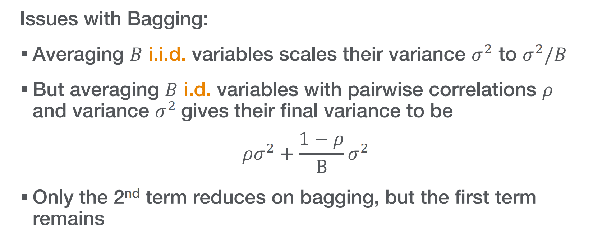

# Trainng of Random Forests
## Overview
> [!def]
> 

## Bagging
> [!def]
> 

### Bootstrap
> [!def]
> 

### Aggregation
> [!def]
> 
> Derivations about why $\frac{1}{3}$ of the original training data points will be left out:
> 
> 

> [!algo]
> 

### Issue with Bagging
> [!important]
> 

## Feature Randomization
> [!def]
> 

## AdaBoosting
> [!def]
> 

### AdaBoost
> [!def]
> 

> [!algo]
> 
> **Remarks:**
> 
> 

### Derivation of AdaBoost
> [!important]
> 

> [!info]
> 

# Gradient Boosting
## Overview
> [!def]
> 

## GB for Regression
### Motivations
> [!motiv] Motivation
> 

### Relation to Gradient Descent
> [!important]
> 

### Algorithm Procedures
> [!algo]
> 
> The term "negative gradient pays less attention to outliers" means that when the error is large (beyond the threshold $\delta$), the update is capped at $\delta$. 
> 
> This means large errors (often due to outliers) do not disproportionately influence the model update. 
> 
> Their influence is limited to a fixed value $\delta$, preventing outliers from having too much weight in the model fitting process, which could skew the model and harm its performance on the rest of the data.

### Loss Function for GB
> [!def]
> 

### GB with Absolute Loss
> [!def]
> 

### GB with Huber Loss
> [!def]
> 

## GB for Classification
### Motivations
> [!motiv] Motivations
> 

### Algorithm Procedures
> [!algo]
> 

### Difference with GB for Regression
> [!def]
> 

> [!example] 
> 

## Choosing Learning Rate for GB

# Prediction with Random Forests
> [!def]
> 

# Evaluation of Random Forests
## Margin Function
> [!def]
> 
> The larger the margin, the more confidence in the classification
> 
> 

 
## Generalization Error
> [!def]
> 
> $mg(X,Y)<0$ means that on average there are more trees that are predicting incorrectly.

> [!thm]
> Overfitting is not a problem:
> 

> [!proof]
> 

