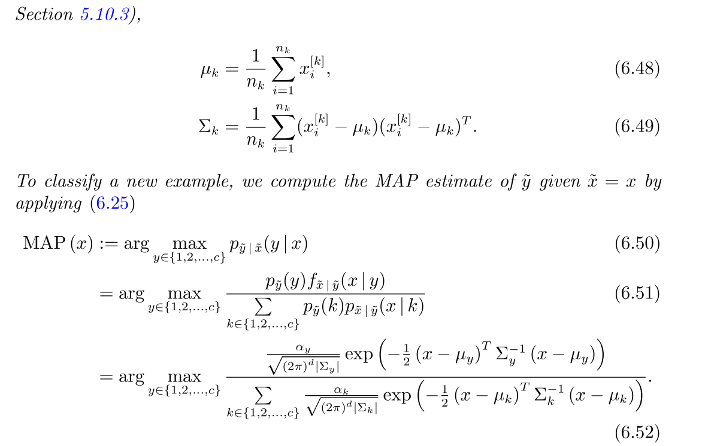
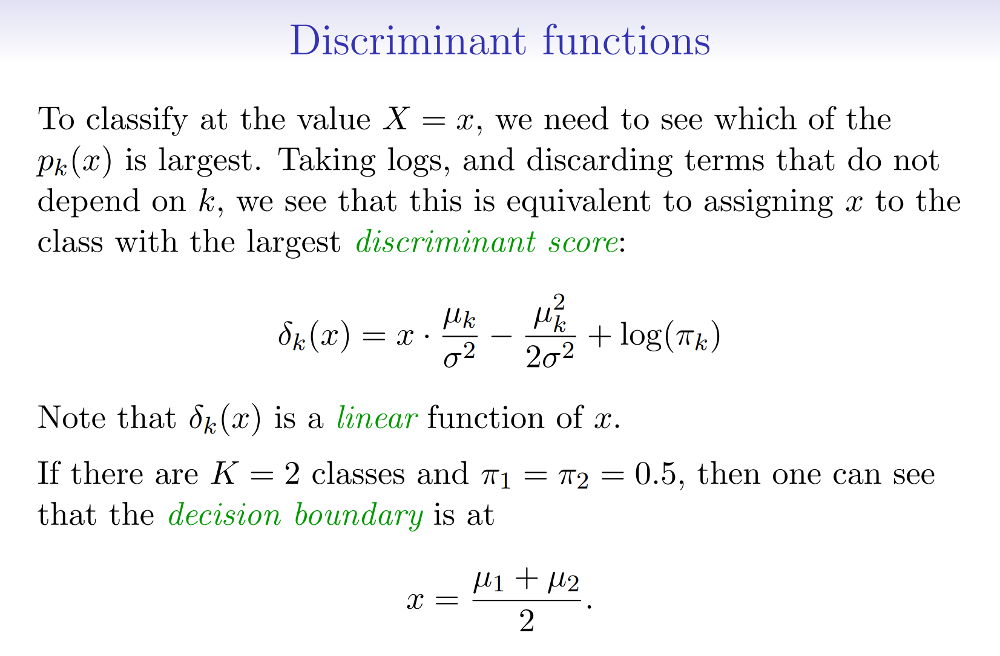

# Bayes Theorem
> [!property]
> 

# GDA
> [!def]
> 

> [!proof]
> 

# LDA
## 1-d Case
### Model Assumption
> [!def]
> 

### Discriminant Functions
> [!important]
> 

> [!example] EECS189 Fa23 Disc03 P2
> 

### Estimating Parameters
> [!def]
> 

## n-d case
### Discriminant Functions
> [!def]
> 

### Discriminant Plot
> [!def]
> 

## LDA and Logistic
> [!def]
> 

> [!important]
> 

# QDA

