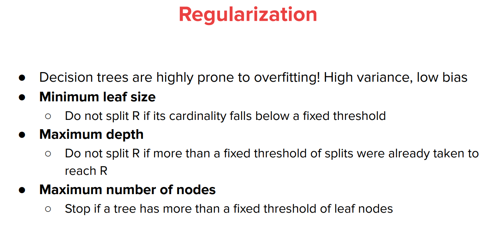

# Motivation
> [!overview]
> 

# Split Quality Metrics
## Misclassification Rate
> [!def]
> 

> [!bug] Caveat
> 

> [!thm]
> 
> Note that the graph is obtained in the following way:
> 
> The x-axis represents the probability of being class 1(number of data points that has label 1($y_i=1$).
> 
> The y-axis represents the metric value, the strictly concave curve represents the entropy value while the lower one represents misclassification rate.
> 
> Before split, we are at $p=0.5$, which means the probabilty that a test node will be classified in class $1$ is 0.5. After split, in the splitted node the $p=0.75$, meaning that the probability that a test node will be classified in class $1$ is 0.75.
> - The entropy is calculated as $-\frac{1}{2}log\frac{1}{2}-(1-\frac{1}{2})log(1-\frac{1}{2})=1$ before split where $p=\frac{1}{2}$ and is $-\frac{3}{4}log\frac{3}{4}-(1-\frac{3}{4})log(1-\frac{3}{4})=0.811$ where $p=\frac{3}{4}$.
> - The misclassification rate is calculated as $1-max_{k}P(X=k)=1-\max_{k\in\{0,1\}}P(Y=k)=1-(1-p)=p=0.5$ before split where $p=\frac{1}{2}$ and is$1-max_{k}P(X=k)=1-\max_{k\in\{0,1\}}P(Y=k)=1-p=1-0.75=0.25$.

## Entropy Reduction
> [!def]
> This definition is for random variables, but in practice we work with data. The distribution is empirically defined by our training points $\left\{\left(\mathbf{x}_i, y_i\right)\right\}_{i=1}^n$. Concretely, the probability of class $k$ is the proportion of datapoints having class $k$ :$$P(Y=k)=\frac{\left|\left\{i \mid y_i=k\right\}\right|}{n}$$
> 
> We know that when we choose a split-feature, split-value pair, we want to reduce entropy in some way. Let $X_{j, v}$ be an indicator variable which is 1 when $x_j<v$, and 0 otherwise. There are a few entropies to consider:
> - $H(Y)$
> - $H\left(Y \mid X_{j, v}=1\right)$, the entropy of the distribution of points such that $x_j<v$.
> - $H\left(Y \mid X_{j, v}=0\right)$, the entropy of the distribution of points such that $x_j \geq v$.
> 
> $H(Y)$ is not really under our control: we start with the set of points with labels represented by $Y$, this distribution has some entropy, and now we wish to carve up those points in a way to minimize the entropy remaining. Thus, the quantity we want to minimize is a weighted average of the two sides of the split, where the weights are (proportional to) the sizes of two sides:$$\operatorname{minimize} H\left(Y \mid X_{j, v}\right):=P\left(X_{j, v}=1\right) H\left(Y \mid X_{j, v}=1\right)+P\left(X_{j, v}=0\right) H\left(Y \mid X_{j, v}=0\right)$$
> 
> This quantity $H\left(Y \mid X_{j, v}\right)$ is known as the [Conditional Entropy](../../Probability_Theory_EECS126/2_Information_Theory/Entropies.md#Joint/Conditional%20Entropy) of $Y$ given $X_{j, v}$. An equivalent way of seeing this is that we want to maximize the information we've learned, which is represented by how much entropy is reduced after learning whether or not $x_j<v$ :$$\operatorname{maximize} I\left(X_{j, v} ; Y\right):=H(Y)-H\left(Y \mid X_{j, v}\right)$$
> 
> This quantity $I\left(X_{j, v} ; Y\right)$ is known as the [Mutual Information](../../Probability_Theory_EECS126/2_Information_Theory/Entropies.md#Mutual%20Information) between $X_{j, v}$ and $Y$. It is always nonnegative, and it's zero iff the resulting sides of the split have the same distribution of classes as the original set of points. 
> 
> 
> In some literatures, this process is also called information gain maximization.
> 
> Let's see an example:
> 

## Gini Impurity
> [!def]
> 

# Learning a Decision Tree
## Algorithm Step
> [!algo]
> 

## Stopping Criteria
> [!def]
> 

### Base Case 1
> [!important]
> 

### Base Case 2
> [!important]
> 

