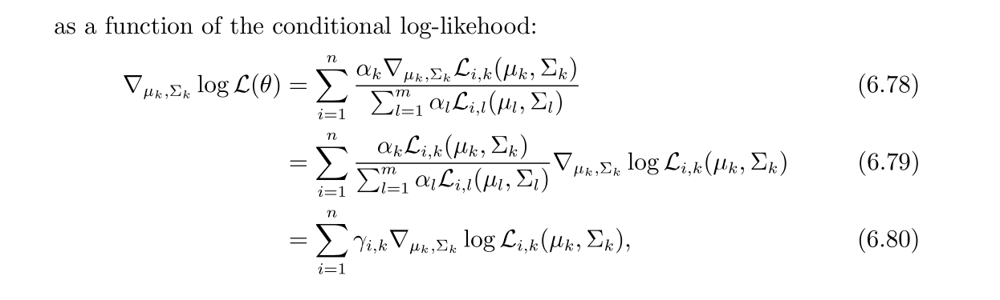

Also See [GMMEMNotes](GMMEMNotes.pdf)
# Basic Definition
> [!def]
> 

> [!example]
> 


# Fitting GMM
## Problem Descriptions
> [!def]
> 


## Trick 1: Latent Variables
> [!def]
> 

## Trick 2: MLE
> [!def]
> 
> More see [GDA](../Classification_Decision/2_Gaussian_Discriminative_Analysis.md#GDA)
> Here:
> - $\mu_k$ is the group mean. The mean of samples that belong to label $k$.
> - $\Sigma_k$ is the group variance. The covariance matrix of samples that belong to label $k$.
> - $\pi_k$ is the probability of this group(number of samples with label $k$).


# EM Algorithm - Version 1
## Motivation
> [!motiv]
> 


## E-Step: Responsabilities
> [!important]
> 
> $\gamma_k$ is an auxiliary random variable, different from $\pi_k$ where $\pi_k$ is our GMM parameter.
> 


## M-Step: Estimate Parameters
> [!important]
> 


## Summary
> [!summary]
> 


# EM Algorithm - Version 2
## Algorithm
> [!def]
> 


## Derivations
> [!important]
> 


# Genreal EM Algorithm
> [!important]
> 


# GMM vs K-Means
> [!important]
> 


# EM Implementations
> [!code]
```python


```


# EM Algorithm Optimization Details
## Surrogate Optimization
> [!important]
> More in [GMMEMNotes](GMMEMNotes.pdf)
> 


## Convergence of EM
> [!def]
> 


