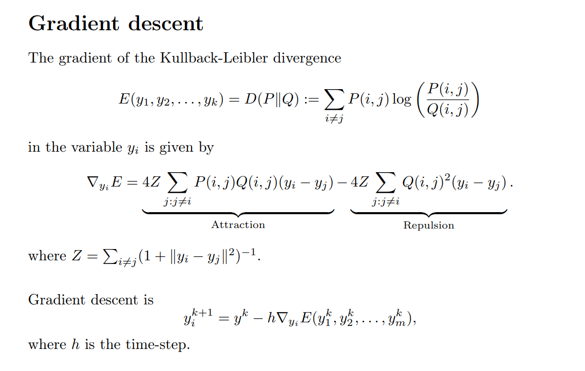

# Motivations
> [!motiv] Why we need T-SNE
> 


# Locally Linear Embedding(LLE)
## Definition
> [!def]
> 
> Here $j\in N_{\epsilon}(\vec{x_i})$。
> 
> Then we want to find a dimension reduction scheme such that $\vec{x}_{i}\to \vec{z}_{i}$ and $W$ remains unchanged.
> 


## Choose Number of Neighbors
> [!important]
> 
> K must be just right.


## Problem on LLE
> [!example]
> 


# Laplacian Eigenmaps
> More on [Laplacian Matrix](../../Optimization_EECS127AB/1_Linear_Algebra_Review/Structured_Matrices.md#Laplacian%20Matrix)

> [!def]
> 


# Spectral Embedding
> [!def]
> 


# Neighborhood Embeddings
## Definitions
> [!def]
> 


## NE - Isomap
> [!important]
> 


## Stochastic NE(SNE)
> [!def]
> 


### Probability Matrix
> [!important]
> 


### Perplexity
> [!def]
> 
> 


### SNE-Objective
> [!def]
> 


# T-SNE
> [!important]
> Important Reference: https://distill.pub/2016/misread-tsne/

## Definition
> [!def]
> 


## Gradient
> [!important]
> 

> [!proof] Derivations
> 


## Algorithms
> [!algo]
> 


## Hyperparamter Properties
> [!important]
> For T-SNE, we have four hyperparameters:
> - Cluster size(Number of points per cluster)
> - Embedding dimension: Like `n_components` in PCA
> - Perplexity
> - Epsilon: Training rate.


### Perplexity
> [!property]
> Considered loosely, it can be thought of as the balance between preserving the global and the local structure of the data. A more direct way to think about perplexity is that it is the continuous analogy to the k number of nearest neighbors for which we will preserve distances.
> 
> In most implementations, perplexity defaults to 30. This focuses the attention of t-SNE on preserving the distances to its 30 nearest neighbors and puts virtually no weight on preserving distances to the remaining points. For data sets with a small number of points e.g. 100, this will uncover the global structure quite well since each point will preserve distances to a third of the data set.
> 
> For larger data sets, e.g. 10,000 points, considering 30 nearest neighbors will likely do a poor job of preserving global structure. Using a higher perplexity value e.g. 500, will do a much better job for of uncovering the global structure.
> 
> The larger the perplexity, the more non-local information will be retained in the dimensionality reduction result.
> 
> The way I think about perplexity parameter in t-SNE is that it sets the effective number of neighbours that each point is attracted to. In t-SNE optimisation, _all_ pairs of points are repulsed from each other, but only a small number of pairs feel attractive forces.
> 
> So if your perplexity is very small, then there will be fewer pairs that feel any attraction and the resulting embedding will tend to be "fluffy": repulsive forces will dominate and will inflate the whole embedding to a bubble-like round shape.
> 
> On the other hand, if your perplexity is large, clusters will tend to shrink into denser structures.
> 
> This is a very handway explanation and I must say that I have never seen a good mathematical analysis of this phenomenon (I suspect such an analysis would be nontrivial), but I think it's roughly correct.
> 

> [!bug] Caveats
> Generally, the perplexity hypoerparameter should be smaller than the total number of data points.


### Cluster Size
> [!def]
> 


### Inter-Cluster Distance
> [!important]


## Sklearn Implementation
> [!code]
```python
def explore_perplexity(values, X, labels):
  """
  Plots a 2D representation of the data for visualization with categories
  labeled as different colors using different perplexities.

  Args:
    values (list of floats) : list with perplexities to be visualized
    X (np.ndarray of floats) : matrix with the dataset
    labels (np.ndarray of int) : array with the labels

  Returns:
    Nothing.

  """

  for perp in values:

    # Perform t-SNE
    tsne_model = TSNE(n_components=2, perplexity=perp, random_state=2020)

    embed = tsne_model.fit_transform(X)
    visualize_components(embed[:, 0], embed[:, 1], labels, show=False)
    plt.title(f"perplexity: {perp}")
    plt.show()


# Visualize
values = [50, 5, 2]
with plt.xkcd():
  explore_perplexity(values, X, labels)
```
> [!code] Output
> 


# Comparison between PCA and T-SNE
> [!important]
> 
> t-SNE is a nonlinear technique that focuses on preserving the pairwise similarities between data points in a lower-dimensional space. t-SNE is concerned with preserving small pairwise distances whereas, PCA focuses on maintaining large pairwise distances to maximize variance.
> 
> In summary, PCA preserves the variance in the data, whereas t-SNE preserves the relationships between data points in a lower-dimensional space, making it quite a good algorithm for visualizing complex high-dimensional data.


