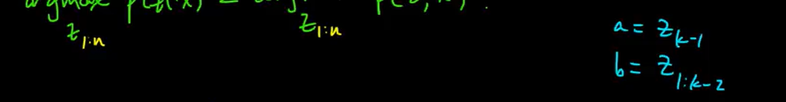
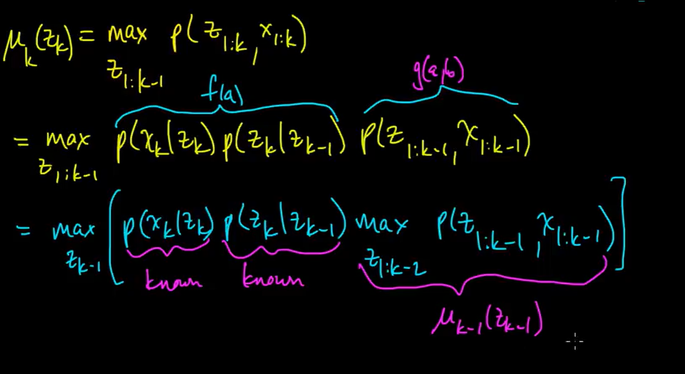
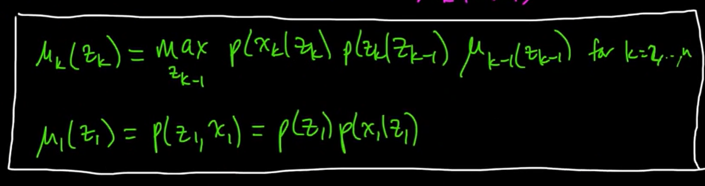
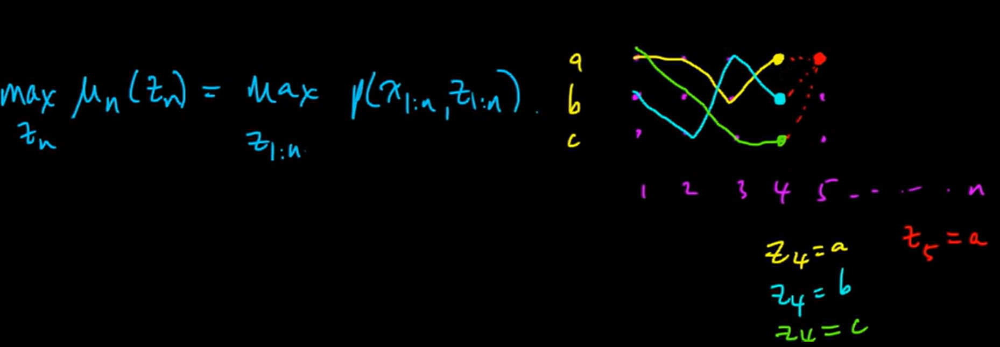
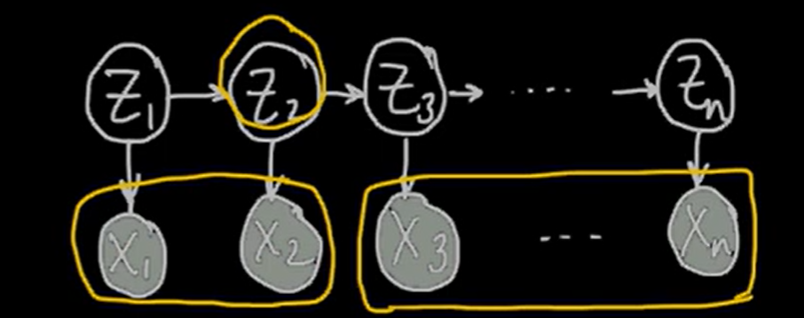
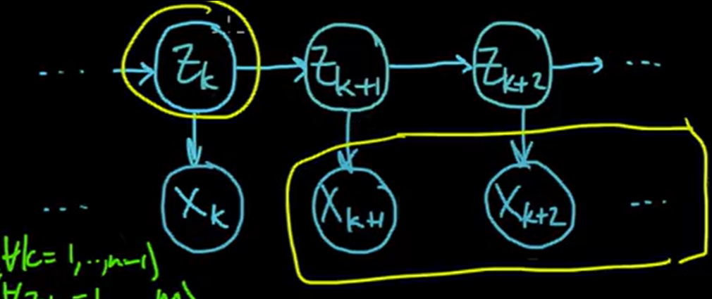
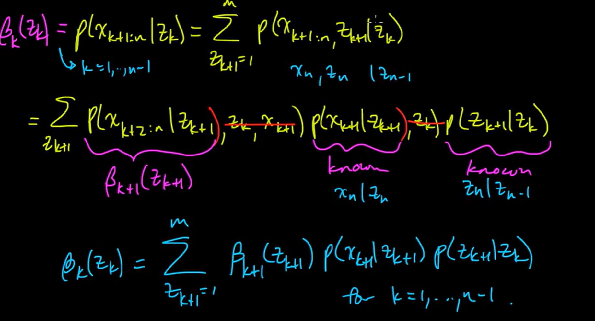
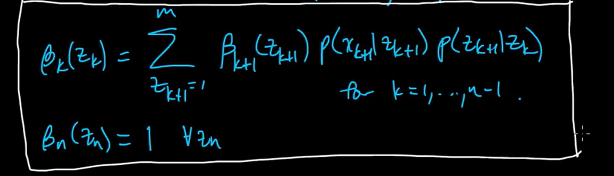
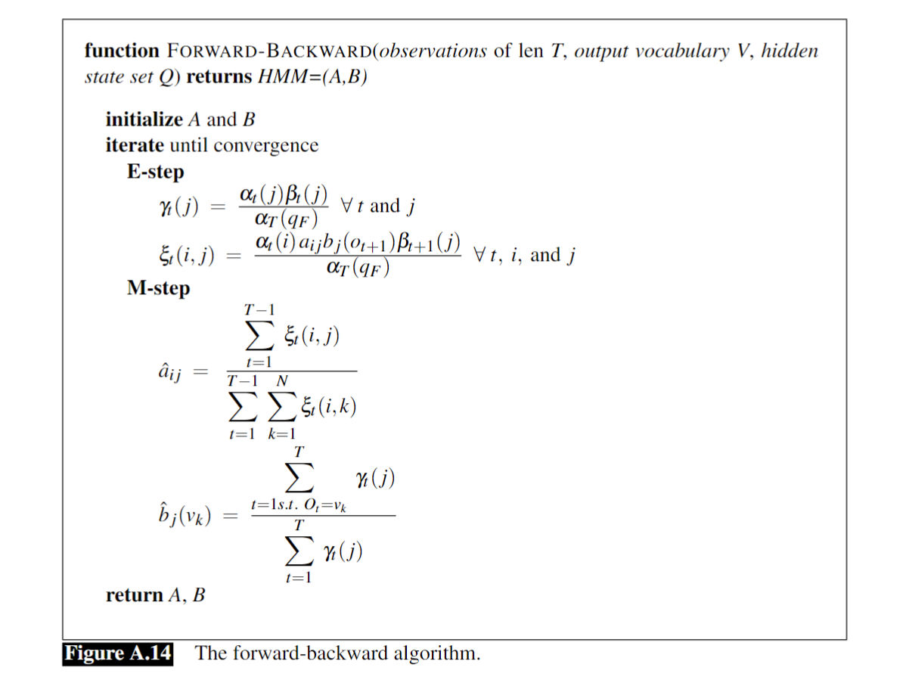

# Canonical Definition
> [!def]
> 


## Transition Probability
> [!def]


## Emission Probability
> [!def]


# Model Assumptions
> [!important]
> 
> Consider the following initial distribution, transition model, and sensor model:
> 
> 
> 从这里可以看出，`HMM`对概率图模型有着很强的约束，本质上是在说，所有的$y_i$仅由其相邻的状态决定(由`Markov Property`可知)。


# Three Fundamental Problems of HMM
> [!def]
> 

> [!example]
> 


## P1: Likelihood Computation
### Motivation
> [!motiv] Motivation
> 


### Naive Computing Procedure
> [!example] EECS189 Fa23 Notes
> 

> [!bug] Time Complexity
> 


### Forward Algorithm - DP
> [!algo]
> 

> [!example] EECS189 Notes - Computing Example and Visualization
> 


### Exercises
> [!example] EECS188 Fa23 Disc10 P1
> 


## P2: Decoding - Viterbi Algorithm
### Motivation
> [!motiv] Motivation
> 
> The algorithm tries to do the following thing:
> - Given $x_{1,\cdots,}x_n$
> - Assume A, B
> - Goal: Compute the most likely hidden states given the params and observations, $z^{*}=argmax_{z}p(z|x)$

> [!important]
> Some important lemmas:
> - If $f(a)\geq 0,\forall a$ and $g(a, b) \geq 0,\forall a,b$, then $\max_{b}f(a)g(a, b)=\max_{a}\{f(a)max_{b}g(a, b)\}$
> - $argmax_{z_{1:n}}p(z|x)=argmax_{z_{1:n}}p(z,x)$


### Viterbi Trellis - DP
> [!def]
> 


### Algorithm Procedures
> [!algo]
> 
> 
> 


## P3: Training HMM 
### Motivation
> [!motiv] Motivation
> 


### Naive Algorithm
> [!algo]
>  Assume $p(x_{k}|z_{k}),p(z_{k}|z_{k-1}), p(z_1)$ are all known, we want to compute $p(z_k|x)$.
>  
>  We could use bayes theorem and marginal probability:
>  $$p(z_{k}, x) = \sum\limits_{z_{1},\cdots, z_{k-1},z_{k+1},\cdots, z_{n}}p(x, z)$$ and $$p(x)=\sum\limits_{z_{1:n}}p(x, z)=\sum\limits_{z_1=1}^m\sum\limits_{z_2=1}^m\cdots\sum\limits_{z_n=1}^mp(x, z)$$
>  Then $p(z_{k}|x)=\frac{p(z_{k},x)}{p(x)}$.

> [!bug] Caveats - Time Complexity
> But notice that the time complexity is really huge, which is $\Theta(m^n)$, so we need the forward-backward algorithm to optimize it.


### Forward-Backward Algorithm
> [!algo]
> Assume $p(x_{k}|z_{k}),p(z_{k}|z_{k-1}), p(z_1)$ are all known, we want to compute $p(z_k|x)$
> 
> 注意到$p(z_{k}|x)\propto p(z_{k}, x_{1:n})=p(x_{k+1:n}|z_{k},x_{1:k})p(z_{k}, x_{1:k})$(贝叶斯公式), 我们发现:
> - $p(x_{k+1:n}|z_{k},x_{1:k})$长得很像`Backward Algorithm`要计算的东西
> - $p(z_{k}, x_{1:k})$就是`Forward Algorithm`要计算的东西
> 
> 所以我们其实会想证明$p(x_{k+1:n}|z_{k},x_{1:k})=p(x_{k+1:n}|z_{k})$, 也就是说$x_{k+1:n}\perp x_{1:k}$ given $z_{k}$, 事实真的如此吗?
> 
> 其实是的，因为`HMM`本质上也是一个概率图模型，所以我们可以使用`D-Separablility`来判断`node`之间的独立性, 答案也显而易见。


#### Forward Algorithm
> [!def]
> Forward algorithm is computing $p(z_{k}, x_{1:k}), \forall k=1,\cdots, n$
> 
> The key idea here is to use **bayes theorem** and **D-separation algorithm** to derive a **recusvie** expression that computes $p(z_{k}, x_{1:k})$ iteratively and efficiently.
> 
> First, using bayes theorem, we get:
> $$\begin{aligned}p(z_{k}, x_{1:k})&=\sum\limits_{z_{k-1}=1}^mp(z_{k},z_{k-1}, x_{1:k})\\&=\sum\limits_{z_{k-1}=1}^mp(x_{k}|z_{k}, z_{k-1}, x_{1:k-1})p(z_{k}|z_{k-1},x_{1:k-1})p(z_{k-1}, x_{1:k-1})\end{aligned}$$
> 
> Using D-separation algorithm, we get:
> $$p(x_{k}|z_{k}, z_{k-1}, x_{1:k-1})=p(x_{k}|z_{k})$$
> and $$p(z_{k}|z_{k-1},x_{1:k-1})=p(z_{k}|z_{k-1})$$
> 
> Finally, we have:
> $$\begin{aligned}p(z_{k}, x_{1:k})&=\sum\limits_{z_{k-1}=1}^mp(z_{k},z_{k-1}, x_{1:k})\\&=\sum\limits_{z_{k-1}=1}^mp(x_{k}|z_{k})p(z_{k}|z_{k-1})p(z_{k-1}, x_{1:k-1})\end{aligned}$$
> Notice that the first two terms are just the emssion probability and transition probability(part of parameters).
> 
> Denote $\alpha_{k}(z_k)=p(z_{k}, x_{1:k})$ we could get:
> $$\begin{aligned}\alpha_{k}(z_k)&=\sum\limits_{z_{k-1}=1}^mp(z_{k},z_{k-1}, x_{1:k})\\&=\sum\limits_{z_{k-1}=1}^mp(x_{k}|z_{k})p(z_{k}|z_{k-1})\alpha_{k-1}(z_{k-1})\end{aligned}$$ where $\alpha_{1}(z_1)=p(x_1|z_1)p(z_1)$

> [!important] Time Complexity
> For the time complexity, we have:
> - $\Theta(m)$ for each $z_{k}$, because we have to sum up $m$ possible states of $z_{k-1}$
> - $\Theta(m^2)$ for each $k$, since each $z_{k}$ could take $m$ states, and $\Theta(m)$ for each state.
> - $\Theta(m^2\cdot n)$ for the whole process since we have $n$ time steps.
> 


#### Backward Algorithm
> [!def]
> Backward algorithm is computing $p(x_{k+1:n}|z_{k}), \forall k=1,\cdots, n,\forall z_{k}=1,2,\cdots, m$
> 


### Pseudocode
> [!algo]
> 


# Code Implementations
> [!code]
```python
from typing import List
import numpy as np

from utils.commons.data_structure import get_length


class HMM():
    """
    A Hidden Markov Model (HMM).

    Attributes
    ----------
    states : array_like or numpy ndarray
        List of states.

    observations : array_like or numpy ndarray
        Observations space array. e.g. [1, 2, 3], which represents 3 possible observation states

    transition : array_like or numpy ndarray
        Transition probability matrix(symmetric) which stores probability of
        moving from state i (row) to state j (col).

    emission : array_like or numpy ndarray
        Emission probability matrix which stores probability of
        seeing observation o (col) from state s (row).

    initial : array_like or numpy ndarray
        Initial state probabilities array.
    """

    def __init__(self, states, observations, A, B, pi):
        self.states = np.array(states)
        self.num_states = get_length(states)
        self.observations = np.array(observations)
        self.transition = np.array(A)
        self.emission = np.array(B)
        self.initial = np.array(pi)

    def compute_likelihood(self, obs):
        """
        Task 1: Compute the likelihood of an observation sequence, P(O|λ) where λ=(A, B)
        :param obs: Array like object or numpy ndarray
        :return: prob, float, the probability of an observation sequence
        """
        return self._forward_likelihood(np.array(obs))

    def decode_from_obs(self, obs):
        """
        Task 2: Decode the observation sequence, computing P(Q|Z, λ) where λ=(A, B)
        :param obs: Array like object or numpy ndarray
        :return: prob, float, the probability of an observation sequence
        """
        return self._forward_viterbi(np.array(obs))

    def learn_from_obs(self, obs):
        """
        Task 3: Train the HMM from data using forward-backward algorithm
        :param obs: Array like object or numpy ndarray
        :return:
        """
        return self._baum_welch_algorithm(np.array(obs))

    def _forward_likelihood(self, obs):
        """

        :param obs: Observation sequence, e.g. [1,2,3,4,5]
        :return: The likelihood of this observation sequence
        """
        N = self.num_states
        T = get_length(obs)

        assert T > 0, "Observation cannot be empty array"

        forward_prob_matrix = np.zeros((N, T))

        # 1. Initialization
        forward_prob_matrix[:, 0] = self.initial * self.emission[:, self._get_observation_idx(obs[0])]

        # 2. Recursion Step: Computes P(O | Q) P(Q) at each time step
        for t in range(1, T):
            forward_prob_matrix[:, t] = (forward_prob_matrix[:, t - 1].dot(self.transition)) \
                                        * self.emission[:, self._get_observation_idx(obs[t])]

        # 3. Termination: P(O) = Σ P(O, Q) = Σ P(O | Q)P(Q)
        forward_prob = forward_prob_matrix[:, T - 1].flatten().sum()

        return forward_prob, forward_prob_matrix

    def _backward_likelihood(self, obs):
        N = self.num_states
        T = get_length(obs)

        assert T > 0, "Observation cannot be empty array"

        backward_prob_matrix = np.zeros((N, T))

        # 1. Initialization: The backward probability at the last time step is set to 1 because,
        # starting from the last observation, the probability of the "empty sequence" (i.e., no future observations)
        # is certain. In other words, there is nothing left to observe, so the probability of correctly observing
        # "nothing" is trivially 1.
        backward_prob_matrix[:, T-1] = 1

        # 2. Recursion Step: Computes P(O | Q) P(Q) at each time step
        for t in range(T - 2, -1, -1):
            backward_prob_matrix[:, t] = (self.transition.dot(backward_prob_matrix[:, t + 1])) \
                                        * self.emission[:, self._get_observation_idx(obs[t + 1])]

        # 3. Termination
        backward_prob = self.initial.dot(backward_prob_matrix[:, 0] * self.emission[:, self._get_observation_idx(obs[0])])

        return backward_prob, backward_prob_matrix

    def _forward_viterbi(self, obs):
        N = self.num_states
        T = get_length(obs)

        assert T > 0, "Observation cannot be empty array"

        forward_viterbi_matrix = np.zeros((N, T))

        # 1. Initialization
        forward_viterbi_matrix[:, 0] = self.initial * self.emission[:, self._get_observation_idx(obs[0])]

        # 2. Recursion Step: Computes max-prob path at each iteration
        for t in range(1, T):
            forward_value = (forward_viterbi_matrix[:, t - 1]
                             .reshape(-1, 1) * self.transition) \
                                .max(axis=0) \
                                * self.emission[:, self._get_observation_idx(obs[t])]
            forward_viterbi_matrix[:, t] = forward_value

        # 3. Termination: Find the max-prob and max-path
        # backtrace
        max_prob_path = self.states[forward_viterbi_matrix.argmax(axis=0)]
        max_prob = forward_viterbi_matrix[:, T - 1].max()

        return max_prob_path, max_prob

    def _baum_welch_algorithm(self, obs, iterations=1):
        for _ in range(iterations):
            T = len(obs)

            # expectation step
            forward_likelihood_prob, alpha = self._forward_likelihood(obs)
            _, beta = self._backward_likelihood(obs)
            gamma = alpha * beta / (alpha * beta).sum(axis=0)
            xi = np.zeros((self.num_states, self.num_states, T - 1))
            for t in range(T - 1):
                o_t1 = self._get_observation_idx(obs[t + 1])
                for i in range(self.num_states):
                    xi[i, :, t] = alpha[i, t] * self.transition[i, :] \
                                  * self.emission[:, o_t1] * beta[:, t + 1]
            xi /= xi.sum(axis=(0, 1))

            # maximization step
            self.initial = gamma[:, 0]
            self.transition = xi.sum(axis=2) / gamma[:, :-1].sum(axis=1).reshape(-1, 1)
            for idx, o in enumerate(self.observations):
                indices = np.argwhere(obs == o).flatten()
                self.emission[:, idx] = gamma[:, indices].sum(axis=1) \
                                  / gamma.sum(axis=1)

    def _get_observation_idx(self, o):
        """
        Get the vocabulary idx of a particular observation
        :param o: The observation
        :return: The idx in the vocabulary of an observation o
        """
        return np.argwhere(self.observations == o).flatten().item()

```


# Applications
## Inference


## Particle Filtering - Sampling HMM


## Speech Tagging


