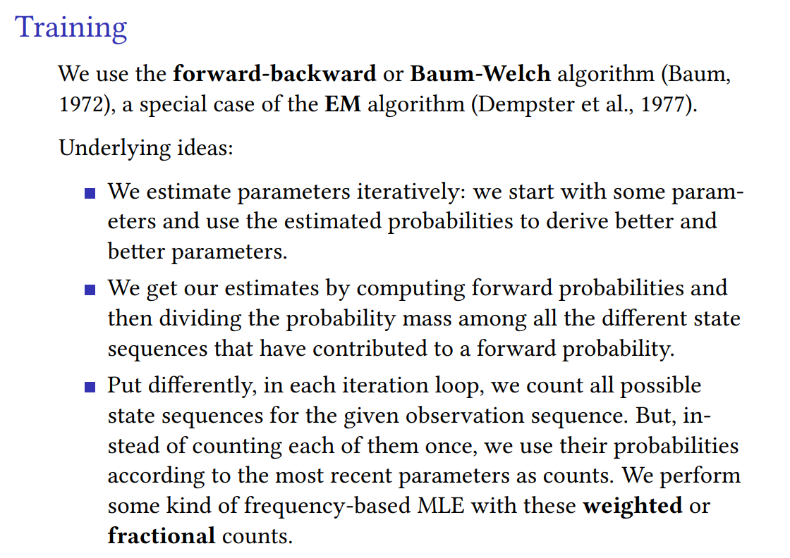

# Canonical Definition
> [!def]
> 

## Transition Probability
> [!def]

## Emission Probability
> [!def]

# Model Assumptions
> [!important]
> 
> Consider the following initial distribution, transition model, and sensor model:
> 
> 
> 从这里可以看出，`HMM`对概率图模型有着很强的约束，本质上是在说，所有的$y_i$仅由其相邻的状态决定(由`Markov Property`可知)。

# Three Fundamental Problems of HMM
> [!def]
> 

> [!example]
> 

## P1: Likelihood Computation
### Motivation
> [!motiv] Motivation
> 

### Naive Computing Procedure
> [!example] EECS189 Fa23 Notes
> 

> [!bug] Time Complexity
> 

### Forward Algorithm - DP
> [!algo]
> 

> [!example] EECS189 Notes - Computing Example and Visualization
> 

### Exercises
> [!example] EECS188 Fa23 Disc10 P1
> 

## P2: Decoding - Viterbi Algorithm
### Motivation
> [!motiv] Motivation
> 

### Viterbi Trellis - DP
> [!def]
> 

### Algorithm Procedures
> [!algo]
> 

## P3: Training HMM 
### Motivation
> [!motiv] Motivation
> 

## Naive Algorithm
> [!algo]
>  Assume $p(x_{k}|z_{k}),p(z_{k}|z_{k-1}), p(z_1)$ are all known, we want to compute $p(z_k|x)$.
>  
>  We could use bayes theorem and marginal probability:
>  $$p(z_{k}, x) = \sum\limits_{z_{1},\cdots, z_{k-1},z_{k+1},\cdots, z_{n}}p(x, z)$$ and $$p(x)=\sum\limits_{z_{1:n}}p(x, z)=\sum\limits_{z_1=1}^m\sum\limits_{z_2=1}^m\cdots\sum\limits_{z_n=1}^mp(x, z)$$
>  Then $p(z_{k}|x)=\frac{p(z_{k},x)}{p(x)}$.

> [!bug] Caveats - Time Complexity
> But notice that the time complexity is really huge, which is $\Theta(m^n)$, so we need the forward-backward algorithm to optimize it.

### Forward-Backward Algorithm
> [!algo]
> Assume $p(x_{k}|z_{k}),p(z_{k}|z_{k-1}), p(z_1)$ are all known, we want to compute $p(z_k|x)$
> 
> 注意到$p(z_{k}|x)\propto p(z_{k}, x_{1:n})=p(x_{k+1:n}|z_{k},x_{1:k})p(z_{k}, x_{1:k})$(贝叶斯公式), 我们发现:
> - $p(x_{k+1:n}|z_{k},x_{1:k})$长得很像`Backward Algorithm`要计算的东西
> - $p(z_{k}, x_{1:k})$就是`Forward Algorithm`要计算的东西
> 
> 所以我们其实会想证明$p(x_{k+1:n}|z_{k},x_{1:k})=p(x_{k+1:n}|z_{k})$, 也就是说$x_{k+1:n}\perp x_{1:k}$ given $z_{k}$, 事实真的如此吗?
> 
> 其实是的，因为`HMM`本质上也是一个概率图模型，所以我们可以使用`D-Separablility`来判断`node`之间的独立性, 答案也显而易见。

#### Forward Algorithm
> [!def]
> Forward algorithm is computing $p(z_{k}, x_{1:k}), \forall k=1,\cdots, n$
> 
> The key idea here is to use **bayes theorem** and **D-separation algorithm** to derive a **recusvie** expression that computes $p(z_{k}, x_{1:k})$ iteratively and efficiently.
> 
> First, using bayes theorem, we get:
> $$\begin{aligned}p(z_{k}, x_{1:k})&=\sum\limits_{z_{k-1}=1}^mp(z_{k},z_{k-1}, x_{1:k})\\&=\sum\limits_{z_{k-1}=1}^mp(x_{k}|z_{k}, z_{k-1}, x_{1:k-1})p(z_{k}|z_{k-1},x_{1:k-1})p(z_{k-1}, x_{1:k-1})\end{aligned}$$
> 
> Using D-separation algorithm, we get:
> $$p(x_{k}|z_{k}, z_{k-1}, x_{1:k-1})=p(x_{k}|z_{k})$$
> and $$p(z_{k}|z_{k-1},x_{1:k-1})=p(z_{k}|z_{k-1})$$
> 
> Finally, we have:
> $$\begin{aligned}p(z_{k}, x_{1:k})&=\sum\limits_{z_{k-1}=1}^mp(z_{k},z_{k-1}, x_{1:k})\\&=\sum\limits_{z_{k-1}=1}^mp(x_{k}|z_{k})p(z_{k}|z_{k-1})p(z_{k-1}, x_{1:k-1})\end{aligned}$$
> Notice that the first two terms are just the emssion probability and transition probability(part of parameters).
> 
> Denote $\alpha_{k}(z_k)=p(z_{k}, x_{1:k})$ we could get:
> $$\begin{aligned}\alpha_{k}(z_k)&=\sum\limits_{z_{k-1}=1}^mp(z_{k},z_{k-1}, x_{1:k})\\&=\sum\limits_{z_{k-1}=1}^mp(x_{k}|z_{k})p(z_{k}|z_{k-1})\alpha_{k-1}(z_{k-1})\end{aligned}$$ where $\alpha_{1}(z_1)=p(x_1|z_1)p(z_1)$

> [!important] Time Complexity
> For the time complexity, we have:
> - $\Theta(m)$ for each $z_{k}$, because we have to sum up $m$ possible states of $z_{k-1}$
> - $\Theta(m^2)$ for each $k$, since each $z_{k}$ could take $m$ states, and $\Theta(m)$ for each state.
> - $\Theta(m^2\cdot n)$ for the whole process since we have $n$ time steps.
> 

#### Backward Algorithm
> [!def]
> Backward algorithm is computing $p(x_{k+1:n}|z_{k}), \forall k=1,\cdots, n,\forall z_{k}=1,2,\cdots, m$

# Code Implementations

# Applications
## Inference

## Particle Filtering - Sampling HMM

