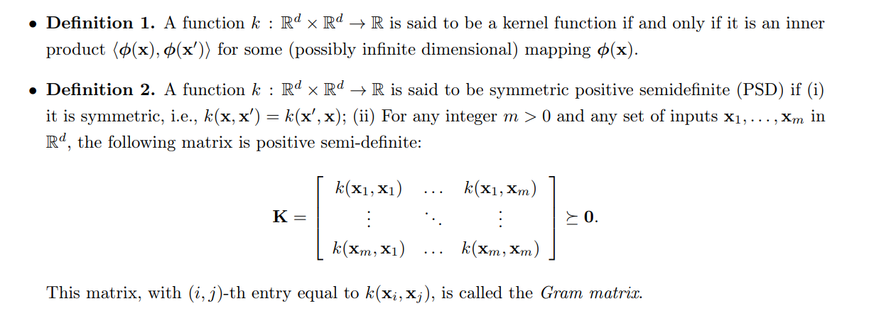
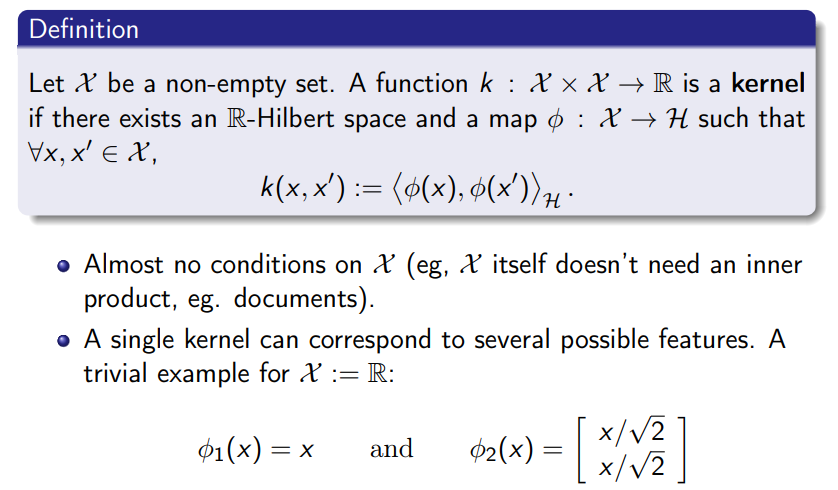
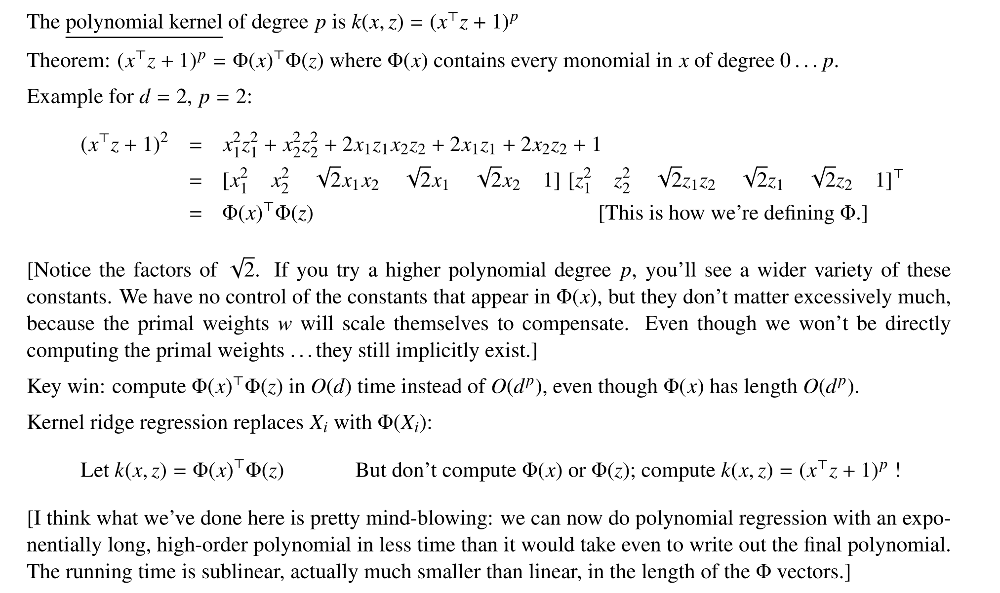
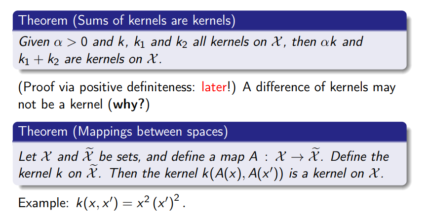
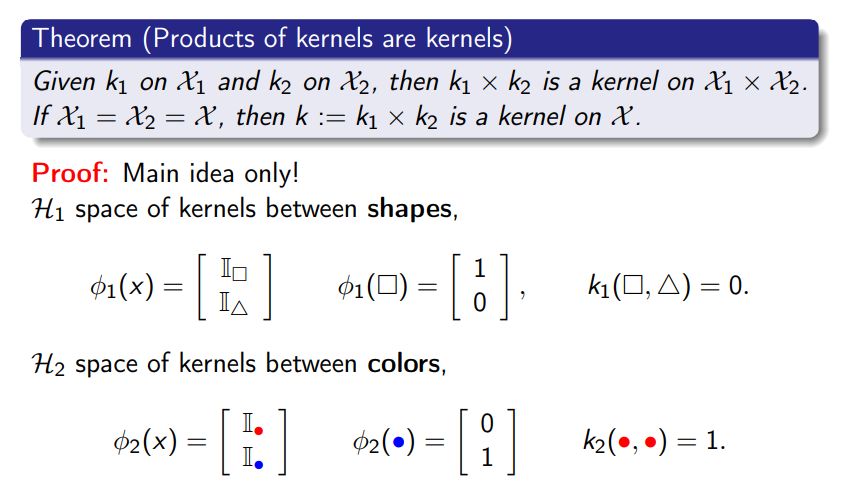
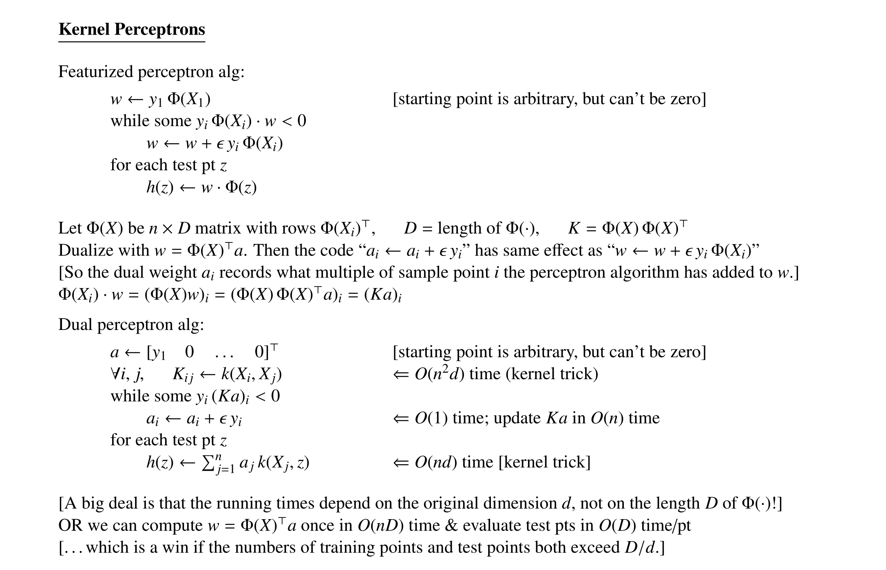
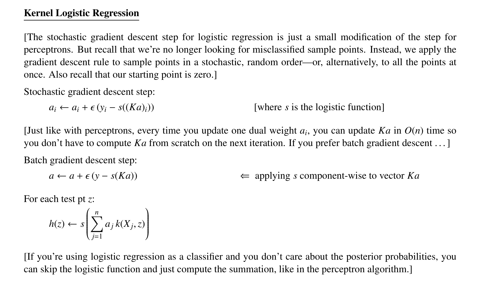
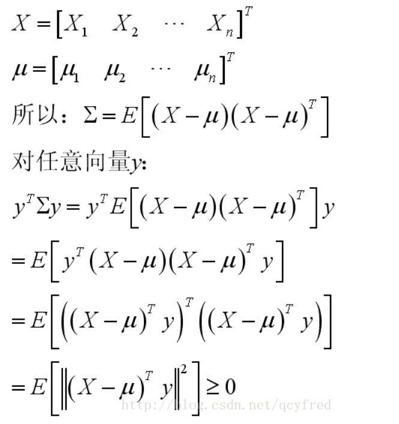
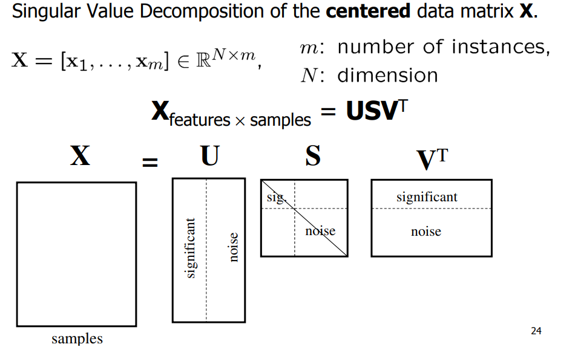
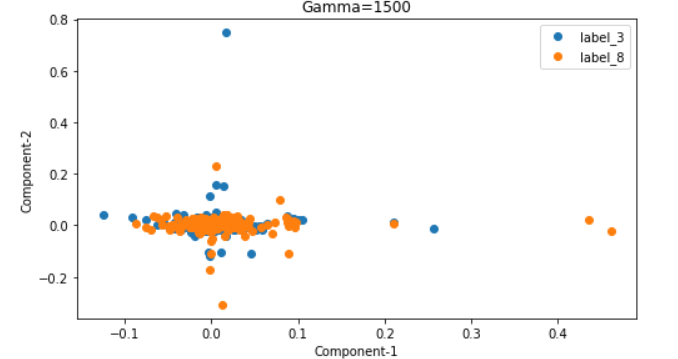

[MarailVertKernelMethods.pdf](https://www.yuque.com/attachments/yuque/0/2023/pdf/12393765/1682232570991-b2d6cdef-4cce-4bba-8aa6-4a6022963e55.pdf)
[Kernel_Notes_Basics.pdf](https://www.yuque.com/attachments/yuque/0/2023/pdf/12393765/1682232619244-1027c928-ea33-43c8-8008-f6664a5dff92.pdf)


# Kernel Basics
## Definition
### Simple Definition
> 


### Formal Definition
> 


## Hilbert Space
> 


## Types of Kernel
### Polynomial Kernel
> [!def]
> 


# Preserving Kernel Properties
## Summation Tricks
> [!important]
> 1. $\sum_{i}(a_i\sum_{j}b_j)=\sum_{i}\sum_{j}a_ib_j=\sum_{j}\sum_{i}a_ib_j=\sum_{i,j}a_ib_j$, 只要求和符号下面的下标是`Independent`的，就可以交换顺序。
> 2. $(\sum_{i}a_i)(\sum_{j}b_j)=\sum_{i}\sum_{j}a_ib_j=\sum_{i,j}a_ib_j$, 这个只要展开就可以证明，也很常用
> 3. $\sum_{i,j}a_ib_j=(\sum_{i}a_i)(\sum_{j}b_j)$, 作为结论`(2)`的逆命题也成立。
> 这些技巧在证明`Kernel Properties`的时候很有用。


## Properties
> [!property]
> 

### Sums of Kernels
> [!thm]
> 


### Products of Kernels
> [!thm]
> 


# Kernel Perceptrons
> [!def]
> 


# Kernel Logistic Regression
> [!def]
> 


# Kernel Ridge Regression
## Lemma
> [!lemma]
> 

> [!proof]
> 


## Algorithm
> [!algo]
> 


## Implementations
```python
import numpy as np
import pandas as pd
import matplotlib.pyplot as plt
%matplotlib inline
from sklearn.kernel_ridge import KernelRidge
from sklearn.linear_model import LinearRegression
from sklearn.decomposition import KernelPCA
from sklearn.datasets import load_digits
import seaborn as sns

para_lambda = [0.1, 0.5, 1]
para_gamma = [0.1, 0.5, 1, 2]

fig, axes = plt.subplots(4,3, figsize=(20, 20))

for i in range(len(para_lambda)):
    for j in range(len(para_gamma)):
        l = para_lambda[i] # lambda 就是 regularization term
        g = para_gamma[j] # gamma 就是 RBF kernel
        krr = KernelRidge(kernel="rbf", alpha=l, gamma=g).fit(X, y)
        y_hat = krr.predict(x_plot)
        axes[j, i].plot(x_plot,y_hat, label="predicted")
        axes[j, i].plot(x_data, y, "o", label="original")
        axes[j, i].set_title(f"lambda={l}, sigma={g}")
        axes[j, i].set(xlabel="x", ylabel="y_pred")
        axes[j, i].legend()

fig.savefig("./HW4_P2")
       
```


# Kernel PCA
## Convariance Matrix&Feature Map
> 首先是一些基本概念:
> 1. `Dataset Matrix`这是我们手里有的东西，我们令$\mathbf{X}=\begin{bmatrix} \mathbf{x_1}&\mathbf{x_2}&\cdots&\mathbf{x_n} \end{bmatrix}$, 其中$\mathbf{x_i}\in \mathbb{R}^d$, $\mathbf{X}\in \mathbb{R}^{d\times n}$。对数据做中心化之后得到$\mathbf{\bar{X}}=\begin{bmatrix} \mathbf{x_1-\bar{x_n}}&\mathbf{x_2-\bar{x_n}}&\cdots&\mathbf{x_n-\bar{x_n}} \end{bmatrix}\in \mathbb{R}^{d\times n}$
> 2. 中心化数据集$\mathbf{\bar{X}}$的`Centered Covariance Matrix`由公式$\frac{1}{n}\mathbf{\bar{X}\bar{X}^{\top}}\in \mathbb{R}^{d\times d}$给出，且这个矩阵一定是半正定的。
> 3. `Embedded Data Matrix(EDM)`: 假设存在一个`Feature Map` $\mathbb{R}^d\to \mathbb{R}^m$, 则特征映射矩阵为$\mathbf{\Phi}=\begin{bmatrix} \phi(\mathbf{x_1})&\phi(\mathbf{x_2)}&\cdots&\phi(\mathbf{x_n})\end{bmatrix}\in \mathbb{R}^{m\times n}$。我们期望$m>>n$，此时相当于我们把一个很低维的数据映射到很高维的空间中去，后续可以通过核方法，仅仅通过在$n$维空间中计算内积就可以间接得到高维空间中内积的结果。
> 4. `Centered Embedded Data Matrix(CEDM)`: 定义$\overline{\phi(\mathbf{x_n})}=\frac{1}{n}\sum_{i=1}^n\phi(\mathbf{x_i})$, 则我们有`Centered EFMM`如下 $\mathbf{\tilde{\Phi}}=\begin{bmatrix} \phi(\mathbf{x_1})-\overline{\phi(\mathbf{x_n})}&\phi(\mathbf{x_2)}-\overline{\phi(\mathbf{x_n})}&\cdots&\phi(\mathbf{x_n})-\overline{\phi(\mathbf{x_n})}\end{bmatrix}\in \mathbb{R}^{m\times n}$。$\mathbf{\tilde{\Phi}}=\mathbf{{\Phi}}-\overline{\phi(\mathbf{x_n})}\mathbf{1}_n^{\top}$(类比`Numpy`中的`Broadcasting`机制)。

**Proof for 2 Formulation**
1. `2-D Case`:

我们知道对于`Pairwised Data`$\{(X_1,Y_1),(X_2,Y_2),\cdots, (X_n, Y_n)\}$来说，他们之间的协方差公式是$\mathbb{E}[(X-\mathbb{E}[X])(Y-\mathbb{E}[Y])]$, 样本协方差是$\frac{1}{n}\sum_{i=1}^n(x_i-\overline{x_n})(y_i-\overline{y_n})=\frac{1}{n}(\sum_{i}x_iy_i)-\bar{x_n}\bar{y_n}$。但是如果我们对数据做中心化处理的话，也就是令$\tilde{x_i}=x_i-\overline{x_n}, \tilde{y_i}=y_i-\overline{y_n}$的话，对于这个`Centered Dataset`$\{(\tilde{x_1},\tilde{y_1}),\cdots,(\tilde{x_n},\tilde{y_n})\}$, 我们有$\frac{1}{n}\sum_{i=1}^n\tilde{x_i}=0$, $\frac{1}{n}\sum_{i=1}^n \tilde{y_i}=0$，所以此时我们的协方差是$\frac{1}{n}(\sum_{i=1}^{n}\tilde{x_i}\tilde{y_i})$。上述分析仅仅对于数据维度为$2$时成立，$\{(\tilde{x_1},\tilde{y_1}),\cdots,(\tilde{x_n},\tilde{y_n})\}$本质上可以写成矩阵形式$\mathbf{\bar{X}}=\begin{bmatrix} \tilde{x_1}&\tilde{x_2}&\cdots&\tilde{x_n}\\\tilde{y_1}&\tilde{y_2}&\cdots&\tilde{y_n} \end{bmatrix}\in \mathbb{R}^{2\times n}$, $\tilde{x_1}$是第一维，$\tilde{y_1}$是第二维。$\mathbf{\bar{X}}^{\top}=\begin{bmatrix} \tilde{x_1}&\tilde{y_1}\\\tilde{x_2}&\tilde{y_2}\\\vdots&\vdots\\\tilde{x_n}&\tilde{y_n}\end{bmatrix}\in \mathbb{R}^{n\times 2}$， 我们采用外积的方式计算$\frac{1}{n}\mathbf{\bar{X}\bar{X}^{\top}}=\frac{1}{n}\begin{bmatrix} \tilde{x_1}&\tilde{x_2}&\cdots&\tilde{x_n}\\\tilde{y_1}&\tilde{y_2}&\cdots&\tilde{y_n} \end{bmatrix}\begin{bmatrix} \tilde{x_1}&\tilde{y_1}\\\tilde{x_2}&\tilde{y_2}\\\vdots&\vdots\\\tilde{x_n}&\tilde{y_n}\end{bmatrix}$协方差矩阵, 为一系列秩一矩阵的加和, 得到$\frac{1}{n}\sum_{i=1}^n\begin{bmatrix} \tilde{x_i}\tilde{x_i}&\tilde{x_i}\tilde{y_i}\\\tilde{y_i}\tilde{x_i}&\tilde{y_i}\tilde{y_i}\end{bmatrix}$。符合我们的协方差的定义。

2. `N-D Case`:

推广到$d$维很容易。
**Proof for 2 Convariance Matrix is PSD**

## Projection Score
### On Centered Data
> [!def]
> `PCA`的一种常用计算方法是通过对中心化矩阵(`Centered Data Matrix`)进行奇异值分解, 不妨令奇异值分解(`Compact Version`)的结果为$\mathbf{\bar{X}}=\mathbf{U}_k\mathbf{\Lambda}_k\mathbf{V}_k^{\top}$, 其中$\mathbf{U_k}/\mathbf{V_k}$是协方差矩阵的前$k$个左/右奇异向量按列组成的矩阵, $\mathbf{\Lambda}_k$是奇异值方阵。$\mathbf{V_k}$一般用于从降维后的数据反构造出原来的中心化矩阵。
> 
> 1. `Score Vector`
> `PCA`的一大目的就是要得到`Score Vector`，`Score Vector`被定义为$\mathbf{\alpha_i}=\mathbf{U_k}^{\top}(\mathbf{x_i-\overline{x_n}})$, 本质上是中心化样本在$Col(\mathbf{U_k})$上的不同方向的投影大小，注意是大小，如果我们再左乘一个$\mathbf{U_k}$, 得到的$\mathbf{U_k\alpha_i}=\mathbf{U_{k}U_{k}^{\top}}(\mathbf{x_i}-\mathbf{\overline{x_n}})$才是投影后的向量。The coefficient $\mathbf{α_i}$ (score of the $i$th point) is used for the representation of data in a lower dimension space and dimension reduction.
> 注意到我们在进行奇异值分解任意矩阵$A=U\Sigma V^T$的时候, $A^{\top}A v = \lambda v$求出的特征向量$v$就是$A$的右奇异向量, $AA^{\top} u = \lambda u$求出的特征向量$u$就是$A$的左奇异向量。
> 所以为了得到上述$\mathbf{U_k}$, 我们需要求出$\mathbf{\bar{X}\bar{X}^{\top}}$的特征值。
> 2. `Score Matrix`
> 对于中心化数据矩阵我们有$\mathbf{\bar{X}}=\mathbf{U}_k\mathbf{\Lambda}_k\mathbf{V}_k^{\top}$, 左乘$\mathbf{U_k}^{\top}$得到$\mathbf{U_k}^{\top}\mathbf{\bar{X}}=\mathbf{U_k}^{\top}\mathbf{U}_k\mathbf{\Lambda}_k\mathbf{V}_k^{\top}=\mathbf{\Lambda}_k\mathbf{V}_k^{\top}$
> `Score Matrix`被定义为$\Alpha=\begin{bmatrix} \mathbf{\alpha_1}&\mathbf{\alpha_2}&\cdots&\mathbf{\alpha_n}\end{bmatrix}=\mathbf{U_k}^{\top}\mathbf{\bar{X}}=\mathbf{\Lambda}_k\mathbf{V}_k^{\top}$。

 

### On Embedded Data
> 和`PCA`类似。`Kernel PCA`也要得到`Score Vector`, 做法和上面类似，即对`Centered Feature Map Matrix`做奇异值分解得到矩阵$\mathbf{U_k}$, 于是根据前文的探讨我们的目标就是求出$\mathbf{\Phi}\mathbf{\Phi}^{\top}u=\lambda u$的`Top-k`特征值。其中$\|u\|=1$(一般会对特征值做正交化), **假设**$\mathbf{\phi}:\mathbb{R}^d\to \mathbb{R}^m$**且**$m>>n$
> 1. 由于我们知道协方差$\mathbf{\Phi}\mathbf{\Phi}^{\top}\in \mathbb{R}^{m\times m}$矩阵永远是半正定的，而且我们的目标是求出前`k`个特征值，所以我们只需要关心那些$\lambda>0$对应的特征向量。
> 2. 如果$\lambda >0$, 则$\mathbf{\Phi}(\frac{\mathbf{\Phi}^{\top}u}{\lambda})=u$, 令$\frac{\mathbf{\Phi}^{\top}u}{\lambda}=v\in \mathbb{R}^{n\times 1}$($v$其实就是右奇异向量)，则$\mathbf{\Phi}v=u$, 所以`CEDM`的特征值$u\in\mathbb{R}^{m\times 1}$在$\mathbf{\Phi}$的列空间中。
> 3. 因为$\frac{\mathbf{\Phi}^{\top}u}{\lambda}=v$, 所以$\|v\|_2^2=v^{\top}v=(\frac{\mathbf{\Phi}^{\top}u}{\lambda})^{\top}\frac{\mathbf{\Phi}^{\top}u}{\lambda}=\frac{1}{\lambda^2}u^{\top}\mathbf{\Phi}\mathbf{\Phi}^{\top}u=\frac{1}{\lambda^2}u^{\top}\lambda u=\frac{1}{\lambda}$
> 4. $\mathbf{\Phi}^{\top}\mathbf{\Phi}v=\mathbf{\Phi}^{\top}\mathbf{\Phi}(\frac{\mathbf{\Phi}^{\top}u}{\lambda})=\mathbf{\Phi}^{\top}(\mathbf{\Phi}\frac{\mathbf{\Phi}^{\top}u}{\lambda})=\mathbf{\Phi}^{\top}(\frac{\lambda u}{\lambda})=\mathbf{\Phi}^{\top}u=\lambda v$(By 3)

 

## Kernel Matrix for PCA
> 下面的讨论中，** 假设**$\mathbf{\phi}:\mathbb{R}^d\to \mathbb{R}^m$**且**$m>>n$
> 下面介绍在`Feature Mapped Data`上进行`PCA`的两种方法:
> 1. 直接对$\mathbf{\Phi}\mathbf{\Phi}^{\top}$(如果是`Centered Data`**则此时是协方差矩阵**)进行特征值分解(或者直接对$\mathbf{\Phi}$进行奇异值分解)得到左奇异向量矩阵$\mathbf{U_k}$, `Score Matrix`就是$\alpha=\mathbf{U_k^{\top}\mathbf{\Phi}=\Lambda^{-\frac{1}{2}}V_k^{\top}}$(因为$\mathbf{\Phi=U_k\Lambda^{-\frac{1}{2}}V_k^{\top}}$), 此时$\mathbf{\Phi}\mathbf{\Phi}^{\top}\in \mathbb{R}^{m\times m}$, 分解所需要考虑的参数量比较大。
> 2. 对$\mathbf{K}=\mathbf{\Phi}^{\top}\mathbf{\Phi}$(**核矩阵**)进行特征值分解(或者直接对$\mathbf{\Phi}$进行奇异值分解)得到右奇异向量矩阵$\mathbf{V_k}$,`Score Matrix`就是$\alpha=\mathbf{V^{\top}\Phi^{\top}\Phi}=\mathbf{V^{\top}K}$。此时$\mathbf{\Phi}^{\top}\mathbf{\Phi}\in \mathbb{R}^{n\times n}$, 分解所需要考虑的参数量比较小, 更推荐使用。

### Definition
> 定义`Kernel Matrix`为$\mathbf{K}=\mathbf{\Phi}^{\top}\mathbf{\Phi}\in \mathbb{R}^{n\times n}$，则:
> 1. $\Alpha = \mathbf{U^{\top}\Phi}$，因为$\mathbf{\Phi}v=u$, 所以$\mathbf{\Phi V=U}$, 于是$\Alpha=\mathbf{V^{\top}\Phi^{\top}\Phi}=\mathbf{V^{\top}K}$。
> 2. 假设我们需要$k$个特征值，则$\mathbf{V}\in \mathbb{R}^{n\times k}$, $\mathbf{\Phi}\in \mathbb{R}^{m\times n}$, $\mathbf{U}\in \mathbb{R}^{m\times k}$(写成$\mathbf{V_k, U_k}$)。可以看到$\mathbf{W}$的形状取决于样本量的大小$n$，特征值分解的秩$k$, 而和$m$(`Feature Dimension`无关)。此时我们有$\mathbf{\Phi V_k=U_k}$


### Without Kernel Trick
> 在$\mathbf{\Phi}\mathbf{\Phi}^{\top}=\mathbf{U_k\Lambda U_k^{\top}}$, $\Alpha=\mathbf{U_k^{\top}\mathbf{\Phi}=\Lambda^{-\frac{1}{2}}V_k^{\top}}$


### Kernel Trick
> Input: $\{\mathbf{x_1}, \mathbf{x_2}, \cdots, \mathbf{x_N}\}$
> 1. $\mathbf{K}_{ij}=k(\mathbf{x_i},\mathbf{x_j})$
> 2. $\mathbf{Kv_i}=\lambda_i\mathbf{v_i}$, $\forall i=1,2,\cdots, k$
> 3. Given $w$s.t. $\|v\|=1$, need $\tilde{v}$that satisfies $\|\tilde{v}\|^2=\frac{1}{\lambda}$， 即$\tilde{v}=\frac{1}{\sqrt{\lambda}}v$。对$\mathbf{K}$做对角化，有$\mathbf{K=V\Lambda V^{\top}=V_k\Lambda_{k}V_k^{\top}}$, 其中$\mathbf{\Lambda}\in \mathbb{R}^{n\times n}$是对角化得到的特征值矩阵，对角线上的元素是$\lambda_i$。另外，我们可以将$\mathbf{\Lambda_k}\in \mathbb{R}^{k\times k}$看成是一个`Scale Matrix`, 于是$\mathbf{\tilde{V_k}=V_k\Lambda^{-\frac{1}{2}}}$
> 4. $\Alpha=\mathbf{\tilde{V_k}^{\top}K=\Lambda_k^{-\frac{1}{2}}V_k^{\top}K}$。因为$\mathbf{K=V_k\Lambda_{k}V_k^{\top}}$, 则两边同乘以$\mathbf{V_k^{\top}}$得到$\mathbf{V_{k}^{\top}K=V_{k}^{\top}V_{k}\Lambda_{k}V_k^{\top}=\Lambda_k V_k^{\top}}$。 所以$\Alpha=\mathbf{\Lambda_k^{-\frac{1}{2}}V_k^{\top}K=\Lambda_k^{-\frac{1}{2}}\Lambda_k V_k^{\top}=\Lambda_k^{\frac{1}{2}}V_k^{\top}}$, 其中$\|(V_k)_i\|^2_2=1$


## KPCA on Centered Data
### Definition
> **假设**$\phi:\mathbb{R}^d\to \mathbb{R}^m$**且**$m>>n$, 定义$\overline{\phi}=\overline{\phi(\mathbf{x_n})}=\frac{1}{n}\sum_{i=1}^n\phi(\mathbf{x_i})$, 则我们的`Centered Embedded Data Matrix`如下 $\mathbf{\tilde{\Phi}}=\begin{bmatrix} \phi(\mathbf{x_1})-\overline{\phi(\mathbf{x_n})}&\phi(\mathbf{x_2)}-\overline{\phi(\mathbf{x_n})}&\cdots&\phi(\mathbf{x_n})-\overline{\phi(\mathbf{x_n})}\end{bmatrix}\in \mathbb{R}^{m\times n}$，则:
> 1. 协方差矩阵:  $\mathbf{\Sigma_{\mathbf{\Phi}}}=\frac{1}{n}\mathbf{\tilde{\Phi}\tilde{\Phi}^{\top}}\in \mathbb{R}^{m\times m}$
> 2. 核矩阵:  $\mathbf{\tilde{K}=\tilde{\Phi}^{\top}\tilde{\Phi}}\in \mathbb{R}^{n\times n}$。下面我们计算$\mathbf{\tilde{K}}$，我们不想直接计算出$\mathbf{\tilde{\Phi}}$, 而是想要借助`Kernel Trick`计算低位的点积间接得到结果。


### Compute Centered Kernel
> **定义**$\phi(\mathbf{x_i})-\overline{\phi}=\tilde{\phi}(\mathbf{x_i})$
> $\begin{aligned} \mathbf{\tilde{k}(x,y)} &= \mathbf{\tilde{\phi}(x)^{\top}\tilde{\phi}(y)} \\ &=\mathbf{(\phi(x)-\overline{\phi})^{\top}(\phi(y)-\overline{\phi})}\\&=\phi(\mathbf{x})^{\top}\phi(\mathbf{y})-\phi(\mathbf{x})^{\top}\overline{\phi}-\overline{\phi}^{\top}\phi(\mathbf{y})+\overline{\phi}^{\top}\overline{\phi}\\&=\mathbf{k(x,y)}-\frac{1}{n}\phi(\mathbf{x})^{\top}\sum_{i=1}^n\phi(\mathbf{x_i})-\frac{1}{n}\sum_{j=1}^n\phi(\mathbf{x_j})^{\top}\phi(\mathbf{y})+\frac{1}{n^2}\sum_{i=1}^n\phi(\mathbf{x_i})^{\top}\sum_{j=1}^n\phi(\mathbf{x_j})\\&=\mathbf{k(x,y)}-\frac{1}{n}\sum_{i=1}^n\mathbf{k(x,x_i)}-\frac{1}{n}\sum_{j=1}^n\mathbf{k(x_j,y)}+\frac{1}{n^2}\sum_{i=1}^n\sum_{j=1}^n\mathbf{k(x_i,x_j)}\end{aligned}$
> **所以:**
> $\begin{aligned}\mathbf{\tilde{K}}_{ij}&=\mathbf{\tilde{k}(x_i,x_j)}\\&=\mathbf{k(x_i,y_j)}-\frac{1}{n}\sum_{j=1}^n\mathbf{k(x_i,x_j)}-\frac{1}{n}\sum_{i=1}^n\mathbf{k(x_i,y_j)}+\frac{1}{n^2}\sum_{i=1}^n\sum_{j=1}^n\mathbf{k(x_i,x_j)} \end{aligned}$
> **其中:**
> 1. $\mathbf{k(x_i,x_j)}-\frac{1}{n}\sum_{j=1}^n\mathbf{k(x_i,x_j)}$意思是: 对于$\mathbf{K}$中第$i$行第$j$列的元素，我们减去所有第$i$行元素的和(相当于在列方向求和)的平均值。列方向求和用矩阵记号表示就是$\mathbf{K}\mathbf{1_n}$，得到的是一个向量。现在对于所有列我们都要减去$\mathbf{K}\mathbf{1_n}$, 用矩阵表示就是$\mathbf{K}\mathbf{1_n1_n^{\top}}$(就是对这个列在行方向上复制$n$份的意思)
> 2. $\frac{1}{n}\sum_{i=1}^n\mathbf{k(x_i,y_j)}$就是在`Summing the rows`, 和上面的推导类似，矩阵表示为$\mathbf{1_n1_n^{\top}}\mathbf{K}$
> 3. $\sum_{i=1}^n\sum_{j=1}^n\mathbf{k(x_i,x_j)}$表示对于$\mathbf{K}$中第$i$行第$j$列的元素, 都减去这个值(矩阵$\mathbf{K}$中所有元素之和)，这个值可以看成是先`Summing the rows`再`Summing the columns`的结果, 矩阵表示为$\mathbf{1_n^{\top}}\mathbf{K}\mathbf{1_n}$, 但是我们要对矩阵中所有$i-j$元素都减去$\mathbf{1_n^{\top}}\mathbf{K}\mathbf{1_n}$, 所以表示为$\mathbf{1_n^{\top}}\mathbf{K}\mathbf{1_n}\mathbf{1_n}\mathbf{1_n}^{\top}$
> 4. 定义$\mathbf{J_n=I_n-\frac{1}{n}1_n1_n^{\top}}$, called centering matrix.
> 
**于是:**
> $\begin{aligned}\mathbf{\tilde{K}}&= \mathbf{K}-\frac{1}{n}\mathbf{K}\mathbf{1_n1_n^{\top}}-\frac{1}{n}\mathbf{1_n1_n^{\top}}\mathbf{K}+\frac{1}{n^2}\mathbf{1_n^{\top}}\mathbf{K}\mathbf{1_n}\mathbf{1_n}\mathbf{1_n}^{\top}\\&=(\mathbf{I_n-\frac{1}{n}1_n1_n^{\top})K(I_n-\frac{1}{n}1_n1_n^{\top})}\\&=\mathbf{J_{n}KJ_n^{\top}}\end{aligned}$


### Computing Procedure
> Given Input data: $\{\mathbf{x_1,x_2,\cdots, x_n}\}$, $\mathbf{k(x,y)}$, where $\mathbf{x_i}\in \mathbb{R}^{d}$
> 1. $\mathbf{K_{ij}=k(x_i,x_j)}, \mathbf{\tilde{K}=JKJ^{\top}}$
> 2. $\mathbf{\tilde{K}=V_k\Lambda_k V_k^{\top}}$
> 3. $\Alpha=\mathbf{\Lambda^{\frac{1}{2}}V_k^{\top}}$


## Out of Sample Extension
> **对于不在数据集中的数据点**$\mathbf{x}$**，我们有以下投影步骤:**
> 1. Linear PCA: $\mathbf{y=U^{\top}(x-\mu)}$
> 2. Nonlinear PCA: $\mathbf{y=U^{\top}(\phi(x)-\bar{\phi})}$, 也就是$y_i=u_i^{\top}(\phi(\mathbf{x})-\bar{\phi})$, 我们有$v=\lambda^{-1}\mathbf{\Phi^{\top}u}$和$\mathbf{\Phi}v=u$, 红体字说的是，`Eigenvectors`$u$`of the Convariance Matrix`$\mathbf{\Phi\Phi^{\top}}$`is the linear combination of the embedded data points and the coefficients is given by the eigenvectors of the kernel`$\mathbf{\Phi^{\top}\Phi}$。
> 3. $\mathbf{\Phi}v=u$很重要，因为$\mathbf{\Phi}\in \mathbb{R}^{m\times n}$,$u \in \mathbb{R}^m$, $v\in \mathbb{R}^n$, 其中$m>>n$, 所以我们总是可以通过一个有限维数的特征向量$v$左乘`Embedded Data Matrix`就得到一个潜在的的无限维的特征向量$u$。
> 4. $y_i=\mathbf{u_i}^{\top}(\phi(\mathbf{x})-\bar{\phi})$, $\mathbf{u_i}=\mathbf{\Phi v_i}=\sum_{j=1}^n\phi(\mathbf{x_j})\mathbf{(v_{i})_j}$, 所以$\begin{aligned}y_i&=\sum_{j=1}^n\mathbf{(v_{i})_j}\phi(\mathbf{x_j})^{\top}(\phi(\mathbf{x})-\bar{\phi})\\&=\sum_{j=1}^n\mathbf{(v_{i})_j}(k(x_j,x)-\cdots)\\&=\mathbf{v_i}^{\top}K_{x}\end{aligned}$, where $\mathbf{v_i}\in \mathbb{R}^n,K_x\in \mathbb{R}^{n}$,$K_x=\begin{bmatrix} k(x_1,x)\\k(x_2,x)\\\vdots\\k(x_n,x)\end{bmatrix}$


## KPCA Implementations
```python
# Load the minst_test_data
minst_data = pd.read_csv("./mnist_test.csv", header=None)
label_3_8_data = minst_data[(minst_data[0]==3)|(minst_data[0]==8)].reset_index().iloc[:,1:]
label_3_index =label_3_8_data.index[label_3_8_data[0]==3]
label_8_index = label_3_8_data.index[label_3_8_data[0]==8]
data_matrix = label_3_8_data.iloc[:,1:]


k = 2
param_gamma = [800, 1500, 2000]
fig, axes = plt.subplots(3,1, figsize=(8, 15))
for i in range(len(param_gamma)):
    gamma = param_gamma[i] # gamma 就是 RBF Kernel 中的sigma
    transformer = KernelPCA(n_components=k, kernel='rbf', eigen_solver="auto", random_state=42, gamma=gamma)
    X_transformed = transformer.fit_transform(data_matrix)
    axes[i].plot(X_transformed[label_3_index,0], X_transformed[label_3_index,1], "o", label="label_3")
    axes[i].plot(X_transformed[label_8_index,0], X_transformed[label_8_index,1], "o", label="label_8")
    axes[i].set_xlabel("Component-1")
    axes[i].set_ylabel("Component-2")
    axes[i].legend()
    axes[i].set_title(f"Gamma={gamma}")

plt.savefig("./HW4_P3.jpg")
```
**Output**


# RKHS
## Introduction
> 


# Kernel SVM
> 


