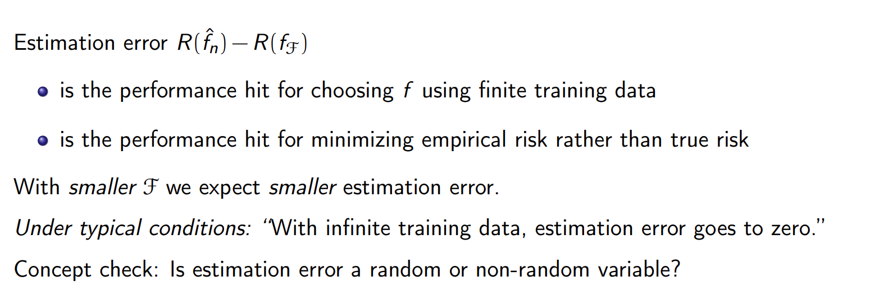

# Decision Theory Framework
## General Setup
> [!important]
> 

# Risk Minimization
## Frequentist Risk
> [!def]
> 

## Bayesian Posterior Risk
> [!def]
> 

## Bayes Risk
> [!def]
> 

## Risk Minimization Scheme
> [!def]
> 

> [!example] Square Loss
> 

> [!example] 0-1 Loss
> 

> [!example] Exponential Loss

> [!example] Logistic Loss
> 

> [!example] Hinge Loss

# Empirical Risk Minimization(ERM)
## General Setup
> [!def]
> We cannot compute $R(f)=\mathbb{E}[l(f(X),Y)]$ since we don't know $P_{\mathcal{X}\times\mathcal{Y}}$
> 

## Constrained ERM
### Overfitting Problem Using ERM
> [!example]
> 
> But under this prediction function, $\hat{f}$ has empirical risk = 0, since we correctly predict each data point. But the risk is 1 since for data point other than 0.25, 0.5, 0.75(unobserved one), the risk is 1, so the expectation should be 1.
> 
> 

### Hypothesis Spaces
> [!def]
> 

### CERM Algorithm
> [!def]
> 

## Excess Risk Decomposition
### Error Decomposition
> [!def]
> 

### Excess Risk Decomposition For ERM
> [!def]
> 
> 
> **Approximation Error:** How good is the hypothesis class relative to all function? Should be a non-random value(the difference between two expectation).
> 
> **Estimation Error:** Within hypothesis class, how good is the learned predictor? Should be a random variable, since $\hat{f}$ depends on the data and they are random.
> 
> 

## Optimization Error
> [!def]
> 

## Error Decomposition in Practice
> [!def]
> 

# Bias and Variance Decomposition
## Metric
> [!def]
> 

## Generalization Error
> [!def]
> 
> Note that the generalization error could be chosen as MSE, defined by:
> $$\mathbb{E}_{\mathcal{D},Y}[(h(\mathbf{x};\mathcal{D})-Y)^2]$$
> where $h(\cdot)$ is our model, which is trained on a random data $\mathcal{D}$.
> 
> Note that we can choose different error function to do such decomposition.

 

## BV Decomposition
> [!important]
> 
> Here the irreducible error is the lower bound for our generalization error, which is the error that any model will not be able to get rid of, indicating the difficulty of this task.
> 
> 

> [!important] Alternative Derivations
> 

## Summary
> [!summary] 
> 

# Bias-Variance Tradeoff and Regularization
> [!example] DS-GA-1003 Sp24 P5 / EECS189 Fa23 HW5 P1
> 

