# MVG Basics
## What makes a MVG
> [!important]
> 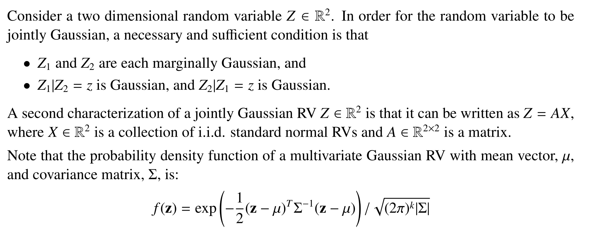

> [!example] Check MVG
> 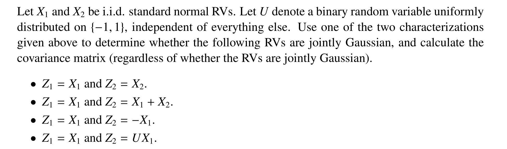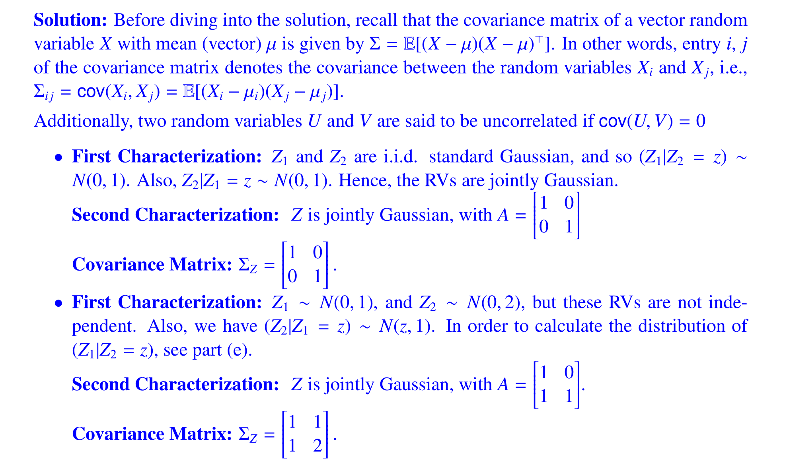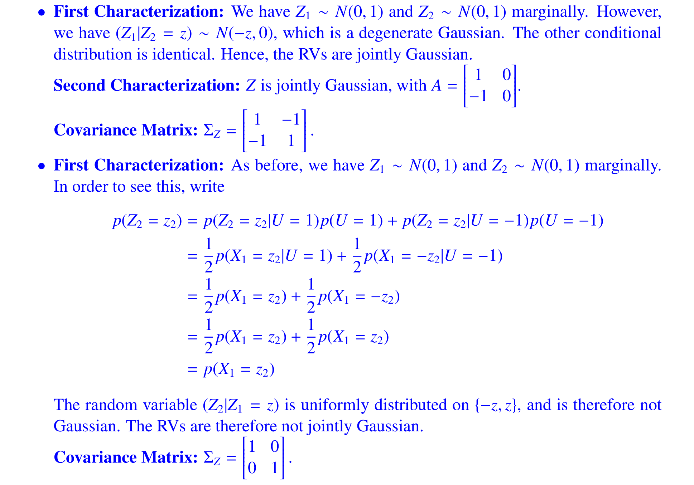

## Correlatedness and  Independence
> [!important]
> Generally, for two Gaussian RVs $X_1$ and $X_2$, we have:
> 1. If $X_1$ and $X_2$ are jointly gaussian, then $Cov(X_1,X_2)=0\implies X_1\perp X_2$ 
> 2. If $X_1$ and $X_2$ are both gaussian but **not jointly gaussian**, then $Cov(X_1,X_2)=0$ doesn't imply $X_1\perp X_2$, as is shown in the example 4 above.
> 
> 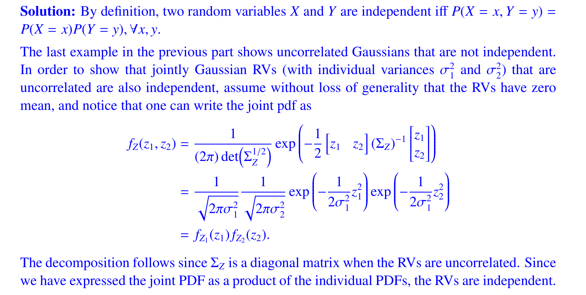

## Linear Transformation of Random Vector
> [!important]
> Suppose $Z=VX$ where $V\in \mathbb{R}^{2\times 2}$ and $X\sim \mathcal{N}(\vec{0},I_2)$, then we have: $E[Z]=0$ and $\Sigma_Z=V\Sigma_XV^{\top}$ and the derivations are as follows:
> 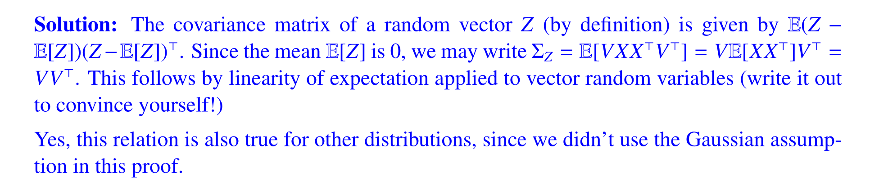
> 
> Note that this is true for all random vectors.

> [!example] Application
> 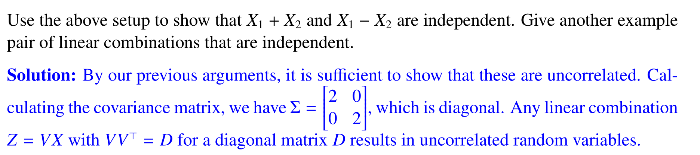

# Conditional Gaussian
## 2-d Case
> [!important]
> Suppose we have jointly gaussian random vector $\begin{bmatrix} Z_1&Z_2\end{bmatrix}^{\top}\sim\mathcal{N}(\begin{bmatrix} \mu_1\\\mu_2\end{bmatrix},\Sigma_Z)$ where $\Sigma_Z=\begin{bmatrix} \Sigma_{11}&\Sigma_{12}\\\Sigma_{21}&\Sigma_{22}\end{bmatrix}=\begin{bmatrix} \sigma_1^2&\rho\sigma_1\sigma_2\\\rho\sigma_1\sigma_2&\sigma_2^2\end{bmatrix}$, then we have:
> $$Z_1|Z_2=z_2\sim\mathcal{N}(\mu_1+\rho\sigma_1(\frac{z_2-\mu_2}{\sigma_2}),(1-\rho^2)\cdot\sigma_1^2)$$
> 
> Several Observations we made:
> 1. The posterior variance $\sigma_{Z_1|Z_2}^2\leq\sigma_{Z_1}^2$ is smaller then prior variance, meaning that data makes us more certain where the parameter lies.

> [!proof] Proof by algebra
> 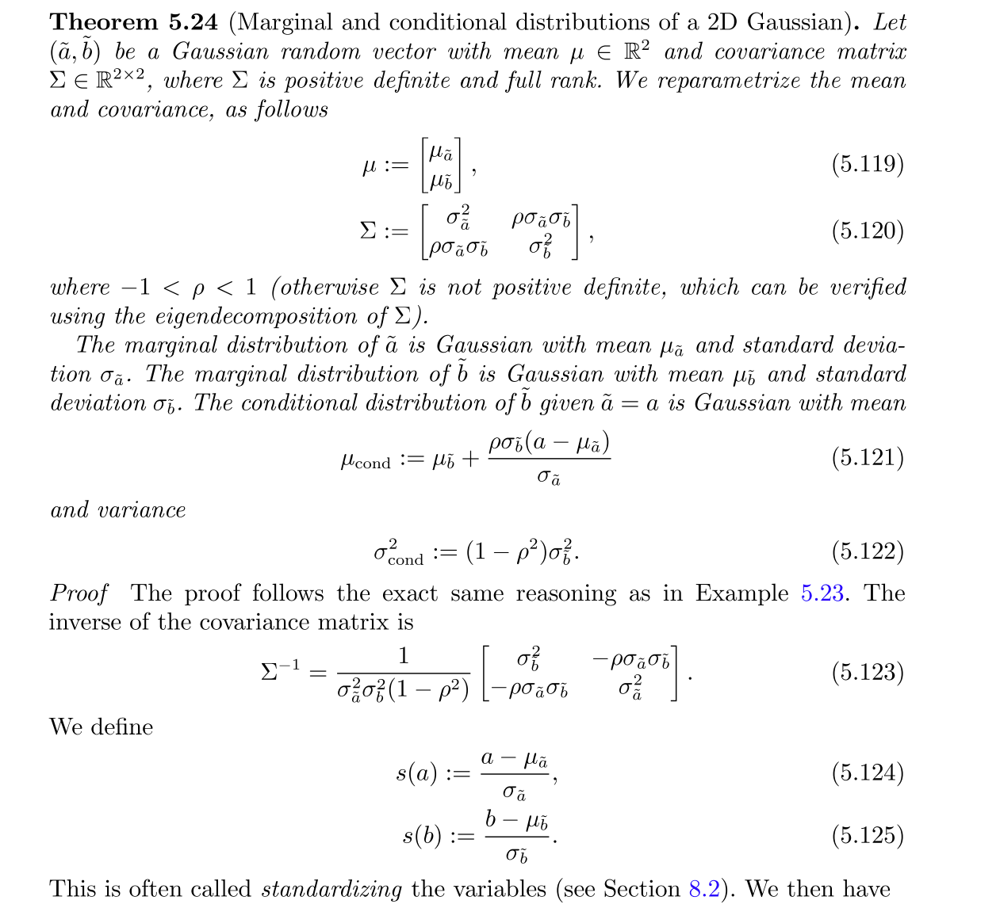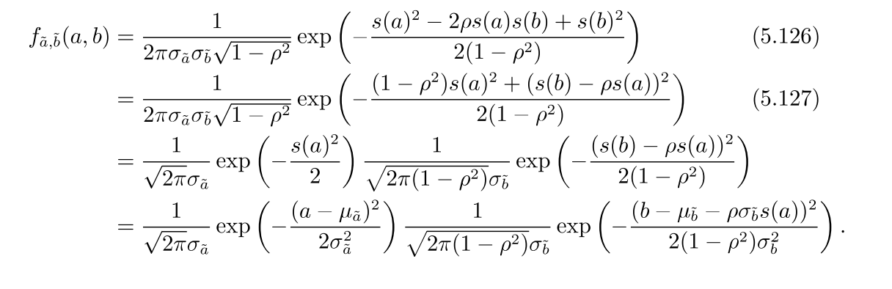

> [!proof] Proof by Linear Algebra(Zero Mean Case)
> 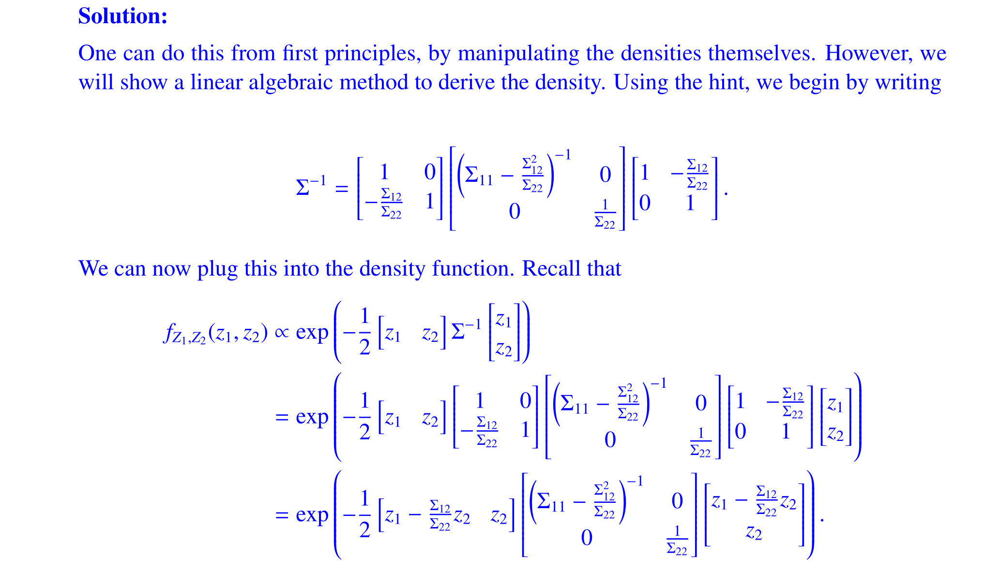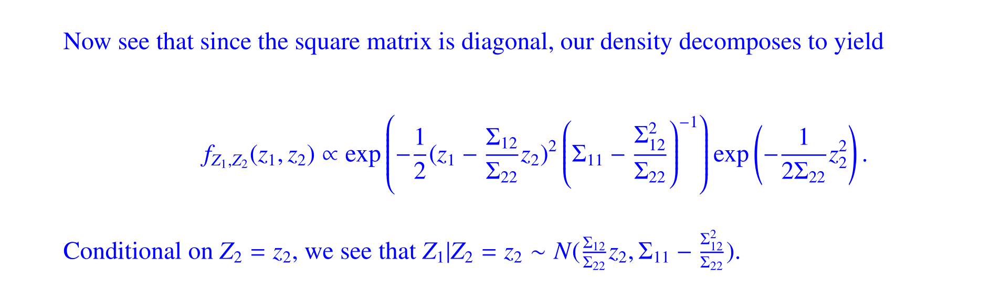
> Note that the last step follows from dividing by the marginal pdf of $Z_2=z_2$
> 
> **Remarks:**
> 1. Recall that $\Sigma_{11}-\frac{\Sigma_{12}^2}{\Sigma_{22}}$ is actually the schur complement of the matrix $\Sigma_{22}$ in matrix $\Sigma_Z$.

## General Case
> [!important]
> Preliminary:
> 
> 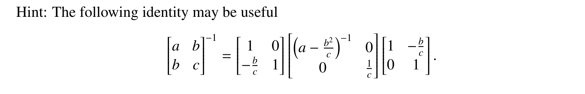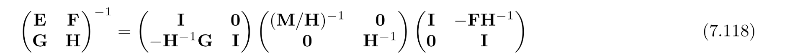
> Derivations:
> 
> 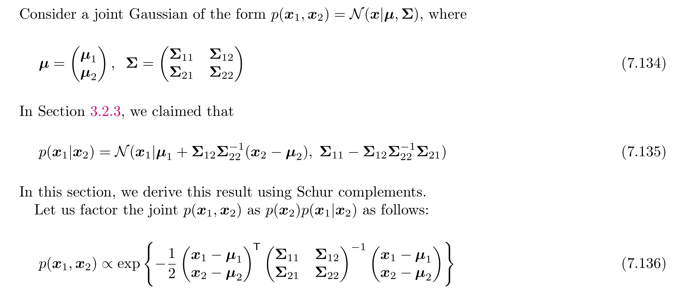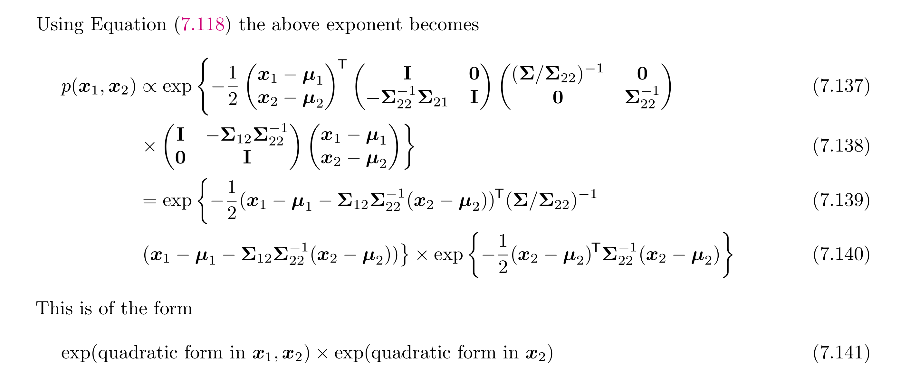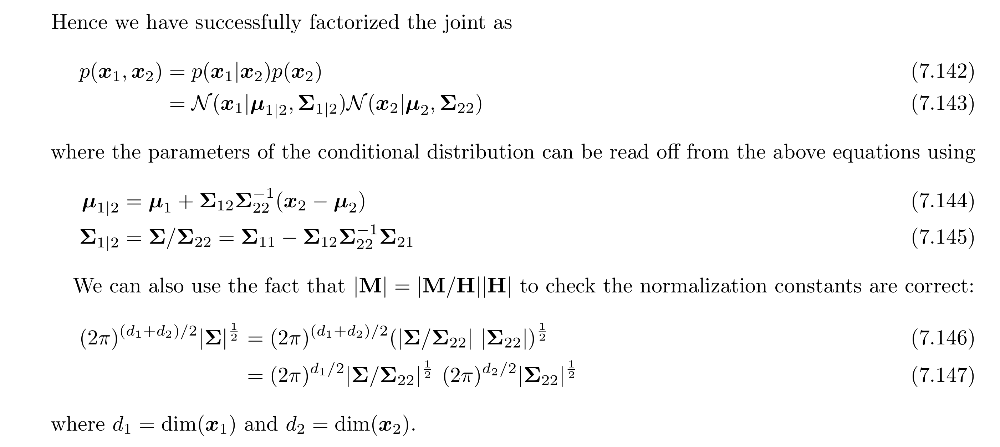

# Bayes Rule for Gaussians

