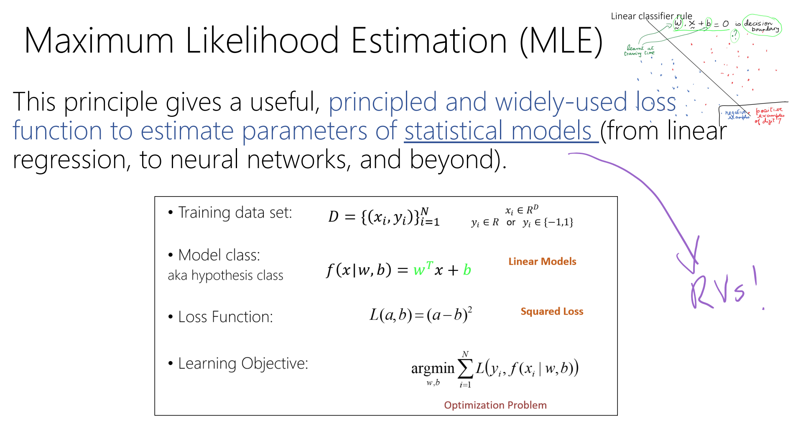
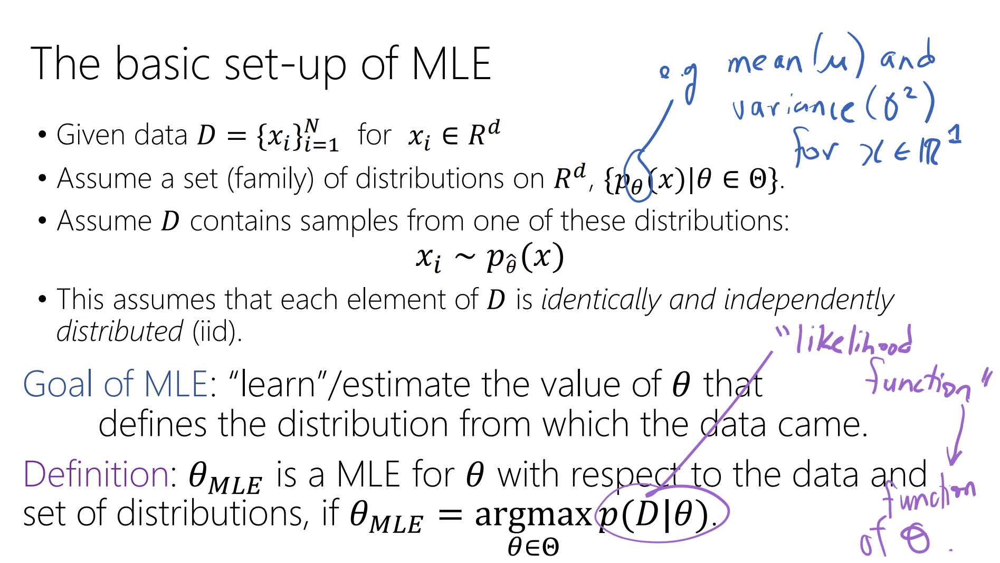
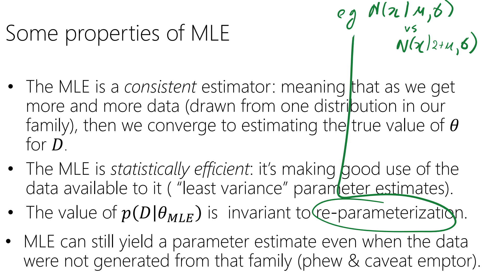
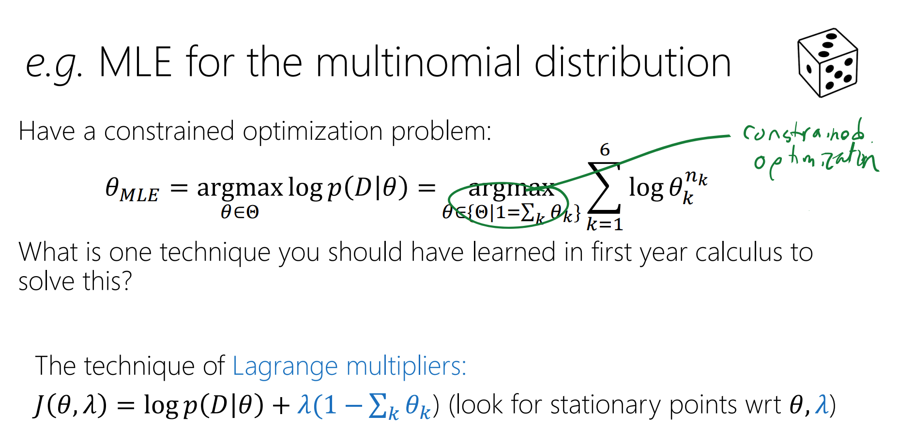

# MLE Basics
## ML Main Abstract Idea
> [!def]
> 

## Basic Setup
> [!important]
> 

## Properties
> [!important]
> 

## MLE for Multivariate Gaussian

## MLE for Multinomial Distribution
> [!important]
> 

 
# MAP Basics

