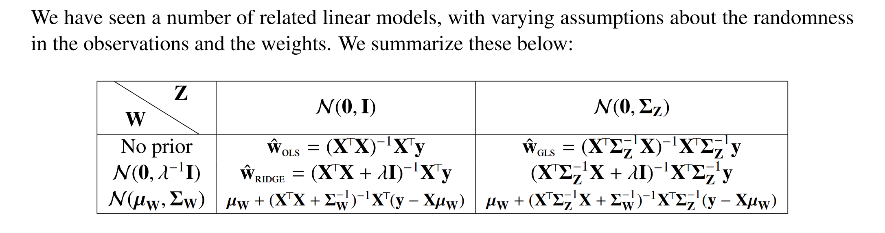

# Linear Regression
## Overview
> [!overview]
> 
> Basically we are making assumptions about the randomness of the data and that of the weight.
> 
> And it is just the tug of war between the prior and likehood distribution that determines the posterior distribution. [Priors&Posteriors](../../../../Data_Science/Statistical_Inference/Bayesian_Statistics/Priors&Posteriors.md)
> 
> For all of the following discussion, we assume that the observation takes the form $$\vec{y}=X\vec{w}+\vec{z}$$ where:
> 1. $X$ is our data matrix(each row is a data point of $d$ dimension)
> 2. $\vec{y}$ is our noisy observation.
> 3. $\vec{z}$ is our noise. 
> 4. $\vec{w}$ is out parameters.
> 5. **Likelihood:** $\vec{z}$'s covariance matrix $\Sigma_Z$controls the weights we put on each data point. The bigger the eigenvalue value $\lambda_i(\Sigma_Z)$ is, the smaller variance of that data point, and the more weight will be put on the data point since it is likely match the true underlying de-noised point.
> 6. **Prior:** $\vec{w}$'s covariance matrix $\Sigma_W$ controls the weights we put on the regularization terms. When i-th eigenvalue $\lambda_i(\Sigma_W)$ is large, this means $w_i$ may take on a wide range of values. Thus we do not want to penalize that dimension as much, preferring to let the data fit sort it out and the weight(force of penalization) will be small.
> 7. The weights mentioned earlier is determined by the eigenvalues of $\Sigma_Z^{-1}$ for data points and eigenvalues of $\Sigma_W^{-1}$ for the parameters.

## Ordinary Least Square
> [!def]
> When $\vec{z}\sim \mathcal{N}(\vec{0},\sigma^2I_n)$, our MAP becomes:
> $$\begin{aligned}\hat{\mathbf{w}}&=\underset{\mathbf{w} \in \mathbb{R}^d}{\arg \max }~p(\mathbf{w}|Y_{1,\cdots,}Y_n,X_{1,\cdots,}X_n,\sigma^2)\\&=\underset{\mathbf{w} \in \mathbb{R}^d}{\arg \max }~\frac{p(Y_{1,\cdots,}Y_n|\mathbf{w},X_{1,\cdots,}X_n,\sigma^2)p(\mathbf{w})}{p(Y_{1,\cdots,}Y_n,X_{1,\cdots,}X_n,\sigma^2)}\\&=\underset{\mathbf{w} \in \mathbb{R}^d}{\arg \max }~\frac{L(\mathbf{w})p(\mathbf{w})}{P(Y_{1,\cdots,}Y_n)}\\&=\underset{\mathbf{w} \in \mathbb{R}^d}{\arg \max }~L(\mathbf{w})p(\mathbf{w})\\&=\left(\sum_{i=1}^n \left(y_i-\mathbf{x}_i^{\top} \mathbf{w}\right)^2\right)\end{aligned}$$
> 
> $$\underset{\mathbf{w} \in \mathbb{R}^d}{\arg \min }\left(\sum_{i=1}^n \left(y_i-\mathbf{x}_i^{\top} \mathbf{w}\right)^2\right)$$

## Weighted Least Square
> 

# Polynomial Regression

# Kernel Regression

# Logistic Regression

# Automatic Relevancy Determination(ARD)

