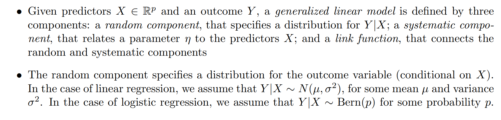
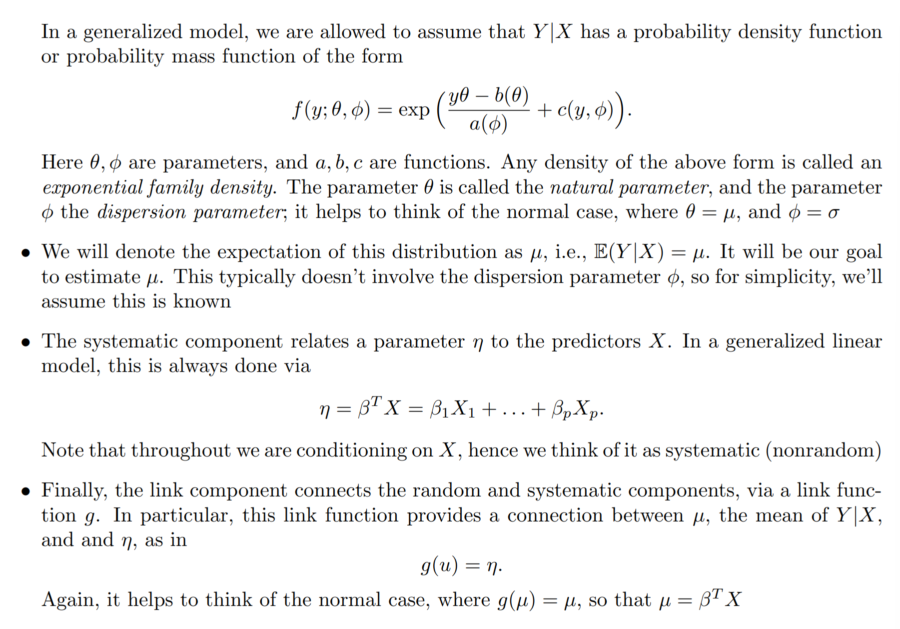
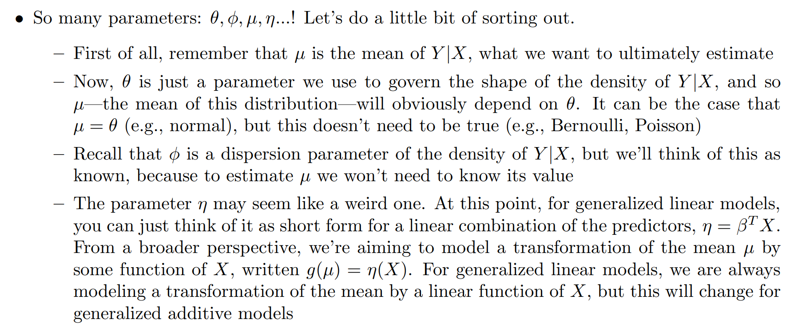
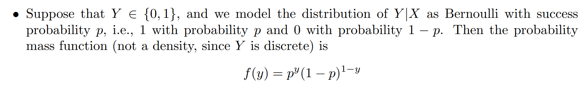
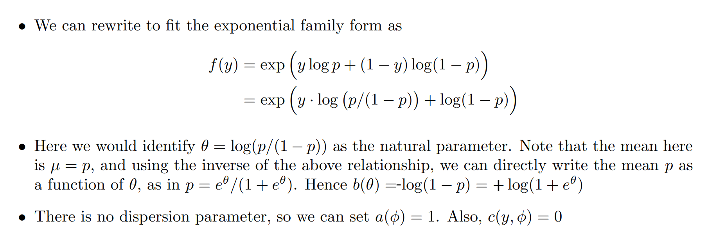
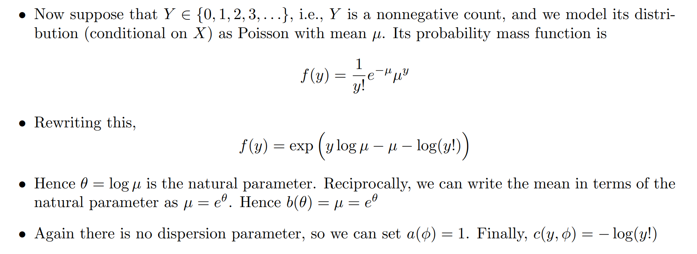
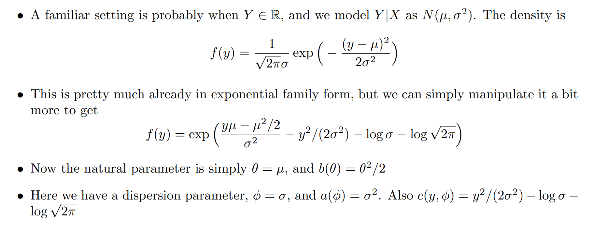
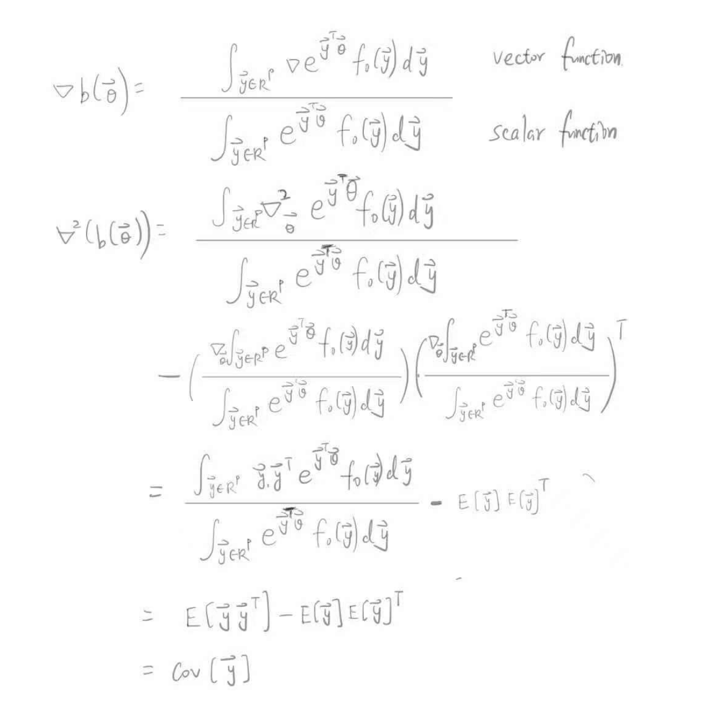
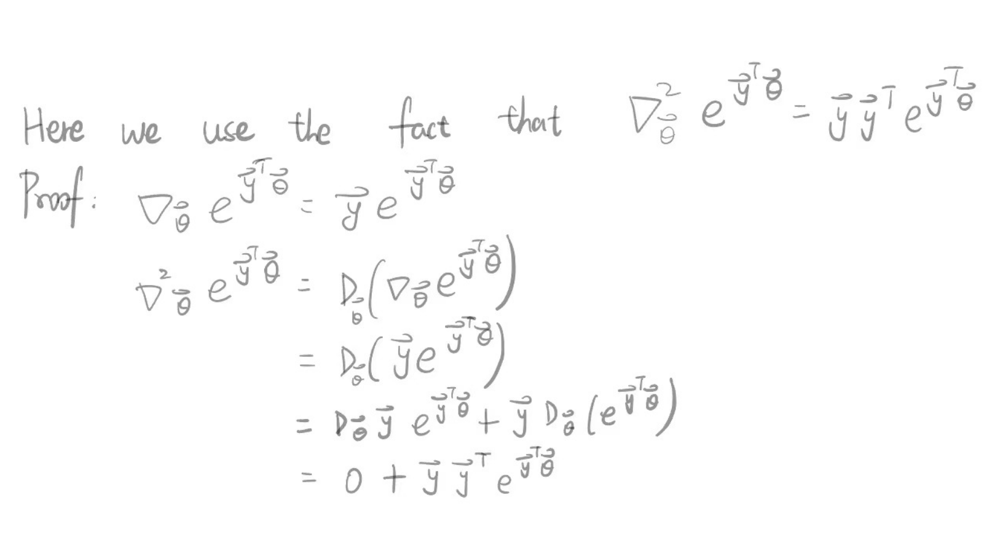
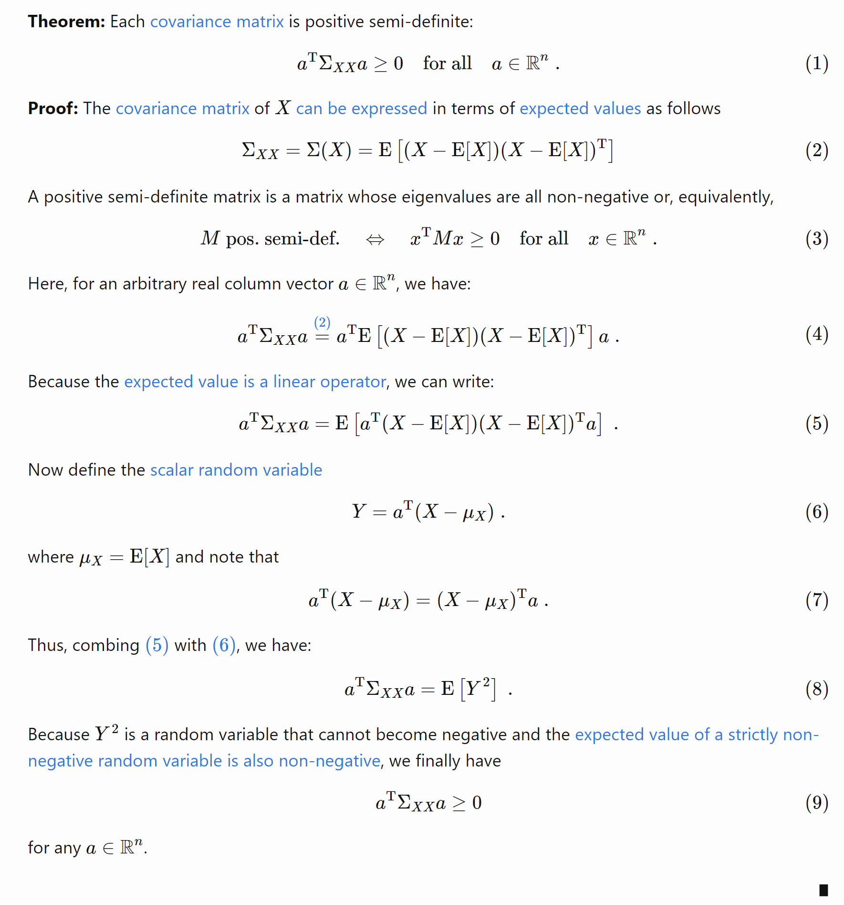

# Generalized Linear Models
## Exponential Family Distrubution
> [!def]
> Suppose we have $\mathcal{D}=\{(\vec{x}_1,y_1),(\vec{x}_2,y_2),\cdots, (\vec{x}_n,y_n)\}$ where $\vec{x}_i\in\mathbb{R}^p$.
> 
> And then we have to model output $\vec{y}$ by some distribution which is parametrized by some **natural parameter** $\vec{\theta}$, then we can write the probability density of $\vec{y}$ as $$f(\vec{y}|\vec{\theta},\vec{\phi})=e^{\frac{\vec{y}^{\top}\vec{\theta}-b(\vec{\theta})}{a(\vec{\phi})}}f_0(\vec{y},\sigma^2)$$ where 
> - $\vec{\theta}$ is the (input dependent) **natural parameter** of the distribution and is determined by the dataset structure. 
> - $\vec{\phi}$ is called the **dispersion parameter** of the exponential family distribution, which contains the assumptions we made on the model. In the normal case, we have $\vec{\theta}=\vec{\mu}$ and $\vec{\phi}=$
> - $b(\vec{\theta})=log(\int_{\mathbb{R}^n}e^{\vec{y}^{\top}\vec{\theta}-b(\vec{\theta})}f_0(\vec{y},\sigma^2)d\vec{y})$ is called log-normalizer that ensures that $f(\vec{y},\vec{\theta},\sigma^2)$ is a valid probability distribution.

## GLM Formulation
> [!def]
> 

## MLE Formulation
> [!concept]
> Suppose the model coefficients are fixed(frequentist perspective), the MLE is equivalent to the following optimization problem:
> $$\max_{\vec{\beta}}f(\vec{y},X\vec{\beta})$$

# Exponential Distribution Examples
## Bernoulli Model
> [!def]
> 
> Here the canonical link function is calculated as follows:
> 1. $\mu=\mathbb{E}_{Y\sim{\mathbb{R}_{Y\mid X}}}[Y|X]=p$
> 2. $\eta=\vec{\beta}^{\top}X=\theta$
> 3. We already know from the exponential distribution that $\theta=log(\frac{1-p}{p})$, thus $g(\mu)=log(\frac{1-\,u}{\mu})=\eta$

## Possion Model
> [!def]
> 
> Here the canonical link function $g(\mu)=log\mu$ so that $g(\mu)=loge^{\theta}=\theta=\eta$

## Gaussian Model
> [!def]
> 
> Here the canonical link function $g(\mu)=\mu$

# Properties of Exp Family
## Log Normalizer
### Mean - First Order Derivative
> [!property]
> $$\begin{aligned}& f(\vec{y}, \vec{\theta})=e^{\vec{y}^{\top} \vec{\theta}-b(\vec{\theta})} f_0(\vec{y}) \\& b(\vec{\theta})=\log \int_{\vec{y} \in R^p} e^{\vec{y}^T \vec{\theta}} f_0(\vec{y}) d \vec{y} \\& \therefore \nabla_{\vec{\theta}} b(\vec{\theta})=\frac{\int_{\vec{y} \in R^p} \nabla e^{\vec{y}^{\top} \vec{\theta}} f_0(\vec{y}) d \vec{y}}{\int_{\vec{y} \in R^p} e^{\vec{y}^{\top} \vec{\theta}} f_0(\vec{y}) d \vec{y}} \\& =\frac{\int_{\vec{y} \in R^p} \vec{y} e^{\vec{y}^{\top} \vec{\theta}} f_0(\vec{y}) d \vec{y}}{e^{b(\vec{\theta})}} \\& =\int_{\vec{y} \in R^p} \vec{y}\left(e^{\vec{y}^{\top} \vec{\theta}-b(\vec{\theta})} f_0(\vec{y})\right) d \vec{y} \\& =E[\vec{y}] \text {. } \\&\end{aligned}$$

### Covariance - Hessian
> [!property]
> Another very important property of log normalizer is that: $Cov(\vec{y})=\nabla^2_{\vec{\theta}}b(\vec{\theta})$
> 

> [!property] Covariance Matrix is PSD
> 
> Here since the hessian of $b(\vec{\theta})$ is PSD, so $b(\vec{\theta})$ is convex in $\vec{\theta}$.

## Repeated Sampling
> [!property]
> Suppose we sample $\vec{y_{1}},\vec{y_{2}},\cdots, \vec{y_{n}}\sim \mathbb{P}_{\theta}(\vec{y})$ i.i.d, then we will have:
> $p_{\vec{\theta}}(\vec{y}_1,\cdots,\vec{y}_n)=exp\{\theta^{\top}(\sum\limits_{i=1}^n\vec{y}_i)-nb(\vec{\theta})\}\prod_{i=1}^nf_0(\vec{y}_i)$ and that $(\vec{y}_1,\cdots,\vec{y}_n)$ belongs to a new exponential family:$$\left\{\begin{array}{l}\vec{\theta}^{(n)}=n \vec{\theta} \\T^{(n)}\left(\vec{y}_1, \cdots, \vec{y}_n\right)=\frac{1}{n} \sum_{i=1}^n \vec{y_i} \\b^{(n)}\left(\vec{\theta}^{(n)}\right)=n b\left(\vec{\theta}^{(n)} / n\right) \\f_0^{(n)}\left(\vec{y}_1, \cdots, \vec{y}_n\right)=\prod_{1=1}^n f_0\left(\vec{y}_i\right)\end{array}\right.$$

## Conditioning

## Conjugate Prior

# Regression Models in GLM - 1d
## Linear Regression
> [!def]
> 

## Logistic Regression
> [!def]
> 

## Possion Regression
> [!def]

## Multi-nomial Regression
> [!def]
> 