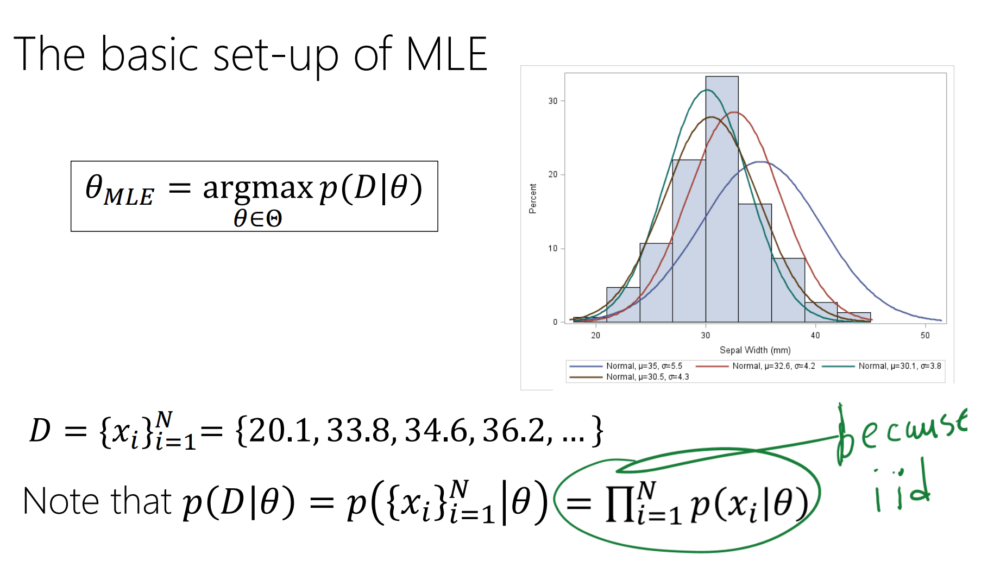
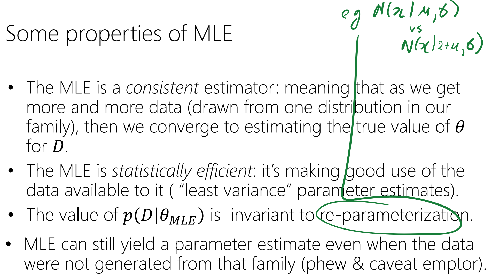
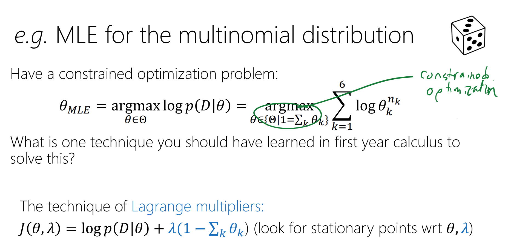
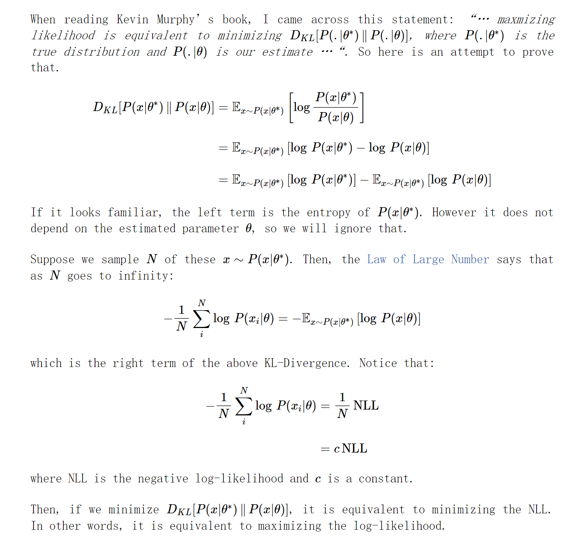
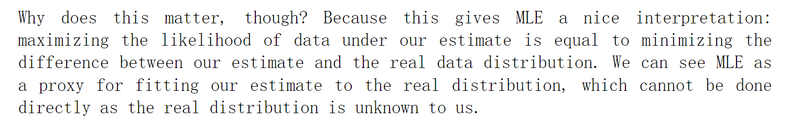
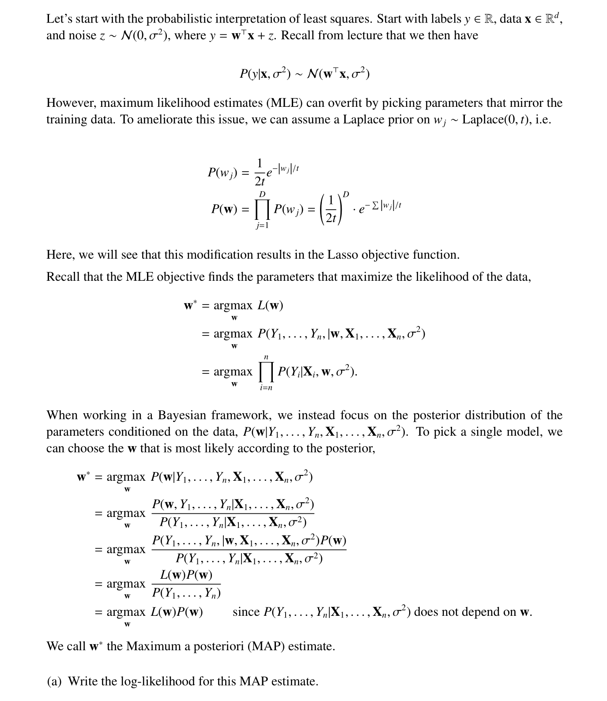
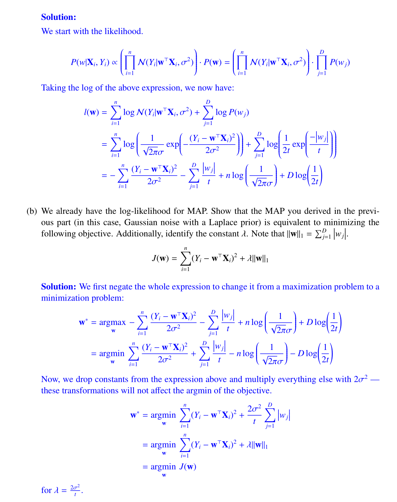
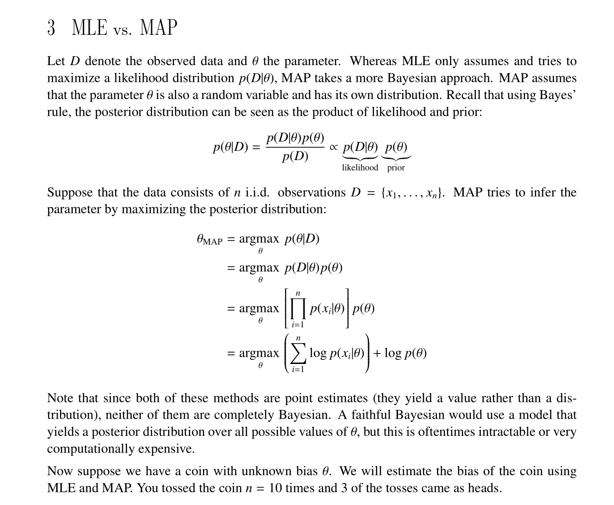

# MLE Basics
## ML Main Abstract Idea
> [!def]
> 

## Basic Setup
> [!important]
> 

## Properties
> [!important]
> 

## MLE for Multivariate Gaussian

## MLE for Multinomial Distribution
> [!important]
> 

# MLE and KL-Divergence
> [!def]
> 

# MLE Modeling
> [!important] Important: Fa23 Disc02 P2
> 

# MAP Modeling
Also See [Hypothesis_Testing](../../../../Data_Science/Statistical_Inference/3_Bayesian_Statistics/Hypothesis_Testing.md)
> [!important] Important: Fa23 Disc02 P3
> 

